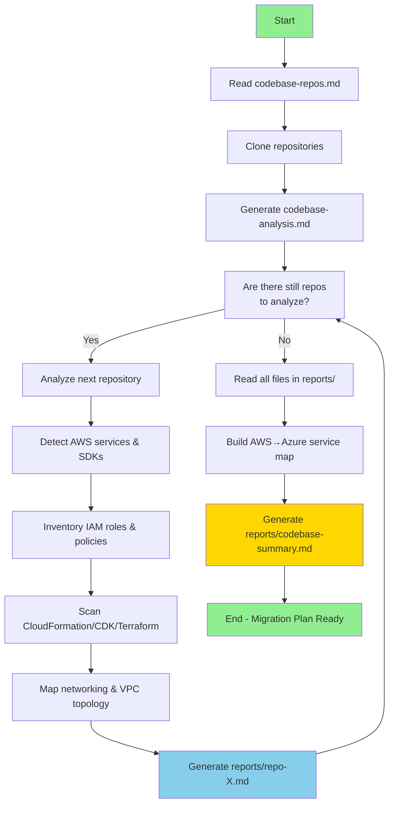
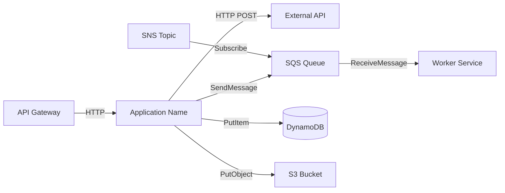
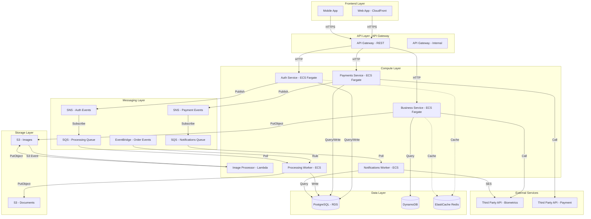
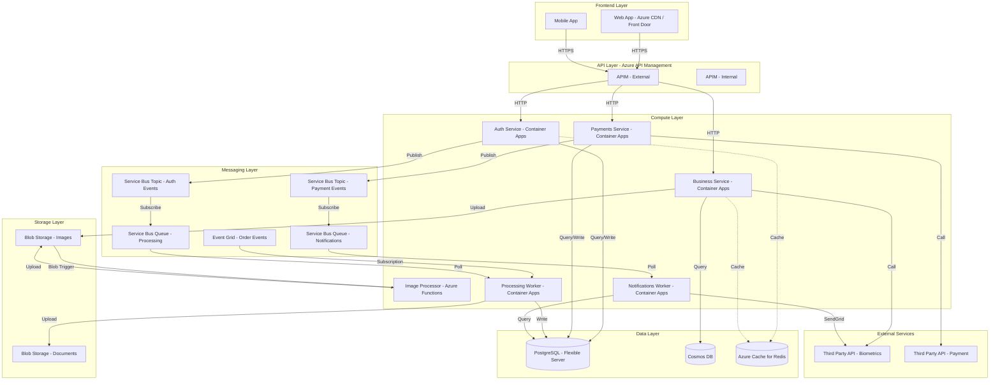
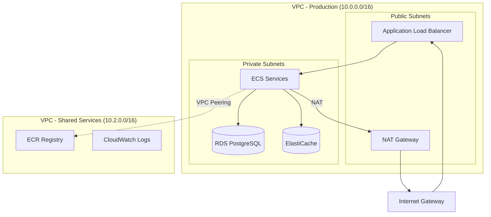
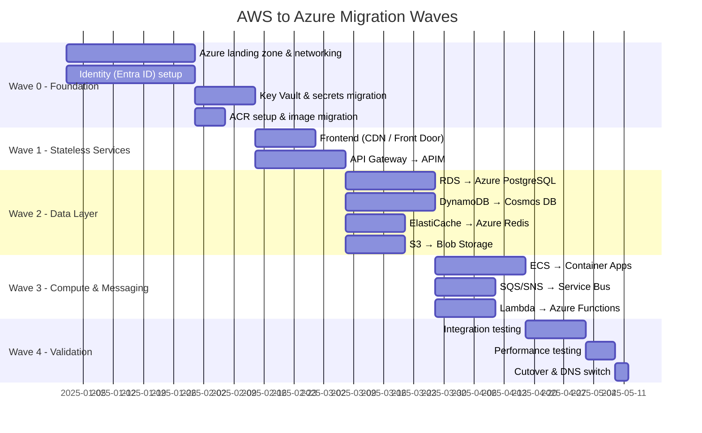

# AWS-to-Azure Migration Assessment - Multi-Repository

## Objective
Analyze all source code repositories of a business solution (BS) hosted on AWS, generating structured documentation about each application's AWS service dependencies, networking topology, IAM posture, and inter-service communications to plan a comprehensive migration to Azure.

## Context
This prompt works with multiple repositories that need to be analyzed individually due to context limitations. The analysis is incremental — each repository is assessed for AWS service usage and Azure migration implications, then all findings are consolidated into a unified migration plan.

## Workflow



### Phase 1: Preparation
1. **Read the `codebase-repos.md` file**
   - This file contains a list of GitHub repository URLs
   - Each line represents a repository of the business solution (BS)
   - Expected format: Full GitHub URLs (e.g., `https://github.com/org/repo-name`)

2. **Clone all repositories**
   - For each URL listed in `codebase-repos.md`, execute:
     ```bash
     git clone <repo-url>
     ```
   - Organize the cloned repositories in a dedicated directory (e.g., `repos/`)

3. **Generate the `codebase-analysis.md` file**
   - This file will be the work guide for individual analysis
   - Structure it as a task list
   - Each task represents the analysis of ONE specific repository
   - **Important**: Analyze only one repository at a time to avoid context overflow

### Phase 2: Individual Analysis (Per Repository)

For each repository listed in `codebase-analysis.md`:

#### Task: Analyze Repository [REPO-NAME]

**Status**: [ ] Pending | [x] Completed

**Analysis steps**:

1. **Basic Identification**
   - Repository name
   - Main programming language(s) and version(s)
   - Framework(s) used (e.g., Spring Boot, Express, Django, ASP.NET)
   - Application type (API, Worker, Frontend, Lambda, Library, etc.)
   - Summary of application purpose

2. **AWS Service Dependency Analysis**
   - **Compute**: EC2, ECS, EKS, Lambda, Fargate, Elastic Beanstalk
   - **Databases**: RDS (MySQL/PostgreSQL/Aurora), DynamoDB, ElastiCache (Redis/Memcached), DocumentDB
   - **Messaging**: SQS (queues), SNS (topics), EventBridge, Kinesis, MSK (Kafka)
   - **Storage**: S3 buckets, EFS, EBS volumes
   - **Networking**: ALB/NLB, API Gateway, CloudFront, Route 53
   - **Security**: Cognito, IAM roles/policies, Secrets Manager, KMS, ACM
   - **Monitoring**: CloudWatch (logs, metrics, alarms), X-Ray, CloudTrail
   - **Other**: Step Functions, SES, Parameter Store, AppSync, etc.

3. **AWS SDK & Package Detection**
   - Scan dependency files for AWS SDK packages:
     - **Python**: `boto3`, `botocore`, `aws-cdk-lib`, `moto` in `requirements.txt` / `Pipfile` / `pyproject.toml`
     - **Node.js/TypeScript**: `@aws-sdk/*`, `aws-sdk`, `aws-cdk-lib` in `package.json`
     - **.NET/C#**: `AWSSDK.*`, `Amazon.*` in `.csproj` / `packages.config` / `Directory.Packages.props`
     - **Java**: `software.amazon.awssdk.*`, `com.amazonaws.*` in `pom.xml` / `build.gradle`
     - **Go**: `github.com/aws/aws-sdk-go-v2` in `go.mod`
   - List every AWS SDK package found with its version

4. **CloudFormation / CDK / Terraform Analysis**
   - Identify infrastructure-as-code files:
     - CloudFormation templates (`*.yaml`, `*.json` with `AWSTemplateFormatVersion`)
     - CDK constructs (`cdk.json`, `lib/*.ts`, `app.py`)
     - Terraform files (`*.tf` with `provider "aws"`)
     - SAM templates (`template.yaml` with `AWS::Serverless`)
   - List all AWS resources defined (e.g., `AWS::Lambda::Function`, `AWS::DynamoDB::Table`)
   - Note resource names, configurations, and cross-stack references

5. **IAM Roles & Policies**
   - IAM roles referenced in code or IaC (execution roles, task roles, service roles)
   - Inline and managed policies attached
   - Cross-account assume-role patterns
   - Service-linked roles
   - Least-privilege assessment (overly broad `*` permissions)

6. **AWS-Specific Configuration**
   - Environment variables referencing AWS (ARNs, region, account IDs, endpoint URLs)
   - AWS configuration files (`~/.aws/config`, `buildspec.yml`, `appspec.yml`)
   - Hardcoded AWS account IDs, regions, or resource ARNs
   - Secrets stored in SSM Parameter Store or Secrets Manager

7. **Container & Orchestration Setup**
   - ECR repositories used
   - ECS task definitions and service configurations
   - EKS manifests, Helm charts, or `eksctl` configs
   - Dockerfiles present (base images, exposed ports)
   - Fargate vs. EC2 launch type

8. **CI/CD Pipeline Analysis**
   - CodePipeline / CodeBuild / CodeDeploy configurations
   - `buildspec.yml` files and build steps
   - GitHub Actions workflows with AWS actions (`aws-actions/*`)
   - Deployment targets and strategies (blue/green, rolling, canary)

9. **Communication Analysis**
   - How does the application communicate with other services?
   - Protocols used (HTTP, gRPC, async messaging via SQS/SNS, etc.)
   - Exposed endpoints (ALB listeners, API Gateway routes)
   - Consumed endpoints (other internal services, external APIs)

10. **Testing Analysis**
    - Test coverage (if available)
    - Test types (unit, integration, e2e)
    - Testing frameworks used
    - LocalStack or moto usage for AWS service mocking

11. **Points of Attention for Azure Migration**
    - AWS services with no direct Azure equivalent
    - Deep SDK coupling that requires refactoring
    - Hardcoded ARNs, regions, or account-specific values
    - Deprecated or problematic dependencies
    - Legacy code or old patterns

### Phase 3: Individual Documentation

After analyzing each repository, **create an individual file** in the `reports/` folder named `[repository-name].md`:

#### Structure of `reports/[repository-name].md` file

```markdown
# AWS Migration Assessment - [Repository Name]

## Identification

**Repository Name**: [repository-name]
**Type**: [API/Worker/Lambda/Frontend/Library/etc]
**Language**: [Main language and version]
**Frameworks**: [List of frameworks]
**Repository URL**: [GitHub URL]

## Summary
[Concise description of the application purpose - 2 to 3 paragraphs explaining what the application does, its role in the business solution, and how it currently runs on AWS]

## AWS Service Inventory

| AWS Service | Resource Name/ID | Purpose | Usage Pattern | Azure Equivalent |
|-------------|-----------------|---------|---------------|------------------|
| S3 | my-app-bucket | Document storage | Read/Write | Azure Blob Storage |
| SQS | order-processing-queue | Order processing | Consumer | Azure Service Bus Queue |
| DynamoDB | users-table | User profiles | CRUD | Azure Cosmos DB |
| Lambda | image-resize | Image processing | Event-triggered | Azure Functions |
| RDS PostgreSQL | prod-db | Transactional data | Primary DB | Azure Database for PostgreSQL |
| CloudWatch | app-logs | Logging & monitoring | Logs + Metrics | Azure Monitor / App Insights |

## AWS SDK Packages

| Package | Version | Language | Files Using It |
|---------|---------|----------|----------------|
| boto3 | 1.28.x | Python | src/s3_client.py, src/sqs_handler.py |
| @aws-sdk/client-s3 | 3.x | TypeScript | lib/storage.ts |
| AWSSDK.S3 | 3.7.x | C# | Services/StorageService.cs |

## CloudFormation / CDK / Terraform Resources

| Resource Type | Logical Name | IaC Tool | File Path |
|---------------|-------------|----------|-----------|
| AWS::Lambda::Function | ImageResizer | CloudFormation | infra/template.yaml |
| AWS::DynamoDB::Table | UsersTable | CDK | lib/database-stack.ts |
| aws_s3_bucket | documents | Terraform | main.tf |

## IAM Roles & Policies

| Role Name | Attached To | Key Permissions | Scope |
|-----------|------------|-----------------|-------|
| app-execution-role | ECS Task | S3 Read/Write, SQS Send/Receive, DynamoDB CRUD | Single account |
| lambda-exec-role | Lambda | CloudWatch Logs, S3 GetObject | Single account |
| cross-account-role | CI/CD | AssumeRole to prod account | Cross-account |

## Service Dependencies

### Databases
- **Database 1**: [Type (RDS/DynamoDB/ElastiCache), name, purpose, engine version]
- **Database 2**: [Type, name, purpose, engine version]

### Messaging
- **SQS Queue 1**: [Queue name, purpose, FIFO or standard, DLQ configured?]
- **SNS Topic 1**: [Topic name, purpose, subscriptions]

### Storage
- **S3 Bucket 1**: [Bucket name, purpose, lifecycle policies, encryption]

### APIs and External Integrations
- **API 1**: [Name, base endpoint, purpose]
- **API 2**: [Name, base endpoint, purpose]

## Communication

### Exposed Endpoints
| Method | Path | Description | Authentication | AWS Service |
|--------|------|-------------|----------------|-------------|
| GET | /api/resource | [Description] | Cognito JWT | API Gateway |
| POST | /api/resource | [Description] | IAM Sig v4 | ALB |

### Consumed Endpoints
| Service | Method | Endpoint | Purpose |
|---------|--------|----------|---------|
| [Service Name] | GET | /api/endpoint | [Description] |

### Asynchronous Communication
| Type | AWS Service | Resource Name | Action | Purpose |
|------|-------------|---------------|--------|---------|
| Publishes | SQS | order-queue | SendMessage | [Description] |
| Consumes | SQS | payment-queue | ReceiveMessage | [Description] |
| Publishes | SNS | user-events | Publish | [Description] |
| Triggers | EventBridge | order-rule | PutEvents | [Description] |

### Communication Diagram



## Configuration

### AWS-Specific Environment Variables
| Variable | Description | Example | AWS Service | Required |
|----------|-------------|---------|-------------|----------|
| AWS_REGION | AWS region | us-east-1 | Core | Yes |
| S3_BUCKET_NAME | Storage bucket | my-app-docs | S3 | Yes |
| SQS_QUEUE_URL | Queue endpoint | https://sqs.us-east-1... | SQS | Yes |
| DYNAMODB_TABLE | Table name | users | DynamoDB | Yes |
| RDS_HOST | Database endpoint | mydb.xxx.rds.amazonaws.com | RDS | Yes |

### Secrets Management
| Secret | Current Storage | AWS Service | Migration Target |
|--------|----------------|-------------|-----------------|
| DB_PASSWORD | Secrets Manager | Secrets Manager | Azure Key Vault |
| API_KEY | SSM Parameter Store | Systems Manager | Azure Key Vault |
| JWT_SECRET | Environment variable | Hardcoded | Azure Key Vault |

## Infrastructure

### Containerization
- **Dockerfile**: [Yes/No - path if exists]
- **Base Image**: [Base image name]
- **ECR Repository**: [ECR repo URI if applicable]
- **Exposed Ports**: [List of ports]

### Container Orchestration
- **ECS Service**: [Yes/No - launch type (Fargate/EC2), desired count]
- **ECS Task Definition**: [Yes/No - path if exists]
- **EKS Deployment**: [Yes/No - namespace, manifests path]
- **Helm Charts**: [Yes/No - path if exists]

### Infrastructure as Code
- **CloudFormation**: [Yes/No - path, number of resources]
- **CDK**: [Yes/No - path, language, stacks defined]
- **Terraform**: [Yes/No - path, providers used]
- **SAM**: [Yes/No - path, functions defined]

### CI/CD
- **Pipeline Tool**: [CodePipeline/GitHub Actions/Jenkins/etc]
- **Build Spec**: [buildspec.yml path if exists]
- **Deploy Target**: [ECS/EKS/Lambda/Elastic Beanstalk/etc]
- **Stages**: [Source, Build, Test, Deploy stages]

## Testing

### Coverage
- **Percentage**: [X%] (if available)
- **Tool**: [Jest/PyTest/JUnit/xUnit/etc]

### Test Types
- **Unit**: [Yes/No - framework used]
- **Integration**: [Yes/No - framework used]
- **E2E**: [Yes/No - framework used]
- **AWS Mocking**: [LocalStack/moto/aws-sdk-mock - details]

## Azure Migration Assessment

### Migration Complexity Rating

| Category | Complexity | Notes |
|----------|-----------|-------|
| Compute | 🟢 Low / 🟡 Medium / 🔴 High | [Details] |
| Data | 🟢 Low / 🟡 Medium / 🔴 High | [Details] |
| Messaging | 🟢 Low / 🟡 Medium / 🔴 High | [Details] |
| Identity | 🟢 Low / 🟡 Medium / 🔴 High | [Details] |
| Networking | 🟢 Low / 🟡 Medium / 🔴 High | [Details] |
| CI/CD | 🟢 Low / 🟡 Medium / 🔴 High | [Details] |
| **Overall** | **[Rating]** | **[Summary]** |

### AWS-Specific Dependencies Requiring Refactoring
- [Dependency 1]: [Impact description and Azure alternative]
- [Dependency 2]: [Impact description and Azure alternative]

### Hardcoded AWS Configurations
- [Configuration 1]: [ARN/region/account ID found, file location, remediation]
- [Configuration 2]: [Description and remediation]

### Specific Migration Recommendations
1. [Recommendation 1]
2. [Recommendation 2]
3. [Recommendation 3]

## Additional Observations
[Any relevant information that doesn't fit in the above sections]
```

### Phase 4: Consolidation and Overview

After analyzing **all repositories**, create the `reports/codebase-summary.md` file consolidating all information:

#### Structure of `reports/codebase-summary.md`

```markdown
# AWS-to-Azure Migration Summary - [BS-NAME] Solution

## Solution Overview

**Total Repositories Analyzed**: [Number]
**Analysis Date**: [Date]
**Business Purpose**: [General description of the business solution]
**Current Cloud**: AWS
**Target Cloud**: Azure

## Application Summary

### [Repository Name 1]
- **Type**: [API/Worker/Lambda/Frontend/etc]
- **Language**: [Main language]
- **Purpose**: [Summary in 1-2 lines]
- **Key AWS Services**: [S3, SQS, DynamoDB, etc.]
- **Migration Complexity**: [🟢 Low / 🟡 Medium / 🔴 High]
- **[Complete details](./repository-name-1.md)**

### [Repository Name 2]
- **Type**: [API/Worker/Lambda/Frontend/etc]
- **Language**: [Main language]
- **Purpose**: [Summary in 1-2 lines]
- **Key AWS Services**: [RDS, Lambda, SNS, etc.]
- **Migration Complexity**: [🟢 Low / 🟡 Medium / 🔴 High]
- **[Complete details](./repository-name-2.md)**

[Repeat for all repositories...]

## Current AWS Architecture

### Complete Communication Diagram



### Proposed Azure Architecture



## Complete AWS → Azure Service Mapping

| AWS Service | Current Usage | Azure Equivalent | Repositories | Migration Complexity |
|-------------|--------------|------------------|--------------|---------------------|
| S3 | Object storage | Azure Blob Storage | repo1, repo2, repo7 | 🟢 Low |
| SQS | Message queuing | Azure Service Bus Queue | repo2, repo4, repo6 | 🟡 Medium |
| SNS | Pub/sub topics | Azure Service Bus Topic | repo2, repo6 | 🟡 Medium |
| DynamoDB | NoSQL database | Azure Cosmos DB | repo1, repo3, repo5 | 🟡 Medium |
| RDS PostgreSQL | Relational DB | Azure Database for PostgreSQL | repo3, repo4 | 🟢 Low |
| Lambda | Serverless compute | Azure Functions | repo8 | 🟡 Medium |
| ECS Fargate | Container hosting | Azure Container Apps | repo1, repo2, repo3 | 🟡 Medium |
| EKS | Kubernetes | Azure Kubernetes Service | repo5 | 🟡 Medium |
| ElastiCache Redis | In-memory cache | Azure Cache for Redis | repo1, repo2 | 🟢 Low |
| API Gateway | API management | Azure API Management | repo-gateway | 🟡 Medium |
| CloudFront | CDN | Azure Front Door / CDN | repo-frontend | 🟢 Low |
| Cognito | Auth/identity | Microsoft Entra ID | repo1, repo3 | 🔴 High |
| CloudWatch | Monitoring | Azure Monitor / App Insights | All repos | 🟡 Medium |
| Secrets Manager | Secret storage | Azure Key Vault | repo1, repo3, repo5 | 🟢 Low |
| KMS | Key management | Azure Key Vault | repo3, repo4 | 🟢 Low |
| EventBridge | Event bus | Azure Event Grid | repo2, repo6 | 🟡 Medium |
| CodePipeline | CI/CD | Azure DevOps / GitHub Actions | All repos | 🟡 Medium |
| Route 53 | DNS | Azure DNS | repo-infra | 🟢 Low |
| ECR | Container registry | Azure Container Registry | All repos | 🟢 Low |
| SES | Email service | Azure Communication Services | repo-notifications | 🟢 Low |
| Step Functions | Orchestration | Azure Durable Functions | repo8 | 🟡 Medium |

## AWS Account & Environment Topology

### Multi-Account Structure
| AWS Account | Purpose | Account ID | Repositories Deployed |
|------------|---------|------------|----------------------|
| Dev | Development | 111111111111 | All repos |
| Staging | Pre-production | 222222222222 | All repos |
| Production | Live environment | 333333333333 | All repos |
| Shared Services | Central infra | 444444444444 | repo-infra |

### Cross-Account Patterns
- [Describe cross-account IAM trust relationships]
- [Shared services (ECR, S3 artifacts, logging) across accounts]
- [CI/CD cross-account deployment roles]

### Regional Deployments
| Region | Purpose | Services Deployed |
|--------|---------|-------------------|
| us-east-1 | Primary | All services |
| us-west-2 | DR / Secondary | Database replicas, S3 replication |
| eu-west-1 | EU compliance | [If applicable] |

## VPC & Networking Topology

### VPC Layout
| VPC | CIDR Range | Purpose | Account |
|-----|-----------|---------|---------|
| vpc-prod | 10.0.0.0/16 | Production workloads | Production |
| vpc-staging | 10.1.0.0/16 | Staging environment | Staging |
| vpc-shared | 10.2.0.0/16 | Shared services | Shared Services |

### Subnet Layout
| VPC | Subnet | CIDR | Type | AZ | Purpose |
|-----|--------|------|------|-----|---------|
| vpc-prod | public-1a | 10.0.1.0/24 | Public | us-east-1a | ALB, NAT Gateway |
| vpc-prod | private-1a | 10.0.10.0/24 | Private | us-east-1a | ECS tasks, RDS |
| vpc-prod | private-1b | 10.0.11.0/24 | Private | us-east-1b | ECS tasks, RDS |

### Network Components
- **NAT Gateways**: [Count, AZs deployed]
- **Internet Gateways**: [VPCs with IGW]
- **VPC Endpoints**: [S3, DynamoDB, SQS, ECR, etc.]
- **PrivateLink**: [Services using interface endpoints]
- **Security Groups**: [Key SG rules - ingress/egress patterns]
- **NACLs**: [Custom NACLs if any]

### Connectivity
- **VPC Peering**: [Peering connections between VPCs]
- **Transit Gateway**: [If used, hub-spoke topology]
- **VPN / Direct Connect**: [On-premises connectivity]
- **Route 53 Hosted Zones**: [Public and private DNS zones]

### Network Diagram



## Shared AWS Service Dependency Matrix

| AWS Service | repo1 | repo2 | repo3 | repo4 | repo5 | Migration Strategy |
|-------------|-------|-------|-------|-------|-------|-------------------|
| S3 (docs bucket) | ✅ | ✅ | - | - | ✅ | Migrate to Blob Storage, update SDK calls |
| SQS (order queue) | - | ✅ | - | ✅ | - | Migrate to Service Bus Queue |
| DynamoDB (users) | ✅ | - | ✅ | - | ✅ | Migrate to Cosmos DB for NoSQL |
| RDS PostgreSQL | - | - | ✅ | ✅ | - | Migrate to Azure DB for PostgreSQL |
| Cognito | ✅ | - | ✅ | - | - | Migrate to Microsoft Entra ID |
| Secrets Manager | ✅ | ✅ | ✅ | ✅ | ✅ | Migrate to Azure Key Vault |

## Communication Matrix

### Inter-Service Communication

| Source Service | Target Service | Protocol | AWS Service | Purpose |
|----------------|----------------|----------|-------------|---------|
| Web App | API Gateway | HTTPS | CloudFront → API GW | Authentication |
| API Gateway | Auth Service | HTTP | ALB | Token validation |
| Auth Service | PostgreSQL | TCP | RDS | Fetch user |
| Business Service | DynamoDB | SDK | DynamoDB | Store data |
| Business Service | SQS | SDK | SQS | Send event |
| Worker | S3 | SDK | S3 | Upload file |
| Lambda | S3 | SDK | S3 Event Trigger | Process file |

### External Dependencies

| Internal Service | External Service | Type | Purpose | Criticality |
|------------------|------------------|------|---------|-------------|
| Payment Service | Stripe API | REST API | Payment processing | High |
| Notification Service | SendGrid | REST API | Email sending | Medium |
| Auth Service | Cognito | AWS SDK | User authentication | Critical |

## Identified Architectural Patterns

#### 1. API Gateway Pattern
**Repositories**: [repo-api-gateway]
**Description**: AWS API Gateway as single entry point for all client requests
**AWS Services**: API Gateway, CloudFront, WAF, Cognito authorizer
**Azure Migration**: Azure API Management with Azure Front Door and Entra ID

#### 2. Event-Driven Architecture
**Repositories**: [repo-auth, repo-payment, worker-notifications]
**Description**: Asynchronous communication via SNS topics and SQS queues
**AWS Services**: SNS, SQS, EventBridge, Lambda triggers
**Azure Migration**: Service Bus Topics/Queues, Event Grid, Azure Functions triggers

#### 3. Serverless Functions
**Repositories**: [repo-image-processor, repo-data-pipeline]
**Description**: Event-triggered processing using AWS Lambda
**AWS Services**: Lambda, S3 events, SQS triggers, API Gateway integration
**Azure Migration**: Azure Functions with Blob triggers, Service Bus triggers, APIM integration

#### 4. Container-based Microservices
**Repositories**: [repo-auth, repo-business, repo-payment]
**Description**: Containerized services running on ECS Fargate
**AWS Services**: ECS, Fargate, ECR, ALB, CloudWatch Container Insights
**Azure Migration**: Azure Container Apps with ACR, managed identity, App Insights

### Technologies and Frameworks Used

| Technology | Version | Repositories | Purpose |
|------------|---------|--------------|---------|
| Node.js | 18.x | repo1, repo2, repo5 | Backend runtime |
| Python | 3.11 | repo3, repo4, repo6 | Backend runtime |
| Express.js | 4.x | repo1, repo2 | Web framework |
| FastAPI | 0.104 | repo3, repo4 | Web framework |
| TypeScript | 5.x | repo1, repo5 | Language |
| React | 18.x | repo-frontend | Frontend framework |
| Docker | 20.x | All repos | Containerization |
| Terraform | 1.x | repo-infra | Infrastructure as Code |
| C# | 12.x | repo7, repo8 | Backend runtime |
| .NET | 8.x | repo7, repo8 | Web framework |

## Migration Sequencing Plan

### Migration Waves



### Wave Details

| Wave | Repositories | Dependencies | Risk Level | Estimated Duration |
|------|-------------|-------------|------------|-------------------|
| Wave 0 | repo-infra | None | Low | 4-6 weeks |
| Wave 1 | repo-frontend, repo-gateway | Wave 0 complete | Low | 2-3 weeks |
| Wave 2 | repo-infra (data resources) | Wave 1 complete | High | 3-4 weeks |
| Wave 3 | repo-auth, repo-business, repo-payment, repo-workers | Wave 2 complete | High | 3-4 weeks |
| Wave 4 | All repos | Wave 3 complete | Medium | 2-3 weeks |

### Migration Priority (Repos to Migrate First)
1. **repo-infra** — Foundation: networking, identity, shared services
2. **repo-frontend** — Stateless, low risk, quick win
3. **repo-api-gateway** — Entry point, enables routing to Azure services
4. **repo-auth-service** — Dependency for all other services (Cognito → Entra ID)
5. **repo-business-service** — Core business logic, depends on data migration
6. **repo-payment-service** — High criticality, migrate after data layer
7. **repo-workers** — Last, as they consume from messaging layer

## Identity Migration Plan

### Current AWS Identity Setup
| Component | AWS Service | Scope |
|-----------|------------|-------|
| User Authentication | Cognito User Pools | End-user login |
| Service-to-Service | IAM Roles + STS | Cross-service auth |
| Secrets | Secrets Manager + SSM | Credential storage |
| API Auth | Cognito Authorizer / IAM | API Gateway auth |

### Target Azure Identity Setup
| Component | Azure Service | Migration Notes |
|-----------|--------------|-----------------|
| User Authentication | Microsoft Entra ID | User pool migration required |
| Service-to-Service | Managed Identity | Replace IAM roles with MI |
| Secrets | Azure Key Vault (RBAC) | Migrate secrets, use MI for access |
| API Auth | Entra ID + APIM policies | Replace Cognito authorizer |

## Network Topology Migration Plan

| AWS Component | Azure Equivalent | Migration Notes |
|--------------|-----------------|-----------------|
| VPC | Azure Virtual Network | Map CIDR ranges, plan address space |
| Public Subnet + IGW | Public subnet + Internet | Similar pattern |
| Private Subnet + NAT GW | Private subnet + NAT Gateway | Similar pattern |
| Security Groups | Network Security Groups (NSG) | Convert SG rules to NSG rules |
| NACLs | NSG (subnet-level) | Merge into NSG rules |
| VPC Endpoints | Private Endpoints | Map each endpoint |
| Transit Gateway | Azure Virtual WAN / VNet Peering | Evaluate topology |
| Route 53 | Azure DNS + Traffic Manager | Migrate zones and records |
| ALB/NLB | Azure Application Gateway / Load Balancer | Map listeners and rules |
| CloudFront | Azure Front Door | Migrate distributions |
| VPN Gateway | Azure VPN Gateway | Re-establish tunnels |
| Direct Connect | Azure ExpressRoute | Coordinate with provider |

## Risk Analysis

### Identified Risks

#### High Impact
1. **Cognito to Entra ID migration**
   - **Affected repositories**: All repos using Cognito
   - **Description**: User pool migration, token format changes, OIDC configuration
   - **Recommendation**: Plan phased identity migration with dual-auth period

2. **DynamoDB to Cosmos DB data model differences**
   - **Affected repositories**: repos using DynamoDB
   - **Description**: Partition key strategy, consistency models, query patterns differ
   - **Recommendation**: Evaluate Cosmos DB for NoSQL API, test query compatibility

3. **Hardcoded ARNs and region-specific configurations**
   - **Affected repositories**: repo1, repo3
   - **Description**: Fixed ARNs, account IDs, and region codes in source
   - **Recommendation**: Externalize to environment variables before migration

#### Medium Impact
4. **Lambda cold start vs Azure Functions cold start**
   - **Affected repositories**: repo8
   - **Description**: Different cold start characteristics, runtime differences
   - **Recommendation**: Test with Azure Functions Premium plan if latency-sensitive

5. **AWS SDK replacement across all repositories**
   - **Affected repositories**: All repos
   - **Description**: Every AWS SDK call must be replaced with Azure SDK equivalent
   - **Recommendation**: Create shared wrapper libraries, migrate incrementally

## Critical Dependencies

### Services Requiring High Availability
1. **Auth Service** (repo-auth)
   - Impact: Complete system access blockage
   - Current SLA: 99.99% (Cognito + ECS)
   - Azure Target: 99.99% (Entra ID + Container Apps)

2. **API Gateway** (repo-api-gateway)
   - Impact: All APIs unavailable
   - Current SLA: 99.95% (API Gateway)
   - Azure Target: 99.95% (Azure API Management)

3. **Payment Service** (repo-payment)
   - Impact: Unable to process transactions
   - Current SLA: 99.95% (ECS + RDS Multi-AZ)
   - Azure Target: 99.95% (Container Apps + PostgreSQL HA)

## Solution Metrics

### Lines of Code
| Repository | Language | LOC | AWS SDK Calls | Migration Complexity |
|------------|----------|-----|--------------|---------------------|
| repo1 | TypeScript | 15,000 | 45 | Medium |
| repo2 | Python | 8,000 | 32 | Medium |
| ... | ... | ... | ... | ... |
| **TOTAL** | - | **XX,XXX** | **XXX** | - |

### Overall Test Coverage
- **Average Coverage**: X%
- **Repositories with >80%**: X
- **Repositories with <50%**: X
- **AWS Mock Coverage**: X repos using LocalStack/moto

## Appendices
- [Details of each repository](./)
- [Detailed architecture diagrams](./diagrams/)
- [AWS → Azure service mapping reference](./aws-azure-mapping.md)
- [Cost comparison estimates](./costs/)
```
```

## Execution Instructions

### How to use this prompt:

1. **First execution - Preparation**:
   - Make sure you have the `codebase-repos.md` file with the repository list
   - Execute: "Clone all repositories listed in codebase-repos.md and generate the codebase-analysis.md file with analysis tasks"
   - Copilot will automatically create the `reports/` folder

2. **Incremental analysis - Per repository**:
   - Execute: "Analyze the next pending repository in codebase-analysis.md — scan for AWS services, SDKs, IAM roles, and CloudFormation/CDK/Terraform resources, then create reports/[repo-name].md"
   - Repeat until all repositories are analyzed
   - Each analysis will generate a separate markdown file in the `reports/` folder

3. **Final consolidation - Migration plan**:
   - Execute: "Analyze all files in the reports/ folder and generate reports/codebase-summary.md with the complete AWS→Azure migration plan, service mapping, and architecture diagrams"
   - Copilot will consolidate all information, build the service mapping, and create the migration wave plan

## Limitations and Considerations

- **Context**: Analyze only ONE repository at a time to avoid context overflow
- **Individual Files**: Each repository will generate its own file in `reports/[repo-name].md`
- **Incrementality**: Never overwrite existing files, only create new ones or complement
- **Final Consolidation**: The `codebase-summary.md` file should only be generated after ALL repositories are analyzed
- **Diagrams**: Use Mermaid for all visualizations (individual and consolidated)
- **Detail**: Be specific about AWS service names, SDK versions, ARNs, and IAM policies in each assessment
- **AWS Focus**: Identify every AWS service dependency and map it to an Azure equivalent in each repository and consolidate in the summary
- **Organization**: Keep files organized:
  - `reports/` → Detailed individual analyses and consolidated summary
  - `reports/codebase-summary.md` → Consolidated migration plan and strategic view
  - `codebase-analysis.md` → Task control

## Expected Output

At the end of the process you will have:

### Generated file structure:
```
project/
├── codebase-repos.md                    # Input: Repository list
├── codebase-analysis.md                 # Work guide with tasks
├── reports/                             # ✅ Folder with individual assessments and summary
│   ├── codebase-summary.md              # ✅ Final AWS→Azure migration plan
│   ├── repo-auth-service.md             # ✅ Authentication service assessment
│   ├── repo-payment-service.md          # ✅ Payment service assessment
│   ├── repo-order-worker.md             # ✅ Order worker assessment
│   ├── repo-api-gateway.md              # ✅ API Gateway assessment
│   └── ...                              # ✅ One file for each repository
└── repos/                               # Cloned repositories
    ├── repo-auth-service/
    ├── repo-payment-service/
    └── ...
```

### Complete documentation:
1. ✅ **codebase-analysis.md** - Work guide with tasks and status of each analysis
2. ✅ **reports/[repo-name].md** - One detailed file for each repository with:
   - Application identification and summary
   - AWS service inventory table
   - AWS SDK packages found
   - CloudFormation/CDK/Terraform resources defined
   - IAM roles and policies used
   - AWS-specific configuration (env vars, ARNs, regions)
   - Communication diagrams with AWS service dependencies
   - Azure migration complexity assessment
3. ✅ **reports/codebase-summary.md** - Consolidated migration plan with:
   - Complete AWS → Azure service mapping across all repos
   - Current AWS architecture diagram (Mermaid)
   - Proposed Azure architecture diagram (Mermaid)
   - AWS account and environment topology
   - VPC and networking migration plan
   - Identity migration plan (Cognito → Entra ID)
   - Shared service dependency matrix
   - Migration wave sequencing with Gantt chart
   - Risk analysis and strategic recommendations
4. ✅ All repositories cloned and organized
5. ✅ Mermaid diagrams (individual in each assessment + consolidated architecture + migration Gantt)

## Practical Usage Example

### Scenario: Analysis of "E-Commerce Platform" on AWS

**Step 1**: Create `codebase-repos.md`
```
https://github.com/company/auth-service
https://github.com/company/order-api
https://github.com/company/order-worker
https://github.com/company/notification-service
https://github.com/company/infra-cdk
```

**Step 2**: Execute preparation
```
Prompt: "Clone all repositories listed in codebase-repos.md and generate the codebase-analysis.md file"
```

**Step 3**: Incremental analysis (repeat 5 times)
```
Prompt 1: "Analyze auth-service for AWS dependencies and generate reports/auth-service.md"
Prompt 2: "Analyze order-api for AWS dependencies and generate reports/order-api.md"
Prompt 3: "Analyze order-worker for AWS dependencies and generate reports/order-worker.md"
Prompt 4: "Analyze notification-service for AWS dependencies and generate reports/notification-service.md"
Prompt 5: "Analyze infra-cdk for AWS resources and generate reports/infra-cdk.md"
```

**Step 4**: Final consolidation
```
Prompt: "Analyze all files in reports/ and generate reports/codebase-summary.md with complete AWS→Azure migration plan"
```

**Result**: Complete AWS-to-Azure migration assessment with service mapping, architecture diagrams, and migration wave plan!
 