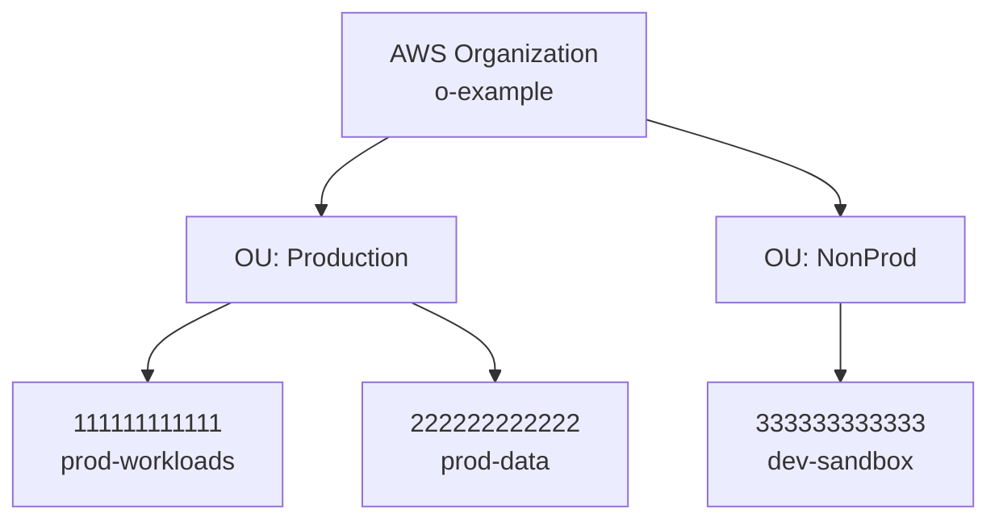
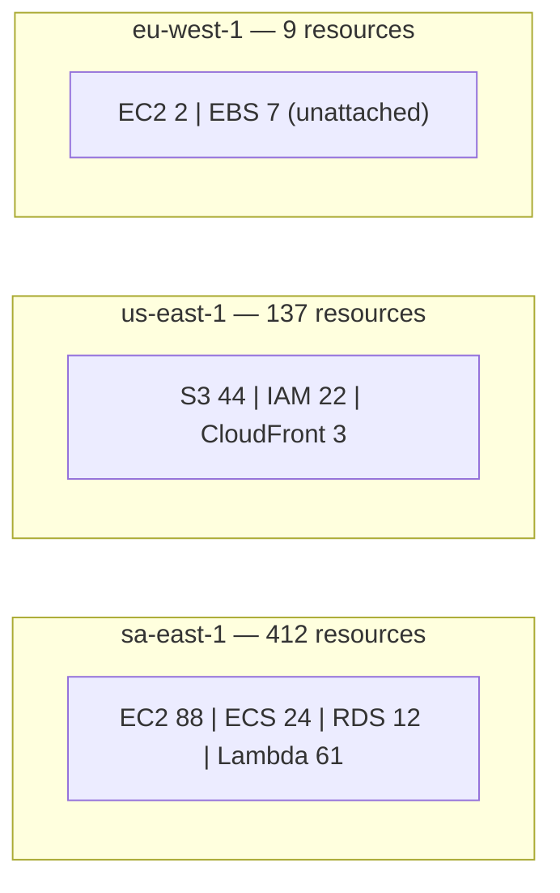
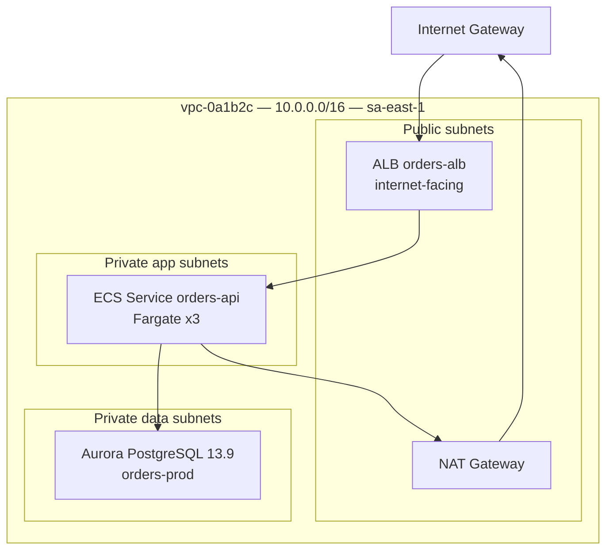
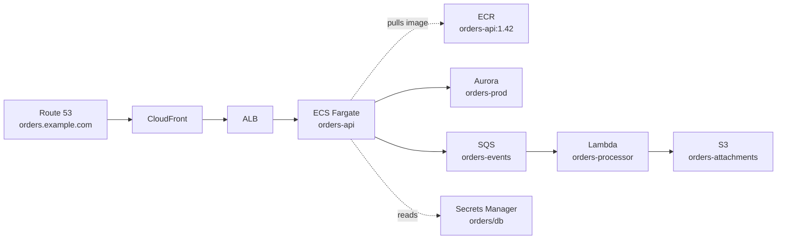
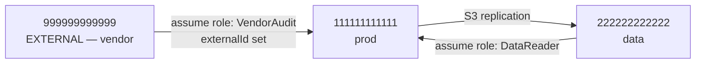

# Phase 4 — Relationships & Topology

**Goal:** turn a flat inventory into a graph — who talks to whom, what depends on what, and what is reachable from the internet.

**Prerequisite:** Phase 3 enriched inventory exists.

Load the **aws-resource-relationships** skill for the full edge-inference catalog, and the **aws-inventory-reporting** skill for the Mermaid patterns.

---

## Step 1: Build The Edge List

Extract edges from **hard identifiers first**. Every edge records: `source`, `target`, `edgeType`, `evidence`, `confidence`.

### High-confidence edges (explicit identifiers)

| Edge type | Derived from |
|-----------|--------------|
| `resides-in` | Resource `VpcId` / `SubnetId` |
| `protected-by` | Resource → attached security group IDs |
| `allows-from` | Security group rule referencing another security group ID |
| `routes-to` | Route table entries → IGW / NAT / TGW / peering / VPC endpoint |
| `peered-with` | VPC peering connections (records the accepter account — cross-account edge) |
| `attached-to` | TGW attachments, ENI attachments, EBS volume attachments, EIP associations |
| `load-balances` | ALB/NLB listener → target group → registered targets (instance IDs, IPs, Lambda ARNs) |
| `runs-task` | ECS service → task definition → container images |
| `pulls-image-from` | Task definition / EKS pod spec image URI → ECR repository |
| `scales` | Auto Scaling Group → Launch Template → AMI, and ASG → target group |
| `triggered-by` | Lambda event source mapping → SQS / Kinesis / DynamoDB Stream / MSK |
| `invokes` | EventBridge rule → target ARN; Step Functions state → resource ARN; API Gateway integration → Lambda/HTTP/VPC Link |
| `publishes-to` | SNS topic → subscription endpoints (SQS, Lambda, HTTPS, email) |
| `assumes` | IAM role trust policy principal → role (cross-account trust is an edge to another account) |
| `uses-role` | EC2 instance profile / ECS task role / Lambda execution role / EKS IRSA → IAM role |
| `encrypted-by` | Resource `KmsKeyId` → KMS key (cross-account KMS grants are edges) |
| `reads-secret` | Task definition `secrets` / Lambda env `secretArn` → Secrets Manager / SSM parameter |
| `logs-to` | Resource log configuration → CloudWatch log group / S3 bucket / Firehose |
| `managed-by` | CloudFormation stack resource list → stack |
| `resolves-to` | Route 53 record → ALB / CloudFront / S3 website / EIP |
| `fronted-by` | CloudFront distribution origin → S3 bucket / ALB / custom origin |
| `replicates-to` | S3 replication rule → destination bucket (often cross-account/region) |
| `backs-up` | AWS Backup plan → protected resource ARNs |

### Medium/low-confidence edges (inferred — must be labeled as such)

| Edge type | Evidence | Confidence |
|-----------|----------|-----------|
| `connects-to` | Lambda/ECS environment variable **name** referencing a known endpoint (e.g. `ORDERS_DB_HOST`), matched against an RDS endpoint | MEDIUM |
| `connects-to` | Security group allows a database port from an application security group | MEDIUM |
| `belongs-to-app` | Shared `Application` / `Project` tag value | MEDIUM |
| `belongs-to-app` | Shared naming prefix (`orders-*`) | LOW |
| `talks-to` | VPC Flow Logs showing sustained traffic between two ENIs | HIGH (when flow logs are enabled and queried) |

**Rule:** every inferred edge in the report must state its evidence and be visually distinguishable (dotted line in Mermaid).

---

## Step 2: Internet Exposure Paths

Trace every path from the internet inward and record it explicitly:

1. **Public IP on EC2** → instance in a subnet with an IGW route + a security group allowing `0.0.0.0/0`
2. **Internet-facing load balancer** → ALB/NLB with `Scheme: internet-facing` → target group → targets
3. **Public RDS** → `PubliclyAccessible: true` in a public subnet
4. **Public S3** → public access block disabled or bucket policy status `IsPublic: true`
5. **API Gateway / Lambda Function URL** with `AuthType: NONE`
6. **CloudFront distribution** → origin
7. **EKS public API endpoint** → `endpointPublicAccess: true` with `publicAccessCidrs: 0.0.0.0/0`
8. **ECR public repositories**
9. **Elastic IPs** attached to anything

Each exposure path becomes a row in `AWS-Security-Findings.md` and a highlighted edge in the topology map.

---

## Step 3: Cross-Account And Cross-Region Edges

These are the edges most often missed. Search for:

- VPC peering where accepter/requester accounts differ
- Transit Gateway attachments from other accounts (and TGW sharing via RAM)
- IAM role trust policies naming an external account or an external ID
- S3 bucket policies granting a different account principal
- KMS key policies and grants naming external accounts
- ECR repository policies granting cross-account pull
- SNS/SQS resource policies granting external accounts
- Route 53 hosted zones associated with VPCs in other accounts
- RDS/Aurora cross-region read replicas and global clusters
- S3 cross-region replication rules
- AWS RAM shared resources: `aws ram list-resources --resource-owner OTHER-ACCOUNTS` and `--resource-owner SELF`

---

## Step 4: Application Grouping

Group resources into logical applications using this precedence:

1. `Application` / `Project` / `Service` tag value
2. CloudFormation stack membership
3. Connected component in the high-confidence edge graph
4. Naming convention prefix
5. Everything else → `Unclassified`

Report the size of `Unclassified` — a large bucket here is itself a governance finding.

---

## Step 5: Generate The Maps

Produce these Mermaid diagrams. Keep each diagram readable — if a diagram would exceed ~40 nodes, split it (one per VPC, one per application) and add an index.

### 5.1 Account hierarchy



### 5.2 Region heatmap



### 5.3 VPC topology (one per VPC)



⚠️ Mermaid pitfalls to avoid (see the reporting skill): no `->` inside node labels, no node declared in two subgraphs, no thick-line labels of the form `===|text|`.

### 5.4 Application dependency map



### 5.5 Data flow map

Show where data originates, where it is stored, where it is replicated and where it leaves the account (cross-region replication, external endpoints, SES, third-party integrations).

### 5.6 Cross-account trust map



Flag every edge from an account ID that is **not** in the organization as `EXTERNAL` and raise it as a finding.

---

## Step 6: Write The Topology Artifacts

- `reports/AWS-Network-Topology.md` — VPC inventory table, subnet map, routing summary, exposure paths, per-VPC diagrams
- `reports/AWS-Dependency-Map.md` — account hierarchy, region heatmap, application maps, data-flow map, cross-account trust map, full edge table
- `reports/raw/<account-id>/_edges.json` — machine-readable edge list

Edge JSON schema:

```json
{
  "source": "arn:aws:ecs:sa-east-1:111111111111:service/prod/orders-api",
  "target": "arn:aws:rds:sa-east-1:111111111111:cluster:orders-prod",
  "edgeType": "connects-to",
  "evidence": "SG sg-app allows 5432 to SG sg-db; task def env ORDERS_DB_HOST matches cluster endpoint",
  "confidence": "MEDIUM",
  "crossAccount": false,
  "crossRegion": false
}
```

---

## Exit Criteria

- [ ] Edge list built from hard identifiers
- [ ] Inferred edges labeled with evidence and confidence
- [ ] Every internet exposure path traced and recorded
- [ ] Cross-account and cross-region edges identified, external accounts flagged
- [ ] Resources grouped into applications, `Unclassified` count reported
- [ ] All Mermaid diagrams generated and syntax-validated
- [ ] `AWS-Network-Topology.md` and `AWS-Dependency-Map.md` written
- [ ] `Report-Status.md` updated

**Next step:** proceed to `/AWSAssess-phase5-reports`
