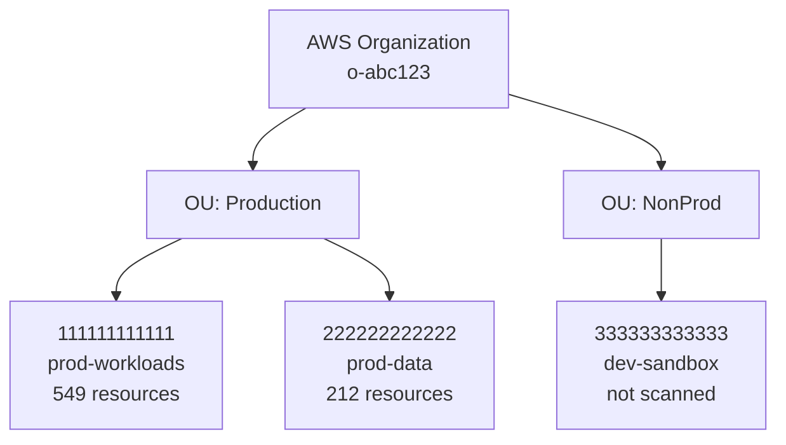
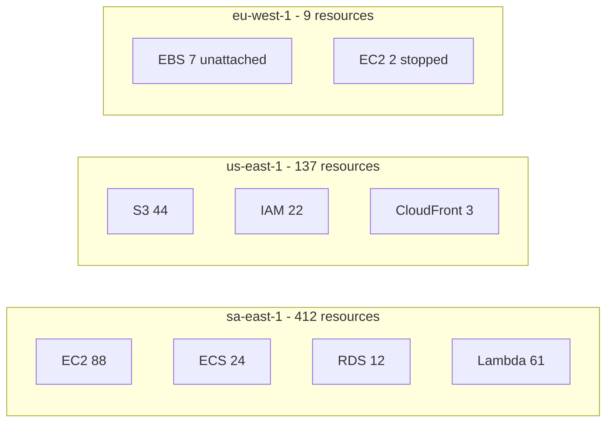
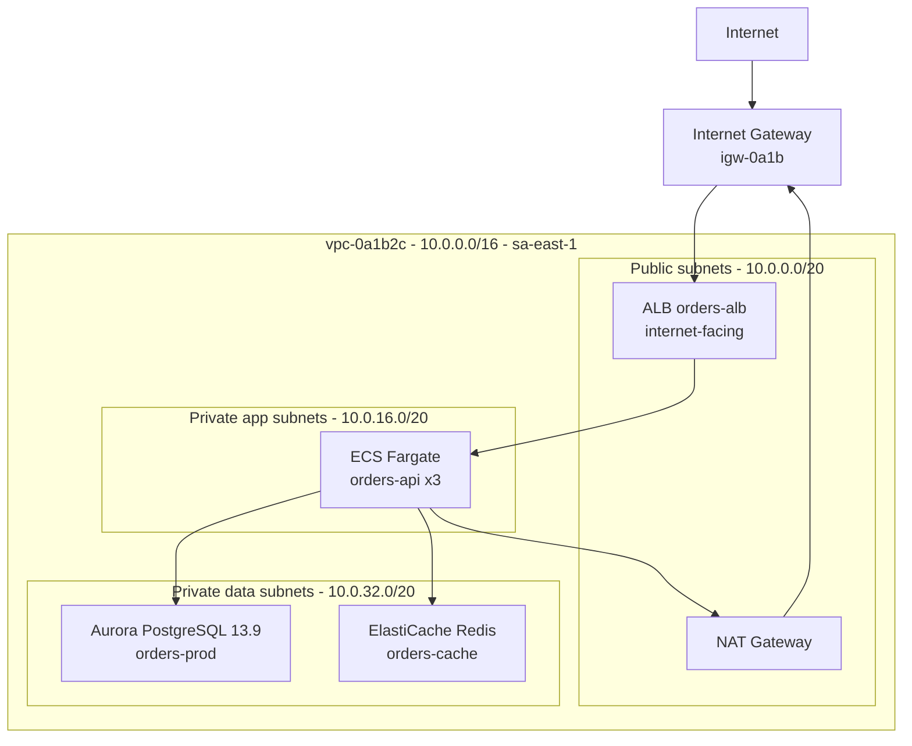
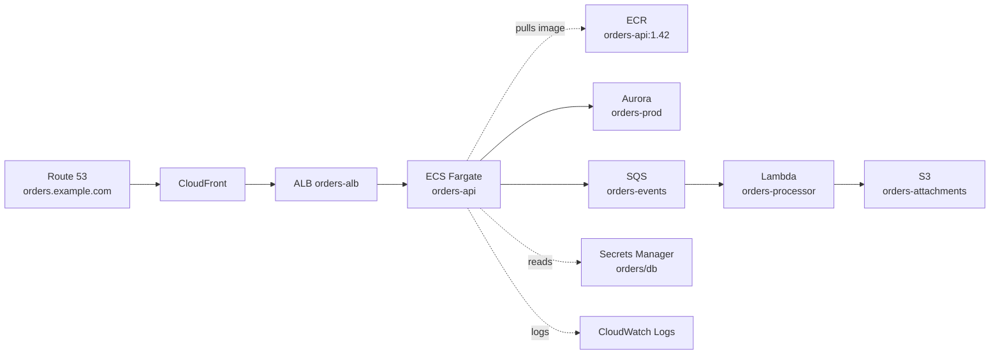
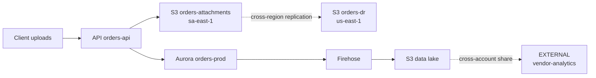
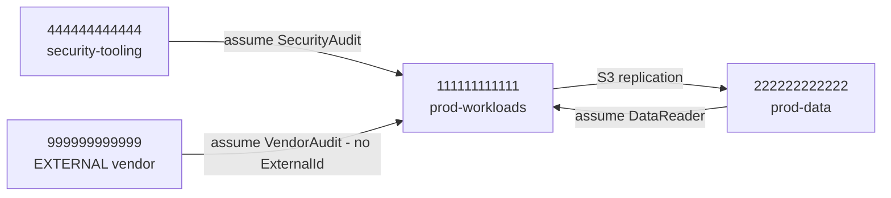
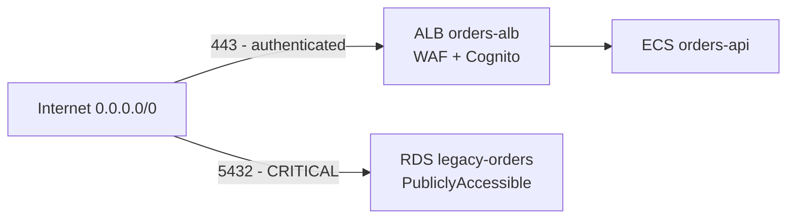

# AWS Inventory Reporting Skill

Defines the deliverable set, the table schemas and the diagram patterns.

## Golden rule — regenerate, never append

Reports are **derived artifacts**. Every time a new account is scanned, rebuild every report from **all** folders under `reports/raw/`. Never hand-edit a report to add an account; the totals will drift and the deliverable becomes untrustworthy.

```
reports/
├── Report-Status.md
├── AWS-Account-Assessment-Report.md
├── AWS-Resource-Inventory.md
├── AWS-Network-Topology.md
├── AWS-Dependency-Map.md
├── AWS-Security-Findings.md
├── AWS-Tagging-Governance.md
├── AWS-Cost-Analysis.md
├── Azure-Migration-Readiness.md        (optional, Phase 6)
├── inventory.csv
└── raw/
    ├── _scope.json
    └── <account-id>/
        ├── _index.json
        ├── _inventory-enriched.json
        ├── _edges.json
        ├── _findings.json
        └── <region>/<service>.json
```

Templates live in `templates/` next to this skill.

---

## 1. Universal Table Columns

Every inventory table starts with these, then adds service-specific columns:

| Column | Source |
|--------|--------|
| Resource | `resourceName` or `resourceId` |
| Type | `resourceType` |
| Region | `region` |
| Account | `accountId` (+ alias) |
| State | `state` |
| Created On | `createdOn` |
| Created By | `createdByDisplay` |
| Via | `createdVia` |
| Owner | `owner` |
| Tags | key=value list, or `—` |
| Est. Cost | `estimatedMonthlyCost` |

Rendering rules:
- Never leave a cell blank — use `—` for not-applicable and `UNKNOWN` for not-determined; they mean different things
- Format timestamps as `YYYY-MM-DD` in tables and keep full ISO-8601 in the JSON
- Truncate long ARNs in tables (`...:db:orders-prod`) and keep the full ARN in the CSV and JSON
- Sort by cost descending, then by name, so the reader sees what matters first

---

## 2. CSV Export Contract

`reports/inventory.csv` — one row per resource, all accounts, regenerated every time:

```
AccountId,AccountAlias,Region,Service,ResourceType,ResourceId,ResourceName,State,
CreatedOn,CreatedBy,CreatedVia,AttributionConfidence,Owner,OwnerConfidence,
Environment,Application,CostCenter,ManagedBy,EstimatedMonthlyCost,
PubliclyAccessible,Encrypted,VpcId,Arn,AllTags
```

- `AllTags` is a `key=value;key=value` string so Excel can split it
- Quote every field; escape embedded quotes by doubling them
- Write UTF-8 **without BOM**
- `EstimatedMonthlyCost` uses `.` as the decimal separator and no currency symbol

Optional companion exports when the user asks:
- `reports/findings.csv` — one row per (finding, resource) pair
- `reports/edges.csv` — `Source,Target,EdgeType,Confidence,Evidence,CrossAccount,CrossRegion`

---

## 3. Mermaid Diagram Patterns

### 3.1 Account hierarchy



### 3.2 Region distribution



### 3.3 VPC topology (one diagram per VPC)



### 3.4 Application dependency map



### 3.5 Data flow



### 3.6 Cross-account trust



### 3.7 Exposure paths



---

## 4. Mermaid Pitfalls (validate before delivering)

| Pitfall | Symptom | Fix |
|---------|---------|-----|
| `->` inside a node label | "Syntax error in text" | Use `to`, or a word — the arrow token is parsed even inside `[ ]` |
| Same node declared in two subgraphs | Silent render failure | Each node belongs to exactly one subgraph; reference it from outside |
| `===\|label\|` thick-line labels | Invalid in many versions | Use `==label==>` or `-->\|label\|` |
| Extra dots in dotted-arrow labels (`-.a.b.->`) | Parser confusion | Use `-.->\|label\|` with no extra dots |
| Unquoted labels containing `(`, `)`, `:`, `,`, `/` | Parse error | Always wrap labels in double quotes |
| CIDR blocks in labels | Usually fine, but `/` can break unquoted labels | Keep labels quoted |
| Node IDs starting with a digit or containing `-` | Parse error | Use `A1`, `VPC_0A1B` style IDs; put the real name in the label |
| Diagrams above ~40 nodes | Unreadable output | Split by VPC / application and add an index |
| `<br/>` in labels | Fine with default `htmlLabels: true` | Keep using it for multi-line labels |

Validate by pasting the block into the Mermaid Live Editor when a diagram is large or hand-assembled.

---

## 5. Report-Status Template

```markdown
# AWS Assessment — Status

**Started:** 2026-08-19 13:40 UTC
**Last updated:** 2026-08-19 17:05 UTC
**Mode:** Per-account (manual login)
**Operator:** <who ran it>

## Phase Progress
| Phase | Status |
|-------|--------|
| 0 — Setup & Scope | ✅ |
| 1 — Resource Discovery | ⏳ |
| 2 — Deep Inventory | ⬜ |
| 3 — Enrichment | ⬜ |
| 4 — Relationships & Topology | ⬜ |
| 5 — Reports | ⬜ |
| 6 — Azure Readiness | ⬜ |

## Accounts
| Account | Alias | P1 | P2 | P3 | P4 | Resources | Last scanned |
|---------|-------|----|----|----|----|-----------|--------------|
| 111111111111 | prod-workloads | ✅ | ✅ | ✅ | ✅ | 549 | 2026-08-19 14:02 |
| 222222222222 | prod-data | ✅ | ⬜ | ⬜ | ⬜ | 212 | 2026-08-19 16:40 |
| 333333333333 | dev-sandbox | ⬜ | ⬜ | ⬜ | ⬜ | — | pending |

## Regions In Scope
17 enabled regions — 4 contain resources, 13 confirmed empty.

## Options
| Option | Value |
|--------|-------|
| Creator attribution | CloudTrail 90-day |
| Cost analysis | Enabled |
| Security findings | Enabled |
| Account ID masking | Disabled |
| Concurrency | 5 |

## Coverage Gaps
| Account | Region | Service | Operation | Reason |
|---------|--------|---------|-----------|--------|
| 111111111111 | ap-east-1 | eks | eks:ListClusters | AccessDeniedException |

## Next Action
Run `/phase2-deepinventory` for account 222222222222.
Then log in to 333333333333 and run `/phase1-resourcediscovery`.
```

---

## 6. Quantify Everything

Every report opens with numbers, not prose:

| Metric | Example |
|--------|---------|
| Accounts assessed | 2 of 3 |
| Regions swept | 17 |
| Total resources | 761 |
| Distinct services in use | 34 |
| Compute footprint | 88 EC2 · 24 ECS services · 61 Lambda · 3 EKS clusters |
| Data footprint | 12 databases · 44 S3 buckets · 18.4 TB total |
| Network footprint | 5 VPCs · 34 subnets · 12 internet-facing endpoints |
| Tag coverage | 61% (118 untagged) |
| Ownership coverage | 78% (87 UNKNOWN) |
| IaC coverage | 44% managed by CloudFormation |
| Findings | 4 Critical · 17 High · 42 Medium |
| Estimated monthly cost | $18,420 ($1,940 unattributed) |
| Coverage gaps | 3 |

---

## 7. Pre-Delivery Checklist

```
[ ] All reports regenerated from ALL account folders present
[ ] Totals reconcile: inventory == index - coverage gaps
[ ] Every Mermaid block validated
[ ] No secret values, access keys, session tokens or private keys anywhere in reports/
[ ] No environment-variable values captured
[ ] Account IDs masked if requested
[ ] Every finding carries a resource ARN
[ ] Every table uses the universal columns
[ ] inventory.csv regenerated and openable in Excel
[ ] Generation timestamp and account set stated in every report
[ ] Coverage gaps and the CloudTrail 90-day caveat stated in the assessment report
[ ] Next action stated in Report-Status.md
```
