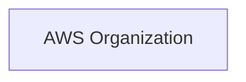
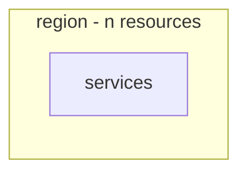

# AWS Account Assessment Report

> **Generated:** `<YYYY-MM-DD HH:mm UTC>`
> **Accounts assessed:** `<n>` of `<n>` — `<id (alias)>, ...`
> **Regions swept:** `<n>` enabled regions
> **Mode:** `Organizations` | `Per-account`
> **Scope:** Read-only discovery. No AWS resource was created, modified or deleted.

---

## 1. Executive Summary

<!-- 5-10 bullets a non-technical stakeholder can act on. Lead with numbers. -->

- The estate spans **`<n>` accounts** and **`<n>` regions**, holding **`<n>` resources** across **`<n>` services`**.
- **`<n>` resources (`<pct>`) have no identifiable owner**, representing **`$<amount>`/month** of unattributed spend.
- **`<n>` Critical** and **`<n>` High** security findings were identified, including `<headline finding>`.
- **`<pct>` of infrastructure is not managed as code**, concentrated in `<where>`.
- **`<n>` resources run end-of-life engines or runtimes** and require remediation.
- `<n>` resources were found in **`<regions>`**, outside the declared operating footprint.
- Estimated monthly run rate: **`$<amount>`**, with **`$<amount>`** in identified waste.

---

## 2. Estate Profile

### 2.1 Resources by account

| Account | Alias | Regions in use | Resources | Est. monthly cost | Findings (C/H) |
|---------|-------|----------------|-----------|-------------------|----------------|
| | | | | | |
| **Total** | | | | | |

### 2.2 Resources by region

| Region | Resources | Top services | Est. monthly cost |
|--------|-----------|--------------|-------------------|
| | | | |

### 2.3 Resources by service

| Service | Count | Accounts | Regions | Est. monthly cost |
|---------|-------|----------|---------|-------------------|
| | | | | |

### 2.4 Footprint summary

| Dimension | Value |
|-----------|-------|
| EC2 instances | `<n>` (`<n>` vCPU, `<n>` GiB) |
| Auto Scaling Groups | `<n>` |
| Elastic Beanstalk environments | `<n>` |
| ECS clusters / services / tasks | `<n>` / `<n>` / `<n>` |
| Fargate vs EC2 launch type | `<n>` / `<n>` |
| EKS clusters / node groups | `<n>` / `<n>` |
| ECR repositories / images | `<n>` / `<n>` |
| Lambda functions | `<n>` |
| Relational databases (RDS/Aurora) | `<n>` |
| NoSQL / cache | `<n>` DynamoDB, `<n>` ElastiCache |
| S3 buckets / total size | `<n>` / `<n>` TB |
| EBS volumes / total size | `<n>` / `<n>` TB |
| VPCs / subnets | `<n>` / `<n>` |
| Load balancers | `<n>` (`<n>` internet-facing) |
| IAM users / roles | `<n>` / `<n>` |

---

## 3. Architecture Overview

### 3.1 Account hierarchy

### 3.2 Region distribution

> Detailed per-VPC topology: see [AWS-Network-Topology.md](AWS-Network-Topology.md)
> Application and data-flow maps: see [AWS-Dependency-Map.md](AWS-Dependency-Map.md)

---

## 4. Workload Inventory

| Application | Account | Environment | Resources | Owner | Est. monthly cost | Internet-facing | IaC managed |
|-------------|---------|-------------|-----------|-------|-------------------|-----------------|-------------|
| | | | | | | | |
| *Unclassified* | | | | | | | |

---

## 5. Key Findings

<!-- Top 10 by severity and business impact. Full list in AWS-Security-Findings.md -->

| # | Severity | Finding | Affected | Account(s) | Recommendation |
|---|----------|---------|----------|------------|----------------|
| 1 | 🔴 Critical | | `<n>` | | |
| 2 | 🟠 High | | `<n>` | | |

> Full catalog: [AWS-Security-Findings.md](AWS-Security-Findings.md)

---

## 6. Cost Summary

| Dimension | Top item | Amount | Share |
|-----------|----------|--------|-------|
| Service | | | |
| Region | | | |
| Account | | | |
| Owner | | | |
| **Unattributed** | — | | |

Identified waste: **`$<amount>`/month**

| Waste category | Count | Est. monthly cost |
|----------------|-------|-------------------|
| Unattached EBS volumes | | |
| Unassociated Elastic IPs | | |
| Idle load balancers | | |
| Never-expiring log groups | | |
| Snapshots older than 1 year | | |

> Figures are **directional**. Use the AWS Cost Explorer console for authoritative numbers.
> Full analysis: [AWS-Cost-Analysis.md](AWS-Cost-Analysis.md)

---

## 7. Governance Summary

| Metric | Value | Target |
|--------|-------|--------|
| Tag coverage (any tag) | `<pct>` | 100% |
| Required-tag compliance | `<pct>` | 100% |
| Ownership coverage | `<pct>` | 100% |
| IaC coverage | `<pct>` | ≥ 90% |
| Resources created via console | `<n>` | 0 |
| Orphaned resources | `<n>` | 0 |

> Detail: [AWS-Tagging-Governance.md](AWS-Tagging-Governance.md)

---

## 8. Modernization Signals

| Signal | Count | Detail |
|--------|-------|--------|
| End-of-life database engines | | |
| Deprecated Lambda runtimes | | |
| EKS clusters out of support | | |
| Retired Beanstalk solution stacks | | |
| Previous-generation instance families | | |
| Classic Load Balancers | | |
| Single-AZ production workloads | | |
| Resources not managed as code | | |

---

## 9. Coverage Gaps & Limitations

### 9.1 Not scanned

| Account | Region | Service | Operation | Reason |
|---------|--------|---------|-----------|--------|
| | | | | |

### 9.2 Known limitations

- **CloudTrail creator attribution covers only the last 90 days.** Resources created before `<date>` show `UNKNOWN` unless an ownership tag exists or an Athena-backed trail was queried.
- **Cost figures are allocations**, not per-resource billing, unless Cost Explorer resource-level data is enabled.
- **Inferred relationships** are labeled with their evidence and confidence; `MEDIUM`/`LOW` edges are hypotheses, not facts.
- **Accounts not yet scanned:** `<list>` — totals in this report exclude them.

---

## 10. Recommendations

| Priority | Recommendation | Justified by | Effort |
|----------|----------------|--------------|--------|
| P0 | | Finding `<id>` | |
| P1 | | Finding `<id>` | |
| P2 | | Finding `<id>` | |

---

## 11. Next Steps

- [ ] Scan remaining accounts: `<list>` — run `/phase1-resourcediscovery` after logging in to each
- [ ] Remediate P0 findings
- [ ] Define and enforce the required tag set
- [ ] Bring unmanaged resources under IaC
- [ ] (Optional) Run `/phase6-azurereadiness` if Azure migration is in scope
