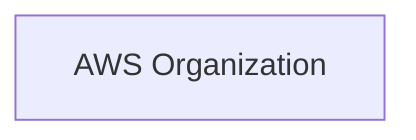
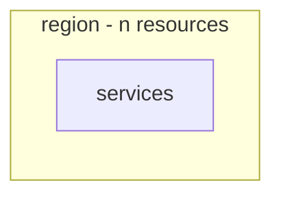
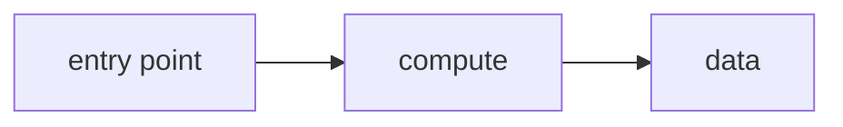
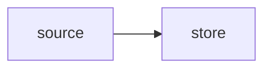
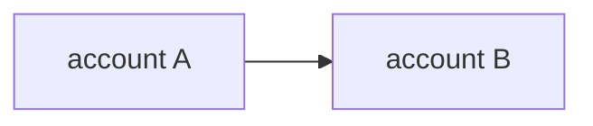
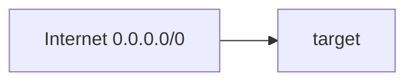

# AWS Dependency Map

> **Generated:** `<YYYY-MM-DD HH:mm UTC>`
> **Accounts:** `<list>` · **Edges:** `<n>` (`<n>` HIGH, `<n>` MEDIUM, `<n>` LOW)
> Machine-readable edge list: `reports/raw/<account-id>/_edges.json`

**Legend**

| Rendering | Meaning |
|-----------|---------|
| Solid arrow `-->` | HIGH confidence — explicit identifier in the API response |
| Dotted arrow `-.->` | MEDIUM confidence — inferred, evidence stated in the edge table |
| Node labeled `EXTERNAL` | Account outside the organization |
| Red-labeled edge | Internet-exposed path |

---

## 1. Account Hierarchy

---

## 2. Region Distribution

---

## 3. Application Maps

Repeat one diagram per identified application.

### 3.1 `<application-name>`

**Account:** `<id>` · **Environment:** `<env>` · **Owner:** `<owner>` · **Est. cost:** `$<amount>`/month

| Resource | Type | Role in the application | Owner |
|----------|------|------------------------|-------|
| | | | |

**Inferred edges in this map**

| Source | Target | Evidence | Confidence |
|--------|--------|----------|-----------|
| | | | |

---

## 4. Data Flow

| Flow | From | To | Data | Cross-region | Cross-account | Encrypted in transit |
|------|------|----|------|--------------|---------------|----------------------|
| | | | | | | |

---

## 5. Cross-Account & Cross-Region Edges

| Source Account | Target Account | Mechanism | Detail | External? | Risk |
|----------------|----------------|-----------|--------|-----------|------|
| | | IAM trust / peering / TGW / S3 policy / KMS grant / RAM | | | |

---

## 6. Internet Exposure Paths

| # | Entry | Path | Terminal resource | Auth | Severity |
|---|-------|------|-------------------|------|----------|
| | | | | | |

---

## 7. Full Edge Table

| Source | Target | Edge Type | Evidence | Confidence | Cross-Acct | Cross-Region | Application |
|--------|--------|-----------|----------|-----------|-----------|--------------|-------------|
| | | | | | | | |

---

## 8. Orphaned Resources

Resources with **zero HIGH-confidence inbound and outbound edges** — decommissioning candidates.

| Resource | Type | Account | Region | Created | Created By | Owner | Est. monthly cost | Orphan signal |
|----------|------|---------|--------|---------|-----------|-------|-------------------|---------------|
| | | | | | | | | |

**Total reclaimable:** `$<amount>`/month

---

## 9. Unclassified Resources

Resources that could not be assigned to an application.

| Count | Est. monthly cost | Share of estate |
|-------|-------------------|-----------------|
| | | |

| Resource | Type | Account | Region | Created | Owner | Why unclassified |
|----------|------|---------|--------|---------|-------|------------------|
| | | | | | | No tag, no stack, no edges |
