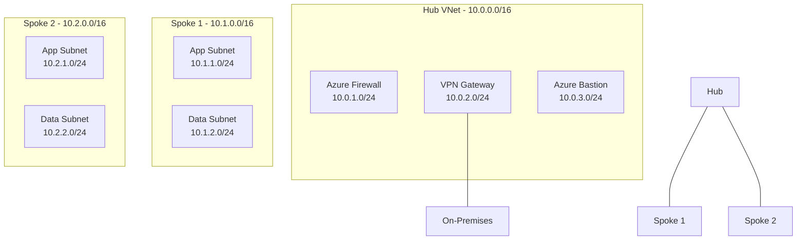

# AWS to Azure Networking Migration Guide

This skill provides comprehensive guidance for migrating AWS networking services to their Azure equivalents. It covers VPC-to-VNet translation, security group mapping, load balancing, DNS, CDN, and hybrid connectivity patterns.

---

## Core Networking Mapping

| AWS | Azure | Key Differences |
|-----|-------|-----------------|
| VPC | Virtual Network (VNet) | Similar concept, different CIDR handling |
| Subnet | Subnet | Azure subnets can span availability zones |
| Security Group | Network Security Group (NSG) | NSG is stateful, applies to subnet or NIC |
| NACL | NSG (combined) | Azure NSGs handle both SG and NACL functions |
| Internet Gateway | Built-in (VNet default) | Azure VNets have implicit internet routing |
| NAT Gateway | NAT Gateway | Similar functionality |
| Elastic IP | Public IP (Static) | Azure supports Standard and Basic SKUs |
| VPC Peering | VNet Peering | Similar — non-transitive |
| Transit Gateway | Azure Virtual WAN / Hub-Spoke VNet | Virtual WAN for managed hub; hub-spoke for custom |
| VPC Endpoints (Gateway) | Service Endpoints | For Storage, SQL, etc. |
| VPC Endpoints (Interface) | Private Endpoints | More granular, resource-level |
| PrivateLink | Azure Private Link | Same concept |
| Route Tables | Route Tables (UDR) | User-Defined Routes |
| Direct Connect | ExpressRoute | Private connectivity to Azure |
| VPN Gateway | VPN Gateway | Site-to-site and point-to-site |

### Key Differences to Note

- **Security Groups vs. NSGs**: AWS Security Groups are instance-level and stateful. AWS NACLs are subnet-level and stateless. In Azure, NSGs combine both functions — they are stateful and can be applied at either the subnet or NIC level. There is no separate NACL equivalent.
- **Internet Gateway**: AWS requires an explicit Internet Gateway attached to a VPC. Azure VNets have implicit internet routing by default — outbound internet access is available unless restricted by NSG rules or Azure Firewall.
- **Subnets and Availability Zones**: AWS subnets are tied to a single Availability Zone. Azure subnets span all availability zones within a region, simplifying high-availability designs.
- **VPC Endpoints vs. Private Endpoints**: AWS Gateway Endpoints are free but limited to S3 and DynamoDB. Azure Service Endpoints are free and cover more services. AWS Interface Endpoints and Azure Private Endpoints both provide private IP connectivity into PaaS services and are functionally equivalent.

---

## Load Balancing Mapping

| AWS | Azure | When to Use |
|-----|-------|-------------|
| Application Load Balancer (ALB) | Application Gateway | Layer 7, path-based routing, WAF integration |
| Network Load Balancer (NLB) | Azure Load Balancer | Layer 4, high performance, ultra-low latency |
| Classic Load Balancer | Azure Load Balancer | Migrate to ALB/NLB equivalent first |
| Global Accelerator | Azure Front Door | Global load balancing, anycast, edge acceleration |

### Load Balancer Decision Guide

```
Is the traffic HTTP/HTTPS?
├── Yes → Is it global (multi-region)?
│   ├── Yes → Azure Front Door
│   └── No → Application Gateway
│       └── Need WAF? → Application Gateway with WAF v2
└── No (TCP/UDP) → Is it global?
    ├── Yes → Azure Front Door (TCP proxy) or Traffic Manager + Load Balancer
    └── No → Azure Load Balancer (Standard SKU)
```

### Application Gateway (ALB Equivalent)

- Supports path-based and host-based routing
- Integrated WAF v2 with OWASP rule sets
- SSL/TLS termination and end-to-end encryption
- Autoscaling with v2 SKU
- Supports Private Link for internal-only access

### Azure Load Balancer (NLB Equivalent)

- Standard SKU recommended for production
- Supports availability zones (zone-redundant or zonal)
- HA ports for NVA deployments
- Outbound rules for SNAT configuration

---

## DNS Mapping

| AWS | Azure | Notes |
|-----|-------|-------|
| Route 53 Public Hosted Zone | Azure DNS Zone | Public DNS hosting |
| Route 53 Private Hosted Zone | Azure Private DNS Zone | VNet-scoped DNS resolution |
| Route 53 Health Checks | Azure Traffic Manager / Front Door health probes | Health-based failover |
| Route 53 Routing Policies | Traffic Manager routing methods | Weighted, geographic, priority, performance |

### Route 53 Routing Policy → Azure Equivalent

| Route 53 Policy | Azure Equivalent | Service |
|-----------------|-----------------|---------|
| Simple | A/AAAA record | Azure DNS |
| Weighted | Weighted routing | Traffic Manager |
| Latency-based | Performance routing | Traffic Manager |
| Failover | Priority routing | Traffic Manager |
| Geolocation | Geographic routing | Traffic Manager |
| Multi-value | Multiple A records | Azure DNS / Traffic Manager |

### DNS Migration Steps

1. Export all DNS records from Route 53 hosted zones
2. Create corresponding Azure DNS zones or Azure Private DNS zones
3. Import records into Azure DNS (use `az network dns record-set` commands)
4. Update NS records at the domain registrar to point to Azure DNS name servers
5. Monitor with low TTL during cutover, then increase TTL after validation

---

## CDN & Edge

| AWS | Azure | Notes |
|-----|-------|-------|
| CloudFront | Azure Front Door / Azure CDN | Front Door recommended for new deployments |
| CloudFront Functions | Azure Front Door Rules Engine | Request/response manipulation at the edge |
| Lambda@Edge | Azure Functions + Front Door | Serverless compute at the edge |

### CloudFront → Azure Front Door Migration

Azure Front Door is the recommended replacement for CloudFront. It combines CDN, global load balancing, WAF, and SSL offloading in a single service.

**Key mapping:**

| CloudFront Concept | Azure Front Door Concept |
|-------------------|------------------------|
| Distribution | Front Door profile |
| Origin | Origin / Origin group |
| Behavior | Route |
| Cache Policy | Caching rules |
| Origin Request Policy | Rule set actions |
| Function Association | Rules Engine |
| Field-Level Encryption | End-to-end TLS |

---

## Migration Patterns

Follow these steps for a structured network migration:

### Step 1: Document Current AWS VPC Topology

- Inventory all VPCs, subnets, and CIDR ranges
- Map all Security Group and NACL rules
- Document VPC peering connections and Transit Gateway topology
- List all VPC Endpoints (Gateway and Interface)
- Record route tables and their associations
- Document NAT Gateways, Internet Gateways, and Elastic IPs
- Export DNS records from Route 53

### Step 2: Design Azure VNet Topology

- Use a **hub-spoke topology** for enterprise deployments
- Plan CIDR ranges to avoid overlap with on-premises networks
- Place shared services (DNS, firewall, VPN gateway) in the hub VNet
- Create spoke VNets for each workload or environment
- Use VNet peering between hub and spokes



### Step 3: Map Security Groups to NSG Rules

- Consolidate AWS Security Groups and NACLs into Azure NSGs
- Map inbound and outbound rules preserving port, protocol, and source/destination
- Use Application Security Groups (ASGs) to group VMs logically (similar to AWS Security Group references)
- Apply NSGs at the subnet level for broad rules, NIC level for VM-specific rules

### Step 4: Plan Private Endpoints for Azure PaaS Services

- Replace AWS VPC Endpoints with Azure Private Endpoints
- Create Private Endpoints for Storage, SQL, Key Vault, App Services, and other PaaS resources
- Configure Private DNS zones for automatic DNS resolution of private endpoints
- Disable public network access on PaaS services after Private Endpoints are configured

### Step 5: Configure DNS

- Migrate Route 53 public zones to Azure DNS
- Create Azure Private DNS zones for VNet-scoped name resolution
- Link Private DNS zones to relevant VNets
- Configure DNS forwarding if hybrid resolution is needed (Azure DNS Private Resolver)

### Step 6: Set Up Hybrid Connectivity

- **VPN Gateway**: For encrypted site-to-site or point-to-site connections
- **ExpressRoute**: For private, high-bandwidth, low-latency connectivity (replaces AWS Direct Connect)
- Configure BGP peering if dynamic routing is required
- Set up redundant connections for high availability

### Step 7: Validate Network Security

- Enable NSG flow logs and send to Log Analytics workspace
- Use Azure Network Watcher for connectivity testing and topology visualization
- Verify Private Endpoint DNS resolution
- Test network connectivity between spokes through the hub
- Validate firewall rules and route tables

---

## Best Practices

### Network Topology
- Use **hub-spoke VNet topology** for enterprise deployments
- Use **Azure Virtual WAN** for large-scale branch connectivity
- Plan IP address space carefully — avoid overlaps with on-premises and other cloud environments
- Use separate subnets for different tiers (web, app, data)

### Security
- Enable **NSG flow logs** for security monitoring and send to Log Analytics
- Use **Private Endpoints** for all PaaS services (Storage, SQL, Key Vault, App Service, etc.)
- Use **Azure Firewall** or third-party NVA for centralized egress filtering
- Use **Azure DDoS Protection** for public-facing resources
- Use **Azure Bastion** instead of jump boxes for secure VM access
- Apply the principle of least privilege in NSG rules — deny by default, allow explicitly

### DNS
- Use **Azure Private DNS zones** for internal name resolution
- Link Private DNS zones to VNets that need resolution
- Use **Azure DNS Private Resolver** for hybrid DNS forwarding scenarios

### Monitoring & Operations
- Use **Azure Network Watcher** for diagnostics, packet capture, and topology views
- Enable **Connection Monitor** for continuous connectivity testing
- Use **Azure Monitor** metrics and alerts for load balancers, VPN gateways, and ExpressRoute circuits
- Implement **Network Security Group analytics** via Log Analytics

### Cost Optimization
- Use **Service Endpoints** (free) where Private Endpoints are not required
- Choose the right load balancer tier — Standard Load Balancer for production, Basic for dev/test
- Right-size VPN Gateway and ExpressRoute SKUs based on throughput needs
- Use **Azure Reservations** for ExpressRoute circuits with predictable bandwidth needs

---

## Bicep Examples

### Hub VNet with Firewall and Bastion

```bicep
param location string = resourceGroup().location
param hubVnetName string = 'vnet-hub'
param hubAddressPrefix string = '10.0.0.0/16'

resource hubVnet 'Microsoft.Network/virtualNetworks@2024-01-01' = {
  name: hubVnetName
  location: location
  properties: {
    addressSpace: {
      addressPrefixes: [hubAddressPrefix]
    }
    subnets: [
      {
        name: 'AzureFirewallSubnet'
        properties: {
          addressPrefix: '10.0.1.0/24'
        }
      }
      {
        name: 'GatewaySubnet'
        properties: {
          addressPrefix: '10.0.2.0/24'
        }
      }
      {
        name: 'AzureBastionSubnet'
        properties: {
          addressPrefix: '10.0.3.0/24'
        }
      }
    ]
  }
}
```

### NSG with Rules (Security Group Equivalent)

```bicep
param location string = resourceGroup().location

resource webNsg 'Microsoft.Network/networkSecurityGroups@2024-01-01' = {
  name: 'nsg-web-tier'
  location: location
  properties: {
    securityRules: [
      {
        name: 'AllowHTTPS'
        properties: {
          priority: 100
          direction: 'Inbound'
          access: 'Allow'
          protocol: 'Tcp'
          sourceAddressPrefix: '*'
          sourcePortRange: '*'
          destinationAddressPrefix: '*'
          destinationPortRange: '443'
        }
      }
      {
        name: 'AllowHTTP'
        properties: {
          priority: 110
          direction: 'Inbound'
          access: 'Allow'
          protocol: 'Tcp'
          sourceAddressPrefix: '*'
          sourcePortRange: '*'
          destinationAddressPrefix: '*'
          destinationPortRange: '80'
        }
      }
      {
        name: 'DenyAllInbound'
        properties: {
          priority: 4096
          direction: 'Inbound'
          access: 'Deny'
          protocol: '*'
          sourceAddressPrefix: '*'
          sourcePortRange: '*'
          destinationAddressPrefix: '*'
          destinationPortRange: '*'
        }
      }
    ]
  }
}
```

### Private Endpoint for Storage Account

```bicep
param location string = resourceGroup().location
param vnetName string
param subnetName string
param storageAccountName string

resource storageAccount 'Microsoft.Storage/storageAccounts@2023-05-01' existing = {
  name: storageAccountName
}

resource privateEndpoint 'Microsoft.Network/privateEndpoints@2024-01-01' = {
  name: 'pe-${storageAccountName}'
  location: location
  properties: {
    subnet: {
      id: resourceId('Microsoft.Network/virtualNetworks/subnets', vnetName, subnetName)
    }
    privateLinkServiceConnections: [
      {
        name: 'plsc-${storageAccountName}'
        properties: {
          privateLinkServiceId: storageAccount.id
          groupIds: ['blob']
        }
      }
    ]
  }
}
```

---

## Common Pitfalls

| Pitfall | Recommendation |
|---------|---------------|
| Overlapping CIDR ranges | Plan IP address space holistically before deployment |
| Forgetting Private DNS zones for Private Endpoints | Always create and link Private DNS zones |
| Using Basic SKU Load Balancer in production | Always use Standard SKU for production workloads |
| Not enabling NSG flow logs | Enable on all NSGs from day one |
| Public access left open on PaaS services | Disable public access after Private Endpoints are configured |
| Undersized VPN Gateway | Choose SKU based on expected throughput and connection count |
| Missing UDR for forced tunneling | Add 0.0.0.0/0 route through Azure Firewall for spoke subnets |
