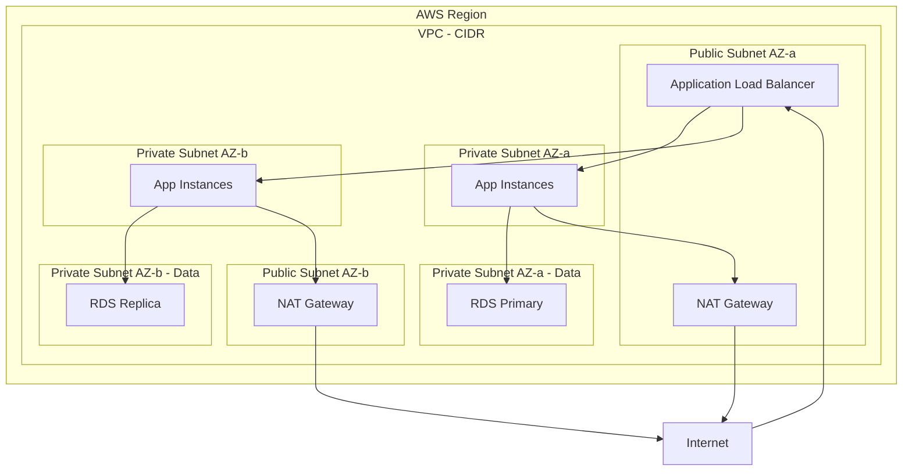
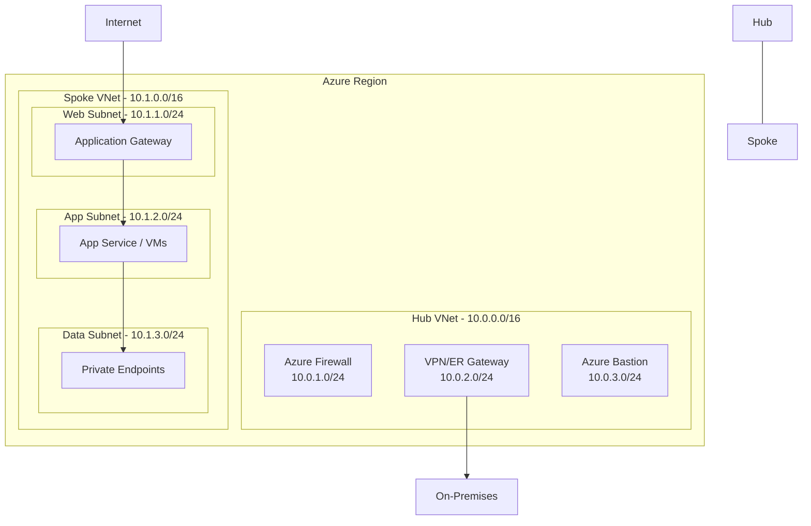

# Networking Migration Plan: [Application Name]

> **Date:** YYYY-MM-DD
> **Author:** [Your Name]
> **Status:** Draft | In Review | Approved | Completed

---

## 1. Current AWS VPC Topology

### Architecture Diagram

> **Instructions:** Replace the diagram above with your actual AWS VPC topology. Include all VPCs, subnets, gateways, load balancers, and connectivity.

### VPC Inventory

| VPC Name | VPC ID | CIDR Range | Region | Purpose |
|----------|--------|------------|--------|---------|
| | | | | |
| | | | | |

### Subnet Inventory

| Subnet Name | Subnet ID | CIDR Range | AZ | Type (Public/Private) | Associated Route Table |
|-------------|-----------|------------|----|-----------------------|----------------------|
| | | | | | |
| | | | | | |
| | | | | | |

### Internet & NAT Gateways

| Resource | ID | Associated Subnet | Elastic IP | Notes |
|----------|----|--------------------|------------|-------|
| Internet Gateway | | N/A | N/A | |
| NAT Gateway | | | | |

### VPC Peering & Transit Gateway

| Connection | Source VPC | Destination VPC | CIDR Ranges | Purpose |
|-----------|-----------|-----------------|-------------|---------|
| | | | | |

---

## 2. Target Azure VNet Topology

### Architecture Diagram

> **Instructions:** Replace the diagram above with your planned Azure VNet topology. Use hub-spoke model for enterprise deployments.

### VNet Design

| VNet Name | Address Space | Region | Purpose | Peered To |
|-----------|--------------|--------|---------|-----------|
| vnet-hub | 10.0.0.0/16 | | Hub — shared services | All spokes |
| vnet-spoke-app | 10.1.0.0/16 | | Application workloads | vnet-hub |
| | | | | |

### Subnet Design

| VNet | Subnet Name | Address Prefix | Purpose | NSG | Route Table |
|------|-------------|---------------|---------|-----|-------------|
| vnet-hub | AzureFirewallSubnet | 10.0.1.0/24 | Azure Firewall | N/A | N/A |
| vnet-hub | GatewaySubnet | 10.0.2.0/24 | VPN/ExpressRoute Gateway | N/A | N/A |
| vnet-hub | AzureBastionSubnet | 10.0.3.0/24 | Azure Bastion | N/A | N/A |
| vnet-spoke-app | snet-web | 10.1.1.0/24 | Web tier / App Gateway | nsg-web | rt-spoke |
| vnet-spoke-app | snet-app | 10.1.2.0/24 | Application tier | nsg-app | rt-spoke |
| vnet-spoke-app | snet-data | 10.1.3.0/24 | Private Endpoints | nsg-data | rt-spoke |
| | | | | | |

---

## 3. CIDR Range Mapping

| AWS VPC/Subnet | AWS CIDR | Azure VNet/Subnet | Azure CIDR | Notes |
|----------------|----------|-------------------|------------|-------|
| | | | | |
| | | | | |
| | | | | |

### IP Address Space Validation

- [ ] No CIDR overlaps between Azure VNets
- [ ] No CIDR overlaps with on-premises networks
- [ ] No CIDR overlaps with other cloud environments
- [ ] Sufficient address space for future growth
- [ ] Reserved subnets accounted for (GatewaySubnet, AzureFirewallSubnet, AzureBastionSubnet)

---

## 4. Security Group → NSG Rule Mapping

### Inbound Rules

| AWS Security Group | Rule Description | Protocol | Port Range | Source | Azure NSG | Azure Rule Name | Priority |
|-------------------|-----------------|----------|------------|--------|-----------|----------------|----------|
| | | | | | | | |
| | | | | | | | |

### Outbound Rules

| AWS Security Group | Rule Description | Protocol | Port Range | Destination | Azure NSG | Azure Rule Name | Priority |
|-------------------|-----------------|----------|------------|-------------|-----------|----------------|----------|
| | | | | | | | |
| | | | | | | | |

### NACL Rules to Consolidate

| AWS NACL | Rule # | Direction | Protocol | Port Range | Source/Dest | Action | Consolidated Into NSG |
|----------|--------|-----------|----------|------------|-------------|--------|----------------------|
| | | | | | | | |
| | | | | | | | |

### Application Security Groups (ASGs)

| ASG Name | Purpose | Associated NICs / VMs |
|----------|---------|----------------------|
| | | |
| | | |

> **Note:** Use ASGs to replicate the behavior of AWS Security Group cross-references (where one SG references another as a source/destination).

---

## 5. DNS Migration Plan

### Public DNS Zones

| Route 53 Hosted Zone | Domain | Record Count | Azure DNS Zone | Migration Status |
|----------------------|--------|-------------|---------------|-----------------|
| | | | | ☐ Not Started |
| | | | | ☐ Not Started |

### Private DNS Zones

| Route 53 Private Zone | Domain | Associated VPCs | Azure Private DNS Zone | Linked VNets | Migration Status |
|----------------------|--------|----------------|----------------------|-------------|-----------------|
| | | | | | ☐ Not Started |

### DNS Records to Migrate

| Zone | Record Name | Type | Value | TTL | Azure Equivalent | Notes |
|------|------------|------|-------|-----|-----------------|-------|
| | | A | | | | |
| | | CNAME | | | | |
| | | MX | | | | |

### Private Endpoint DNS Zones

| Azure Service | Private DNS Zone Name | Linked VNets |
|--------------|----------------------|-------------|
| Azure SQL | privatelink.database.windows.net | vnet-hub, vnet-spoke-app |
| Storage (Blob) | privatelink.blob.core.windows.net | vnet-hub, vnet-spoke-app |
| Key Vault | privatelink.vaultcore.azure.net | vnet-hub, vnet-spoke-app |
| App Service | privatelink.azurewebsites.net | vnet-hub, vnet-spoke-app |
| | | |

### DNS Migration Checklist

- [ ] Export all records from Route 53
- [ ] Create Azure DNS zones (public and private)
- [ ] Import records into Azure DNS
- [ ] Create Private DNS zones for Private Endpoints
- [ ] Link Private DNS zones to appropriate VNets
- [ ] Lower TTLs before cutover
- [ ] Update NS records at domain registrar
- [ ] Validate DNS resolution
- [ ] Increase TTLs after validation

---

## 6. Connectivity Requirements

### Hybrid Connectivity

| Requirement | AWS Current | Azure Target | Notes |
|-------------|-------------|-------------|-------|
| Site-to-site VPN | AWS VPN Gateway | Azure VPN Gateway | |
| Private connectivity | Direct Connect | ExpressRoute | |
| Remote user access | Client VPN | Point-to-site VPN / Azure VPN Client | |
| Branch connectivity | Transit Gateway | Azure Virtual WAN | |

### VPN Gateway Configuration

| Parameter | Value |
|-----------|-------|
| Gateway SKU | VpnGw2 |
| VPN Type | Route-based |
| BGP Enabled | Yes / No |
| BGP ASN | |
| Local Network Gateway IP | |
| Shared Key | (stored in Key Vault) |

### ExpressRoute Configuration (if applicable)

| Parameter | Value |
|-----------|-------|
| Circuit SKU | Standard / Premium |
| Bandwidth | 50 Mbps / 100 Mbps / ... |
| Peering Location | |
| Provider | |
| Private Peering VLAN | |
| Microsoft Peering VLAN | |

### Connectivity Checklist

- [ ] Hybrid connectivity type selected (VPN / ExpressRoute / both)
- [ ] Gateway subnet created in hub VNet
- [ ] Gateway provisioned and configured
- [ ] On-premises firewall rules updated
- [ ] BGP peering established (if applicable)
- [ ] Connectivity validated from on-premises to Azure
- [ ] Redundancy configured for high availability

---

## 7. Private Endpoint Plan for PaaS Services

| Azure PaaS Service | Resource Name | Private Endpoint Name | Subnet | Private DNS Zone | Public Access Disabled |
|--------------------|--------------|-----------------------|--------|-----------------|----------------------|
| Azure SQL Database | | pe-sql-* | snet-data | privatelink.database.windows.net | ☐ |
| Storage Account (Blob) | | pe-st-* | snet-data | privatelink.blob.core.windows.net | ☐ |
| Key Vault | | pe-kv-* | snet-data | privatelink.vaultcore.azure.net | ☐ |
| App Service | | pe-app-* | snet-data | privatelink.azurewebsites.net | ☐ |
| Azure Cache for Redis | | pe-redis-* | snet-data | privatelink.redis.cache.windows.net | ☐ |
| | | | | | ☐ |

### Private Endpoint Checklist

- [ ] Identify all PaaS services requiring Private Endpoints
- [ ] Create dedicated subnet for Private Endpoints (or use existing data subnet)
- [ ] Disable network policies on Private Endpoint subnet
- [ ] Create Private DNS zones for each service type
- [ ] Link Private DNS zones to hub and spoke VNets
- [ ] Create Private Endpoints for each PaaS service
- [ ] Validate DNS resolution to private IPs
- [ ] Disable public network access on PaaS services
- [ ] Test application connectivity through Private Endpoints

---

## 8. Load Balancer Migration

| AWS Load Balancer | Type | Target Azure Resource | SKU | Notes |
|-------------------|------|-----------------------|-----|-------|
| | ALB | Application Gateway | WAF_v2 | |
| | NLB | Azure Load Balancer | Standard | |
| | CLB | Azure Load Balancer | Standard | |

### Application Gateway Configuration

| Parameter | Value |
|-----------|-------|
| SKU | Standard_v2 / WAF_v2 |
| Capacity (min/max) | / |
| Subnet | |
| Public IP | |
| Backend Pools | |
| Routing Rules | |
| Health Probes | |
| WAF Policy | |

---

## 9. Migration Execution Checklist

### Pre-Migration

- [ ] Current AWS networking fully documented
- [ ] Azure VNet topology designed and reviewed
- [ ] CIDR ranges validated (no overlaps)
- [ ] NSG rules mapped and reviewed
- [ ] DNS migration plan approved
- [ ] Hybrid connectivity plan approved
- [ ] Private Endpoint plan approved
- [ ] Rollback plan documented

### Migration

- [ ] Hub VNet and shared services deployed
- [ ] Spoke VNets deployed
- [ ] VNet peering configured
- [ ] NSGs applied to subnets
- [ ] Route tables (UDRs) configured
- [ ] Azure Firewall / NVA deployed (if applicable)
- [ ] VPN Gateway / ExpressRoute provisioned
- [ ] Private Endpoints created
- [ ] Private DNS zones created and linked
- [ ] Load balancers / Application Gateway deployed
- [ ] Public DNS migrated to Azure DNS
- [ ] NSG flow logs enabled

### Post-Migration Validation

- [ ] Application connectivity verified
- [ ] DNS resolution validated (public and private)
- [ ] Hybrid connectivity tested
- [ ] NSG flow logs reviewed for unexpected blocks
- [ ] Network Watcher topology verified
- [ ] Load balancer health probes passing
- [ ] Performance baseline established
- [ ] Security scan completed
- [ ] Monitoring and alerting configured

---

## 10. Rollback Plan

| Step | Action | Owner | Estimated Time |
|------|--------|-------|---------------|
| 1 | Revert DNS NS records to Route 53 | | |
| 2 | Re-enable AWS load balancers | | |
| 3 | Verify AWS application health | | |
| 4 | Retain Azure resources for 48 hours before cleanup | | |

---

## Approval

| Role | Name | Date | Signature |
|------|------|------|-----------|
| Network Architect | | | |
| Security Lead | | | |
| Application Owner | | | |
| Operations Lead | | | |
