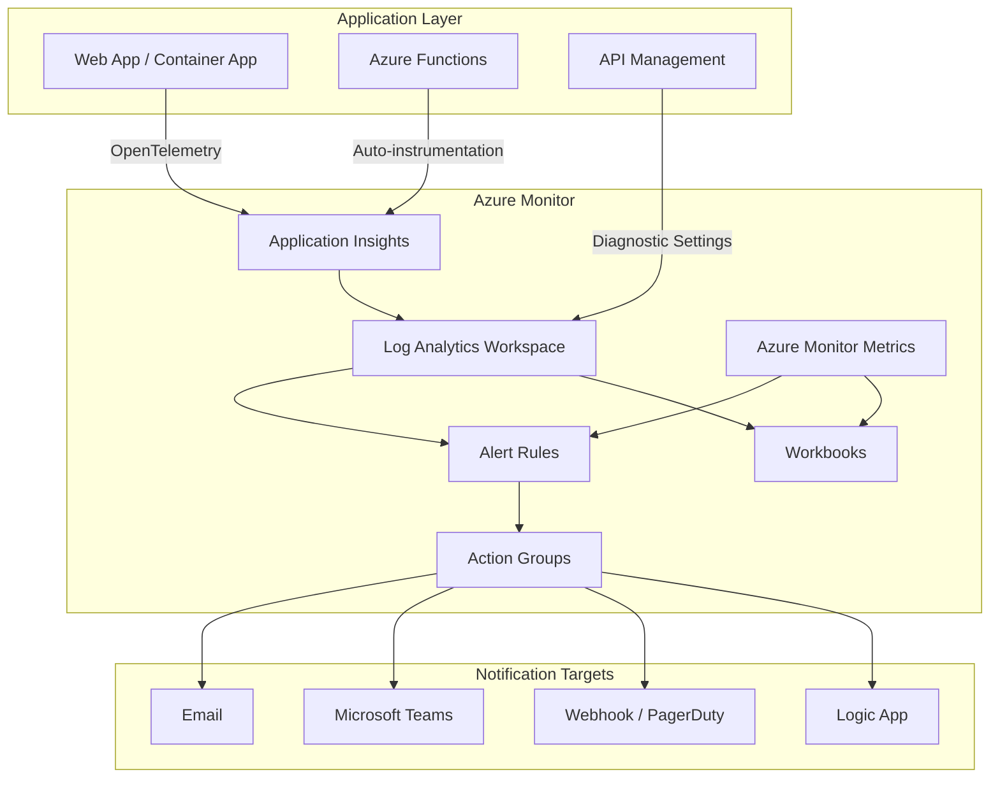

# Observability Migration Plan: [Application Name]

> **Date:** [YYYY-MM-DD]
> **Author:** [Name]
> **Source Environment:** AWS ([region])
> **Target Environment:** Azure ([region])
> **Application Type:** [.NET / Java / Python / Node.js / Go]

---

## 1. Current AWS Observability Inventory

### 1.1 CloudWatch Metrics

List all custom and key platform metrics currently monitored.

| # | AWS Metric Namespace | Metric Name | Dimensions | Period | Statistic | Azure Equivalent Metric | Status |
|---|---|---|---|---|---|---|---|
| 1 | `AWS/EC2` | `CPUUtilization` | InstanceId | 5 min | Average | `Percentage CPU` (VM) | ☐ Migrated |
| 2 | `AWS/ApplicationELB` | `RequestCount` | LoadBalancer | 1 min | Sum | `TotalRequests` (App Gateway) | ☐ Migrated |
| 3 | `AWS/RDS` | `DatabaseConnections` | DBInstanceIdentifier | 5 min | Average | `active_connections` (Azure DB) | ☐ Migrated |
| 4 | Custom namespace | | | | | | ☐ Migrated |
| 5 | | | | | | | ☐ Migrated |

### 1.2 CloudWatch Alarms

List all active alarms and their notification targets.

| # | Alarm Name | Metric | Threshold | Evaluation | SNS Topic / Action | Azure Alert Rule | Action Group | Status |
|---|---|---|---|---|---|---|---|---|
| 1 | `HighCPU-Prod` | CPUUtilization > 80% | Static | 3 of 5 periods | `ops-alerts` | Metric Alert | `prod-ops-ag` | ☐ Migrated |
| 2 | `5xxErrors` | HTTPCode_Target_5XX_Count > 10 | Static | 1 of 1 periods | `dev-alerts` | Log Alert | `prod-dev-ag` | ☐ Migrated |
| 3 | | | | | | | | ☐ Migrated |

### 1.3 CloudWatch Dashboards

List all dashboards to be migrated.

| # | Dashboard Name | Widgets Count | Purpose | Target (Dashboard / Workbook) | Status |
|---|---|---|---|---|---|
| 1 | `Prod-Overview` | 12 | Production health overview | Azure Workbook | ☐ Migrated |
| 2 | `API-Performance` | 8 | API latency and error rates | Azure Workbook | ☐ Migrated |
| 3 | | | | | ☐ Migrated |

### 1.4 X-Ray Tracing

| Component | X-Ray Instrumentation Type | Language | Azure Instrumentation | Status |
|---|---|---|---|---|
| API Gateway | AWS managed | N/A | Application Insights (auto) | ☐ Migrated |
| Web API service | SDK (manual) | .NET | `Azure.Monitor.OpenTelemetry.AspNetCore` | ☐ Migrated |
| Background worker | SDK (auto) | Java | Application Insights Java Agent | ☐ Migrated |
| Frontend SPA | N/A | JavaScript | Application Insights JS SDK | ☐ Migrated |
| | | | | ☐ Migrated |

### 1.5 CloudTrail Configuration

| # | Trail Name | Scope | Log Group | Azure Equivalent | Status |
|---|---|---|---|---|---|
| 1 | `org-trail` | Organization | `cloudtrail-logs` | Azure Activity Log | ☐ Migrated |
| 2 | `data-events` | S3 + Lambda | `data-event-logs` | Diagnostic Settings | ☐ Migrated |

### 1.6 CloudWatch Log Groups

| # | Log Group | Retention | Subscription Filters | Azure Table / Workspace | Retention (Azure) | Status |
|---|---|---|---|---|---|---|
| 1 | `/aws/lambda/my-function` | 30 days | None | `FunctionAppLogs` | 30 days | ☐ Migrated |
| 2 | `/ecs/my-service` | 90 days | To Elasticsearch | `ContainerAppConsoleLogs` | 90 days | ☐ Migrated |
| 3 | `/application/api` | 365 days | To S3 archive | Custom table via DCR | 365 days | ☐ Migrated |
| 4 | | | | | | ☐ Migrated |

---

## 2. Azure Target Architecture

### 2.1 Azure Monitor Resources

| Resource | Name | Resource Group | Purpose |
|---|---|---|---|
| Log Analytics Workspace | `law-[app]-[env]` | `rg-monitoring-[env]` | Centralized log store |
| Application Insights | `appi-[app]-[env]` | `rg-[app]-[env]` | APM and distributed tracing |
| Action Group (Critical) | `ag-critical-[env]` | `rg-monitoring-[env]` | P1 alerts: PagerDuty/email/SMS |
| Action Group (Warning) | `ag-warning-[env]` | `rg-monitoring-[env]` | P2 alerts: email/Teams |
| Azure Workbook | `wb-[app]-overview` | `rg-monitoring-[env]` | Operational dashboard |
| Dashboard | `dash-[app]-[env]` | `rg-monitoring-[env]` | Portal overview |

### 2.2 Architecture Diagram



---

## 3. Tracing Instrumentation Migration Checklist

### 3.1 .NET Applications

- [ ] Remove AWS X-Ray NuGet packages (`AWSXRayRecorder`, `AWSXRayRecorder.Handlers.*`)
- [ ] Install `Azure.Monitor.OpenTelemetry.AspNetCore`
- [ ] Replace `app.UseXRay()` with `builder.Services.AddOpenTelemetry().UseAzureMonitor()`
- [ ] Set `APPLICATIONINSIGHTS_CONNECTION_STRING` environment variable
- [ ] Remove X-Ray segment/subsegment manual instrumentation
- [ ] Replace with OpenTelemetry `Activity` / `ActivitySource` for custom spans
- [ ] Replace CloudWatch EMF with `TelemetryClient.TrackMetric()` or OpenTelemetry Meter
- [ ] Verify distributed trace correlation across services
- [ ] Validate custom dimensions/properties are mapped correctly

### 3.2 Java Applications

- [ ] Remove AWS X-Ray SDK dependencies from `pom.xml` / `build.gradle`
- [ ] Download Application Insights Java Agent JAR
- [ ] Configure `applicationinsights.json` with connection string and role name
- [ ] Add `-javaagent:applicationinsights-agent-3.x.x.jar` to JVM arguments
- [ ] Remove `@XRayEnabled` annotations
- [ ] Replace X-Ray `Subsegment` calls with OpenTelemetry Span API (if custom instrumentation needed)
- [ ] Replace CloudWatch SDK metric calls with Micrometer or OpenTelemetry Meter
- [ ] Verify distributed trace correlation across services
- [ ] Validate custom dimensions/properties are mapped correctly

### 3.3 Python Applications

- [ ] Remove `aws-xray-sdk` from `requirements.txt`
- [ ] Install `azure-monitor-opentelemetry`
- [ ] Replace `XRayMiddleware` with `configure_azure_monitor()`
- [ ] Set `APPLICATIONINSIGHTS_CONNECTION_STRING` environment variable
- [ ] Remove `xray_recorder.begin_segment()` / `end_segment()` calls
- [ ] Replace with OpenTelemetry Tracer for custom spans
- [ ] Replace `boto3` CloudWatch `put_metric_data` with OpenTelemetry Meter
- [ ] Verify distributed trace correlation across services

### 3.4 Node.js Applications

- [ ] Remove `aws-xray-sdk` from `package.json`
- [ ] Install `@azure/monitor-opentelemetry`
- [ ] Replace `AWSXRay.express.openSegment()` with `useAzureMonitor()`
- [ ] Set `APPLICATIONINSIGHTS_CONNECTION_STRING` environment variable
- [ ] Remove manual X-Ray segment/subsegment creation
- [ ] Replace with OpenTelemetry Tracer API for custom spans
- [ ] Replace CloudWatch SDK metric calls with OpenTelemetry Meter
- [ ] Verify distributed trace correlation across services

### 3.5 Go Applications

- [ ] Remove `aws-xray-sdk-go` from `go.mod`
- [ ] Install Azure Monitor OpenTelemetry exporter (`go.opentelemetry.io/otel`)
- [ ] Replace `xray.Handler()` with OpenTelemetry HTTP middleware
- [ ] Configure Azure Monitor exporter with connection string
- [ ] Remove manual X-Ray segment creation
- [ ] Replace with OpenTelemetry Span API for custom spans
- [ ] Replace CloudWatch SDK metric calls with OpenTelemetry Meter
- [ ] Verify distributed trace correlation across services

---

## 4. KQL Query Equivalents

Map your most-used CloudWatch Insights queries to KQL.

### 4.1 Application Errors

**CloudWatch Insights:**

```
fields @timestamp, @message
| filter @message like /ERROR/
| sort @timestamp desc
| limit 100
```

**KQL Equivalent:**

```kql
AppTraces
| where SeverityLevel >= 3  // Error and above
| order by TimeGenerated desc
| take 100
```

### 4.2 Request Latency Percentiles

**CloudWatch Insights:**

```
stats pct(@duration, 50) as p50,
      pct(@duration, 95) as p95,
      pct(@duration, 99) as p99
by bin(5m)
```

**KQL Equivalent:**

```kql
AppRequests
| summarize p50 = percentile(DurationMs, 50),
            p95 = percentile(DurationMs, 95),
            p99 = percentile(DurationMs, 99)
        by bin(TimeGenerated, 5m)
| order by TimeGenerated desc
```

### 4.3 Top Errors by Count

**CloudWatch Insights:**

```
fields @message
| filter @message like /Exception/
| stats count(*) as cnt by @message
| sort cnt desc
| limit 10
```

**KQL Equivalent:**

```kql
AppExceptions
| summarize cnt = count() by OuterMessage
| top 10 by cnt desc
```

### 4.4 Request Count by Status Code

**CloudWatch Insights:**

```
stats count(*) as cnt by statusCode
| sort cnt desc
```

**KQL Equivalent:**

```kql
AppRequests
| summarize cnt = count() by ResultCode
| order by cnt desc
```

### 4.5 Slow Requests

**CloudWatch Insights:**

```
fields @timestamp, @message, @duration
| filter @duration > 5000
| sort @duration desc
| limit 20
```

**KQL Equivalent:**

```kql
AppRequests
| where DurationMs > 5000
| project TimeGenerated, Name, DurationMs, ResultCode
| order by DurationMs desc
| take 20
```

### 4.6 Custom Query Mappings

| # | Description | CloudWatch Insights Query | KQL Equivalent | Validated |
|---|---|---|---|---|
| 1 | | | | ☐ |
| 2 | | | | ☐ |
| 3 | | | | ☐ |
| 4 | | | | ☐ |

---

## 5. Log Retention and Compliance Requirements

| Data Category | AWS Retention | Required Retention | Azure Table | Azure Retention | Archive Strategy | Status |
|---|---|---|---|---|---|---|
| Application logs | 30 days | 30 days | `AppTraces` | 30 days | N/A | ☐ Configured |
| Security/audit logs | 365 days | 365 days | `AzureActivity` | 365 days | Storage Account | ☐ Configured |
| Access logs | 90 days | 90 days | `AppRequests` | 90 days | N/A | ☐ Configured |
| Error/exception logs | 90 days | 90 days | `AppExceptions` | 90 days | N/A | ☐ Configured |
| Performance metrics | 15 months | 12 months | Platform Metrics | 93 days + archive | Storage Account | ☐ Configured |
| Compliance data | 7 years | 7 years | Custom table | 730 days + archive | Storage Account (immutable) | ☐ Configured |

### Retention Configuration Notes

- Log Analytics default retention: **30 days** (free tier included)
- Maximum interactive retention: **730 days** (per-table configuration)
- Long-term archive: Export to **Azure Storage Account** with immutable blob policies
- Use **Basic Logs** tier for high-volume, rarely-queried tables to reduce cost

---

## 6. Dashboard Migration Plan

### 6.1 Dashboard Mapping

| # | CloudWatch Dashboard | Widgets | Azure Workbook Name | Sections | Status |
|---|---|---|---|---|---|
| 1 | `Prod-Overview` | CPU, Memory, Requests, Errors | `wb-prod-overview` | Health, Performance, Errors, Dependencies | ☐ Created |
| 2 | `API-Metrics` | Latency, Throughput, 5xx | `wb-api-metrics` | Request Rate, Latency Distribution, Errors | ☐ Created |
| 3 | | | | | ☐ Created |

### 6.2 Widget-to-Workbook Step Mapping

| CloudWatch Widget Type | Azure Workbook Step Type | Notes |
|---|---|---|
| Line chart (metric) | Metric chart step | Select resource, metric, aggregation |
| Number widget | KQL query → single value visualization | Use `summarize` for aggregation |
| Log query widget | KQL query → table/chart visualization | Direct KQL translation |
| Text widget | Text/Markdown step | Supports Markdown formatting |
| Alarm status widget | Azure Resource Health query | Or KQL against `AlertsManagementResources` |

---

## 7. Migration Validation Checklist

### Pre-Migration

- [ ] Inventory all CloudWatch metrics, alarms, dashboards, and log groups
- [ ] Document all X-Ray instrumented services and trace sampling rules
- [ ] Export CloudTrail configuration and audit requirements
- [ ] Identify CloudWatch Insights queries used by operations team
- [ ] Review current retention policies and compliance requirements

### Infrastructure Setup

- [ ] Create Log Analytics Workspace in target resource group
- [ ] Create Application Insights resource linked to the workspace
- [ ] Configure diagnostic settings for all Azure resources
- [ ] Create Action Groups for alert notifications
- [ ] Set up RBAC for monitoring resources

### Application Instrumentation

- [ ] Install Azure Monitor SDK/agent for each application component
- [ ] Configure connection strings via environment variables or app settings
- [ ] Verify telemetry data flowing to Application Insights
- [ ] Validate distributed tracing across service boundaries
- [ ] Confirm custom metrics and dimensions are captured

### Alerting

- [ ] Create Azure Monitor alert rules matching CloudWatch alarms
- [ ] Configure Action Groups with appropriate notification channels
- [ ] Test alert firing and notification delivery
- [ ] Set up alert processing rules for maintenance windows

### Dashboards

- [ ] Create Azure Workbooks for each CloudWatch dashboard
- [ ] Validate all KQL queries return expected data
- [ ] Configure workbook parameters for environment/time range filtering
- [ ] Share workbooks with appropriate teams via RBAC

### Post-Migration Validation

- [ ] Compare metric values between AWS and Azure (parallel run period)
- [ ] Verify all alerts trigger correctly under test conditions
- [ ] Confirm log data is queryable with expected retention
- [ ] Validate compliance requirements are met
- [ ] Document any gaps or differences for the operations team
- [ ] Decommission AWS observability resources after validation period

---

## 8. Sign-Off

| Role | Name | Date | Approved |
|---|---|---|---|
| Application Owner | | | ☐ |
| DevOps/SRE Lead | | | ☐ |
| Security/Compliance | | | ☐ |
| Cloud Architect | | | ☐ |
