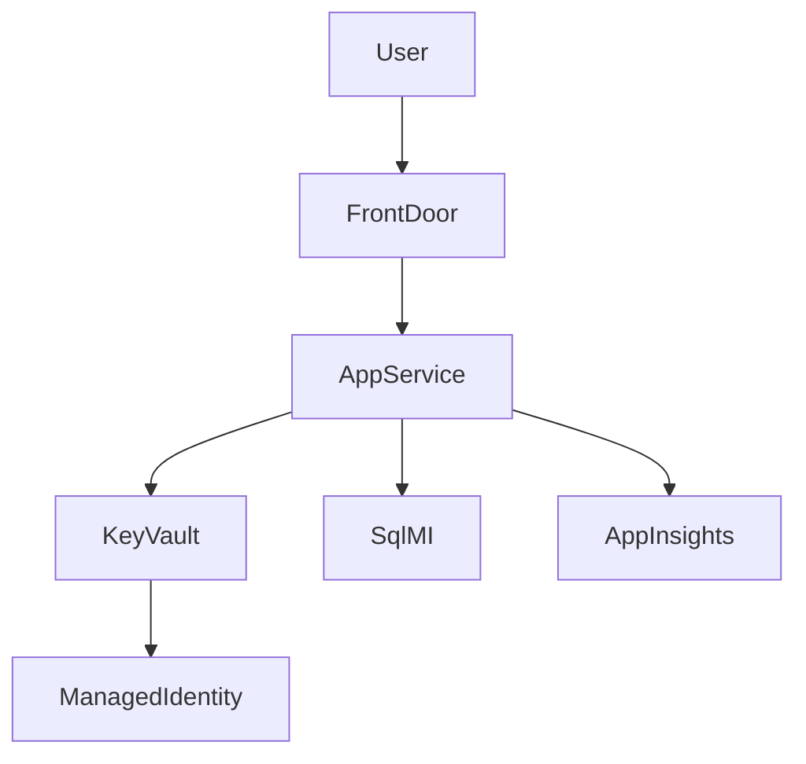

# Skill: Migration Plan Template

> The Architect's finalized execution plan for ONE application. Produced after Discovery Engineer hands off the Dossier + Capability Matrix, and after Architect approves the strategy.

## Output File

`reports/Migration-Plan.md`

## When to Use

- Produced by `/build-migration-plan` (Architect-led)
- Consumed by Phase 1–6 prompts for execution sequencing
- Updated when the strategy is refined or a phase reveals new constraints

## Template

````markdown
# Migration Plan — <Application Name>

> Produced by: Architect (Danny Ocean)
> Date: <YYYY-MM-DD>
> Status: <Draft | Approved | In Execution | Complete>
> Discovery Dossier: [reports/Discovery-Dossier.md](Discovery-Dossier.md)
> Capability Matrix: [reports/Capability-Matrix.yaml](Capability-Matrix.yaml)

## 1. Executive Summary (≤5 lines)

<5 lines: what's moving, where to, the strategy, the headline risk, the timeline range>

## 2. Approved Strategy

| Field | Value |
|-------|-------|
| Strategy | <rehost | replatform | refactor | rearchitect | rebuild | retire | retain> |
| Discovery recommendation matched? | <yes | refined> |
| Refinement (if any) | <what changed and why; logged in .squad/decisions.md> |

## 3. Target Azure Architecture

| Layer | Service | Why |
|-------|---------|-----|
| Compute (primary) | <e.g., Azure Container Apps> | <one-line> |
| Compute (secondary, if any) | <e.g., Functions for the nightly job> | <one-line> |
| Data | <e.g., Azure SQL MI> | <one-line> |
| Identity | <e.g., Entra ID workload identity + managed identity> | <one-line> |
| Secrets | Key Vault with RBAC | mandatory |
| Network | <VNet integration | private endpoints | public> | <one-line> |
| Observability | App Insights + Log Analytics | mandatory |
| Cost guardrails | <e.g., autoscale floor 0 + budget alert $X/month> | <one-line> |

### Architecture Diagram



## 4. Per-Phase Execution Plan

> Each row is the dispatch contract for that phase. Migration-Orchestrator uses this table to route work.

| Phase | Lead | Parallel | Skills to load | Inputs | Outputs | Quality gate | Effort |
|-------|------|----------|----------------|--------|---------|--------------|--------|
| **Phase 1 — Plan & Assess** | Architect | Azure Specialist, Database Specialist | capability-matrix, migration-report-template, <source-X>, <stack-X> | Discovery Dossier, Capability Matrix | Application-Assessment-Report.md | Phase 1 gate (routing.md) | <S/M/L/XL> |
| **Phase 2 — Migrate Code** | Coder | <per stack/workload> | <stack-X>, <workload-X>, config-transformation | Capability Matrix, Phase 1 report | Migration-Change-Log.md | Phase 2 gate | <S/M/L/XL> |
| **DB Migration (if applicable)** | Database Specialist | Coder, Security Auditor | ef-migration or db-specific | Capability Matrix | Database-Migration-Report.md | DB gate | <S/M/L/XL> |
| **Phase 3 — Generate Infra** | Azure Specialist | DevOps Engineer, Security Auditor | bicep-modules or terraform-azure, azure-X | Phase 1 + Phase 2 outputs | Infra-Plan.md, IaC files | Phase 3 gate | <S/M/L/XL> |
| **Security Hardening** | Security Auditor | Azure Specialist, Observability Engineer | managed-identity, azure-keyvault-secrets, rbac-least-privilege, owasp-top10-review | Phase 3 output | Security-Review-Report.md | Security gate | <S/M/L> |
| **Phase 4 — Deploy to Azure** | DevOps Engineer | Cutover Commander, Tester | azd-configuration, azure-X | IaC + code | Deployment evidence | Phase 4 gate | <S/M/L/XL> |
| **Phase 5 — Setup CI/CD** | DevOps Engineer | Tester, Security Auditor | github-actions-cicd or azure-devops-pipelines | Deployment success | Pipeline files | Phase 5 gate | <S/M/L> |
| **Phase 6 — Post-Migration Ops** | Observability Engineer | Performance Engineer, Cost Engineer | azure-monitor-appinsights, cost-optimization | Deployment + pipeline | Operational runbook | Phase 6 gate | <S/M/L> |

## 5. Cross-Phase Risks & Mitigations

| Risk | Affected phases | Mitigation | Owner |
|------|-----------------|------------|-------|
| <e.g., schema drift during long migration> | Phase 2, DB, Phase 4 | <e.g., DMS continuous sync + Cutover rehearsal> | Database Specialist |
| <e.g., vendor support during runtime upgrade> | Phase 2, Phase 4 | <e.g., maintain dual-runtime test bench> | Coder |

## 6. Quality Gates

### Standard gates (from `.squad/routing.md`)

These always apply. Referenced, not duplicated, here.

### App-specific extra gates (from Capability Matrix risk flags)

| Risk flag | Extra gate | Inserted before |
|-----------|-----------|-----------------|
| `regulated-data` | Security Auditor sign-off | Phase 4 |
| `large-data-gravity` | Performance Engineer baseline | Phase 6 |
| `vendor-licensed-runtime` | Cost Engineer license review | Phase 3 |
| `tight-cutover-window` | Cutover Commander rehearsal | Phase 4 |
| `production-only-system` | Tester smoke plan | Phase 4 |
| `high-integration-fanout` | Integration mock harness | Phase 4 |
| ... | ... | ... |

## 7. Rollback Strategy Reference

See `.github/skills/rollback-strategy.md` + per-phase rollback notes:

| Phase | Rollback shape |
|-------|----------------|
| Phase 3 | `azd down` or `terraform destroy` for the IaC scope |
| Phase 4 | Slot swap reverse / blue-green flip / DNS revert |
| DB | Restore from pre-cutover backup; replay change log |
| Phase 6 | Disable alert noise; preserve baseline |

## 8. Status Tracking

| Artifact | Path |
|----------|------|
| Migration plan (this file) | `reports/Migration-Plan.md` |
| Status dashboard | `reports/Report-Status.md` |
| Decisions log | `.squad/decisions.md` |
| Journal | `JOURNAL.md` |

## 9. Carried-Forward Assumptions

> Anything we are deferring rather than answering now. Each entry MUST list the impact if wrong.

| # | Assumption | Impact if wrong | Owner to resolve |
|---|-----------|-----------------|------------------|
| A1 | <e.g., "DB replication latency stays under 200ms"> | <e.g., "cutover window extends by 4h"> | Database Specialist by Phase 3 end |
| A2 | ... | ... | ... |

## 10. Handoff to Migration-Orchestrator

> 3–5 lines telling the Migration-Orchestrator chatmode (Architect-led) what to dispatch first.

**Next command:** `/phase1-planandassess`
**Lead:** Architect
**First dispatch:** Azure Specialist (target compute validation), Database Specialist (data path validation)
**Watch list:** <top 1–2 risks the orchestrator should keep eyes on through all phases>
````

## Authoring Rules

1. **The plan is the contract.** Phase prompts read it; don't keep critical decisions out-of-band in chat.
2. **Effort labels (S/M/L/XL) are mandatory.** Set them per the per-stack adapter guidance and adjusted by risk flags.
3. **Don't generate code or IaC here.** The plan is a plan. Phase 2/3 prompts generate.
4. **App-specific extra gates must trace to risk flags.** No extra gate without a matrix justification.
5. **Update on refinement.** If the Architect changes the target compute or strategy mid-flight, update this file and append a decisions log entry.

## Quality Gate

A plan is **complete** when:

- [ ] All 10 sections present
- [ ] Strategy + target architecture chosen and justified
- [ ] Per-phase table has lead, parallel, skills, inputs, outputs, gate, effort
- [ ] Cross-phase risks documented
- [ ] App-specific extra gates derived from risk flags
- [ ] Rollback shape referenced for each invasive phase
- [ ] Carried-forward assumptions list (may be short, but explicit)
- [ ] Handoff note set with next command
