# 🎰 Ocean's Fourteen — The Azure Heist
### AI-Orchestrated Legacy Migration to Azure
> Fourteen specialists. Seven targets. One mission: migrate everything to Azure.


> **📌 Origin & Purpose** — This repository is a **squad-converted copy** of [RobertoBorges/GHCP-PromptMigration](https://github.com/RobertoBorges/GHCP-PromptMigration), Roberto Borges' original prompt-based migration toolkit. We took that excellent foundation and re-architected it using [snap-squad](https://github.com/paulyuk/snap-squad) to demonstrate **why multi-agent orchestration outperforms single-prompt workflows** — fewer hallucinations, parallel execution, governed phases, and reusable skills. Use this repo as a **living reference** for converting your own prompt libraries into squad-powered systems.

Ocean's Fourteen is a squad-orchestrated migration system for GitHub Copilot: a control tower for assessing, modernizing, securing, deploying, and operating legacy applications on Azure.

Instead of relying on one giant migration prompt, this repository routes work through **14 specialist agents**, **8 chatmodes**, **21 slash-command prompts**, **26 reusable skills**, **23 prompt-local skills**, **3 orchestration hooks**, and **7 developer tools**. The result is a migration workflow architects can govern and developers can actually run.

<a id="table-of-contents"></a>
## Table of Contents

### 🎬 Overview
- [Why Squad Orchestration?](#why-squad-orchestration)
- [Architecture Overview](#architecture-overview)
- [Meet the Crew](#meet-the-crew)

---

### 🚀 Getting Started
- [Quick Start](#quick-start)
- [Launch Copilot CLI & Meet the Squad](#launch-cli)
- [Two Ways to Use the Squad: CLI vs Chat Panel](#two-surfaces)

---

### 📋 Migration Guide
- [Migration Workflow (Phase 0-6)](#migration-workflow)
- [Run the Full Migration from CLI](#cli-full-migration)
- [Interactive Migration Interview](#interactive-migration-interview)
- [Chatmode Selection Guide](#chatmode-selection-guide)
- [Squad Prompt Menu — Step-by-Step Recipes](#squad-prompt-menu)
- [Full CLI Walkthroughs (Per Use Case)](#cli-walkthroughs)

---

### 🎯 Reference
- [The 7 Targets](#the-7-targets)
- [Skills Library](#skills-library)
- [Orchestration Hooks](#orchestration-hooks)
- [PPTX Deck Library](#pptx-deck-library)
- [Samples & Usage Examples](#samples-and-usage-examples)
- [CI/CD Workflows](#cicd-workflows)

---

### 📚 Documentation
- [Repository Structure](#repository-structure)
- [Developer Tools](#developer-tools)
- [Requirements](#requirements)
- [Avoiding Hallucinations](#avoiding-hallucinations)
- [Training & Onboarding](#training-and-onboarding)

---

### 🏛️ For Decision Makers
- [For Architects: Why This Matters](#for-architects-why-this-matters)
- [Prompts to Improve This Project](#improve-this-project)
- [Best Prompts for Working With This Squad](#improve-this-project-prompts)

---

### 🤝 Community
- [Contributing](#contributing)
- [License](#license)

> 📖 **New here?** Start with [Quick Start](#quick-start)
> 🔍 **Evaluating?** Read [Why Squad Orchestration?](#why-squad-orchestration)
> 🛠️ **Ready to migrate?** Start with [Interactive Migration Interview](#interactive-migration-interview)
> 📚 **Deep dive?** See [Full CLI Walkthroughs](#cli-walkthroughs)


<a id="why-squad-orchestration"></a>
## Why Squad Orchestration? (The Pitch)

Architects do not need a bigger prompt. They need a **governable system**.

Monolithic prompting breaks down when migration scope expands across architecture, code, data, security, deployment, observability, and cutover. Ocean's Fourteen solves that by separating concerns into named specialists, reusable skills, durable artifacts, and explicit quality gates.

### Old Way — One Giant Prompt, One Giant Risk

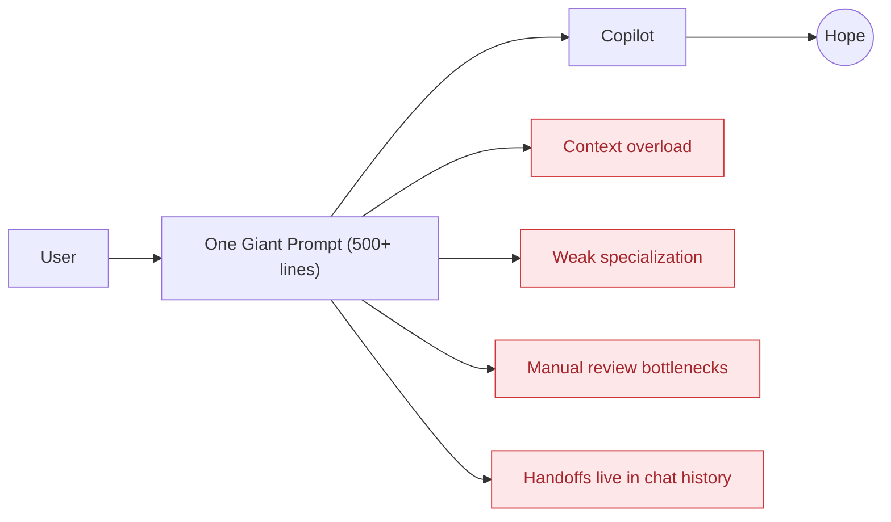

**Pain points**
- 🔴 One prompt must act like architect, coder, DBA, security reviewer, and release manager at once.
- 🔴 Reuse becomes copy-paste instead of composition.
- 🔴 Quality depends on memory, not on gates.
- 🔴 Parallel work is nearly impossible.
- 🔴 New team members must absorb the full prompt before contributing.

### New Way — Orchestrated Specialists, Governed Flow

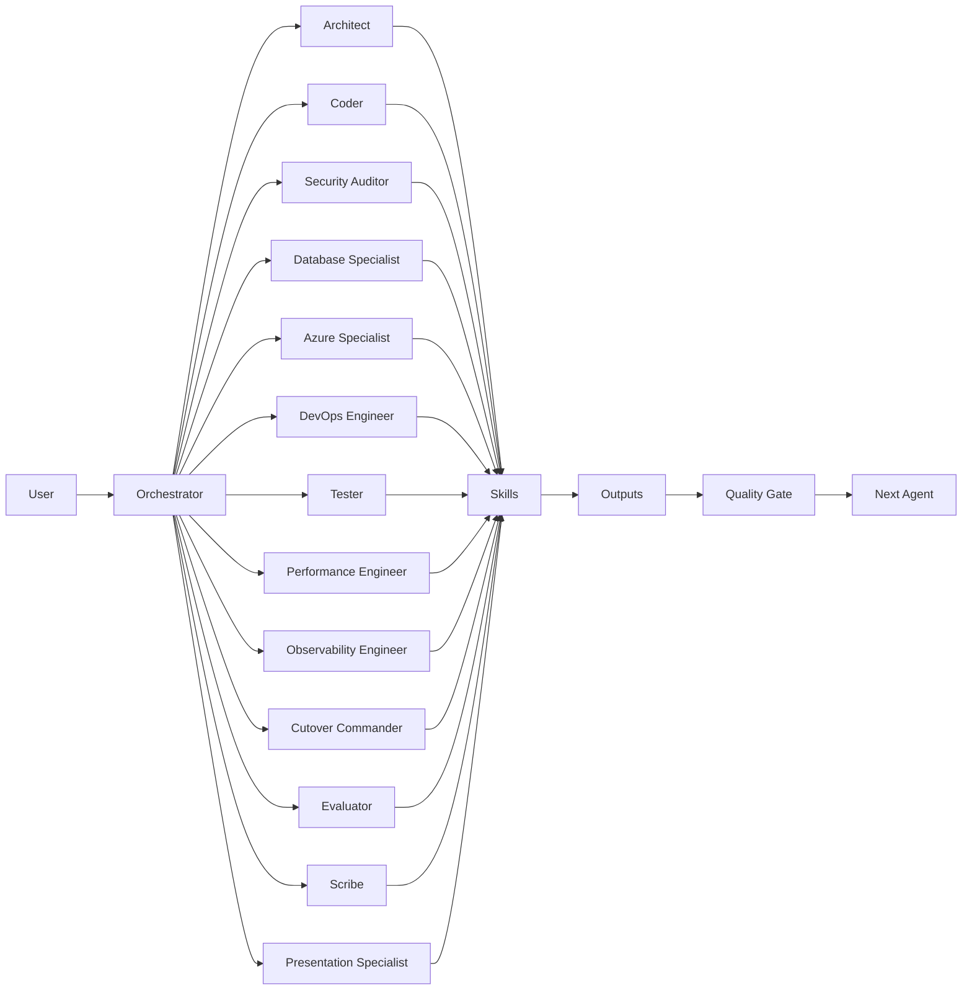

This is the difference between **asking for a migration** and **running a migration system**.

| Dimension | Old Prompting | Squad Orchestration |
|-----------|--------------|-------------------|
| Architecture | 1 monolithic prompt | 14 specialized agents |
| Specialization | None | Deep domain expertise per agent |
| Reusability | Copy-paste | 26 composable skills |
| Quality Gates | Manual review | Automated hooks + handoffs |
| Parallelism | Sequential | Fan-out to multiple agents |
| Memory | Stateless | Shared decisions + journal |
| Onboarding | Read whole prompt | Role-based training paths |

### Why this wins in real migrations

- **Better governance** — phase gates and routing rules make ownership explicit.
- **Higher quality** — security, data, deployment, and operations are first-class, not afterthoughts.
- **Faster delivery** — multiple specialists can work in parallel against the same target state.
- **Lower onboarding cost** — agents and humans learn by role, not by memorizing a monolith.
- **Reusable modernization logic** — skills can be recomposed across all 7 target applications.

<a id="architecture-overview"></a>
## Architecture Overview

Ocean's Fourteen is intentionally layered so each concern has a clear home: orchestration rules at the top, execution surfaces in the middle, and reusable knowledge at the bottom.

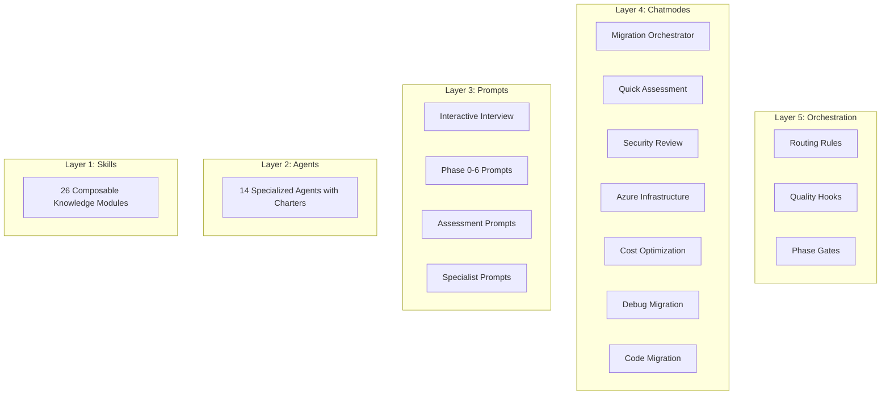

### How to read the stack

1. **Skills** hold durable migration knowledge.
2. **Agents** provide responsibility and domain boundaries.
3. **Prompts** package work into executable tasks.
4. **Chatmodes** shape the conversation surface for different intents.
5. **Orchestration** enforces routing, gates, and handoffs.

### What is actually in the repo

- **8 chatmodes** for orchestrated, onboarding, and specialist workflows.
- **21 prompts** total: 1 interactive interview, 13 guided workflow prompts, and 7 targeted assessment/support prompts.
- **26 root skills** in `skills/` for broad composition.
- **23 prompt-local skills** in `.github/skills/` for the main guided workflow.
- **3 hook files** in `.github/hooks/` for dispatch, gates, and per-target overrides.

<a id="meet-the-crew"></a>
## Meet the Crew 🎬

| # | Agent | Alias | Role | Domain |
|---|-------|-------|------|--------|
| 1 | Architect | Danny Ocean | Lead Strategist | Migration architecture, scope |
| 2 | Coder | Rusty Ryan | Full-Stack Dev | Code transformation |
| 3 | Tester | Linus Caldwell | QA + DevRel | Testing, docs |
| 4 | Azure Specialist | Basher Tarr | Cloud Platform | Azure services, identity |
| 5 | DevOps Engineer | Turk Malloy | CI/CD Lead | Pipelines, automation |
| 6 | Observability | Livingston Dell | Monitoring | App Insights, alerts |
| 7 | Database Specialist | The Amazing Yen | Data Migration | Schema, EF Core |
| 8 | Performance Engineer | Virgil Malloy | Benchmarks | Load testing, optimization |
| 9 | Security Auditor | Frank Catton | Security Lead | OWASP, Defender |
| 10 | Cost Engineer | The Accountant | FinOps | Cost analysis, right-sizing, budget guardrails |
| 11 | Evaluator | Saul Bloom | Quality Engineer | Prompt testing |
| 12 | Cutover Commander | Reuben Tishkoff | Release Lead | Go-live, rollback |
| 13 | Scribe | Roman Nagel | Documentarian | Journal, decisions |
| 14 | Presentation Specialist | Tess Ocean | PPTX & Visual | Deck generation, storytelling |

### Why the crew model matters

Each agent owns a domain. That means:
- architects get architecture,
- developers get implementation guidance,
- security gets security review,
- operations gets observability and cutover plans,
- documentation gets maintained as part of delivery, not as cleanup.

---

<a id="quick-start"></a>
## Quick Start

### Step 1: Clone & Open

```bash
git clone https://github.com/v-dguncet_microsoft/GHCP-PromptMigration.git
cd GHCP-PromptMigration
code .
```

### Step 2: Install Requirements

- GitHub Copilot license
- VS Code 1.101+
- GitHub Copilot extension 1.35+
- GitHub Copilot Chat extension
- Claude Sonnet 4.5+ model in Copilot
- Azure MCP Server extension
- GitHub Copilot for Azure extension
- Azure CLI (`az`) + Azure Developer CLI (`azd`)
- Language-specific SDKs for your workload

---

<a id="launch-cli"></a>
## 🚀 Launch Copilot CLI & Meet the Squad

After cloning and opening in VS Code, here's how to start working with Ocean's Fourteen:

### Step 3: Open Copilot CLI

```text
┌─────────────────────────────────────────────────────────┐
│  In VS Code:                                            │
│                                                         │
│  1. Open the Terminal (Ctrl+`)                          │
│  2. Click the Copilot icon (✨) in the terminal bar     │
│     OR press Ctrl+Shift+` and select "Copilot CLI"      │
│  3. You'll see the Copilot CLI prompt:                  │
│                                                         │
│     > _                                                 │
│                                                         │
│  That's your Squad Command Center!                      │
└─────────────────────────────────────────────────────────┘
```

### Step 4: Meet Your Squad

Type your first command — the squad introduces itself:

```text
@squad who is on the team?
```

The squad will respond with all 14 agents:

```text
🎰 Ocean's Fourteen — The Azure Heist

 #  Agent                   Alias              Role
 1  Architect               Danny Ocean        Lead Strategist
 2  Coder                   Rusty Ryan         Full-Stack Dev
 3  Tester                  Linus Caldwell     QA + DevRel
 4  Azure Specialist        Basher Tarr        Cloud Platform
 5  DevOps Engineer         Turk Malloy        CI/CD Lead
 6  Observability Engineer  Livingston Dell    Monitoring
 7  Database Specialist     The Amazing Yen    Data Migration
 8  Performance Engineer    Virgil Malloy      Benchmarks
 9  Security Auditor        Frank Catton       Security Lead
10  Cost Engineer           The Accountant     FinOps / Cost
11  Evaluator               Saul Bloom         Quality Engineer
12  Cutover Commander       Reuben Tishkoff    Release Lead
13  Scribe                  Roman Nagel        Documentarian
14  Presentation Specialist Tess Ocean         PPTX & Visual
```

### Step 5: Run Your First Triage

Pick any app and get a 5-minute feasibility check:

```text
@squad triage Use-cases/05-BookShop for migration to Azure
```

The **Architect (Danny Ocean)** will scan the codebase and give you:
- ✅ Go / ❌ No-Go recommendation
- Complexity score
- Top blockers
- Recommended Azure landing zone
- Next steps

### Step 6: Choose Your Path

After triage, you have three ways to proceed:

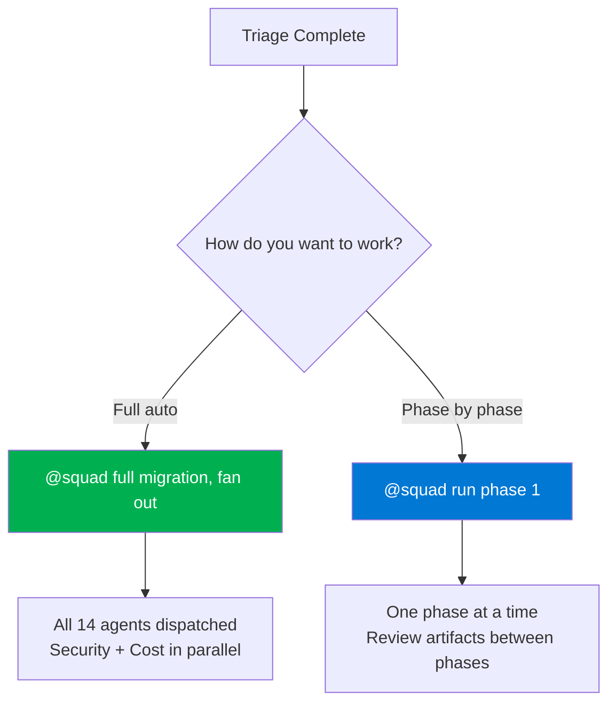

| Path | Best For | Command |
|------|----------|---------|
| 🟢 **Full Auto** | When you trust the squad | `@squad full migration Use-cases/05-BookShop to Azure Container Apps, fan out` |
| 🔵 **Phase by Phase** | When you want control | `@squad run phase 1 on Use-cases/05-BookShop` then review, then `@squad run phase 2`... |

### Quick Commands Cheat Sheet

| What You Want | Just Type |
|---|---|
| Meet the squad | `@squad who is on the team?` |
| Triage an app | `@squad triage [path]` |
| Full migration | `@squad full migration [path], fan out` |
| Check status | `@squad what's the migration status?` |
| Security review | `@squad security review [path]` |
| Cost analysis | `@squad cost optimize [path]` |
| Get help | `@squad what can you do?` |
| See all phases | `@squad show me the migration phases` |

> **💡 Pro tip:** Add **"fan out"** to any command to dispatch multiple agents in parallel. Add **"and explain"** to see what each agent is doing.

### Step 4: Run Your First Assessment

For a single application:

```text
@squad run Phase 1 plan and assess
```

For a fast feasibility check:

```text
@squad run quick assessment
```

For a multi-repo portfolio:

```text
@squad run Phase 0 multi-repo assessment
```

### Step 5: Follow the Squad's Lead

Once the first prompt runs, the system will steer you through the next handoff:
- assessment → code migration
- code migration → infrastructure
- infrastructure → deployment
- deployment → CI/CD
- CI/CD → post-migration operations

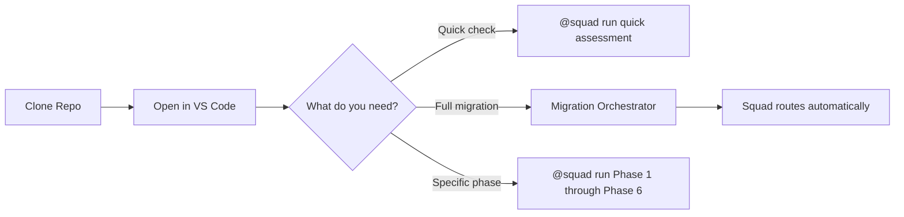

> **Tip:** If you already know the problem area, enter the specialist chatmode directly. If you do not, start with `Migration-Orchestrator`.

<a id="two-surfaces"></a>
## 🖥️ Two Ways to Use the Squad: CLI vs Chat Panel

This repository is designed to work from **two complementary surfaces** in VS Code. Use them together for the best results.

### Surface 1: Copilot CLI (Terminal Agent) — Your Command Center

The Copilot CLI is where you orchestrate the squad. Use `@squad` to dispatch agents, fan out work, create files, run shell commands, and push to GitHub.

```text
┌─────────────────────────────────────────────────────────┐
│  COPILOT CLI — Squad Command Center                     │
│                                                         │
│  > @squad assess the BookShop app for migration         │
│  > @squad migrate WCF to REST, fan out                  │
│  > @squad security review + cost analysis, fan out      │
│  > @squad create a new agent for compliance auditing    │
│  > @squad push changes and create PR                    │
└─────────────────────────────────────────────────────────┘
```

**What you can do here:**

| Capability | Example |
|-----------|---------|
| 🚀 Dispatch multiple agents in parallel | `@squad assess all 7 apps, fan out` |
| 📝 Create/edit files directly | `@squad add a new skill for Cosmos DB migration` |
| 🔍 Search and analyze codebase | `@squad which prompts reference EF Core?` |
| 🛠️ Run shell commands | `@squad run az deployment validate` |
| 📦 Git operations | `@squad commit and push to squad/oceans-fourteen-upgrade` |
| 🏗️ Generate infrastructure | `@squad create Bicep for the BookShop deployment` |
| 📊 Generate reports & presentations | `@squad create a PPTX comparing old vs new approach` |

### Surface 2: Chat Panel (Chatmodes) — Your Workbench

The Chat Panel (`Ctrl+Shift+I`) is where you run **code-aware migration commands** against your actual codebase. Chatmodes give Copilot deep context about the migration task.

```text
┌─────────────────────────────────────────────────────────┐
│  CHAT PANEL — Migration Workbench                       │
│                                                         │
│  Chatmode: [Migration Orchestrator ▾]                   │
│                                                         │
│  > @squad run Phase 1 plan and assess                   │
│  > @squad run Phase 2 code migration                    │
│  > @squad run security hardening review                 │
│  > @squad show migration status                         │
└─────────────────────────────────────────────────────────┘
```

**What you can do here:**

| Capability | Example |
|-----------|---------|
| 🔄 Run migration phases | `@squad run Phase 1 plan and assess`, `@squad run Phase 2 code migration` |
| 🛡️ Security audit | Switch to `Security-Review` chatmode → `@squad run security hardening review` |
| ☁️ Generate IaC | Switch to `Azure-Infrastructure` → `@squad run Phase 3 infrastructure generation` |
| 🐛 Debug issues | Switch to `Debug-Migration` → describe the error |
| 📈 Check progress | `@squad show migration status` in any chatmode |
| 💰 Cost analysis | Switch to `Cost-Optimization` → `@squad run cost optimization review` |

### Best Practice: Use Both Together

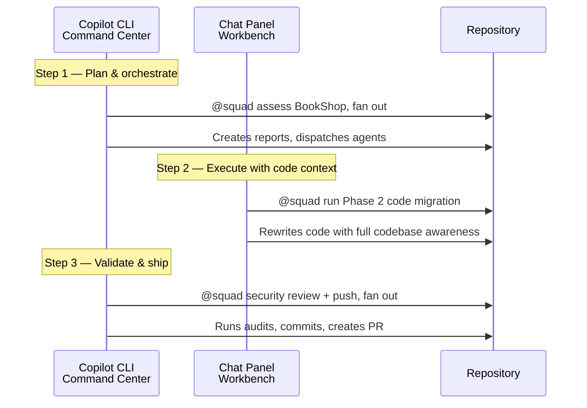

### Quick Reference: When to Use Which

| Task | Use CLI | Use Chat Panel |
|------|---------|---------------|
| Plan a migration | ✅ `@squad plan migration for WCF app` | |
| Run a migration phase | | ✅ `@squad run Phase 2 code migration` |
| Dispatch multiple agents | ✅ `@squad fan out` | |
| Code-aware refactoring | | ✅ Chatmode + guided command |
| Create new prompts/skills | ✅ `@squad add a new skill` | |
| Git commit + push + PR | ✅ `@squad push and create PR` | |
| Debug a build error | | ✅ `Debug-Migration` chatmode |
| Generate PPTX/reports | ✅ `@squad create presentation` | |
| Portfolio-wide operations | ✅ `@squad assess all 7 targets` | |
| Deep single-app work | | ✅ Open app folder + chatmode |

### Example: Full Migration Using Both Surfaces

```text
── CLI ──────────────────────────────────────────────────
@squad I need to migrate Use-cases/05-BookShop to Azure Container Apps.
  Assess feasibility, identify blockers, fan out.
  → Architect + Security + Database agents run in parallel
  → Assessment reports generated

── CHAT PANEL (Code Migration chatmode) ─────────────────
@squad run Phase 2 code migration
  → Coder rewrites WebForms → Razor with full codebase context
  → Code changes applied to your working tree

── CHAT PANEL (Azure Infrastructure chatmode) ───────────
@squad run Phase 3 infrastructure generation
  → Generates Bicep for Container Apps + Azure SQL

── CLI ──────────────────────────────────────────────────
@squad review security, run cost optimization, and push everything.
  Fan out.
  → Security Auditor + Performance Engineer run in parallel
  → Changes committed and pushed to branch
  → PR created for review
```

---

<a id="migration-workflow"></a>
## Migration Workflow (Phase 0–6)

Ocean's Fourteen uses a phase-aware delivery model so every step leaves behind usable artifacts.

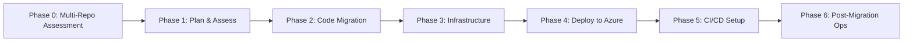

| Phase | What it does | Slash command | Lead agent | Skills loaded | Output artifacts |
|---|---|---|---|---|---|
| Phase 0 | Assesses many repositories, sequences work, and identifies portfolio blockers. | `/phase0-multirepoassessment` | Architect | `migration-handoff` | `codebase-analysis.md`, `codebase-summary.md`, per-repo reports |
| Phase 1 | Builds the migration plan, target platform, risk picture, and success criteria. | `/phase1-planandassess` | Architect | .NET, WCF, WebForms, Java, config, EF, Azure App Service, Entra ID, handoff | `reports/Application-Assessment-Report.md`, updated `reports/Report-Status.md` |
| Phase 2 | Modernizes code, documents breaking changes, and prepares implementation handoff. | `/phase2-migratecode` | Coder | .NET upgrade, config, EF, WCF, WebForms, Java, Entra ID, handoff | modernized project folder, migration notes, updated status |
| Phase 3 | Generates secure Azure infrastructure and deployment descriptors. | `/phase3-generateinfra` | Azure Specialist | Bicep, App Service, Entra ID, handoff | `infra/`, `azure.yaml`, IaC validation notes |
| Phase 4 | Deploys the application to Azure and validates the environment. | `/phase4-deploytoazure` | DevOps Engineer | App Service, Entra ID, rollback, handoff | deployment summary report, endpoints, updated status |
| Phase 5 | Creates repeatable CI/CD pipelines with security and promotion controls. | `/phase5-setupcicd` | DevOps Engineer | App Service, Entra ID, Bicep, rollback, handoff | workflow files or pipeline YAML, `reports/cicd_setup_report.md` |
| Phase 6 | Establishes monitoring, cost controls, runbooks, and production-readiness checks. | `/phase6-postmigrationops` | Observability Engineer | App Service, Entra ID, rollback, handoff | `reports/Post-Migration-Ops-Report.md`, dashboards, alert plan |

### Specialist side paths

These prompts plug into the main workflow when needed:
- `/databasemigration`
- `/securityhardening`
- `/costoptimization`
- `/phase-rollback`
- `/getstatus`
- `/quicktriage`
- technology assessments such as Classic ASP, WCF, WebForms, Java, and .NET upgrade reviews

<details>
<summary><strong>Phase-by-phase guidance</strong></summary>

#### Phase 0 — Multi-Repo Assessment
Use this when you have a business solution spread across multiple repositories. The output is portfolio-level sequencing, not just app-level discovery.

#### Phase 1 — Plan & Assess
This is the most important starting point for single-application migrations. It decides the Azure target, estimates effort, surfaces risks, and sets quality expectations.

#### Phase 2 — Code Migration
This is where legacy code is actually transformed. The Coder leads, but database, performance, and security specialists can be routed in parallel.

#### Phase 3 — Infrastructure
This turns migration intent into Azure deployment assets. The emphasis is secure defaults, externalized configuration, and repeatable deployment.

#### Phase 4 — Deploy to Azure
Deployment is treated as a governed step, not a terminal command. Smoke validation, environment verification, and rollback readiness matter here.

#### Phase 5 — Setup CI/CD
The goal is not “a pipeline file”; the goal is repeatable promotion with authentication, approvals, secret handling, and rollback logic.

#### Phase 6 — Post-Migration Ops
Migration is not done at deploy. This phase operationalizes the app with telemetry, runbooks, budgets, and incident-readiness.

</details>

<a id="cli-full-migration"></a>
## 🚀 Run the Full Migration from CLI (No Chatmodes Needed)

You can run **every phase** directly from the Copilot CLI using `@squad` — no chatmode switching required. The squad dispatches the right agents automatically.

### One-Shot: Full Migration in a Single Prompt

```text
@squad I need to migrate Use-cases/05-BookShop to Azure Container Apps.
Run the full migration workflow:
1. Assess the app (Architect leads)
2. Migrate code to .NET 8 (Coder leads)
3. Generate Bicep infrastructure (Azure Specialist leads)
4. Deploy to Azure (DevOps leads)
5. Set up CI/CD pipeline (DevOps leads)
6. Configure monitoring and post-ops (Observability leads)
Fan out security and cost reviews in parallel.
```

### 🎤 Interactive Migration Interview

> Instead of copy-pasting hardcoded prompts, let the squad interview you.

Start with one prompt, answer a few targeted questions, and let the squad scan your codebase, generate a migration plan, and show you which phase to run next.

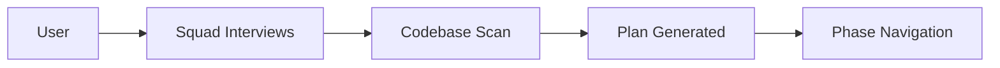

#### Start Here

```text
@squad I have a legacy app to migrate. Let's plan it.
```

The squad will typically ask about your stack, target Azure platform, constraints, and timelines before proposing a tailored plan.

#### Example Phase Table Output

```text
| Phase | Goal | Lead | Status | Next Action |
|-------|------|------|--------|-------------|
| Phase 1 | Plan & Assess | Architect | Ready | Review assessment report |
| Phase 2 | Migrate Code | Coder | Blocked | Confirm target .NET version |
| Phase 3 | Generate Infra | Azure Specialist | Pending | Start after Phase 1 |
```

That gives you a clear map: what the squad learned, which phase is ready, and what decision you need to make next.

#### Sample Interview Prompts by Scenario

| Scenario | What to say | Squad does |
|----------|-------------|------------|
| **New migration** | `@squad I have a legacy app to migrate. Let's plan it.` | Interviews you, scans code, builds phase plan |
| **Know your stack** | `@squad migrate my .NET 3.5 WebForms app at src/MyApp to .NET 8 on App Service` | Skips basic questions, goes straight to scan + plan |
| **Multi-repo portfolio** | `@squad I have 5 legacy apps to assess. Start with a portfolio triage, fan out` | Runs parallel assessment across repos |
| **Resume mid-migration** | `@squad show me pending phases and what's blocking` | Shows phase table with current status |
| **Drill into a phase** | `@squad show me details for phase 2` | Shows files affected, effort estimate, risks |
| **Run a specific phase** | `@squad run phase 0 and 1, fan out` | Dispatches agents in parallel |
| **Ask a decision** | `@squad should I use Razor Pages or MVC for this WebForms replacement?` | Analyzes your pages and recommends |
| **Check progress** | `@squad status` | Shows phase table with ⬜/🔄/✅ status |

#### What the Squad Will Ask You

When you start an interview, the Architect typically asks these questions (only what the codebase scan can't determine):

<details>
<summary><strong>Click to see sample interview questions</strong></summary>

```
🏗️ Application Profile
  1. What's the app name and folder path?
  2. What framework and version? (.NET 3.5, Java 8, Classic ASP?)
  3. What type? (WebForms, MVC, API, WCF, Spring Boot?)

🎯 Target Platform
  4. Where should it run on Azure? (App Service, Container Apps, AKS?)
  5. What database? (Azure SQL, PostgreSQL, Cosmos DB, keep current?)
  6. IaC preference? (Bicep or Terraform?)

👥 Team & Timeline
  7. Team size and who's involved?
  8. Timeline expectations? (sprint, quarter, gradual?)
  9. Any compliance or security requirements?

🔍 The squad auto-detects (no need to answer):
  • Project structure and dependencies
  • Database technology and connection patterns
  • Auth patterns and config files
  • Special concerns (COM, SOAP, ViewState, global.asa)
```

</details>

#### Learn More

- Full guide: [`docs/squad-interactive/README.md`](docs/squad-interactive/README.md)
- Example CLI session: [`docs/squad-interactive/example-session.md`](docs/squad-interactive/example-session.md)

> [!TIP]
> Use the interview flow when starting from a real codebase and want the squad to discover details for you. Use the phase prompts below when you already know exactly which phase to run.

| Old Way (Hardcoded Prompts) | New Way (Squad Interview) |
|----|---|
| Copy 1,000+ lines of app-specific prompts | One prompt: `@squad let's plan a migration` |
| Edit every prompt with your app name | Squad scans your code and fills in details |
| Must know which phase to run next | Squad shows phase table, you pick |
| No decision tracking | Squad asks before irreversible changes |

### Phase-by-Phase: Copy-Paste CLI Prompts

> Expand only the phase you need.

<details>
<summary><strong>Phase 0 — Portfolio Assessment (multi-repo only)</strong></summary>

```text
@squad I have multiple legacy apps to migrate. Assess all repositories
listed in codebase-repos.md. Sequence them by risk and effort.
Identify shared blockers across the portfolio.
```
**Agent:** Architect (Danny Ocean) | **Output:** `codebase-analysis.md`, per-repo reports

</details>

<details>
<summary><strong>Phase 1 — Plan & Assess</strong></summary>

```text
@squad assess Use-cases/05-BookShop for migration to Azure.
Identify: target platform, hosting model, database strategy,
auth approach, risk matrix, and effort estimate.
Generate the full Application-Assessment-Report.
```
**Agent:** Architect (Danny Ocean) | **Output:** `reports/Application-Assessment-Report.md`

</details>

<details>
<summary><strong>Phase 2 — Code Migration</strong></summary>

```text
@squad migrate the code in Use-cases/05-BookShop from .NET 3.5 WebForms
to .NET 8. Rewrite WebForms pages to Razor Pages, upgrade EF to EF Core,
modernize config from web.config to appsettings.json,
and replace any deprecated APIs.
```
**Agent:** Coder (Rusty Ryan) | **Output:** Modernized project files, migration notes

</details>

<details>
<summary><strong>Phase 3 — Infrastructure</strong></summary>

```text
@squad generate Azure infrastructure for Use-cases/05-BookShop.
Target: Azure Container Apps + Azure SQL.
Create Bicep modules, azure.yaml for azd, and a Dockerfile.
Use managed identity for auth, Key Vault for secrets.
```
**Agent:** Azure Specialist (Basher Tarr) | **Output:** `infra/`, `azure.yaml`, `Dockerfile`

</details>

<details>
<summary><strong>Phase 4 — Deploy to Azure</strong></summary>

```text
@squad deploy Use-cases/05-BookShop to Azure.
Run azd up, validate the deployment, check endpoints,
run smoke tests, and verify the app is healthy.
If anything fails, generate a rollback plan.
```
**Agent:** DevOps Engineer (Turk Malloy) | **Output:** Deployment report, live endpoints

</details>

<details>
<summary><strong>Phase 5 — CI/CD Pipeline</strong></summary>

```text
@squad set up CI/CD for Use-cases/05-BookShop.
Create a GitHub Actions workflow with: build, test, deploy to staging,
approval gate, deploy to production.
Include secret management and rollback triggers.
```
**Agent:** DevOps Engineer (Turk Malloy) | **Output:** `.github/workflows/`, pipeline report

</details>

<details>
<summary><strong>Phase 6 — Post-Migration Ops</strong></summary>

```text
@squad set up post-migration operations for Use-cases/05-BookShop.
Configure: App Insights monitoring, alert rules, cost budgets,
runbook documentation, and health check automation.
Generate the Post-Migration-Ops-Report.
```
**Agent:** Observability Engineer (Livingston Dell) | **Output:** `reports/Post-Migration-Ops-Report.md`

</details>

### Parallel Fan-Out: Security + Cost + Database

Run specialist reviews alongside any phase:

```text
@squad run these reviews on Use-cases/05-BookShop in parallel, fan out:
1. Security: OWASP Top 10 scan, auth review, secret detection
2. Cost: right-sizing analysis, reservation recommendations, budget alerts
3. Database: schema validation, EF Core migration check, data integrity
```
**Agents:** Security Auditor + Performance Engineer + Database Specialist (all parallel)

### Check Status Anytime

```text
@squad what's the current migration status for Use-cases/05-BookShop?
Show me progress across all phases, quality scores, and next steps.
```

### Final Validation & Ship

```text
@squad run final validation on Use-cases/05-BookShop:
- Build passes? ✅
- Security report clean? ✅
- Cost optimized? ✅
- Monitoring configured? ✅
- CI/CD pipeline working? ✅
- Rollback plan documented? ✅
Commit everything to squad/oceans-fourteen-upgrade and create a PR.
```

### CLI vs Chatmode: When to Use Which

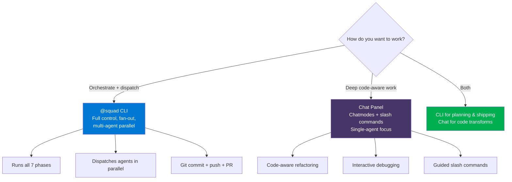

<a id="chatmode-selection-guide"></a>
## Chatmode Selection Guide

| Chatmode | When to Use | Example |
|----------|------------|---------|
| Squad Onboarding | First-time squad tour | "Teach me the agents, prompts, skills, and hooks" |
| Migration Orchestrator | Master coordination | "I have 7 legacy apps to migrate" |
| Quick Assessment | 5-min feasibility | "Is this WCF app worth migrating?" |
| Code Migration | Active coding | "Rewrite these WebForms pages" |
| Azure Infrastructure | IaC generation | "Generate Bicep for App Service" |
| Security Review | Security audit | "Check OWASP compliance" |
| Cost Optimization | Spend analysis | "Right-size my Azure resources" |
| Debug Migration | Troubleshooting | "Build fails after migration" |

### Recommended starting pattern

- **Brand new to the repo?** Start with `Onboarding`.
- **Unknown scope?** Start with `Migration-Orchestrator`.
- **Architectural feasibility question?** Start with `Quick-Assessment`.
- **Already in implementation?** Jump to `Code-Migration-Modernization`.
- **Only Azure design is missing?** Use `Azure-Infrastructure`.
- **A failing build or deploy is blocking progress?** Use `Debug-Migration`.

---

<a id="the-7-targets"></a>
## The 7 Targets 🎯

| # | Target | Codename | Source Stack | Target Stack |
|---|--------|----------|-------------|-------------|
| 1 | 01-ASPClassicApp | The Antique | Classic ASP (VBScript) | App Service + Azure SQL |
| 2 | 02-NetFramework30 | The Fossil | .NET 3.0 WebForms | App Service + Azure SQL |
| 3 | 03-WCFNet35 | The Wire | WCF .NET 3.5 | Container Apps + REST |
| 4 | 04-ContosoUniversity | The Campus | ASP.NET MVC | App Service + Azure SQL |
| 5 | 05-BookShop | The Vault | .NET 3.5 WebForms | Container Apps + SQL |
| 6 | 06-Java-BusReservation | The Express | Java 8 Maven | Container Apps + PostgreSQL |
| 7 | 07-PartsUnlimited | The Machine | ASP.NET 4.5 | App Service + Azure SQL |

> **Note:** Some training artifacts describe the currently checked-in BookShop benchmark separately from the portfolio target-state table above. Use the table above as the squad's codename-oriented target map.

<a id="skills-library"></a>
## Skills Library

Skills are the reusable building blocks of the system. Prompts stay thin because the heavy knowledge lives in skill files.

```text
Prompts reference skills like building blocks:
  #file:.github/skills/dotnet-framework-to-dotnet8.md
  #file:.github/skills/ef-migration.md
  #file:.github/skills/azure-app-service.md
```

### How composition works

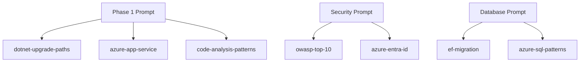

### Why skills matter

- They reduce duplication across prompts.
- They let specialists reuse proven migration patterns.
- They make prompt changes safer because knowledge is modular.
- They let architects govern the system at the capability level, not just at the prompt level.

<details>
<summary><strong>Prompt-local skills in <code>.github/skills/</code> (23)</strong></summary>

- `asp-classic-to-dotnet.md`
- `azure-app-service.md`
- `azure-container-apps.md`
- `azure-defender-compliance.md`
- `azure-entra-id.md`
- `azure-keyvault-secrets.md`
- `azure-network-security.md`
- `bicep-modules.md`
- `config-transformation.md`
- `docker-containerize.md`
- `dotnet-framework-to-dotnet8.md`
- `ef-migration.md`
- `java8-to-java21.md`
- `managed-identity.md`
- `migration-handoff.md`
- `migration-report-template.md`
- `owasp-top10-review.md`
- `pptx-generation.md`
- `rbac-least-privilege.md`
- `rollback-strategy.md`
- `secret-management.md`
- `wcf-to-rest-api.md`
- `webforms-to-razor.md`

</details>

<details>
<summary><strong>Full reusable skills catalog in <code>skills/</code> (26)</strong></summary>

| Skill | Purpose |
|---|---|
| `asp-classic-to-dotnet.md` | Classic ASP rewrite patterns |
| `azd-configuration.md` | Azure Developer CLI structure and environment setup |
| `azure-aks.md` | AKS platform guidance |
| `azure-app-service.md` | App Service hosting patterns |
| `azure-container-apps.md` | Container Apps guidance |
| `azure-devops-pipelines.md` | Azure DevOps CI/CD design |
| `azure-entra-id.md` | Identity modernization and auth patterns |
| `azure-key-vault.md` | Secret externalization and Key Vault integration |
| `azure-monitor-appinsights.md` | Monitoring, telemetry, and App Insights |
| `azure-sql-migration.md` | Azure SQL migration patterns |
| `bicep-modules.md` | Bicep module design and IaC structure |
| `config-transformation.md` | Legacy configuration modernization |
| `cost-optimization.md` | Right-sizing and FinOps guidance |
| `docker-containerize.md` | Containerization patterns |
| `dotnet-framework-to-dotnet8.md` | .NET upgrade paths |
| `ef-migration.md` | Entity Framework and schema migration guidance |
| `github-actions-cicd.md` | GitHub Actions pipeline patterns |
| `java8-to-java21.md` | Java modernization guidance |
| `managed-identity.md` | Passwordless Azure identity patterns |
| `migration-report-template.md` | Assessment and delivery report structure |
| `rbac-least-privilege.md` | Least-privilege access design |
| `rollback-strategy.md` | Rollback planning and recovery |
| `secret-management.md` | Secret hygiene and externalization |
| `terraform-azure.md` | Terraform-based Azure provisioning |
| `wcf-to-rest-api.md` | WCF to REST conversion patterns |
| `webforms-to-razor.md` | WebForms to Razor modernization |

</details>

<a id="orchestration-hooks"></a>
## Orchestration Hooks

Three hook files turn the prompt library into an actual orchestration system.

| Hook file | What it does | Why it matters |
|---|---|---|
| `phase-gates.md` | Defines required artifacts between phases | Prevents premature handoffs |
| `agent-dispatch.md` | Maps prompts to lead and parallel agents | Makes ownership explicit |
| `use-case-routing.md` | Applies per-target routing and skill overrides | Keeps the system grounded in real workloads |

### Real orchestration flow

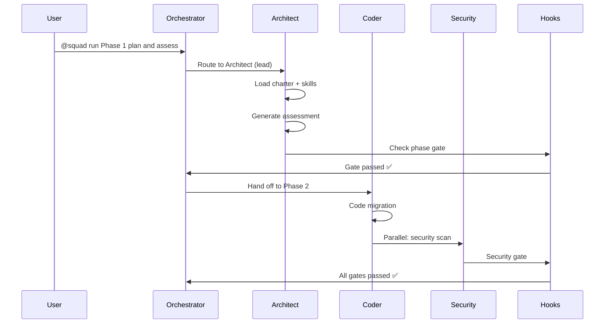

### What architects should notice

- The orchestrator is a **router**, not a monolith in disguise.
- Handoffs are based on **artifacts and gates**, not chat memory alone.
- Specialists can be added in parallel without rewriting the whole system.
- The same control plane works across all seven target applications.

<a id="pptx-deck-library"></a>
## 🎨 PPTX Deck Library

The squad includes a **Presentation Specialist (Tess Ocean)** who generates professional PowerPoint decks using a shared template system.

### Quick Commands

```bash
# Create a new deck
@squad create a 10-slide PPTX about Azure migration ROI

# Modify an existing deck
@squad add 2 slides to the Borges+Brady deck showing Q3 results

# Regenerate after content changes
@squad regenerate all PPTX decks
```

### Architecture

```text
docs/pptx/
├── generators/          ← Python scripts (import from shared module)
│   ├── latam_gcs_template.py    ← Shared GCS palette + all helpers
│   └── generate_*.py            ← 8 deck generators
└── decks/               ← Generated .pptx output files
```

All generators import colors and helpers from `latam_gcs_template.py` — zero duplication. The full API reference is in `.github/skills/pptx-generation.md`.

### Available Decks

| Deck | Slides | Generator |
|------|--------|-----------|
| Ocean's Fourteen: Squad vs Prompting | 17 | `generate_oceans_twelve_deck.py` |
| Borges+Brady Factory Power | 15 | `generate_borges_brady_deck.py` |
| Factory Delivery Model Proposal | 15 | `generate_squad_deck_v3.py` |
| Statement of Work | 14 | `generate_sow_deck.py` |
| Factory Runbook | — | `generate_factory_runbook_deck.py` |
| Standard Runbook | — | `generate_runbook_deck.py` |
| SNAP Model | — | `generate_snap_deck.py` |
| SNAP Runbook | — | `generate_snap_runbook_deck.py` |

> 📖 **Full guide:** See `docs/pptx/README.md` for design rules, color palette, and code samples.

<a id="squad-prompt-menu"></a>
## 🎯 Squad Prompt Menu — Step-by-Step Recipes

> **Use this instead of reading long prompt files.** Pick your scenario, follow the steps.

### 🟢 Scenario 1: "I have a legacy app and don't know where to start"

| Step | Chatmode | Command | Agent | What Happens |
|------|----------|---------|-------|-------------|
| 1 | Quick Assessment | `@squad run quick assessment` | Architect | 5-min triage: complexity score, blockers, go/no-go |
| 2 | Migration Orchestrator | `@squad run Phase 1 plan and assess` | Architect | Full assessment report, risk matrix, target platform |
| 3 | — | Review `reports/Application-Assessment-Report.md` | You | Approve plan before proceeding |

### 🔵 Scenario 2: "Full end-to-end migration"

| Step | Chatmode | Command | Agent | What Happens |
|------|----------|---------|-------|-------------|
| 1 | Quick Assessment | `@squad run quick assessment` | Architect | Fast feasibility check |
| 2 | Migration Orchestrator | `@squad run Phase 1 plan and assess` | Architect | Plan, assess, define target |
| 3 | Code Migration | `@squad run Phase 2 code migration` | Coder | Rewrite code to modern .NET/Java |
| 4 | Security Review | `@squad run security hardening review` | Security Auditor | OWASP scan + hardening report |
| 5 | Azure Infrastructure | `@squad run Phase 3 infrastructure generation` | Azure Specialist | Generate Bicep/Terraform IaC |
| 6 | Migration Orchestrator | `@squad run Phase 4 deploy to Azure` | DevOps Engineer | Deploy to Azure + smoke test |
| 7 | Migration Orchestrator | `@squad run Phase 5 CI/CD setup` | DevOps Engineer | GitHub Actions / ADO pipeline |
| 8 | Migration Orchestrator | `@squad run Phase 6 post-migration ops` | Observability | Monitoring, alerts, runbook |
| 9 | Cost Optimization | `@squad run cost optimization review` | Performance Engineer | Right-size, budget alerts |

### 🟡 Scenario 3: "Assess my whole portfolio (multiple repos)"

| Step | Chatmode | Command | Agent | What Happens |
|------|----------|---------|-------|-------------|
| 1 | — | Create `codebase-repos.md` in root | You | List all repo paths |
| 2 | Migration Orchestrator | `@squad run Phase 0 multi-repo assessment` | Architect | Portfolio scan, sequencing |
| 3 | Quick Assessment | `@squad run quick triage` | Architect | Ultra-fast per-repo ranking |
| 4 | — | Review portfolio report | You | Pick migration order |

### 🟠 Scenario 4: "Upgrade .NET version only"

| Step | Chatmode | Command | Agent | What Happens |
|------|----------|---------|-------|-------------|
| 1 | Quick Assessment | `@squad assess .NET upgrade` | Architect | Version-specific upgrade plan |
| 2 | Code Migration | `@squad run Phase 2 code migration` | Coder | Apply upgrade transforms |
| 3 | Migration Orchestrator | `@squad show migration status` | — | Check progress dashboard |

### 🔴 Scenario 5: "Migrate WCF services to REST"

| Step | Chatmode | Command | Agent | What Happens |
|------|----------|---------|-------|-------------|
| 1 | Quick Assessment | `@squad assess WCF migration` | Architect | Contract inventory, binding analysis |
| 2 | Code Migration | `@squad run Phase 2 code migration` | Coder | WCF → REST/gRPC rewrite |
| 3 | Security Review | `@squad run security hardening review` | Security Auditor | Auth + endpoint security |
| 4 | Azure Infrastructure | `@squad run Phase 3 infrastructure generation` | Azure Specialist | Container Apps IaC |

### 🟣 Scenario 6: "Migrate WebForms to modern web"

| Step | Chatmode | Command | Agent | What Happens |
|------|----------|---------|-------|-------------|
| 1 | Quick Assessment | `@squad assess WebForms migration` | Architect | Page/control inventory |
| 2 | Code Migration | `@squad run Phase 2 code migration` | Coder | WebForms → Razor Pages |
| 3 | Migration Orchestrator | `@squad run database migration review` | Database Specialist | EF Core schema migration |
| 4 | Azure Infrastructure | `@squad run Phase 3 infrastructure generation` | Azure Specialist | App Service + SQL IaC |

### ⚫ Scenario 7: "Migrate Classic ASP"

| Step | Chatmode | Command | Agent | What Happens |
|------|----------|---------|-------|-------------|
| 1 | Quick Assessment | `@squad assess Classic ASP migration` | Architect | ASP/VBScript discovery |
| 2 | Code Migration | `@squad run Phase 2 code migration` | Coder | Full rewrite to .NET 8 |
| 3 | Migration Orchestrator | `@squad run database migration review` | Database Specialist | ADODB → EF Core |
| 4 | Security Review | `@squad run security hardening review` | Security Auditor | Auth modernization |

### 🟤 Scenario 8: "Migrate Java API"

| Step | Chatmode | Command | Agent | What Happens |
|------|----------|---------|-------|-------------|
| 1 | Quick Assessment | `@squad assess Java upgrade` | Architect | Java 8→21, Spring Boot 3 plan |
| 2 | Code Migration | `@squad run Phase 2 code migration` | Coder | Modernize Java + dependencies |
| 3 | Azure Infrastructure | `@squad run Phase 3 infrastructure generation` | Azure Specialist | Container Apps + PostgreSQL |
| 4 | Migration Orchestrator | `@squad run Phase 5 CI/CD setup` | DevOps Engineer | Maven → GitHub Actions |

### 🔧 Scenario 9: "Something broke during migration"

| Step | Chatmode | Command | Agent | What Happens |
|------|----------|---------|-------|-------------|
| 1 | Debug Migration | Describe the error | Coder | Root cause analysis |
| 2 | Debug Migration | `@squad evaluate rollback options` | Cutover Commander | Rollback plan if needed |
| 3 | Migration Orchestrator | `@squad show migration status` | — | Reassess progress |

### 🛡️ Scenario 10: "Security review before go-live"

| Step | Chatmode | Command | Agent | What Happens |
|------|----------|---------|-------|-------------|
| 1 | Security Review | `@squad run security hardening review` | Security Auditor | Full OWASP + Azure review |
| 2 | Cost Optimization | `@squad run cost optimization review` | Cost Engineer | Right-sizing check |
| 3 | Migration Orchestrator | `@squad run Phase 6 post-migration ops` | Observability | Monitoring + runbook |
| 4 | Migration Orchestrator | `@squad evaluate rollback options` | Cutover Commander | Rollback plan ready |

### 📋 Scenario 11: "Assess team readiness"

| Step | Chatmode | Command | Agent | What Happens |
|------|----------|---------|-------|-------------|
| 1 | Migration Orchestrator | `@squad assess team readiness` | Evaluator | Quiz-based skill check |
| 2 | — | Review training plan | You | Assign learning paths from `docs/onboarding/training-program.md` |

> **Pro tip:** Run `@squad show migration status` at any point to see your migration dashboard. Run `@squad run quick triage` for a 5-minute intake on any unknown app.

<a id="cli-walkthroughs"></a>
## 📚 Full CLI Walkthroughs (Per Use Case)

Each use case has a dedicated walkthrough with **copy-paste-ready `@squad` CLI prompts** you can run end to end. The first three legacy modernization guides are now pure CLI flows, with any power-user shortcuts moved to a short appendix.

| # | Walkthrough | Codename | Source Stack | Difficulty |
|---|-----------|----------|-------------|-----------|
| 1 | [Classic ASP Migration](docs/walkthroughs/01-classic-asp-walkthrough.md) | The Antique | VBScript/ASP → .NET 8 | 🔴 Hard (full rewrite) |
| 2 | [.NET 3.0 WebForms](docs/walkthroughs/02-dotnet30-webforms-walkthrough.md) | The Fossil | .NET 3.0 → .NET 8 | 🟠 Medium |
| 3 | [WCF Service Migration](docs/walkthroughs/03-wcf-to-rest-walkthrough.md) | The Wire | WCF 3.5 → REST API | 🟠 Medium |
| 4 | [Contoso University](docs/walkthroughs/04-contoso-university-walkthrough.md) | The Campus | ASP.NET MVC → .NET 8 | 🟡 Medium-Low |
| 5 | [BookShop (Reference)](docs/walkthroughs/05-bookshop-reference-walkthrough.md) | The Vault | .NET 3.5 WebForms → Containers | 🟢 Documented |
| 6 | [Java Bus Reservation](docs/walkthroughs/06-java-api-walkthrough.md) | The Express | Java 8 → Java 21 | 🟠 Medium |
| 7 | [Parts Unlimited](docs/walkthroughs/07-parts-unlimited-walkthrough.md) | The Machine | ASP.NET 4.5 → .NET 8 | 🟡 Medium-Low |

> **Start here:** Pick your use case, open the walkthrough, and follow the prompts step by step. The main path stays in Copilot CLI; any advanced alternate shortcuts are tucked into the appendix.

---

<a id="samples-and-usage-examples"></a>
## Samples & Usage Examples

### Example 1: Quick Assessment of a .NET 3.0 App

```text
1. Open VS Code in Use-cases/02-NetFramework30-ASPNET-WEB
2. Switch to "Quick Assessment" chatmode
3. Type: @squad run quick assessment
4. Review the generated triage report
```

**Expected outcome:** a fast go/no-go summary, likely blockers, recommended Azure landing zone, and the next command to run.

### Example 2: Full Migration with Orchestrator

```text
1. Open Migration Orchestrator chatmode
2. Type: "I need to migrate the BookShop app (Use-cases/05-BookShop) to Azure Container Apps"
3. The orchestrator will:
   - Run @squad run Phase 1 plan and assess (Architect leads)
   - Route to @squad run Phase 2 code migration (Coder leads)
   - Dispatch Security Auditor in parallel
   - Generate Bicep via @squad run Phase 3 infrastructure generation
   - Deploy via @squad run Phase 4 deploy to Azure
   - Set up CI/CD via @squad run Phase 5 CI/CD setup
   - Run post-ops via @squad run Phase 6 post-migration ops
```

**Expected outcome:** a governed end-to-end migration path with explicit role ownership and phase-level artifacts.

### Example 3: Security-First Review

```text
1. Open Security Review chatmode
2. Type: @squad run security hardening review
3. Security Auditor (Frank Catton) runs OWASP Top 10 review
4. Generates Security-Hardening-Report.md with findings
```

**Expected outcome:** a prioritized hardening backlog covering auth, secrets, RBAC, exposure, and compliance gaps.

### Example 4: Multi-Repo Portfolio Assessment

```text
1. Create codebase-repos.md listing all repositories
2. Type: @squad run Phase 0 multi-repo assessment
3. Architect assesses all repos and generates portfolio report
```

**Expected outcome:** portfolio sequencing, shared blockers, repo-level recommendations, and a rational migration order.

---

<a id="repository-structure"></a>
## Repository Structure

```text
📁 .github/
  📁 chatmodes/          # 8 conversation modes
  📁 prompts/            # 21 slash-command prompts
  📁 skills/             # 23 prompt-local skill modules
  📁 hooks/              # 3 orchestration hook files
  📁 workflows/
    squad-health.yml     # CI health check on PRs
    pptx-generate.yml    # PPTX generation on release
📁 .squad/
  📁 agents/             # 14 agent charters
  team.md                # Squad roster
  routing.md             # Work routing rules
  decisions.md           # Decision log
  eval.mjs               # Governance evaluator (141 checks)
  eval-prompts.mjs       # Prompt eval harness (45 checks)
  lint-prompts.mjs       # Prompt linter (frontmatter, skills, hooks)
  track-versions.mjs     # Prompt version tracker
  prompt-versions.md     # Version log for all prompts
  dashboard.html         # Visual HTML dashboard
  view-decisions.mjs     # Decision timeline viewer
  SCORECARD.md           # Squad health scorecard
📁 docs/
  📁 architecture/       # ARCHITECTURE.md, PROJECT-MAP, PROMPT-CATALOG
  📁 guides/             # dotnet-version, handoff, skills-map, dispatch cheatsheet
  📁 onboarding/         # onboarding, team-guide, training
  📁 walkthroughs/       # 7 CLI-first step-by-step guides
  📁 use-case-cheatsheets/ # 7 quick-reference cheatsheets
  📁 pptx/               # PPTX generators and templates
📁 skills/               # Reference skill catalog (26 files)
📁 Use-cases/            # 7 migration target apps
.env.example             # Environment variables (LATAM_TEMPLATE_PATH)
AGENTS.md                # Squad operating instructions
CLAUDE.md                # Session memory
JOURNAL.md               # Build story
```

### Canonical files worth reading first

1. `AGENTS.md` — operating model for the squad
2. `CLAUDE.md` — session memory and repo context
3. `.squad/team.md` — roster and aliases
4. `.squad/routing.md` — dispatch rules and quality gates
5. `.squad/decisions.md` — durable decision history
6. `docs/architecture/ARCHITECTURE.md` — deeper architecture reference

<a id="developer-tools"></a>
### Developer Tools

| Tool | Command | What it does |
|------|---------|--------------|
| **Prompt Linter** | `node .squad/lint-prompts.mjs` | Validates frontmatter, skill refs, hook coverage, stale CLI patterns across all 21 prompts and 8 chatmodes |
| **Governance Evaluator** | `node .squad/eval.mjs` | Runs 141 checks across agents, skills, hooks, routing, and charters |
| **Prompt Eval Harness** | `node .squad/eval-prompts.mjs` | Tests 3 key prompts with 45 structural checks |
| **Prompt Version Tracker** | `node .squad/track-versions.mjs` | Hash-based change detection for all prompts and chatmodes |
| **Squad Dashboard** | Open `.squad/dashboard.html` in a browser | Static heist-themed dashboard for roster, quick stats, pasted lint/eval JSON, and operator shortcuts |
| **Decision Timeline** | `node .squad/view-decisions.mjs [--search "term"] [--last 5]` | Renders `.squad/decisions.md` as a colorized monthly timeline with status counts |
| **PPTX Generators** | `python docs/pptx/generators/<name>.py` | Generate presentation decks (set `LATAM_TEMPLATE_PATH` env var or copy `.env.example`) |

<a id="cicd-workflows"></a>
### CI/CD Workflows

| Workflow | File | Trigger | What it does |
|----------|------|---------|--------------|
| **Squad Health Check** | `.github/workflows/squad-health.yml` | PR to `.github/**`, `.squad/**` | Runs prompt linter + governance evaluator |
| **PPTX Generation** | `.github/workflows/pptx-generate.yml` | Release published / manual | Generates all PPTX decks and uploads as artifacts |

<a id="requirements"></a>
## Requirements

- [GitHub Copilot License](https://github.com/features/copilot)
- [VS Code 1.101+](https://code.visualstudio.com/)
- [GitHub Copilot Extension 1.35+](https://marketplace.visualstudio.com/items?itemName=GitHub.copilot)
- Claude Sonnet 4.5+ model
- [Azure MCP Server Extension](https://marketplace.visualstudio.com/)
- [Azure Developer CLI (AZD)](https://learn.microsoft.com/azure/developer/azure-developer-cli/)
- [Azure CLI](https://learn.microsoft.com/cli/azure/)
- Language-specific SDKs and build tools appropriate for the app being migrated

> **Recommended add-ons:** Docker Desktop for container scenarios, .NET SDKs for .NET use-cases, and Java 21 plus Maven/Gradle for Java modernization.

<a id="avoiding-hallucinations"></a>
## Avoiding Hallucinations

To reduce hallucinations during migration, the guided prompts rely on two durable report files in the repository's `reports/` folder:

- `reports/Report-Status.md` — overall migration status dashboard
- `reports/Application-Assessment-Report.md` — application assessment summary

You can update these files at any phase to fit your requirements.

During each phase, read the summary carefully to understand what will be delivered by the model and what inputs are needed.

### Pro tips

- For rewrite-heavy migrations, unnecessary files may be created (`Class1.cs`, scaffolding leftovers, placeholder artifacts). Clean them up before your final check-in.
- Use the `@terminal` command to ask the agent to solve issues during your tests.
- Don't assume anything. Always verify with documentation.
- Keep the status report current so handoffs are based on facts, not on stale chat context.

<a id="training-and-onboarding"></a>
## Training & Onboarding

Ocean's Fourteen is designed to be trainable by role.

Start here:
- `docs/onboarding/training-program.md` — 5 learning paths and use-case routing
- `docs/guides/skills-map.md` — skills matrix per agent and per target
- `docs/use-case-cheatsheets/` — per-target quick reference guides
- `docs/onboarding/onboarding.md` — new team member guide

Or try the **Onboarding chatmode** for an interactive guided tour.

### Suggested onboarding path

1. Read `AGENTS.md`, `CLAUDE.md`, `.squad/team.md`, `.squad/routing.md`, and `.squad/decisions.md`.
2. Start with `Use-cases/02-NetFramework30-ASPNET-WEB` if you are new to the repo.
3. Run `@squad run quick assessment`, then `@squad run Phase 1 plan and assess`.
4. Review the relevant skill files before making changes.
5. Use the cheat sheets to learn the target-specific traps and Azure landing zones.

---

<a id="for-architects-why-this-matters"></a>
## For Architects: Why This Matters

### 1. Separation of Concerns
Each agent owns **one** domain. That reduces prompt sprawl, improves accountability, and makes review easier.

### 2. Composability
Skills snap together like LEGO. The same App Service, Entra ID, EF, rollback, or observability guidance can be reused across multiple workloads.

### 3. Governance
Every important decision can be logged, every handoff can be traced, and every phase can be gated. That is the difference between an impressive demo and a repeatable delivery model.

### The architecture takeaway

If you are responsible for platform governance, this repository shows a pattern worth copying:
- **thin entrypoints** instead of giant prompts,
- **specialist roles** instead of generic agents,
- **shared skills** instead of duplicated instructions,
- **hooks and reports** instead of implicit memory,
- **documented decisions** instead of hidden trade-offs.

<a id="improve-this-project"></a>
## 🔧 Prompts to Improve This Project

Use these `@squad` prompts to extend, refine, and maintain the Ocean's Fourteen system itself.

### ➕ Add New Capabilities

<details>
<summary><strong>Show prompts</strong></summary>

| What You Want | Prompt |
|---|---|
| Add a new agent | `@squad create a new agent for [domain]. Write the charter, add to team.md, update routing.md` |
| Add a new skill | `@squad create a new skill for [topic] in .github/skills/. Wire it into the relevant prompts` |
| Add a new chatmode | `@squad create a chatmode for [workflow]. Include tools, model, and description in frontmatter` |
| Add a new prompt | `@squad create a new slash command prompt for [task]. Add frontmatter, skills references, and hooks` |
| Add a new use case | `@squad add Use-cases/08-[AppName] with source code. Create a walkthrough in docs/walkthroughs/` |
| Add a new hook | `@squad create an orchestration hook for [gate type] in .github/hooks/` |

</details>

### 🔍 Review & Audit

<details>
<summary><strong>Show prompts</strong></summary>

| What You Want | Prompt |
|---|---|
| Audit all prompts | `@squad review all prompts in .github/prompts/ for consistency, missing frontmatter, and skill wiring gaps` |
| Audit agent charters | `@squad review all charters in .squad/agents/ — check for stale references, wrong tech stacks, and missing duties` |
| Check skill coverage | `@squad which prompts are missing skill references? Show a gap matrix` |
| Review routing rules | `@squad audit .squad/routing.md — are all agents covered? Any missing quality gates?` |
| Find stale docs | `@squad scan docs/ for outdated content that doesn't match current prompts or agents` |
| Validate mermaid diagrams | `@squad check all mermaid diagrams in README.md for syntax errors` |

</details>

### 📊 Generate Reports & Docs

<details>
<summary><strong>Show prompts</strong></summary>

| What You Want | Prompt |
|---|---|
| Update README | `@squad rewrite the README to reflect current state of prompts, agents, and skills` |
| Generate architecture diagram | `@squad create a mermaid diagram showing all agents, prompts, skills, and their connections` |
| Create a PPTX | `@squad create a presentation explaining the squad approach for architects` |
| Update training docs | `@squad update docs/onboarding/training-program.md with any new agents or skills` |
| Generate skills map | `@squad regenerate docs/guides/skills-map.md to reflect current skill-to-prompt-to-agent wiring` |
| Write a journal entry | `@squad update JOURNAL.md with what we just accomplished` |

</details>

### 🛠️ Refactor & Optimize

<details>
<summary><strong>Show prompts</strong></summary>

| What You Want | Prompt |
|---|---|
| Consolidate duplicate skills | `@squad find duplicate content across skills/ and .github/skills/ and consolidate` |
| Standardize frontmatter | `@squad ensure all prompts have consistent frontmatter: agent, model, tools, description` |
| Upgrade model references | `@squad update all prompts and chatmodes to use Claude Sonnet 4.5` |
| Fix identity drift | `@squad check AGENTS.md, CLAUDE.md, and copilot-instructions.md — make sure they all say Ocean's Fourteen` |
| Optimize prompt length | `@squad identify prompts over 200 lines and suggest how to extract content into skills` |
| Wire missing hooks | `@squad which prompts don't reference .github/hooks/? Add the missing orchestration wiring` |

</details>

### 🧪 Test & Validate

<details>
<summary><strong>Show prompts</strong></summary>

| What You Want | Prompt |
|---|---|
| Dry-run a migration | `@squad simulate Phase 1 assessment on Use-cases/05-BookShop without making changes. Show what would be generated` |
| Test a new prompt | `@squad run the new [prompt] against Use-cases/02-NetFramework30 and show me the output` |
| Validate skill composition | `@squad load Phase 1 prompt and list all skills it references — verify they all exist` |
| Check for broken links | `@squad scan README.md and all docs/ files for broken internal links` |
| Compare before/after | `@squad show me the git diff summary of everything we changed today` |

</details>

### 🚀 Ship & Share

<details>
<summary><strong>Show prompts</strong></summary>

| What You Want | Prompt |
|---|---|
| Commit & push | `@squad commit all changes with a descriptive message and push` |
| Create a PR | `@squad create a pull request from squad/oceans-fourteen-upgrade to main with a summary` |
| Generate changelog | `@squad generate a changelog from recent commits for the PR description` |
| Package for sharing | `@squad create a ZIP of just the squad config, prompts, skills, and docs — no use-case source code` |
| Export for another repo | `@squad what files would I copy to set up Ocean's Fourteen in a different repository?` |

</details>

> **Pro tip:** Add "fan out" to any prompt to dispatch multiple agents in parallel. Add "and explain" to get a walkthrough of what the squad is doing.

---

<a id="improve-this-project-prompts"></a>
## 💡 Best Prompts for Working With This Squad

These are the most effective prompts for common tasks. Copy-paste into Copilot CLI:

### Analyze & Improve
```bash
# Full repo analysis with recommendations
@squad analyze this repo and recommend improvements, fan out

# Review and improve a specific prompt
@squad review SecurityHardening prompt and make it more dynamic, fan out

# Audit skill cross-references across all prompts
@squad audit all prompt-to-skill references and fix orphaned skills, fan out
```

### Create & Generate
```bash
# Create a new PPTX deck
@squad create a 12-slide PPTX about [topic] with metrics and case studies, fan out

# Create a new migration prompt
@squad create a new assessment prompt for [technology] following the same patterns as Assess-DotNet-Upgrade

# Create a new skill
@squad create a new skill for [capability] following the pattern in .github/skills/azure-keyvault-secrets.md
```

### Migration Operations
```bash
# Start a new migration
@squad I have a legacy [.NET/Java/ASP] app, help me plan the migration to Azure

# Full end-to-end migration
@squad run the full migration pipeline for [app-name], fan out

# Security review before go-live
@squad run security hardening review for [app-name], fan out

# Check overall status
@squad show migration status
```

### Squad Management
```bash
# See who's on the squad
@squad who's on the team?

# Add a new agent
@squad should we hire a [role] agent?

# Review squad routing
@squad review routing rules and suggest improvements, fan out
```

> 💡 **Pro tip:** Adding `fan out` to any prompt tells the squad to dispatch work to multiple agents in parallel for faster results.

---

<a id="contributing"></a>
## Contributing

Contributions to improve the prompts, chat modes, or add new use cases are welcome. Please feel free to submit pull requests or open issues to discuss potential improvements.

<a id="license"></a>
## License

This project is licensed under the MIT License - see the [LICENSE](LICENSE) file for details.
