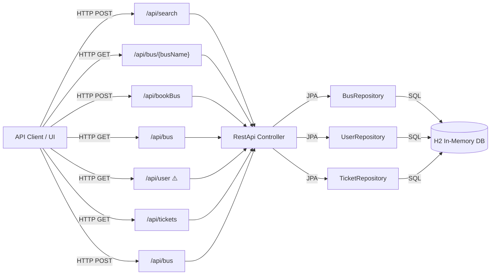
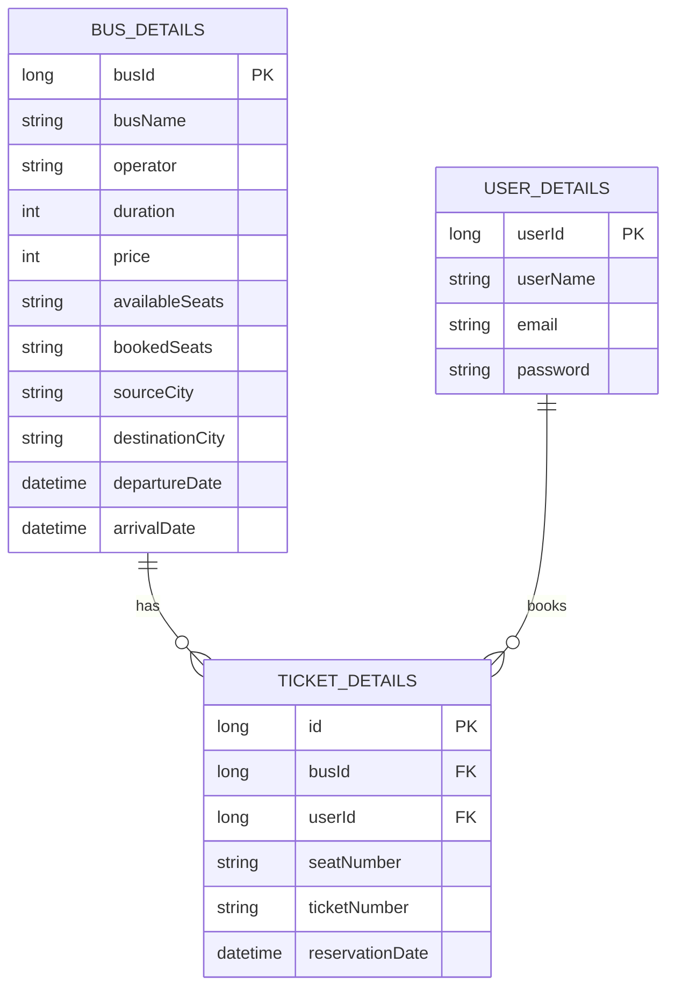

# Assessment - BusReservation

## Identification

**Repository Name**: 06-Java-API-BusReservation  
**Type**: REST API  
**Language**: Java 1.8  
**Frameworks**: Spring Boot 2.3.1.RELEASE, Spring Data JPA, Spring Web MVC, Spring Actuator  
**Repository URL**: Local — `c:\git\GHCP-PromptMigration\Use-cases\06-Java-API-BusReservation`  
**Assessment Date**: March 26, 2026

---

## Summary

BusReservation is a Spring Boot 2.3.1 REST API that provides a bus ticket booking and reservation system. Originally developed in 2020 as a technical demonstration, the service exposes endpoints for searching buses by route and date, viewing bus details, booking seats, and managing tickets. The data model includes three core JPA entities: `Bus`, `User`, and `Ticket`, plus non-persisted DTOs (`Invoice`, `Search`).

The application currently uses an H2 in-memory database seeded with sample data via `data.sql`. All four entities are pre-loaded at startup. The booking flow involves selecting an available seat on a bus, associating it with a registered user, and generating an invoice DTO in the response.

The codebase is a single-module Maven project with minimal test coverage (one smoke test only), no authentication or authorization, no Docker containerization, and no CI/CD pipelines. It requires significant modernization before Azure deployment.

---

## Service Dependencies

### Cloud Services
- None currently configured.

### Databases
- **H2 Database** (in-memory): `jdbc:h2:mem:testdb` — sole data store; lost on restart.
  - Tables: `BUS_DETAILS`, `USER_DETAILS`, `TICKET_DETAILS`

### Messaging
- None.

### Storage
- None.

### Authentication / Authorization
- None — all REST endpoints are publicly accessible without any authentication.

### APIs and External Integrations
- None.

### Other Dependencies
| Dependency | Version | Purpose |
|-----------|---------|---------|
| spring-boot-starter-parent | 2.3.1.RELEASE | Parent BOM |
| spring-boot-starter-web | 2.3.1 | REST controller support |
| spring-boot-starter-data-jpa | 2.3.1 | ORM + repository layer |
| spring-boot-starter-actuator | 2.3.1 | Health/metrics endpoints |
| spring-boot-devtools | 2.3.1 | Dev hot-reload |
| h2 | runtime | In-memory database |
| spring-boot-starter-test | 2.3.1 (test) | JUnit 5 + Mockito |

---

## Communication

### Exposed Endpoints

| Method | Path | Description | Authentication |
|--------|------|-------------|----------------|
| POST | /api/bus | Create a new bus entry | None |
| GET | /api/bus | List all buses | None |
| GET | /api/bus/{busName} | Get bus details by name | None |
| GET | /api/searchBus | Hardcoded test search (S1→D1) | None |
| GET | /api/user | List all users (exposes passwords!) | None |
| GET | /api/tickets | List all tickets | None |
| POST | /api/bookBus | Book a seat on a bus | None |
| POST | /api/search | Search buses by criteria | None |

> ⚠️ **`GET /api/user`** returns full `User` objects including `password` field — critical security vulnerability.
> ⚠️ **`GET /api/searchBus`** contains hardcoded parameters for a developer test — must be removed from production code.

### Request/Response Examples

**POST /api/search** (request body):
```json
{
  "busName": "Bus01",
  "departureDate": "2020-07-02T04:30:00.176+00:00",
  "returnDate": "2020-07-03T04:30:00.176+00:00",
  "sourceCity": "S1",
  "destinationCity": "D1"
}
```

**POST /api/bookBus** (query params): `?seatNumber=d5&busName=Bus01&userName=user2`  
**Response**: Invoice (busName, operator, date, cities, duration, price, userName, email)

### Consumed Endpoints
- None (no external service calls).

### Asynchronous Communication
- None (fully synchronous HTTP).

### Communication Diagram



---

## Configuration

### Environment Variables
Currently none configured. All configuration is hardcoded in `application.properties`.

### Configuration Files

| File | Path | Description |
|------|------|-------------|
| application.properties | src/main/resources/application.properties | Server port, datasource, JPA settings |
| data.sql | src/main/resources/data.sql | Seed data (buses, users, tickets) |
| schema-h2.sql | src/main/resources/schema-h2.sql | Partial schema definition (incomplete — only defines busId, busName, capacity) |

**application.properties content**:
```properties
server.port=8081
spring.datasource.url=jdbc:h2:mem:testdb
spring.datasource.driverClassName=org.h2.Driver
spring.datasource.username=sa
spring.datasource.password=password
spring.jpa.database-platform=org.hibernate.dialect.H2Dialect
spring.h2.console.enabled=true
logging.level.org.hibernate.sql=info
```

### Secrets and Sensitive Parameters
| Parameter | Location | Risk | Azure Alternative |
|-----------|---------|------|-------------------|
| `spring.datasource.password` | application.properties | CRITICAL — hardcoded | Azure Key Vault |
| `spring.datasource.username` | application.properties | MEDIUM | Azure Key Vault |
| User passwords | data.sql (plaintext) | CRITICAL — no hashing | Azure Entra ID or Bcrypt |

---

## Infrastructure

### Containerization
- **Dockerfile**: No
- **docker-compose**: No
- **Notes**: Application is not containerized. Manual `mvn spring-boot:run` or JAR execution required.

### Kubernetes / Helm
- **Manifests**: No
- **Helm Charts**: No

### Infrastructure as Code
- **Terraform**: No
- **Bicep/ARM**: No
- **CloudFormation**: No

### CI/CD
- **Pipeline**: None
- **Files**: None
- **Notes**: No automated build, test, or deployment pipeline exists.

---

## Data Model



> ⚠️ `availableSeats` and `bookedSeats` are stored as comma-separated strings (e.g., `"d1,d2,d3,d4,d5"`) — not normalized. This pattern makes seat queries inefficient and creates concurrency issues under load.

---

## Testing

### Coverage
- **Percentage**: < 5%
- **Tool**: JUnit 5 (Jupiter) + Spring Boot Test

### Test Types
| Type | Present | Framework |
|------|---------|-----------|
| Unit | No | — |
| Integration | No | — |
| E2E / API | No | — |
| Smoke | Yes (1 test only) | JUnit 5 + @SpringBootTest |

### Observations
The only test is `BusReservationApplicationTests.contextLoads()` — a Spring context load check. There are no unit tests for the controller, repository queries, or booking logic. The seat booking logic (string manipulation for seats) is particularly risk-prone without test coverage. Before migration, a test suite should be established to catch regressions.

---

## Points of Attention for Azure Migration

### 🔴 Critical Security Issues

| Issue | Location | Impact | Recommendation |
|-------|---------|--------|----------------|
| Passwords stored as plain text | USER_DETAILS table, data.sql | CRITICAL | Use BCryptPasswordEncoder; migrate to Entra ID |
| No authentication/authorization | All REST endpoints | CRITICAL | Implement Spring Security + Microsoft Entra ID |
| H2 Console enabled | application.properties | HIGH | Disable in non-dev profiles |
| Database credentials in code | application.properties | HIGH | Move to Azure Key Vault |
| User passwords exposed via API | GET /api/user | CRITICAL | Remove password from User JSON serialization (@JsonIgnore) |
| Hardcoded test endpoint | GET /api/searchBus | MEDIUM | Remove from production code |

### 🟡 Architecture & Code Quality Issues

| Issue | Description | Recommendation |
|-------|-------------|----------------|
| No service layer | All business logic in RestApi controller | Extract to dedicated `@Service` classes |
| `System.out.println()` logging | Used in RestApi.java for debug output | Replace with SLF4J (`private static final Logger log = LoggerFactory.getLogger(...)`) |
| Comma-separated seat storage | `availableSeats` and `bookedSeats` are strings | Normalize to a separate `SEAT` table |
| Empty service class | `TicketGeneration.java` is completely empty | Remove or implement |
| Duplicate mapping | `/api/employees` endpoint still present (unused) | Remove from production |
| Hardcoded `SimpleDateFormat` | Not thread-safe; should use `DateTimeFormatter` | Replace with Java 8+ `DateTimeFormatter` |

### 🔵 Migration-Critical Technical Changes

| Change | Current | Required | Impact |
|--------|---------|----------|--------|
| Java version | 1.8 | 21 LTS | High — compile and API changes |
| Spring Boot version | 2.3.1.RELEASE | 3.x | High — Jakarta EE namespace migration |
| javax.persistence | All entity imports | jakarta.persistence | All entity/repository classes must change |
| javax.validation | (not yet used) | jakarta.validation | If added during migration |
| H2 Database | Sole datastore | Azure SQL / PostgreSQL | Application.properties, connection string |
| In-memory data | data.sql seed | Proper DML / Flyway migration | Need persistent data strategy |

### 🟢 Preservation Items

| Item | Reason |
|------|--------|
| Spring Data JPA repositories | Compatible pattern — upgrade version only |
| REST endpoint structure | No breaking changes needed |
| Entity model | Preservable with namespace update |
| Maven build structure | Compatible with .NET 3.x |

---

## Specific Migration Recommendations

### Priority 1 — Security (Before Any Azure Deployment)
1. Add `@JsonIgnore` to `User.password` field immediately
2. Disable `spring.h2.console.enabled` in production profile
3. Implement Spring Security with JWT or Microsoft Entra ID integration
4. Hash passwords with `BCryptPasswordEncoder`
5. Remove `/api/searchBus` (hardcoded test endpoint)
6. Move all datasource credentials to Azure Key Vault

### Priority 2 — Code Modernization
1. Upgrade Java to 21 LTS
2. Upgrade Spring Boot from 2.3.1 to 3.x (latest stable)
3. Migrate all `javax.persistence.*` imports to `jakarta.persistence.*`
4. Extract business logic from `RestApi` into dedicated `@Service` classes
5. Replace `System.out.println()` with SLF4J logging
6. Add input validation (`@Valid`, `@NotNull`, `@Pattern`)
7. Add proper `@ExceptionHandler` and global error handling (`@ControllerAdvice`)

### Priority 3 — Database Modernization
1. Replace H2 with Azure SQL Database or Azure Database for PostgreSQL
2. Add connection pool configuration (HikariCP tuning for Azure)
3. Implement database migrations with Flyway or Liquibase
4. Normalize seat storage (create `SEAT_DETAILS` table)
5. Configure Azure Managed Identity for database access

### Priority 4 — Testing
1. Create unit tests for all business logic (targeting 80%+ coverage)
2. Add integration tests with `@SpringBootTest` and Testcontainers
3. Add repository query tests for `findBySearchParameters`

### Priority 5 — Infrastructure
1. Create multi-stage Dockerfile (Maven build + JRE runtime)
2. Generate Bicep IaC for Azure App Service or Container Apps
3. Set up GitHub Actions pipeline (build → test → deploy)
4. Configure Application Insights for monitoring

---

## Additional Observations

- The project was created in 2020 as a Paypal interview exercise — it demonstrates a working proof-of-concept but lacks production quality for cloud deployment.
- The `schema-h2.sql` file is incomplete (only defines `busId`, `busName`, `capacity` — missing all other columns) and not used by the active schema; Hibernate DDL auto-generation handles the schema instead.
- The booking endpoint uses query parameters (`@RequestParam`) for `busName` and `userName` rather than a request body — this exposes sensitive data in server logs and browser history. Should be converted to a `@RequestBody` DTO.
- Spring Boot 2.3.1.RELEASE reached end-of-life. It includes known CVEs in embedded Tomcat and other transitive dependencies.
