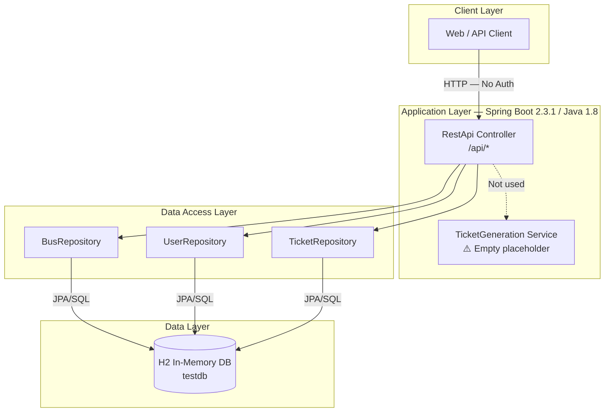
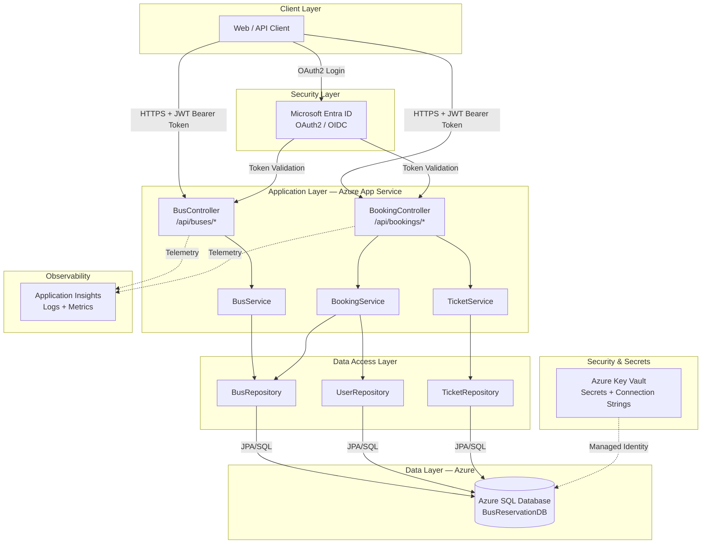

# Code Base Summary - BusReservation Solution

## Solution Overview

**Total Repositories Analyzed**: 1  
**Analysis Date**: March 26, 2026  
**Business Purpose**: Bus ticket reservation and booking system — a REST API that enables users to search buses by route and date, view availability, and book seats with invoice generation.

---

## Application Summary

### BusReservation API
- **Type**: REST API
- **Language**: Java 1.8
- **Frameworks**: Spring Boot 2.3.1, Spring Data JPA, Spring Web MVC
- **Purpose**: Provides bus search, booking, and ticket management operations via RESTful HTTP endpoints.
- **Main Dependencies**: H2 in-memory database, Spring JPA, Spring Actuator
- **[Complete details](./BusReservation.md)**

---

## General Solution Architecture

### Current Architecture Diagram

### Target Architecture Diagram (Post-Migration)

---

## Communication Matrix

### REST API Endpoints (Current)

| Method | Path | Purpose | Auth Required | Risk |
|--------|------|---------|---------------|------|
| POST | /api/bus | Create bus | ❌ None | 🔴 HIGH |
| GET | /api/bus | List all buses | ❌ None | 🟡 MEDIUM |
| GET | /api/bus/{busName} | Bus detail | ❌ None | 🟡 MEDIUM |
| GET | /api/searchBus | Hardcoded test search | ❌ None | 🔴 Remove |
| GET | /api/user | List users (exposes passwords!) | ❌ None | 🔴 CRITICAL |
| GET | /api/tickets | List all tickets | ❌ None | 🟡 MEDIUM |
| POST | /api/bookBus | Book a seat | ❌ None | 🔴 HIGH |
| POST | /api/search | Search buses | ❌ None | 🟢 LOW |

### External Dependencies

| Service | Type | Purpose | Criticality |
|---------|------|---------|-------------|
| H2 Database | In-Memory SQL | All data persistence | Critical — must be replaced |

---

## Shared Dependencies Analysis

### Technologies and Frameworks

| Technology | Version | Purpose | Migration Target |
|------------|---------|---------|-----------------|
| Java | 1.8 | Runtime | Java 21 LTS |
| Spring Boot | 2.3.1.RELEASE | Application framework | Spring Boot 3.x |
| Spring Data JPA | 2.3.1 | ORM and repositories | 3.x (jakarta.persistence) |
| Spring Web MVC | 2.3.1 | REST controllers | 3.x |
| Spring Actuator | 2.3.1 | Health endpoints | 3.x |
| H2 Database | runtime | In-memory DB | Azure SQL Database |
| JUnit 5 | 5.6.x | Testing | 5.x (upgrade) |
| Maven | 3.x | Build tool | Keep |

### Identified Architectural Patterns

#### 1. Repository Pattern
- **Files**: `BusRepository`, `UserRepository`, `TicketRepository`
- **Description**: Spring Data `CrudRepository` interfaces with auto-generated CRUD and custom JPQL query
- **Migration**: Upgrade to `JpaRepository` in Spring Boot 3.x (optional but recommended)

#### 2. Single Controller Anti-Pattern
- **File**: `RestApi.java`
- **Description**: All 8 endpoints consolidated in one controller class; zero service layer
- **Recommendation**: Split into `BusController` + `BookingController`; extract logic to `@Service` classes

---

## Risk Analysis and Migration Recommendations

### 🔴 Critical Risks

| # | Risk | Affected Files | Description | Recommendation |
|---|------|---------------|-------------|----------------|
| 1 | Passwords in plain text | data.sql, User.java | User passwords stored unhashed | BCryptPasswordEncoder + Entra ID |
| 2 | No API authentication | RestApi.java (all endpoints) | All REST APIs publicly accessible | Spring Security + Entra ID OAuth2 |
| 3 | Password exposed via API | RestApi.java (GET /api/user) | User entity serialized with password field | @JsonIgnore on User.password |
| 4 | H2 Console enabled | application.properties | Admin DB console open in any deployment | Disable in non-dev Spring profile |
| 5 | Credentials in code | application.properties | Datasource password hardcoded | Azure Key Vault with managed identity |

### 🟡 Medium Risks

| # | Risk | Description | Recommendation |
|---|------|-------------|----------------|
| 6 | Java 1.8 EOL | No security patches since March 2022 | Upgrade to Java 21 LTS |
| 7 | Spring Boot 2.3.1 EOL | Known CVEs in Tomcat 9.x dependencies | Upgrade to Spring Boot 3.x |
| 8 | In-memory DB | Data lost on restart; no persistence | Azure SQL Database with Flyway migrations |
| 9 | Minimal test coverage | Single smoke test — no unit or integration tests | Implement JUnit 5 test suite |
| 10 | javax.* imports | Will not compile on Jakarta EE 9+ | Bulk replace to jakarta.* |

### 🟢 Low Risks (Quality)

| # | Risk | Description | Recommendation |
|---|------|-------------|----------------|
| 11 | System.out.println | Debug output pollutes logs | Replace with SLF4J |
| 12 | Comma-separated seats | Not queryable or concurrency-safe | Normalize to SEAT_DETAILS table |
| 13 | Hardcoded test endpoint | /api/searchBus has hardcoded parameters | Remove before production |
| 14 | Empty service class | TicketGeneration.java is empty | Remove or implement |

---

## Migration Strategy

### Phase 1: Security Hardening (Week 1)
1. Add `@JsonIgnore` to `User.password`
2. Remove `/api/searchBus` hardcoded endpoint
3. Disable H2 console in non-dev profile
4. Add Spring Security with endpoint protection (401 for all write/admin endpoints)
5. Implement `BCryptPasswordEncoder` for password storage

### Phase 2: Code Modernization (Week 2–3)
1. Upgrade Java: 1.8 → 21
2. Upgrade Spring Boot: 2.3.1 → 3.x
3. Migrate all `javax.persistence.*` → `jakarta.persistence.*`
4. Extract service layer: `BusService`, `BookingService`, `TicketService`
5. Add `@Valid` input validation to all endpoints
6. Add `@ControllerAdvice` global exception handler
7. Replace `System.out.println` with SLF4J
8. Implement Microsoft Entra ID OAuth2 integration (`microsoft-identity-web`)

### Phase 3: Database Migration (Week 3–4)
1. Replace H2 with Azure SQL Database
2. Add Flyway for schema migrations
3. Configure HikariCP connection pool for Azure
4. Use Azure Managed Identity for DB authentication (no passwords in code)
5. Consider normalizing seat storage

### Phase 4: Infrastructure & Deployment (Week 4–5)
1. Create multi-stage Dockerfile
2. Generate Bicep IaC for Azure App Service or Container Apps
3. Create GitHub Actions CI/CD pipeline
4. Configure Application Insights
5. Set up Azure Key Vault for secrets

### Phase 5: Testing & Validation (Week 5–6)
1. Write unit tests for all service classes (target 80%+ coverage)
2. Write integration tests with Testcontainers (PostgreSQL)
3. Perform load testing against Azure deployment
4. Security penetration testing

---

## Solution Metrics

### Lines of Code Estimate

| File/Package | LOC (est.) | Complexity |
|-------------|-----------|------------|
| RestApi.java | ~180 | High (all-in-one) |
| Bus.java | ~130 | Low (POJO) |
| User.java | ~70 | Low (POJO) |
| Ticket.java | ~80 | Low (POJO) |
| Invoice.java | ~80 | Low (POJO) |
| Search.java | ~50 | Low (POJO) |
| Repositories (3 files) | ~30 | Low |
| BusReservationApplication.java | ~10 | Trivial |
| Service (empty) | ~10 | Trivial |
| **TOTAL** | **~640** | **Low–Medium** |

### Test Coverage

| Metric | Value |
|--------|-------|
| Total test files | 1 |
| Total test cases | 1 |
| Coverage (est.) | < 5% |
| Repositories with > 80% coverage | 0 |
| Repositories with < 50% coverage | 1 (this repo) |

---

## Appendices

- [Detailed Assessment for BusReservation](./BusReservation.md)
- [Analysis Task Tracker](../codebase-analysis.md)
- [Repository List](../codebase-repos.md)
