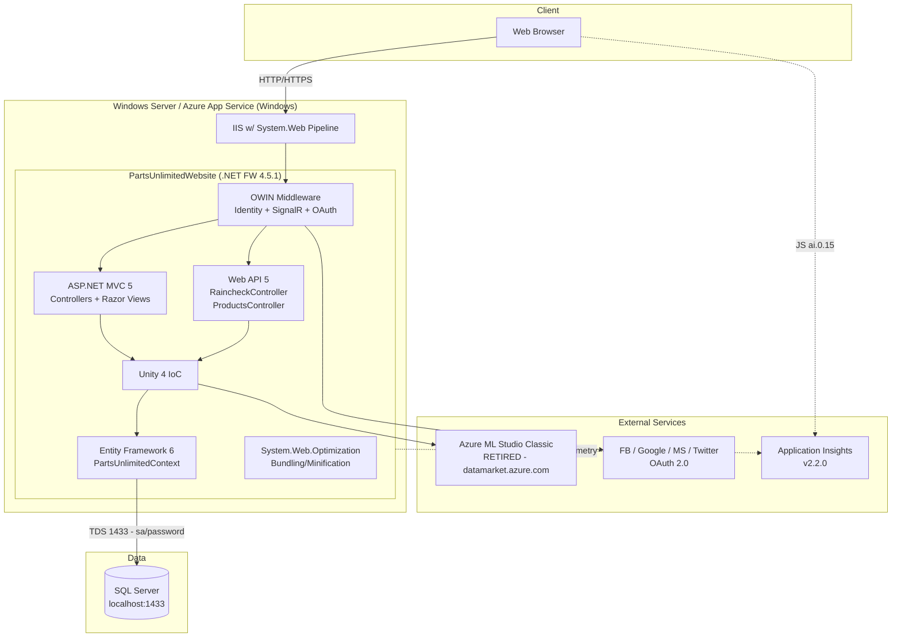
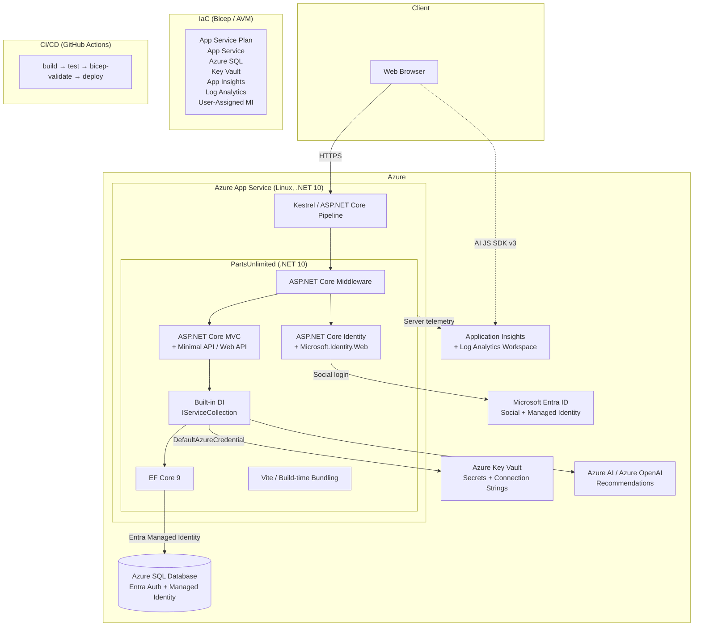

# Application Assessment Report

**Generated:** 2026-05-12
**Application:** PartsUnlimited (ASP.NET 4.5 eCommerce)
**Assessment Type:** Planning & Assessment — Phase 1
**Analyst:** GitHub Copilot Migration Agent

---

## Executive Summary

PartsUnlimited is a **monolithic ASP.NET MVC 5 / Web API 5** eCommerce application targeting **.NET Framework 4.5.1** on Windows / IIS, currently deployed to Azure App Service via the legacy Kudu MSBuild pipeline. The application has no Dockerfile, no Bicep/ARM templates, and no CI/CD pipeline.

The migration path is a **full framework upgrade to .NET 10 LTS + cloud readiness remediation**, targeting **Azure App Service (Linux)** with **Azure SQL Database** and **Bicep** IaC. This requires a substantive but well-scoped rewrite of the startup pipeline, authentication, ORM layer, and bundling — the business logic, domain model, and controller structure carry over cleanly.

**Build status:** ❌ Cannot build with `dotnet build` — solution uses a legacy **non-SDK-style `.csproj`** (ToolsVersion 12.0, `packages.config`) that requires Visual Studio / MSBuild with full .NET Framework targeting packs. Converting to SDK-style is **the first migration task**.

**Overall migration effort:** Medium–Large (estimated 3–5 sprints for a 2-person team).

---

## Migration Configuration

| Setting | Value |
|---|---|
| **Modernization Scope** | Version upgrade (.NET FW 4.5.1 → .NET 10) + Cloud readiness remediation |
| **Target Platform** | Azure App Service (Linux, .NET 10) |
| **IaC Tool** | Bicep (Azure Verified Modules) |
| **Target Database** | Azure SQL Database (fully managed) with Entra auth + Managed Identity |
| **Source** | ASP.NET MVC 5.2.3 + Web API 5.2.3, .NET FW 4.5.1, EF6, OWIN Identity 2.x |
| **Target** | ASP.NET Core (.NET 10), EF Core 9, ASP.NET Core Identity, `Microsoft.Identity.Web` |

---

## Current Architecture

---

## Target Azure Architecture

---

## Application Analysis

### Technology Stack

| Layer | Current (ASP.NET 4.5) | Target (.NET 10) |
|---|---|---|
| Runtime | .NET Framework 4.5.1 | .NET 10 LTS |
| Web Framework | ASP.NET MVC 5.2.3 + Web API 5.2.3 | ASP.NET Core MVC + Minimal API |
| Real-time | SignalR 2.2.1 (disabled) | ASP.NET Core SignalR |
| Auth | OWIN Identity 2.2.1 + social OAuth | ASP.NET Core Identity + `Microsoft.Identity.Web` |
| ORM | Entity Framework 6.1.3 | EF Core 9 |
| DI Container | Unity 4.0.1 | `Microsoft.Extensions.DependencyInjection` (built-in) |
| Config | `web.config` + `WebConfigurationManager` | `appsettings.json` + `IConfiguration` |
| Bundling | System.Web.Optimization 1.1.3 | Vite / WebOptimizer / BundlerMinifier |
| Telemetry | App Insights 2.2.0 (instrumentation key) | App Insights SDK 3.x (Connection String) |
| Project format | Legacy `.csproj` (ToolsVersion 12) + `packages.config` | SDK-style `Microsoft.NET.Sdk.Web` + `<PackageReference>` |
| Hosting | IIS (System.Web) | Kestrel (cross-platform) |
| Build/Deploy | Kudu + MSBuild (`deploy.cmd`) | `dotnet publish` + `azd` / GitHub Actions |

### Dependencies

#### NuGet Packages — Current vs Target

| Current Package | Version | Target Replacement | Target Version |
|---|---|---|---|
| `Microsoft.AspNet.Mvc` | 5.2.3 | Built-in ASP.NET Core | .NET 10 SDK |
| `Microsoft.AspNet.WebApi.*` | 5.2.3 | Built-in ASP.NET Core | .NET 10 SDK |
| `Microsoft.AspNet.SignalR` | 2.2.1 | `Microsoft.AspNetCore.SignalR` | 8.0+ |
| `Microsoft.AspNet.Identity.*` | 2.2.1 | `Microsoft.AspNetCore.Identity` | .NET 10 SDK |
| `Microsoft.Owin.*` | 3.0.1 | `Microsoft.AspNetCore.Authentication.*` | .NET 10 SDK |
| `EntityFramework` | 6.1.3 | `Microsoft.EntityFrameworkCore.SqlServer` | 9.x |
| `Microsoft.Practices.Unity` | 4.0.1 | Built-in DI | .NET 10 SDK |
| `System.Web.Optimization` | 1.1.3 | `WebOptimizer` or build-time (Vite) | latest |
| `Microsoft.ApplicationInsights.Web` | 2.2.0 | `Microsoft.ApplicationInsights.AspNetCore` | 2.22+ |
| `Newtonsoft.Json` | 9.0.1 | `System.Text.Json` (or keep Newtonsoft) | latest |
| `Microsoft.jQuery.Unobtrusive.Validation` | 3.2.3 | Same (CDN or local npm) | 4.x |
| `Bootstrap` | 3.3.7 | Bootstrap 5.x (npm/CDN) | 5.x |

### Authentication & Authorization

| Aspect | Current | Target |
|---|---|---|
| Identity store | `IdentityDbContext<ApplicationUser>` (EF6, ASP.NET Identity 2) | `IdentityDbContext<ApplicationUser>` (EF Core, ASP.NET Core Identity) |
| Cookie auth | OWIN `UseCookieAuthentication` | `AddAuthentication().AddCookie()` |
| Social login | `Microsoft.Owin.Security.{Facebook,Google,MicrosoftAccount,Twitter}` | `AddAuthentication().AddFacebook().AddGoogle().AddMicrosoftAccount()` |
| OAuth secrets | App settings in `web.config` | Azure Key Vault → `IConfiguration` |
| 2FA | Phone + Email token providers | ASP.NET Core Identity built-in |
| Admin user seed | Inline `CreateAdminUser` in `Startup.Auth.cs` | `IHostedService` on startup |
| Azure AD | ❌ None | `Microsoft.Identity.Web` — optional Entra ID integration |

**Security finding 🔴:** `web.config` contains a plaintext admin password `YouShouldChangeThisPassword1!` and SQL `sa` credentials. Both must be removed from the repository and moved to Key Vault / environment variables before any cloud deployment.

### Data Access Patterns

| Aspect | Current | Target |
|---|---|---|
| ORM | Entity Framework 6.1.3 (`IDbSet<T>`) | EF Core 9 (`DbSet<T>`) |
| DbContext base | `IdentityDbContext<ApplicationUser>` (EF6) | `IdentityDbContext<ApplicationUser>` (EF Core) |
| Migrations | EF6 code-first migrations (`Migrations/`) | EF Core migrations (new baseline from existing schema) |
| Seeding | `CreateDatabaseIfNotExists<T>` + `Seed()` (synchronous, 300+ lines) | `IHostedService` async seeder / `HasData()` |
| Connection | `Server=localhost,1433;User Id=sa;Password=...` | Azure SQL via Managed Identity (`Server=<server>.database.windows.net;Authentication=Active Directory Default;`) |
| Entities | Product, Order, Category, CartItem, OrderDetail, Raincheck, Store, ApplicationUser | Same — all carry over |

### Exposed Endpoints

#### MVC Controllers (HTML, Auth Required where noted)

| Controller | Routes | Notes |
|---|---|---|
| `HomeController` | `GET /` | Public |
| `StoreController` | `GET /Store`, `GET /Store/Browse`, `GET /Store/Details/{id}` | Public |
| `ShoppingCartController` | `GET /ShoppingCart`, `POST /ShoppingCart/AddToCart`, `POST /ShoppingCart/RemoveFromCart`, `POST /ShoppingCart/Checkout` | Mixed |
| `CheckoutController` | `GET /Checkout`, `POST /Checkout/Complete` | Auth required |
| `OrdersController` | `GET /Orders`, `GET /Orders/Details/{id}` | Auth required |
| `AccountController` | `GET/POST /Account/Login`, `GET/POST /Account/Register`, `POST /Account/LogOff` | Public |
| `ManageController` | `GET /Manage`, `/Manage/ChangePassword`, `/Manage/ManageLogins` | Auth required |
| `SearchController` | `GET /Search` | Feature-flagged |
| `RecommendationsController` | `GET /Recommendations/GetRecommendations/{productId}` | Calls Azure ML |
| `Admin/*` | Admin area CRUD (Products, Categories, Stores, Customers, Orders, Rainchecks) | Auth + Admin role |

#### Web API Controllers (JSON)

| Controller | Routes | Notes |
|---|---|---|
| `RaincheckController` | `GET/POST/PUT/DELETE /api/Rainchecks` | REST |
| `ProductsController` | `GET /api/Products` | REST |

### External Integrations

| Service | Usage | Status | Migration Action |
|---|---|---|---|
| Azure ML Studio (classic) — `datamarket.azure.com` | `AzureMLFrequentlyBoughtTogetherRecommendationEngine` — `GET` score endpoint | 🔴 **RETIRED** | Replace implementation of `IRecommendationEngine` with Azure ML v2 / Azure OpenAI / static fallback |
| Application Insights | Server-side SDK + client-side `ai.0.15.0` JS | Active (old) | Upgrade to AI SDK 3.x; use Connection String; AI JS SDK v3 |
| Facebook / Google / Microsoft / Twitter OAuth | OWIN middleware | Active | Migrate to ASP.NET Core `AddAuthentication()` providers |

---

## Risk Assessment

| # | Issue | Risk | Phase | Mitigation |
|---|---|---|---|---|
| R01 | `System.Web` pipeline — `Global.asax`, `HttpModules`, `HttpHandlers`, `WebConfigurationManager` | 🔴 Critical | Phase 2 | Replace with `Program.cs` minimal hosting + ASP.NET Core middleware |
| R02 | Hardcoded SQL `sa` credentials in `web.config` | 🔴 Critical | Immediate | Remove from repo; use Key Vault + Managed Identity + Azure SQL Entra auth |
| R03 | Admin password `YouShouldChangeThisPassword1!` in `web.config` | 🔴 Critical | Immediate | Remove; inject via Key Vault / env var at runtime |
| R04 | Azure ML Studio (classic) endpoint — **retired** | 🔴 Critical | Phase 2 | Swap `IRecommendationEngine` impl to Azure ML v2 / fallback |
| R05 | Legacy non-SDK-style `.csproj` — incompatible with `dotnet build` | 🔴 Critical | Phase 2 (first) | Convert to `Microsoft.NET.Sdk.Web`, add `<PackageReference>` |
| R06 | OWIN Identity 2.x (`Microsoft.Owin.*`) — removed in .NET Core | 🟠 High | Phase 2 | Migrate to ASP.NET Core Identity + `Microsoft.Identity.Web` |
| R07 | Entity Framework 6 — not supported on .NET 10 | 🟠 High | Phase 2 | Migrate to EF Core 9; new baseline migration; update `IDbSet<T>` → `DbSet<T>` |
| R08 | Unity IoC (`Global.UnityContainer` static service locator) | 🟠 High | Phase 2 | Replace with built-in `IServiceCollection`; remove static service locator |
| R09 | `System.Web.Optimization` bundling — not ported to .NET Core | 🟠 High | Phase 2 | Replace with WebOptimizer NuGet or Vite/esbuild build step |
| R10 | SignalR 2.x — API changed in ASP.NET Core SignalR | 🟡 Medium | Phase 2 | Re-implement `AnnouncementHub`; client JS changes |
| R11 | App Insights instrumentation key (deprecated) — hardcoded in `web.config` and `ApplicationInsights.config` | 🟡 Medium | Phase 2 | Switch to Connection String via env var; use `AddApplicationInsightsTelemetry()` |
| R12 | `MachineLearning.AccountKey` — Basic auth key in config | 🟡 Medium | Phase 2 | Move to Key Vault; use `IConfiguration` |
| R13 | Bootstrap 3.3.7 / jQuery 3.1.1 / Modernizr 2.8.3 — EOL front-end stack | 🟡 Medium | Phase 2 | Bootstrap 5 + jQuery 3.7+ or native JS; drop Modernizr |
| R14 | Selenium tests — `[Ignore]`, dead URL `cdrm-pu-demo-dev.azurewebsites.net`, Chrome driver 2016 | 🟡 Medium | Phase 5 | Rewrite as Playwright; parameterize base URL |
| R15 | No Dockerfile, no IaC, no CI/CD | 🟡 Medium | Phase 3–5 | Add Bicep (AVM), Dockerfile, GitHub Actions |
| R16 | `CreateDatabaseIfNotExists` DB initializer — 300+ line seed method | 🟢 Low | Phase 2 | Replace with EF Core migrations + async `IHostedService` seeder |
| R17 | `MachineLearning.RecommendationsURL` not found in `web.config` (key missing) | 🟢 Low | Phase 2 | Verify correct key name; add to `appsettings.json` |
| R18 | `Respond.js` polyfill (IE8) | 🟢 Low | Phase 2 | Remove — IE8 is not a supported browser for any Azure App Service scenario |

---

## Migration Plan

### Phase 1: Preparation ✅ (Complete)
- Requirements gathered and confirmed
- Codebase analyzed (Phase 0 + Phase 1 reports)
- Risk assessment completed
- Architecture diagrams produced

### Phase 2: Code Modernization

**Goal:** Working ASP.NET Core (.NET 10) application that builds and runs locally, functionally equivalent to the original.

#### 2.1 Project Conversion (Sprint 1 — ~3 days)
- [ ] **Convert `.csproj` to SDK-style** (`Microsoft.NET.Sdk.Web`, `net10.0`), replacing `packages.config` with `<PackageReference>`
- [ ] **Delete** `Global.asax(.cs)` and `Startup.cs` (OWIN); create `Program.cs` with `WebApplicationBuilder` + `WebApplication`
- [ ] **Convert `web.config`** — migrate `<appSettings>` and `<connectionStrings>` to `appsettings.json` + `appsettings.Development.json` (secrets excluded from repo)
- [ ] **Replace `WebConfigurationManager.AppSettings`** usage in `ConfigurationHelpers.cs` with `IConfiguration`

#### 2.2 Authentication Migration (Sprint 1–2 — ~4 days)
- [ ] **Replace `Microsoft.Owin.Security.*`** with `Microsoft.AspNetCore.Authentication.*`
- [ ] **Migrate ASP.NET Identity 2.x → ASP.NET Core Identity** — keep `ApplicationUser`, update `IdentityDbContext` base to EF Core version
- [ ] **Re-implement `Startup.Auth.cs`** logic as `Program.cs` `services.AddIdentity()` + `app.UseAuthentication()` + `app.UseAuthorization()`
- [ ] **Migrate social OAuth** — `AddFacebook()`, `AddGoogle()`, `AddMicrosoftAccount()`, `AddTwitter()` (or migrate to Entra External ID)
- [ ] **Replace `IdentityConfig.cs`** — recreate `UserManager` / `SignInManager` via DI
- [ ] **Secure admin seed user** — move credentials to Key Vault / env var

#### 2.3 EF Core Migration (Sprint 2 — ~3 days)
- [ ] **Replace `EntityFramework` NuGet** with `Microsoft.EntityFrameworkCore.SqlServer` 9.x
- [ ] **Update `PartsUnlimitedContext`** — change `IdentityDbContext` base class, replace `IDbSet<T>` → `DbSet<T>`, update `OnModelCreating`
- [ ] **Update all query code** — async patterns, fix removed/renamed EF Core APIs
- [ ] **Generate new baseline EF Core migration** from existing schema (`dotnet ef migrations add InitialCreate`)
- [ ] **Replace `CreateDatabaseIfNotExists` seeder** with an `IHostedService` async seeder or `HasData()` on `OnModelCreating`
- [ ] **Update `IPartsUnlimitedContext`** interface — replace `IDbSet<T>` with `DbSet<T>`

#### 2.4 DI / IoC Migration (Sprint 2 — ~1 day)
- [ ] **Replace Unity** — convert `UnityConfig.cs` registrations to `services.AddScoped<>/AddTransient<>/AddSingleton<>` in `Program.cs`
- [ ] **Remove `Global.UnityContainer` static accessor** from `Startup.Auth.cs`; resolve via DI constructor injection

#### 2.5 MVC / Razor / Web API (Sprint 2–3 — ~3 days)
- [ ] **Update controllers** — change base class `Controller` / `ApiController` to ASP.NET Core equivalents; fix `System.Web.Mvc` → `Microsoft.AspNetCore.Mvc` namespaces
- [ ] **Update `WebApiConfig`** — replace `HttpConfiguration` with ASP.NET Core routing attributes (already `MapHttpAttributeRoutes` — low effort)
- [ ] **Update `RouteConfig`** — use ASP.NET Core conventional routing in `Program.cs`
- [ ] **Update Razor Views** — fix `@Html.ActionLink`, `@Url.Action` (most work as-is); replace `@Styles.Render` / `@Scripts.Render` with tag helpers or static file includes
- [ ] **Replace `System.Web.Optimization` bundling** — add `WebOptimizer` NuGet or move to Vite npm build step; update `_Layout.cshtml`
- [ ] **Replace `FilterConfig.cs`** global filters with ASP.NET Core middleware or `[ServiceFilter]`

#### 2.6 SignalR (Sprint 3 — ~1 day)
- [ ] **Add `Microsoft.AspNetCore.SignalR`** NuGet
- [ ] **Re-implement `AnnouncementHub`** — minimal API change (base class `Hub` is same name; method signatures compatible)
- [ ] **Update `_Layout.cshtml`** — uncomment SignalR; update client JS to `@microsoft/signalr` npm package

#### 2.7 Telemetry & Recommendations (Sprint 3 — ~1 day)
- [ ] **Update Application Insights** — replace `Microsoft.ApplicationInsights.Web` with `Microsoft.ApplicationInsights.AspNetCore`; use Connection String env var; update `_Layout.cshtml` to AI JS SDK v3
- [ ] **Replace `IRecommendationEngine` implementation** — stub or re-implement `AzureMLFrequentlyBoughtTogetherRecommendationEngine` against a non-retired endpoint (Azure OpenAI / static fallback)

#### 2.8 Security Hardening (Sprint 3 — ~1 day)
- [ ] **Add `Azure.Identity` + `Azure.Security.KeyVault.Secrets`** — use `DefaultAzureCredential` for local dev and Managed Identity in Azure
- [ ] **Add `Microsoft.Azure.AppConfiguration`** for feature flags (replaces `ShowRecommendations` app setting)
- [ ] **Enable HTTPS-only**, HSTS, anti-forgery headers in `Program.cs`
- [ ] **Replace SQL `sa` auth** with Azure SQL connection string using `Authentication=Active Directory Default;` (no password)

### Phase 3: Infrastructure Generation

**Goal:** Bicep templates that provision all Azure resources.

- [ ] **App Service Plan** (AVM `Microsoft.Web/serverfarms`, Linux, .NET 10)
- [ ] **App Service** (AVM `Microsoft.Web/sites`, User-Assigned Managed Identity, HTTPS-only, connection string from Key Vault ref, App Insights instrumentation)
- [ ] **Azure SQL Database** (AVM `Microsoft.Sql/servers` + `databases`, Entra-only auth, firewall rules)
- [ ] **Azure Key Vault** (AVM, RBAC auth, secrets: admin password, OAuth secrets, AI connection string)
- [ ] **Application Insights** (AVM `Microsoft.Insights/components`, workspace-based)
- [ ] **Log Analytics Workspace** (AVM `Microsoft.OperationalInsights/workspaces`)
- [ ] **User-Assigned Managed Identity** — assigned to App Service; Key Vault `Key Vault Secrets User` + SQL `db_owner`
- [ ] **`main.bicep` + `main.bicepparam`** — parameterized for dev/staging/prod

### Phase 4: Deploy to Azure

- [ ] `azd init` + `azd env new`
- [ ] `azd provision` — deploy Bicep
- [ ] `dotnet publish -c Release` + `azd deploy`
- [ ] Smoke test all routes; validate App Insights telemetry
- [ ] Run EF Core migrations against Azure SQL

### Phase 5: CI/CD Setup

- [ ] **GitHub Actions** workflow: `build-and-deploy.yml`
  - Triggers: push to `main`, PR gate
  - Jobs: `build` (dotnet build + test) → `infra-validate` (bicep build + what-if) → `deploy` (azd deploy, env: production)
- [ ] **Quality gates**: `dotnet test --coverage` (minimum 60%)
- [ ] **Secret management**: GitHub Environments + OIDC federated identity (no stored credentials)

---

## Effort Estimation

| Phase | Effort | Duration (2-dev team) |
|---|---|---|
| Phase 2.1 — Project conversion | 3 dev-days | Day 1–3 |
| Phase 2.2 — Auth migration | 4 dev-days | Day 3–6 |
| Phase 2.3 — EF Core | 3 dev-days | Day 6–9 |
| Phase 2.4 — DI | 1 dev-day | Day 9 |
| Phase 2.5 — MVC/Razor/WebAPI | 3 dev-days | Day 10–12 |
| Phase 2.6 — SignalR | 1 dev-day | Day 13 |
| Phase 2.7 — Telemetry + Recs | 1 dev-day | Day 13 |
| Phase 2.8 — Security | 1 dev-day | Day 14 |
| Phase 3 — IaC (Bicep) | 3 dev-days | Day 15–17 |
| Phase 4 — Deployment | 1 dev-day | Day 18 |
| Phase 5 — CI/CD | 2 dev-days | Day 19–20 |
| **Total** | **~23 dev-days** | **~3 sprints (2-week each, 2 devs)** |

---

## Cost Estimation (T-Shirt Sizing)

**Recommended Size: M (Medium)**

| Component | Azure Service | SKU | Est. Monthly Cost |
|---|---|---|---|
| Web hosting | App Service Plan (Linux) | B2 (dev) / P1v3 (prod) | $13–$80 |
| Database | Azure SQL Database | Basic (dev) / S2 (prod) | $5–$150 |
| Secrets | Azure Key Vault | Standard | ~$5 |
| Monitoring | Application Insights + Log Analytics | Pay-as-you-go | ~$10–30 |
| **Dev/Test total** | | | **~$33–100/month** |
| **Production total** | | | **~$265–300/month** |

**Key cost drivers:** App Service Plan SKU (scale up for production), Azure SQL Database tier, Log Analytics data ingestion volume.

**Cost optimization tips:**
- Use **Dev/Test subscription pricing** for non-production environments (40–55% savings on App Service)
- Enable **auto-scaling** on App Service to scale down during off-peak hours
- Use **Azure SQL serverless** tier for dev/test (auto-pause when idle)
- **Reserved Instances** (1-year) for App Service Plan and Azure SQL save 30–40% in production

For detailed estimates: [Azure Pricing Calculator](https://azure.microsoft.com/pricing/calculator/)

---

## Change Report

### Critical Changes (Must Address)

| # | Issue | File(s) | Change | Verification |
|---|---|---|---|---|
| C01 | Non-SDK `.csproj` blocks `dotnet build` | `PartsUnlimitedWebsite.csproj` | Replace with `<Project Sdk="Microsoft.NET.Sdk.Web">`, target `net10.0`, migrate all `<Reference>` to `<PackageReference>` | `dotnet build` succeeds |
| C02 | `Global.asax.cs` / `HttpApplication` — not in .NET 10 | `Global.asax`, `Global.asax.cs` | Delete both files; recreate startup logic in `Program.cs` using `WebApplicationBuilder` | App starts, routes resolve |
| C03 | OWIN `Startup.cs` (`[assembly: OwinStartup]`) | `Startup.cs`, `App_Start/Startup.Auth.cs` | Remove OWIN startup; migrate `ConfigureAuth` → `services.AddAuthentication()` + `app.UseAuthentication()` in `Program.cs` | Login/logout/social auth works |
| C04 | `web.config` — entire config system not portable | `Web.config`, `Web.Release.config` | Convert to `appsettings.json` + environment variables; remove `<system.web>`, `<entityFramework>` sections | App reads all settings |
| C05 | SQL `sa` credentials hardcoded | `Web.config` | Remove immediately; use Azure SQL Entra auth; local dev uses `appsettings.Development.json` + user secrets | No credentials in repo |
| C06 | Admin password in `web.config` | `Web.config` | Remove; inject via `IConfiguration` from Key Vault / env var | No credentials in repo |
| C07 | `System.Web.*` namespace imports everywhere | All `Controllers/*.cs`, `App_Start/*.cs` | Global find-replace + namespace update to `Microsoft.AspNetCore.*` | No `System.Web` references remain |
| C08 | `EntityFramework` 6 package | `packages.config` | Replace with `Microsoft.EntityFrameworkCore.SqlServer` 9.x; update `PartsUnlimitedContext`, `IDbSet<T>` → `DbSet<T>` | `dotnet build` succeeds; EF migrations run |
| C09 | Azure ML Studio classic endpoint (retired) | `Recommendations/AzureMLFrequentlyBoughtTogetherRecommendationEngine.cs` | Implement a new `IRecommendationEngine` that either returns empty or calls Azure ML v2 / Azure OpenAI | Recommendations page loads without exception |
| C10 | Unity IoC + static `Global.UnityContainer` | `UnityConfig.cs`, `Global.asax.cs`, `Startup.Auth.cs` | Convert all registrations to `services.AddScoped<>/AddSingleton<>` in `Program.cs`; remove static service locator | DI resolves all services |
| C11 | `System.Web.Optimization` bundling | `BundleConfig.cs`, `_Layout.cshtml`, `App_Start/` | Remove package; add `WebOptimizer` or Vite; update `_Layout.cshtml` to use `<link>` / `<script>` tags or tag helpers | CSS/JS loads in browser |

### High-Priority Changes

| # | Issue | File(s) | Change |
|---|---|---|---|
| H01 | `Microsoft.Owin.Security.*` OAuth providers | `App_Start/Startup.Auth.cs` | Replace with `services.AddAuthentication().AddFacebook()/.AddGoogle()` etc. |
| H02 | `Microsoft.AspNet.Identity.EntityFramework` | `Models/PartsUnlimitedContext.cs`, `App_Start/IdentityConfig.cs` | Replace with `Microsoft.AspNetCore.Identity.EntityFrameworkCore` |
| H03 | `UnityDependencyResolver` in `WebApiConfig.cs` | `App_Start/WebApiConfig.cs` | Remove (ASP.NET Core uses built-in DI for controllers) |
| H04 | `HttpApplication` / `HttpContext` direct usage | Various controllers | Replace with `HttpContext` (ASP.NET Core) via `IHttpContextAccessor` or controller properties |
| H05 | `[ValidateAntiForgeryToken]` + `HtmlHelper.AntiForgeryToken()` | Controllers + Views | Replace `@Html.AntiForgeryToken()` with `<form asp-antiforgery="true">` tag helper |
| H06 | `Application Insights Web` 2.2.0 | `ApplicationInsights.config`, `Startup.cs` | Remove `ApplicationInsights.config`; add `services.AddApplicationInsightsTelemetry(config["AI:ConnectionString"])` |

### Medium-Priority Changes

| # | Issue | File(s) | Change |
|---|---|---|---|
| M01 | `@Scripts.Render` / `@Styles.Render` in Razor views | `Views/Shared/_Layout.cshtml` | Replace with `<script src>` / `<link href>` or WebOptimizer `@using WebOptimizer.Razor` tag helpers |
| M02 | `@Html.ActionLink` / `@Url.Action` — minor syntax differences | All `.cshtml` views | Most work as-is; validate after migration |
| M03 | `RouteConfig` conventional routing | `App_Start/RouteConfig.cs` | Recreate via `app.MapControllerRoute(...)` in `Program.cs` |
| M04 | `FilterConfig` global filters | `App_Start/FilterConfig.cs` | Replace `GlobalFilters.Filters.Add(new HandleErrorAttribute())` with built-in ASP.NET Core exception handling middleware |
| M05 | `AI JS SDK ai.0.15.0` client-side | `Views/Shared/_Layout.cshtml` | Replace bundled `ai.0.15.0-build58334.js` with AI JavaScript SDK v3 (npm/CDN); update snippet |
| M06 | Bootstrap 3 + jQuery UI 1.12 | `Content/`, `Scripts/`, `Views/` | Update to Bootstrap 5 + jQuery 3.7+; update CSS classes where changed (`.col-md-*` grid is same) |
| M07 | Respond.js IE8 polyfill | `BundleConfig.cs`, `_Layout.cshtml` | Remove — IE8 not supported |
| M08 | SignalR 2.2.1 | `Hubs/AnnouncementHub.cs`, `_Layout.cshtml` | Migrate to `Microsoft.AspNetCore.SignalR`; re-enable in layout |

---

## Next Steps

1. **Immediate (before any deployment):** Remove hardcoded credentials from `web.config` (C05, C06) — commit this to the branch immediately.
2. **Start Phase 2** with `/phase2-migratecode` — recommended starting point: project file conversion (C01) → `Program.cs` (C02, C03) → `appsettings.json` (C04) → EF Core (C08).
3. **Phase 3** — generate Bicep after the application builds on .NET 10.
4. **Phase 4** — deploy and validate.
5. **Phase 5** — add CI/CD pipeline.

> Run `/phase2-migratecode` to begin code modernization.
