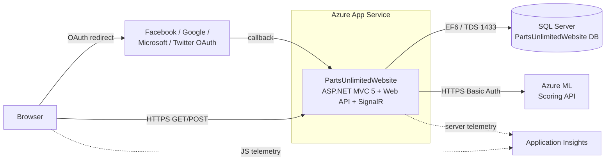

# Assessment — PartsUnlimited (ASP.NET 4.5)

## Identification

| Field | Value |
|---|---|
| **Repository Name** | PartsUnlimited |
| **Type** | Monolithic Web Application (ASP.NET MVC 5 + Web API + SignalR) |
| **Primary Language** | C# |
| **Frameworks** | ASP.NET MVC 5.2.3, ASP.NET Web API 5.2.3, ASP.NET SignalR 2.2.1, ASP.NET Identity 2.2.1, Entity Framework 6.1.3 |
| **Target .NET** | .NET Framework 4.5.1 (web) / 4.5.2 (unit tests) / 4.6.1 (Selenium) |
| **Repository URL** | local: `Use-cases/07-PartsUnlimited-aspnet45/` |

### Solution Projects

| Project | Path | TFM | Type |
|---|---|---|---|
| `PartsUnlimitedWebsite` | `src/PartsUnlimitedWebsite/` | .NET FW 4.5.1 | ASP.NET MVC Web App |
| `PartsUnlimited.UnitTests` | `test/PartsUnlimited.UnitTests/` | .NET FW 4.5.2 | MSTest unit tests |
| `FabrikamFiber.SeleniumTests` | `test/FabrikamFiber.SeleniumTests/` | .NET FW 4.6.1 | Selenium UI tests (currently `[Ignore]`) |
| `PartsUnlimited.DepValidation` | `PartsUnlimited.DepValidation/` | .modelproj | Architecture/dependency validation model |

## Summary

Parts Unlimited is a sample eCommerce web application originally produced by Microsoft to accompany the practices in *The Phoenix Project*. It is a classic **monolithic ASP.NET MVC 5 / Web API 5** application targeting the full .NET Framework on Windows, designed to be deployed to **Azure App Service** (Azure Websites) via the legacy **Kudu deployment** model (`.deployment` + `deploy.cmd`).

Functionally it provides a product catalog (browse by category), product detail pages, a shopping cart, order checkout and history, store locator with rainchecks, basic admin (CRUD on products/categories/stores/customers), product search with feature flags, real-time announcements (SignalR — currently disabled in `_Layout.cshtml`), and a "Frequently Bought Together" recommendation feature backed by an external **Azure Machine Learning** scoring API consumed via plain HTTP.

Authentication is OWIN-based: ASP.NET Identity 2.x with cookie auth and external login providers (Facebook, Google, Microsoft Account, Twitter). Persistence uses Entity Framework 6 against SQL Server. There is no containerization, no IaC, and no CI/CD pipeline checked in.

## Service Dependencies

### Cloud Services
- **Azure App Service (Azure Websites)** — implicit deployment target (Kudu `deploy.cmd`, README references "Designed for Azure Websites… staging slots and environment variables for feature flags").
- **Azure Application Insights** — server-side (NuGet `Microsoft.ApplicationInsights.*` 2.2.0) and client-side (`ai.0.15.0` script in `_Layout.cshtml`). Instrumentation key read from app setting `Keys:ApplicationInsights:InstrumentationKey`.
- **Azure Machine Learning (classic Studio)** — external scoring endpoint consumed by `AzureMLFrequentlyBoughtTogetherRecommendationEngine` using `HttpClientWrapper`. Auth via `MachineLearning.AccountKey` (Basic auth header).

> No Azure SDK NuGet packages are referenced (`Microsoft.Azure.*`, `Microsoft.WindowsAzure.*`, `Azure.Storage.*`, `Azure.Identity` — all absent). All Azure interaction is either implicit (App Service hosting) or via raw HTTP.

### Databases
- **SQL Server** — single relational database `PartsUnlimitedWebsite`. EF 6 `DbContext`: `PartsUnlimitedContext` (extends `IdentityDbContext<ApplicationUser>`). Code-first **migrations** present under `src/PartsUnlimitedWebsite/Migrations/` (`InitialMigration` etc.). Seeding via `PartsUnlimitedDbInitializer : CreateDatabaseIfNotExists<PartsUnlimitedContext>`.
- Connection string in `web.config`:
  ```
  Server=localhost,1433;Database=PartsUnlimitedWebsite;User Id=sa;Password=YourStrong@Passw0rd;
  ```

### Messaging
- **None.** No Service Bus, Event Grid, Storage Queue, RabbitMQ, Kafka, etc. SignalR is used for in-process server→browser push only.

### Storage
- **None.** No Blob Storage, no file uploads to durable storage. Static assets (images) are served from the web app itself (`~/Images/...`).

### APIs and External Integrations

| API | Purpose | Auth |
|---|---|---|
| Azure ML scoring endpoint | Product recommendations ("Frequently Bought Together") | Basic auth, key from app setting `MachineLearning.AccountKey` |
| Facebook OAuth | External login | ClientId/Secret from app settings `Authentication.Facebook.{Key,Secret}` |
| Google OAuth | External login | `Authentication.Google.{Key,Secret}` |
| Microsoft Account OAuth | External login | `Authentication.Microsoft.{Key,Secret}` |
| Twitter OAuth | External login | `Authentication.Twitter.{Key,Secret}` |

### Other Notable Dependencies
- **Unity 4.0.1** IoC container (`UnityConfig.cs`) — registers `IPartsUnlimitedContext`, `IOrdersQuery`, `IRaincheckQuery`, `IRecommendationEngine`, `ITelemetryProvider`, `IProductSearch`, `IShippingTaxCalculator`, `IHttpClient`.
- **Newtonsoft.Json 9.0.1**
- **System.Web.Optimization 1.1.3** + **WebGrease 1.6** — bundling/minification (`BundleConfig.cs`, `_Layout.cshtml` uses `@Styles.Render` / `@Scripts.Render`).
- **jQuery 3.1.1**, **jQuery UI 1.12.1**, **jQuery Validation 1.16.0**, **Bootstrap 3.3.7**, **Modernizr 2.8.3**, **Respond 1.4.2** (IE8 polyfill).

## Communication

### Exposed Endpoints

MVC controllers (server-rendered Razor):

| Controller | Purpose |
|---|---|
| `HomeController` | Landing page, category highlights |
| `StoreController` | Browse/search products by category |
| `ShoppingCartController` | Cart add/remove/update |
| `CheckoutController` | Checkout flow |
| `OrdersController` | Order history & details (auth required) |
| `AccountController` | Login/Register/External login (OWIN Identity) |
| `ManageController` | User profile, 2FA, external logins |
| `Admin/*Controller` | Admin area: Products, Categories, Stores, Customers |
| `SearchController` | Product search (feature-flagged) |

Web API controllers (REST/JSON, `~/api/...`):

| Controller | Purpose |
|---|---|
| `RaincheckController` | Manage rainchecks (in-store stock holds) |
| `ProductsController` | Product API (admin/automation) |

SignalR hub:

| Hub | Endpoint | Status |
|---|---|---|
| `AnnouncementHub` | `/signalr` | Code present but currently commented out in `_Layout.cshtml` |

### Consumed Endpoints

| Service | Method | Endpoint | Purpose |
|---|---|---|---|
| Azure ML | POST | configured Azure ML scoring URI | Frequently-bought-together recommendations |
| Facebook / Google / Microsoft / Twitter | OAuth | provider OAuth endpoints | External sign-in |

### Asynchronous Communication
- **None.** No publishers or subscribers to queues/topics/event bus.

### Communication Diagram



## Configuration

### Connection Strings (`web.config`)

| Name | Provider | Notes |
|---|---|---|
| `DefaultConnectionString` | `System.Data.SqlClient` | Hardcoded SQL Server localhost with `sa` credentials — must be externalized |

### App Settings (`web.config`)

| Key | Purpose |
|---|---|
| `Keys:ApplicationInsights:InstrumentationKey` | App Insights instrumentation key |
| `MachineLearning.AccountKey` | Azure ML Basic-auth key |
| `MachineLearning.RecommendationsURL` (and similar) | Azure ML scoring endpoint URL |
| `Authentication.Facebook.Key` / `.Secret` | Facebook OAuth |
| `Authentication.Google.Key` / `.Secret` | Google OAuth |
| `Authentication.Microsoft.Key` / `.Secret` | Microsoft Account OAuth |
| `Authentication.Twitter.Key` / `.Secret` | Twitter OAuth |
| Various feature flags (e.g. recommendations on/off) | Toggleable features per Azure App Service environment variables |

Configuration is read through `PartsUnlimited.Utils.ConfigurationHelpers` which wraps `WebConfigurationManager.AppSettings`.

### Configuration Files
- `src/PartsUnlimitedWebsite/Web.config` — primary
- `src/PartsUnlimitedWebsite/Web.Debug.config` / `Web.Release.config` — XDT transforms
- `src/PartsUnlimitedWebsite/ApplicationInsights.config` — server-side App Insights pipeline (modules, channels)
- `.deployment` (root) — Kudu deployment marker pointing at `deploy.cmd`
- `deploy.cmd` (root) — Kudu MSBuild deployment script
- `env/PartsUnlimitedEnv/` — packaged Azure Storage tools/licenses (legacy tooling, not application code)

### Secrets and Sensitive Parameters

| Secret | Current handling | Risk |
|---|---|---|
| SQL `sa` password | **Hardcoded in `web.config`** | High — must move to Key Vault / managed identity |
| Azure ML account key | App setting (Azure App Service env var) | Medium — should move to Key Vault |
| OAuth client secrets (4 providers) | App settings | Medium — should move to Key Vault |
| App Insights instrumentation key | App setting | Low (deprecated by AI Connection Strings — should migrate) |

## Infrastructure

### Containerization
- **Dockerfile**: ❌ Not present.
- Application is IIS-hosted (System.Web pipeline). Containerization would require either Windows containers or a full migration to .NET 10 (recommended).

### Kubernetes / Helm
- ❌ None.

### Infrastructure as Code
- ❌ No Bicep, ARM, Terraform, or Pulumi files in the repo.
- README mentions "Includes Azure RM JSON templates and PowerShell automation scripts" but these are **not present** in this snapshot.

### CI/CD
- ❌ No `.github/workflows/`, no `azure-pipelines.yml`, no `appveyor.yml`.
- Only deployment artifact is the **Kudu** deploy script:
  - `.deployment` → references `deploy.cmd`
  - `deploy.cmd` → `nuget restore` + `MSBuild` of `PartsUnlimitedWebsite.csproj` + KuduSync to `wwwroot`

## Testing

### Test Projects

| Project | Framework | Files | Notes |
|---|---|---|---|
| `PartsUnlimited.UnitTests` | MSTest 1.0.8-rc2 + Moq 4.5.30 + FakeDbSet 1.4 | ~6 test classes (HomeController, OrdersController, OrdersQuery, ProductSearch, AzureML recommendations, Mocks) | Standard unit tests with mocked `IPartsUnlimitedContext` and `IHttpClient` |
| `FabrikamFiber.SeleniumTests` | MSTest + Selenium WebDriver 3.0.1 (Chrome) | `PartsUnlimitedTests` | Class is decorated with `[Ignore]`; targets a hardcoded URL `http://cdrm-pu-demo-dev.azurewebsites.net` |

### Coverage
- Not measured. No coverage tool configured. Practical coverage is **low** — only a handful of controllers/utilities have unit tests.

### Observations
- Selenium tests are non-functional as-is (ignored + dead URL + uses Chrome 2016-vintage driver).
- No integration tests. No tests for OWIN Auth, Identity, SignalR, or Web API controllers.

## Project Structure (top-level)

```
07-PartsUnlimited-aspnet45/
├── .deployment
├── deploy.cmd
├── PartsUnlimited.sln
├── README.md
├── docs/                  (GettingStarted.md)
├── env/PartsUnlimitedEnv/ (legacy Azure Storage CLI tools)
├── src/
│   └── PartsUnlimitedWebsite/
│       ├── App_Start/     (UnityConfig, RouteConfig, BundleConfig, FilterConfig, Startup.Auth)
│       ├── Areas/Admin/   (admin controllers, views)
│       ├── Controllers/   (Home, Store, ShoppingCart, Checkout, Orders, Account, Manage, Search)
│       ├── Models/        (EF entities, ViewModels, ApplicationUser, PartsUnlimitedContext)
│       ├── Migrations/    (EF6 code-first migrations)
│       ├── Recommendations/ (AzureML engine + interfaces)
│       ├── ProductSearch/ (search providers)
│       ├── Security/      (login provider config)
│       ├── Utils/         (ConfigurationHelpers, HttpClientWrapper, OrdersQuery, RaincheckQuery, DbInitializer, Telemetry)
│       ├── Views/         (Razor .cshtml)
│       ├── Scripts/, Content/, Images/
│       ├── Web.config, Startup.cs, Global.asax(.cs), packages.config
│       └── ApplicationInsights.config
├── test/
│   ├── PartsUnlimited.UnitTests/
│   └── FabrikamFiber.SeleniumTests/
└── PartsUnlimited.DepValidation/   (architecture validation .modelproj)
```

## Points of Attention for Azure Migration (.NET 10)

### Cloud-Specific / Legacy Dependencies

| Item | Impact | Recommended Replacement |
|---|---|---|
| **System.Web** pipeline (HttpModules, HttpHandlers, Global.asax, `WebConfigurationManager`) | Not portable to .NET 10 / Kestrel | ASP.NET Core middleware + `IConfiguration` |
| **System.Web.Optimization** (Bundling/Minification) | Not supported on .NET Core+ | WebOptimizer, BundlerMinifier, or build-time bundling (esbuild/webpack/Vite) |
| **OWIN Identity 2.x + `Microsoft.Owin.*`** | Removed in ASP.NET Core | ASP.NET Core Identity + `Microsoft.AspNetCore.Authentication.*` |
| **OWIN OAuth providers** (FB/Google/MS/Twitter) | API changed in ASP.NET Core | `AddAuthentication().AddFacebook()/.AddGoogle()/.AddMicrosoftAccount()/.AddTwitter()` — and strongly consider **Microsoft Entra ID (Microsoft.Identity.Web)** instead |
| **SignalR 2.x (`Microsoft.AspNet.SignalR`)** | Different API in ASP.NET Core SignalR | `Microsoft.AspNetCore.SignalR` (hub re-write required) |
| **Unity 4 IoC** | Not idiomatic in ASP.NET Core | Built-in `Microsoft.Extensions.DependencyInjection` |
| **EF6 + code-first migrations** | Not the standard for .NET Core | EF Core 9, regenerate migrations against the existing schema |
| **MSTest 1.0.8-rc2 + FakeDbSet** | Old | MSTest v3 / xUnit + EF Core in-memory or SQLite-in-memory |
| **Selenium 3.0.1, Chrome WebDriver, hardcoded `azurewebsites.net` URL** | Tests are `[Ignore]`d and broken | Selenium 4 / Playwright; parameterize base URL |
| **Azure ML Studio (classic) endpoint** | Classic Azure ML is **retired** | Migrate scoring to **Azure ML (v2)**, **Azure OpenAI**, or **Azure AI Foundry**; encapsulate behind `IRecommendationEngine` (already abstracted ✅) |
| **App Insights instrumentation key** | Deprecated | Switch to **Connection String** + auto-instrumentation in .NET 10 |
| **Bootstrap 3.3.7 / jQuery 3.1.1 / Modernizr 2.8.3** | End-of-life front-end stack | Bootstrap 5, modern jQuery (or remove), drop Modernizr |
| **`Microsoft.ApplicationInsights.Agent.Intercept`** | Deprecated | Native AI SDK auto-collection in modern AI |
| **IIS-only deployment via `deploy.cmd` / Kudu MSBuild** | Doesn't work for .NET 10 cross-platform builds | `dotnet publish` + Azure Developer CLI (`azd`) or GitHub Actions deploying to App Service Linux |

### Hardcoded Configurations

| Location | Issue | Fix |
|---|---|---|
| `web.config` `DefaultConnectionString` | SQL Server `localhost` with `sa` / hardcoded password | Move to Key Vault, use **Managed Identity** + Azure SQL with Entra auth |
| `_Layout.cshtml` | Hardcoded App Insights JS snippet (v0.15) | Use Application Insights JavaScript SDK v3 + Connection String |
| `FabrikamFiber.SeleniumTests/PartsUnlimitedTests.cs` | `var homeUrl = "http://cdrm-pu-demo-dev.azurewebsites.net";` | Inject from environment / test config |
| `ApplicationInsights.config` | Instrumentation key inline | Connection String via env var |

### Legacy Code / Patterns

- `Global.asax` + `Application_Start` — replace with `Program.cs` minimal hosting model.
- `[assembly: OwinStartup(typeof(Startup))]` — replace with .NET 10 `WebApplicationBuilder`.
- `WebConfigurationManager.AppSettings.Get(...)` everywhere — replace with `IConfiguration` and `IOptions<T>`.
- Static `Global.UnityContainer.Resolve<...>()` calls in `Startup.Auth.cs` — service-locator anti-pattern; convert to constructor injection.
- `CreateDatabaseIfNotExists<T>` initializer with massive seed data — replace with EF Core migrations + `dotnet ef database update`; consider moving seed data to a JSON file or `IHostedService` seeder.
- Lazy-loading workaround comment in `RaincheckQuery.cs` references "EF 7.0" — codebase shows traces of an attempted EF 7 / aspnet5 migration that was reverted.

### Specific Recommendations (in order)

1. **Lift the project files to SDK-style** (`Microsoft.NET.Sdk.Web`) targeting `net10.0`. Delete `packages.config`, switch to `<PackageReference>`.
2. **Replace OWIN auth with ASP.NET Core Identity + Microsoft.Identity.Web** for Entra ID. Keep social logins via `AddAuthentication().AddGoogle()/.AddFacebook()/.AddMicrosoftAccount()` as needed.
3. **Migrate EF6 → EF Core 9.** Re-scaffold the `DbContext` from the existing SQL schema and create a baseline migration; preserve the seed via `HasData` or an idempotent seeder.
4. **Re-implement SignalR** on ASP.NET Core SignalR (`AnnouncementHub`).
5. **Replace `System.Web.Optimization`** with build-time bundling (Vite/esbuild) or `WebOptimizer`.
6. **Externalize all secrets** to Azure Key Vault; access via Managed Identity (`Azure.Identity.DefaultAzureCredential`).
7. **Wrap the Azure ML call** in `IRecommendationEngine` (already done) and swap implementation to Azure ML v2 / Azure OpenAI as appropriate.
8. **Add a `Dockerfile`** (multi-stage, `mcr.microsoft.com/dotnet/aspnet:10.0`) for Container Apps option, plus **Bicep with Azure Verified Modules** for App Service + Azure SQL + Key Vault + Application Insights + Log Analytics.
9. **Add CI/CD** (`.github/workflows/build-deploy.yml`) using `azd` to deploy.
10. **Modernize tests**: MSTest v3 / xUnit; replace `FakeDbSet` with EF Core InMemory; revive Selenium tests as Playwright with parameterized base URL.

## Additional Observations

- The repository contains **no real Azure SDK calls** despite being "for Azure" — it relies entirely on App Service hosting conventions (env vars) and one outbound HTTP call to Azure ML. This makes the migration relatively **low-risk on the cloud-integration axis** and **high-risk on the framework axis** (wholesale System.Web → ASP.NET Core rewrite).
- The DI abstraction (`IRecommendationEngine`, `IProductSearch`, `IOrdersQuery`, `IRaincheckQuery`, `IShippingTaxCalculator`, `IHttpClient`) is **clean and migration-friendly** — these interfaces transfer directly to ASP.NET Core DI.
- The `env/PartsUnlimitedEnv/` folder ships a **legacy Microsoft Azure Storage Tools** package — unused at runtime, can be deleted on migration.
- Code comments in `Startup.cs` (`// bellevue comment!!`, `// second commit`) and `Migrations/InitialMigration` reference `MigrationBuilder` (an EF Core type) inside an EF6 project — evidence of a prior, abandoned EF7/ASP.NET 5 migration attempt. Treat the repo as **purely EF6 + ASP.NET 4.5** for assessment purposes.
