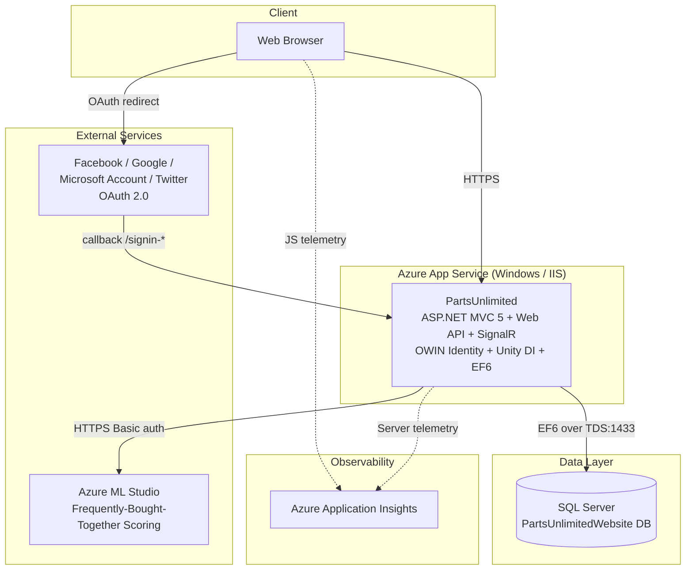

# Codebase Summary — PartsUnlimited Solution

## Solution Overview

| | |
|---|---|
| **Total Repositories Analyzed** | 1 |
| **Analysis Date** | 2026-05-12 |
| **Mode** | Single-repo (no `codebase-repos.md` repository list provided) |
| **Business Purpose** | Sample monolithic eCommerce application demonstrating ASP.NET MVC 5 / Web API / SignalR on Azure App Service. |

## Application Summary

### PartsUnlimited
- **Type**: Monolithic Web Application (ASP.NET MVC 5 + Web API + SignalR)
- **Language**: C#
- **Target Framework**: .NET Framework 4.5.1
- **Purpose**: eCommerce storefront — catalog browsing, shopping cart, orders, store rainchecks, recommendations (Azure ML), social login.
- **Main Dependencies**: ASP.NET MVC 5.2.3, Web API 5.2.3, SignalR 2.2.1, Identity 2.2.1, Entity Framework 6.1.3, Unity 4, Application Insights 2.2.0, Azure ML (HTTP)
- **Complete details**: [PartsUnlimited.md](./PartsUnlimited.md)

## General Solution Architecture

## Communication Matrix

### Inter-Service Communication

| Source | Target | Protocol | Type | Purpose |
|---|---|---|---|---|
| Browser | PartsUnlimited Web | HTTPS | REST/HTML | Catalog, cart, orders, account |
| Browser | PartsUnlimited SignalR | WebSocket / Long polling | RPC | (Disabled) Real-time announcements |
| PartsUnlimited Web | SQL Server | TDS (1433) | EF6 query | Read/write all transactional data |
| PartsUnlimited Web | Azure ML Studio | HTTPS POST | REST/JSON | Get product recommendations |
| PartsUnlimited Web | Application Insights | HTTPS | Telemetry | Logs, metrics, dependencies |
| Browser | Application Insights | HTTPS | Telemetry | Page views, JS exceptions |

### External Dependencies

| Internal Service | External Service | Type | Purpose | Criticality |
|---|---|---|---|---|
| PartsUnlimited Web | Azure ML scoring API | REST | Product recommendations | Low (feature-flagged) |
| PartsUnlimited Web | Facebook OAuth | OAuth 2.0 | External login | Low (optional) |
| PartsUnlimited Web | Google OAuth | OAuth 2.0 | External login | Low (optional) |
| PartsUnlimited Web | Microsoft Account OAuth | OAuth 2.0 | External login | Low (optional) |
| PartsUnlimited Web | Twitter OAuth | OAuth 2.0 | External login | Low (optional) |

## Shared Dependencies Analysis

### Azure Services Used

| Service | Type | Repositories Using It | Purpose | Modernization Target |
|---|---|---|---|---|
| Azure App Service (Websites) | PaaS Hosting | PartsUnlimited | Web hosting | Azure App Service (Linux, .NET 10) **or** Azure Container Apps |
| Application Insights | APM | PartsUnlimited | Telemetry | Application Insights with **Connection String** + auto-instrumentation |
| Azure ML Studio (classic) | ML Scoring | PartsUnlimited | Recommendations | **Azure ML v2** / Azure OpenAI (classic ML is retired) |
| (implicit) Azure SQL Database | Relational DB | PartsUnlimited | OLTP | **Azure SQL Database** with Entra auth + Managed Identity |

### Identified Architectural Patterns

#### 1. Monolithic MVC + Web API
- **Repositories**: PartsUnlimited
- **Description**: Single deployable serving HTML, JSON API, and SignalR hub
- **Cloud Considerations**: Maps cleanly to a single Azure App Service or single Container App revision

#### 2. Service Locator (via Unity)
- **Repositories**: PartsUnlimited
- **Description**: Dependencies resolved via static `Global.UnityContainer.Resolve<T>()` in OWIN startup
- **Cloud Considerations**: Anti-pattern; replace with constructor injection through `IServiceCollection` in .NET 10

#### 3. Repository / Query objects
- **Repositories**: PartsUnlimited (`OrdersQuery`, `RaincheckQuery`, `IPartsUnlimitedContext`)
- **Description**: Thin abstraction over EF6 `DbContext`
- **Cloud Considerations**: Translates directly to EF Core 9

#### 4. External recommendation engine (Strategy)
- **Repositories**: PartsUnlimited (`IRecommendationEngine` + `AzureMLFrequentlyBoughtTogetherRecommendationEngine`)
- **Description**: Pluggable recommendation backend behind an interface
- **Cloud Considerations**: Easy to swap to a modern Azure ML v2 / Azure OpenAI endpoint

### Technologies and Frameworks Used

| Technology | Version | Repositories | Purpose |
|---|---|---|---|
| C# | 6 | PartsUnlimited | Language |
| .NET Framework | 4.5.1 / 4.5.2 / 4.6.1 | PartsUnlimited | Runtime |
| ASP.NET MVC | 5.2.3 | PartsUnlimited | Web framework |
| ASP.NET Web API | 5.2.3 | PartsUnlimited | REST API |
| ASP.NET SignalR | 2.2.1 | PartsUnlimited | Real-time |
| ASP.NET Identity | 2.2.1 | PartsUnlimited | Auth |
| Entity Framework | 6.1.3 | PartsUnlimited | ORM |
| Unity | 4.0.1 | PartsUnlimited | DI |
| Application Insights | 2.2.0 | PartsUnlimited | APM |
| Newtonsoft.Json | 9.0.1 | PartsUnlimited | JSON |
| Bootstrap | 3.3.7 | PartsUnlimited | CSS |
| jQuery | 3.1.1 | PartsUnlimited | JS |
| MSTest | 1.0.8-rc2 | UnitTests, SeleniumTests | Test runner |
| Moq | 4.5.30 | UnitTests | Mocking |
| Selenium WebDriver | 3.0.1 | SeleniumTests | UI tests |

## Risk Analysis and Modernization Recommendations

### Identified Risks

#### High Impact
1. **Full System.Web dependency** (Global.asax, OWIN, WebConfigurationManager, bundling) — *all repositories: PartsUnlimited*
   - Not portable to .NET 10 / Kestrel; requires substantive rewrite of pipeline, auth, bundling.
   - **Recommendation**: SDK-style project, ASP.NET Core minimal hosting, ASP.NET Core Identity + `Microsoft.Identity.Web`.

2. **Hardcoded SQL `sa` credentials in `web.config`** — *PartsUnlimited*
   - Severe security issue in source control.
   - **Recommendation**: Remove from repo immediately; use Azure SQL with Entra auth + Managed Identity; secrets in Azure Key Vault.

3. **Dependency on retired Azure ML Studio (classic)** — *PartsUnlimited*
   - Service has been retired by Microsoft; recommendations feature is at risk.
   - **Recommendation**: Re-implement `IRecommendationEngine` against Azure ML v2, Azure AI Foundry, or Azure OpenAI.

#### Medium Impact
4. **EF6 + custom code-first initializer with massive seed data** — *PartsUnlimited*
   - Brittle, slow, and not idiomatic for cloud.
   - **Recommendation**: Migrate to EF Core 9 with proper migrations + idempotent seeder (`IHostedService`).

5. **Old front-end stack (Bootstrap 3, jQuery 3.1, Modernizr 2)** — *PartsUnlimited*
   - End-of-life, accessibility/security gaps.
   - **Recommendation**: Bootstrap 5, modern build pipeline (Vite/esbuild), drop Modernizr.

6. **Selenium tests broken** — *FabrikamFiber.SeleniumTests*
   - Marked `[Ignore]`, hardcoded dead URL, very old WebDriver.
   - **Recommendation**: Rewrite as Playwright with parameterized base URL.

#### Low Impact
7. **No CI/CD, no IaC, no Dockerfile** — *PartsUnlimited*
   - **Recommendation**: Add Bicep (AVM) for App Service / Azure SQL / Key Vault / App Insights / Log Analytics; add GitHub Actions or `azd` pipeline.

### Strategic Recommendations for Cloud Migration

#### Phase 1: Preparation (Short Term)
1. Remove the hardcoded SQL credentials from `web.config`; document required env vars/Key Vault secrets.
2. Externalize all configuration via `IConfiguration` (`appsettings.json` + env vars).
3. Capture the SQL schema for EF Core baseline.
4. Decide hosting target: **Azure App Service (Linux) for .NET 10** *(simplest)* or **Azure Container Apps** *(if containerization is a goal)*.

#### Phase 2: Code Modernization (Medium Term)
1. Convert all `.csproj` to SDK-style targeting `net10.0`.
2. Replace `Global.asax`/OWIN with ASP.NET Core `Program.cs` (minimal hosting).
3. Migrate Identity + external logins to ASP.NET Core Identity + `Microsoft.Identity.Web` (Entra ID where possible).
4. Migrate EF6 → EF Core 9 (retain SQL Server for now; target Azure SQL).
5. Migrate `Microsoft.AspNet.SignalR` → `Microsoft.AspNetCore.SignalR`.
6. Replace Unity with built-in MS DI.
7. Replace `System.Web.Optimization` with WebOptimizer or build-time bundler.
8. Re-implement `IRecommendationEngine` against the chosen modern AI service.
9. Update Application Insights to Connection String + auto-instrumentation.

#### Phase 3: Infrastructure & Validation (Long Term)
1. Author Bicep using **Azure Verified Modules**: App Service Plan, App Service (Linux), Azure SQL, Key Vault, Application Insights, Log Analytics, User-Assigned Managed Identity with RBAC.
2. Add a multi-stage Dockerfile (`mcr.microsoft.com/dotnet/aspnet:10.0`).
3. Add GitHub Actions or `azd` pipeline (build → test → IaC validate → deploy).
4. Re-enable & modernize SignalR + Selenium/Playwright tests.
5. Performance baseline + Application Insights alerts.

## Critical Dependencies

### Services Requiring High Availability
1. **PartsUnlimited Web** — single point of access to the entire application. Recommended SLA: 99.95% (single-region App Service Premium) or 99.99% (multi-region with Front Door).
2. **Azure SQL Database** — sole datastore. Recommended: Business Critical tier with zone redundancy, or General Purpose + geo-replica.

## Solution Metrics

### Repository Composition (approximate)
| Repository | Language | Projects | Lines of Code (rough) |
|---|---|---|---|
| PartsUnlimited | C# / Razor / JS | 4 | ~20–30k C# (incl. seed data) + bundled JS libraries |

### Overall Test Coverage
- Not measured. Practical coverage is **low**: ~6 unit-test classes, 1 ignored Selenium class, no integration tests.

## Appendices
- [PartsUnlimited.md](./PartsUnlimited.md) — Detailed per-repository assessment
