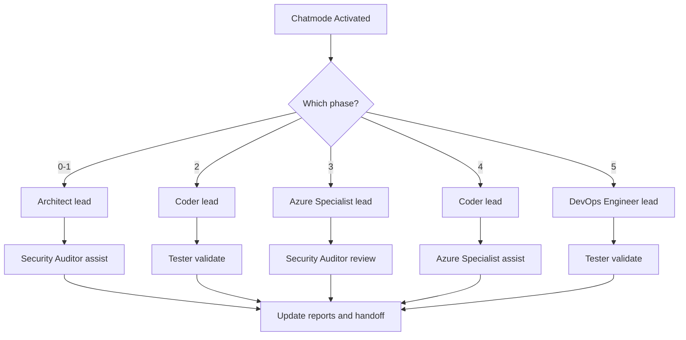
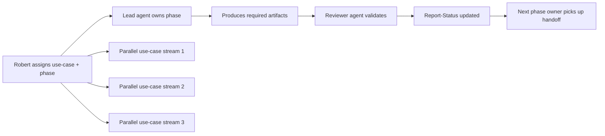
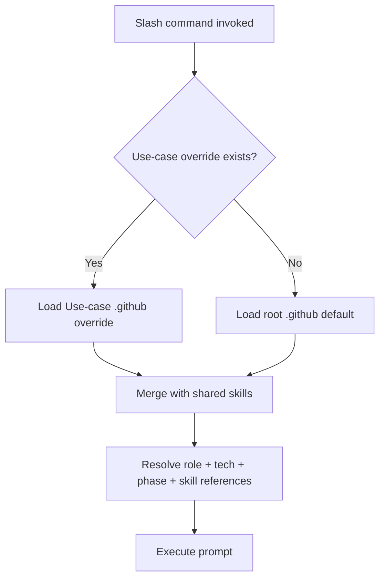
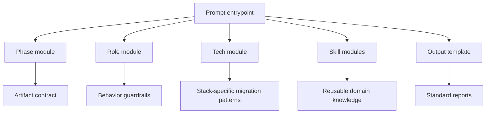
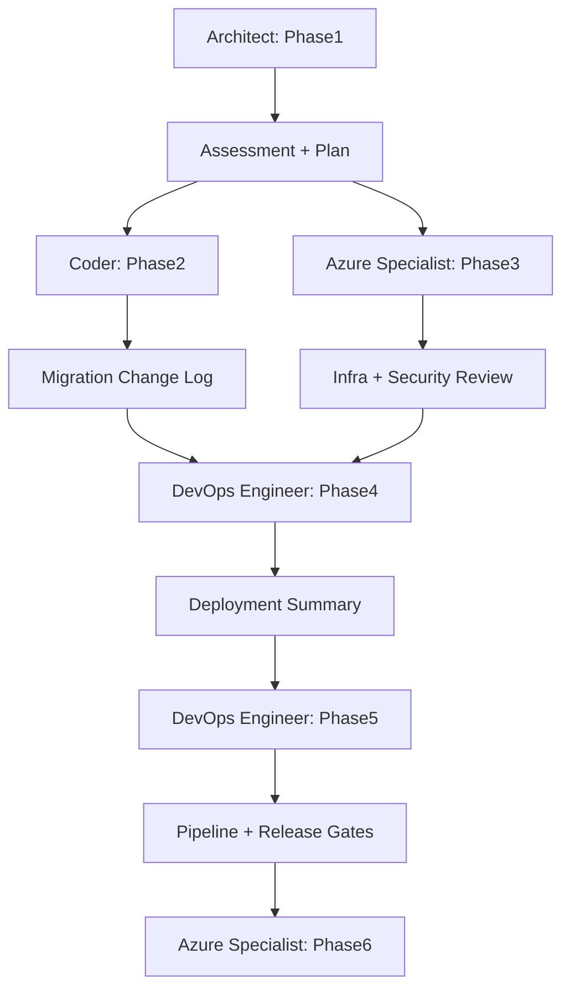

# Prompt & Skill Architecture

## Goal

Replace the flat prompt library with a modular, squad-aware system that keeps slash-command compatibility, supports reusable skills, and allows per-use-case overrides without duplicating 40KB+ prompt references.

## Design Principles

1. **Thin entrypoints, rich modules** — keep `.github/prompts/` as user-facing slash-command entrypoints, move reusable knowledge into modular libraries.
2. **Compose by role + phase + tech + skill** — every phase prompt is assembled from a predictable set of fragments.
3. **Squad-aware by default** — prompts declare a lead role, assisting roles, required artifacts, and handoff targets.
4. **Use-case overrides beat global defaults** — BookShop and future scenarios can replace only the files they need.
5. **Human docs stay small** — replace giant reference docs with indexed skill sheets and generated summaries.

---

## 1. Proposed Repository Layout

```text
.github/
├─ chatmodes/
│  ├─ Migration-Orchestrator.chatmode.md
│  ├─ Code-Migration-Modernization.chatmode.md        # Phase 2 specialist
│  ├─ Azure-Infrastructure.chatmode.md
│  ├─ Quick-Assessment.chatmode.md
│  ├─ Security-Review.chatmode.md
│  ├─ Cost-Optimization.chatmode.md
│  └─ Debug-Migration.chatmode.md
│
├─ prompts/                                           # thin slash-command entrypoints only
│  ├─ phase0-multirepoassessment.prompt.md
│  ├─ phase1-planandassess.prompt.md
│  ├─ phase2-migratecode.prompt.md
│  ├─ phase3-generateinfra.prompt.md
│  ├─ phase4-deploytoazure.prompt.md
│  ├─ phase5-setupcicd.prompt.md
│  ├─ phase6-postmigrationops.prompt.md
│  ├─ getstatus.prompt.md
│  ├─ quickassessment.prompt.md
│  ├─ databasemigration.prompt.md
│  ├─ securityhardening.prompt.md
│  ├─ costoptimization.prompt.md
│  └─ phase-rollback.prompt.md
│
├─ prompt-library/
│  ├─ phases/
│  │  ├─ phase0/
│  │  │  ├─ architect-multi-repo-core.md
│  │  │  ├─ repo-inventory-output.md
│  │  │  └─ risk-triage.md
│  │  ├─ phase1/
│  │  │  ├─ architect-assessment-core.md
│  │  │  ├─ assessment-report-output.md
│  │  │  └─ migration-plan-output.md
│  │  ├─ phase2/
│  │  │  ├─ coder-modernization-core.md
│  │  │  ├─ tester-validation-output.md
│  │  │  └─ migration-change-log-output.md
│  │  ├─ phase3/
│  │  │  ├─ azure-infra-core.md
│  │  │  ├─ bicep-output.md
│  │  │  ├─ terraform-output.md
│  │  │  └─ infra-security-review-output.md
│  │  ├─ phase4/
│  │  │  ├─ deployment-core.md
│  │  │  ├─ deployment-summary-output.md
│  │  │  └─ smoke-validation-output.md
│  │  ├─ phase5/
│  │  │  ├─ cicd-core.md
│  │  │  ├─ github-actions-output.md
│  │  │  ├─ azure-devops-output.md
│  │  │  └─ release-gates-output.md
│  │  └─ phase6/
│  │     ├─ post-migration-ops-core.md
│  │     └─ runbook-output.md
│  │
│  ├─ roles/
│  │  ├─ architect/
│  │  │  ├─ discovery-strategy.md
│  │  │  ├─ risk-assessment.md
│  │  │  └─ handoff-rules.md
│  │  ├─ coder/
│  │  │  ├─ refactor-guardrails.md
│  │  │  ├─ incremental-delivery.md
│  │  │  └─ preserve-behavior.md
│  │  ├─ tester/
│  │  │  ├─ smoke-test-matrix.md
│  │  │  ├─ validation-checklist.md
│  │  │  └─ docs-handoff.md
│  │  ├─ security-auditor/
│  │  │  ├─ threat-review.md
│  │  │  ├─ secret-handling.md
│  │  │  └─ least-privilege-review.md
│  │  ├─ azure-specialist/
│  │  │  ├─ hosting-selection.md
│  │  │  ├─ landing-zone-baseline.md
│  │  │  └─ operability-checks.md
│  │  ├─ devops-engineer/
│  │  │  ├─ pipeline-strategy.md
│  │  │  ├─ release-gates.md
│  │  │  └─ environment-promotion.md
│  │  └─ devrel/
│  │     ├─ report-clarity.md
│  │     ├─ operator-guides.md
│  │     └─ quickstart-updates.md
│  │
│  ├─ tech/
│  │  ├─ dotnet/
│  │  │  ├─ dotnet-discovery.md
│  │  │  ├─ webforms-to-aspnetcore.md
│  │  │  ├─ mvc-to-aspnetcore.md
│  │  │  ├─ wcf-to-rest.md
│  │  │  └─ entra-id-auth.md
│  │  ├─ java/
│  │  │  ├─ java-discovery.md
│  │  │  ├─ spring-boot-modernization.md
│  │  │  ├─ soap-to-rest.md
│  │  │  └─ entra-id-auth.md
│  │  ├─ nodejs/
│  │  │  ├─ node-discovery.md
│  │  │  ├─ express-modernization.md
│  │  │  ├─ nestjs-modernization.md
│  │  │  └─ entra-id-auth.md
│  │  └─ python/
│  │     ├─ python-discovery.md
│  │     ├─ flask-fastapi-modernization.md
│  │     ├─ django-modernization.md
│  │     └─ entra-id-auth.md
│  │
│  ├─ templates/
│  │  ├─ report-status.template.md
│  │  ├─ application-assessment.template.md
│  │  ├─ migration-change-log.template.md
│  │  ├─ deployment-summary.template.md
│  │  ├─ cicd-setup.template.md
│  │  └─ security-review.template.md
│  │
│  └─ routing/
│     ├─ phase-routing.md
│     ├─ chatmode-routing.md
│     └─ skill-selection-matrix.md
│
├─ skills/
│  ├─ azure/
│  │  ├─ azure-app-service.md
│  │  ├─ azure-container-apps.md
│  │  ├─ azure-kubernetes-service.md
│  │  ├─ azure-monitoring.md
│  │  ├─ key-vault-secrets.md
│  │  └─ managed-identity-rbac.md
│  ├─ infra/
│  │  ├─ bicep-modules.md
│  │  ├─ terraform-azure.md
│  │  ├─ private-networking.md
│  │  └─ tagging-naming.md
│  ├─ app/
│  │  ├─ docker-containerize.md
│  │  ├─ database-migration.md
│  │  ├─ config-externalization.md
│  │  ├─ wcf-to-rest.md
│  │  ├─ soap-to-rest.md
│  │  └─ entra-id-auth.md
│  ├─ delivery/
│  │  ├─ github-actions-azure.md
│  │  ├─ azure-devops-azure.md
│  │  ├─ rollout-strategies.md
│  │  └─ rollback-playbook.md
│  └─ governance/
│     ├─ security-review.md
│     ├─ cost-optimization.md
│     ├─ report-status.md
│     └─ artifact-handoff.md
│
└─ manifests/
   ├─ prompt-catalog.yml
   ├─ skill-catalog.yml
   └─ use-case-overrides.yml
```

### Why this shape works

- `.github/prompts/` stays slash-command friendly.
- The current repo uses root-level `skills/` plus specialist chatmodes as the live composition model.
- A future `.github/prompt-library/` may still become the authoring surface if the team later formalizes modular source files.
- Roles, tech guidance, and reusable skills can evolve independently.
- New tech stacks become additive, not disruptive.
- BookShop-sized docs become many small files instead of a single 45KB reference dump.

---

## 2. Thin Prompt Entrypoint Pattern

Each slash-command prompt becomes a small manifest-like entrypoint that declares composition and handoff.

### Example: `.github/prompts/phase2-migratecode.prompt.md`

```md
---
description: Modernize application code using role, tech, and skill composition.
tools: ['search/codebase', 'usages', 'problems', 'changes', 'runTests', 'edit/editFiles', 'runCommands', 'new']
model: Claude Sonnet 4.6 (copilot)
phase: phase2
lead: Coder
assist: [Tester]
tech: auto
includes:
  - ../prompt-library/phases/phase2/coder-modernization-core.md
  - ../prompt-library/roles/coder/refactor-guardrails.md
  - ../prompt-library/roles/coder/preserve-behavior.md
  - ../prompt-library/roles/tester/validation-checklist.md
  - ../skills/governance/report-status.md
requires:
  - reports/Application-Assessment-Report.md
outputs:
  - reports/Report-Status.md
  - reports/Migration-Change-Log.md
handoff:
  next: /phase3-generateinfra
---

@include ../prompt-library/phases/phase2/coder-modernization-core.md
@include ../prompt-library/roles/coder/refactor-guardrails.md
@include ../prompt-library/roles/coder/preserve-behavior.md
@include-if tech=dotnet ../prompt-library/tech/dotnet/dotnet-discovery.md
@include-if tech=dotnet ../prompt-library/tech/dotnet/wcf-to-rest.md
@include-if tech=java ../prompt-library/tech/java/spring-boot-modernization.md
@include-if skill=docker ../skills/app/docker-containerize.md
@include ../prompt-library/roles/tester/validation-checklist.md
@include ../skills/governance/report-status.md
```

### Composition rules

- **Phase files** define the workflow and outputs.
- **Role files** define how the agent behaves.
- **Tech files** define language/framework-specific migration patterns.
- **Skill files** define reusable knowledge chunks.
- **Templates** define expected artifact formats.

If native `@include` support is unavailable, keep the exact same structure but treat `includes:` as the canonical source-of-truth for a future prompt compiler.

---

## 3. Skill-Based Prompt Composition

### Core skill catalog

| Skill file | Used by | Purpose |
|---|---|---|
| `skills/azure-app-service.md` | Phase1, 3, 4 | Hosting choice, app settings, diagnostics, deployment gotchas |
| `skills/wcf-to-rest-api.md` | Phase1, 2 | WCF inventory, contract mapping, REST replacement patterns |
| `skills/azure-entra-id.md` | Phase1, 2, 3, 4 | Auth modernization, app registration, managed identity patterns |
| `skills/bicep-modules.md` | Phase3, 5 | Bicep layout, module boundaries, parameter strategy |
| `skills/terraform-azure.md` | Phase3, 5 | Azure Terraform module structure and state hygiene |
| `skills/docker-containerize.md` | Phase2, 4, 5 | Dockerfile, build/run scripts, runtime hardening |
| `skills/azure-sql-migration.md` | Phase1, 2, 3 | DB discovery, target fit, migration/cutover strategies |
| `skills/managed-identity.md` | Phase3, 4, 5 | Secretless auth and managed identity patterns |
| `skills/github-actions-cicd.md` | Phase5 | GitHub Actions pipeline templates and Azure login patterns |
| `skills/azure-devops-pipelines.md` | Phase5 | Azure DevOps pipeline structure and release gates |
| `skills/secret-management.md` | Phase1, 3, 4, 5 | Security controls, secret handling, and review checklist |
| `skills/cost-optimization.md` | Phase1, 3, 6 | Right-sizing, environment cost controls, scaling policy |

### Example composition by scenario

#### Phase2 + .NET WebForms + App Service

```yaml
phase: phase2
role: coder
skills:
  - skills/dotnet-framework-to-dotnet8.md
  - skills/webforms-to-razor.md
  - skills/config-transformation.md
  - skills/azure-entra-id.md
  - skills/azure-app-service.md
  - skills/migration-report-template.md
reviewers:
  - tester/validation-checklist.md
```

#### Phase3 + Java + Terraform + Container Apps

```yaml
phase: phase3
role: azure-specialist
skills:
  - skills/java8-to-java21.md
  - skills/terraform-azure.md
  - skills/azure-container-apps.md
  - skills/managed-identity.md
  - skills/azure-sql-migration.md
  - skills/secret-management.md
reviewers:
  - security-auditor/least-privilege-review.md
```

### Skill reference syntax

Use one of these patterns consistently:

1. **Frontmatter references** for machine-readable composition.
2. **`@include` lines** for human readability.
3. **`required-skills:` blocks** in chatmodes for dynamic selection.

That keeps skill reuse explicit and searchable.

---

## 4. Phase + Role Routing Model

## Primary routing table

| Phase | Primary prompt | Lead | Assists | Inputs | Outputs | Review gate |
|---|---|---|---|---|---|---|
| Phase0 | `phase0-multirepoassessment.prompt.md` | Architect | Security Auditor | `codebase-repos.md` | `reports/Repo-Portfolio-Assessment.md` | Repo complexity scored |
| Phase1 | `phase1-planandassess.prompt.md` | Architect | Azure Specialist + Security Auditor | repo + user preferences | `reports/Application-Assessment-Report.md`, `reports/Report-Status.md`, `reports/Migration-Plan.md` | risks, target platform, IaC chosen |
| Phase2 | `phase2-migratecode.prompt.md` | Coder | Tester + Database Specialist | assessment + plan | modernized app, `reports/Migration-Change-Log.md`, updated status | build + smoke validation |
| Phase3 | `phase3-generateinfra.prompt.md` | Azure Specialist | DevOps Engineer + Security Auditor + Observability Engineer | assessment + modernized app | `infra/`, `azure.yaml`, `reports/Infra-Plan.md` | IaC validation + security review |
| Phase4 | `phase4-deploytoazure.prompt.md` | DevOps Engineer | Azure Specialist + Cutover Commander + Observability Engineer | validated app + infra | deployment artifacts, `reports/Deployment-Summary.md` | deployment + health checks |
| Phase5 | `phase5-setupcicd.prompt.md` | DevOps Engineer | Tester + Security Auditor | deployed app + infra | workflows/pipelines, `reports/CICD-Setup-Report.md` | pipeline green + rollback readiness |
| Phase6 | `phase6-postmigrationops.prompt.md` | Observability Engineer | Azure Specialist + Performance Engineer + Security Auditor | deployed app + telemetry | runbooks, alerts, ops report | monitor/ops baseline |
| Cross-cutting | `securityhardening.prompt.md` | Security Auditor | Azure Specialist + Cutover Commander | any phase outputs | `reports/Security-Audit-Report.md`, `reports/Security-Go-NoGo.md` | critical findings closed |
| Cross-cutting | `getstatus.prompt.md` | Tester | — | all reports | status dashboard | artifact freshness verified |

### Chatmode dispatch behavior

Each chatmode should dispatch by **phase** and **artifact readiness**, not by hardcoded monolithic instructions.



### Dispatch contract inside chatmodes

Each chatmode should declare:

- `leadRole`
- `assistRoles`
- `entryPrompts`
- `requiredArtifacts`
- `producedArtifacts`
- `handoffPhase`
- `reviewPhase`

This makes routing inspectable by both humans and automation.

---

## 5. Multiple Chatmodes

The monolith is replaced by a **master orchestrator** plus narrow specialist chatmodes.

### `Migration-Orchestrator.chatmode.md`

```yaml
---
description: Master squad-aware migration coordinator for multi-phase and multi-app Azure modernization.
tools: ['search/codebase', 'usages', 'runCommands', 'runTests', 'edit/editFiles', 'new', 'Azure MCP/*', 'Microsoft Docs/*']
model: Claude Sonnet 4.6 (copilot)
leadRole: Architect
assistRoles: [Coder, Tester, Azure-Specialist, DevOps-Engineer, Observability-Engineer, Database-Specialist, Performance-Engineer, Security-Auditor, Evaluator, Cutover-Commander, Scribe]
entryPrompts: [/phase0-multirepoassessment, /phase1-planandassess, /phase2-migratecode, /phase3-generateinfra, /phase4-deploytoazure, /phase5-setupcicd, /phase6-postmigrationops, /quickassessment, /databasemigration, /securityhardening, /costoptimization, /phase-rollback, /getstatus]
requiredArtifacts: []
producedArtifacts: [reports/Report-Status.md, reports/Application-Assessment-Report.md, PORTFOLIO.md]
---
```

- Owns routing, gates, handoffs, and portfolio visibility.
- Knows all 12 agents and all 13 entry prompts.
- Composes skills instead of embedding every technology rule.
- Validates gate readiness before allowing the next phase.
- Explains the shift from prompting to orchestration.

### `Code-Migration-Modernization.chatmode.md`

```yaml
---
description: Phase2 mode for code migration, framework upgrades, refactors, and modernization validation.
tools: ['search/codebase', 'usages', 'vscodeAPI', 'problems', 'changes', 'testFailure', 'runCommands/terminalSelection', 'runCommands/terminalLastCommand', 'fetch', 'search/searchResults', 'githubRepo', 'extensions', 'runTests', 'edit/editFiles', 'search', 'new', 'runCommands', 'runTasks', 'Microsoft Docs/*']
model: Claude Sonnet 4.6 (copilot)
leadRole: Coder
assistRoles: [Tester, Database-Specialist, Performance-Engineer, Security-Auditor]
entryPrompts: [/phase2-migratecode, /databasemigration]
requiredArtifacts: [reports/Application-Assessment-Report.md, reports/Report-Status.md]
producedArtifacts: [reports/Migration-Change-Log.md, reports/Report-Status.md]
---
```

- Focuses on incremental code changes only.
- Selects tech-specific migration fragments by detected stack.
- Pulls auth, database, and containerization skills only when needed.
- Always hands validation to Tester before Phase3.
- Keeps infra/deployment guidance out of the core prompt.

### `Azure-Infrastructure.chatmode.md`

```yaml
---
description: Phase3 mode for Azure architecture, IaC generation, identity, networking, and observability setup.
tools: ['search/codebase', 'runCommands', 'edit/editFiles', 'new', 'Azure MCP/*', 'Microsoft Docs/*']
model: Claude Sonnet 4.6 (copilot)
leadRole: Azure-Specialist
assistRoles: [DevOps-Engineer, Security-Auditor, Observability-Engineer]
entryPrompts: [/phase3-generateinfra]
requiredArtifacts: [reports/Application-Assessment-Report.md, reports/Report-Status.md]
producedArtifacts: [infra/, azure.yaml, reports/Infra-Plan.md, reports/Report-Status.md]
---
```

- Dedicated to hosting selection, IaC, and cloud controls.
- Splits Bicep and Terraform using reusable infra skills.
- Aligns outputs with deployment and CI/CD expectations.
- Requires identity and security review before handoff.
- Produces deployable artifacts, not runtime fixes.

### Future backlog: `Azure-Deployment.chatmode.md`

```yaml
---
description: Phase4 and Phase5 mode for deployment, release validation, and CI/CD setup.
tools: ['runCommands', 'runTasks', 'runTests', 'edit/editFiles', 'new', 'Azure MCP/*', 'Microsoft Docs/*']
model: Claude Sonnet 4.6 (copilot)
leadRole: Coder
assistRoles: [Azure-Specialist, DevOps-Engineer, Tester]
entryPrompts: [/phase4-deploytoazure, /phase5-setupcicd, /phase-rollback]
requiredArtifacts: [infra/, reports/Report-Status.md]
producedArtifacts: [reports/Deployment-Summary.md, reports/CICD-Setup-Report.md]
---
```

- Covers deploy, validate, automate.
- Treats CI/CD as release engineering, not prompt sprawl.
- Pulls rollback and rollout skills only when deployment is in play.
- Uses Tester for smoke gates and Azure Specialist for platform issues.
- Produces operator-ready deployment artifacts.

### `Debug-Migration.chatmode.md`

```yaml
---
description: Root-cause mode for failures across build, runtime, infrastructure, deployment, and configuration drift.
tools: ['search/codebase', 'problems', 'testFailure', 'runCommands', 'runTasks', 'edit/editFiles', 'Azure MCP/*', 'Microsoft Docs/*']
model: Claude Sonnet 4.6 (copilot)
leadRole: Coder
assistRoles: [Tester, Azure-Specialist]
entryPrompts: [/getstatus, /phase2-migratecode, /phase3-generateinfra, /phase4-deploytoazure, /phase-rollback]
requiredArtifacts: [reports/Report-Status.md]
producedArtifacts: [reports/Migration-Debug-Log.md]
---
```

- Starts from the failing artifact and phase.
- Chooses the narrowest recovery path first.
- Avoids re-running the whole migration when a scoped fix is enough.
- Can jump back into a phase-specific mode after diagnosis.
- Maintains an evidence-first debug log.

### `Quick-Assessment.chatmode.md`

```yaml
---
description: 5-minute triage mode for rapid modernization feasibility and next-step recommendation.
tools: ['search/codebase', 'search/searchResults', 'runCommands', 'new']
model: Claude Sonnet 4.6 (copilot)
leadRole: Architect
assistRoles: []
entryPrompts: [/quickassessment]
requiredArtifacts: []
producedArtifacts: [reports/Quick-Assessment-Report.md, reports/Report-Status.md]
---
```

- Performs a fast scan, not a full plan.
- Optimized for go/no-go and effort sizing.
- Useful before assigning work across the team.
- Can escalate into Phase1 when confidence is high.
- Keeps output small and decision-oriented.

### `Security-Review.chatmode.md`

```yaml
---
description: Security-focused review mode for identity, secrets, network posture, dependency risks, and release readiness.
tools: ['search/codebase', 'usages', 'runCommands', 'edit/editFiles', 'new', 'Azure MCP/*', 'Microsoft Docs/*']
model: Claude Sonnet 4.6 (copilot)
leadRole: Security-Auditor
assistRoles: [Architect, Azure-Specialist, Cutover-Commander]
entryPrompts: [/securityhardening, /phase-rollback, /getstatus]
requiredArtifacts: [reports/Report-Status.md]
producedArtifacts: [reports/Security-Audit-Report.md, reports/Security-Go-NoGo.md, reports/Report-Status.md]
---
```

- Dedicated to security posture, not feature delivery.
- Reuses least-privilege, secret handling, and threat-review skills.
- Can be invoked between any two phases as a gate.
- Produces a decision-ready findings report.
- Keeps architecture and implementation prompts lighter.

### `Cost-Optimization.chatmode.md`

```yaml
---
description: Azure cost analysis mode for right-sizing, scaling policy, environment design, and spend reduction opportunities.
tools: ['search/codebase', 'runCommands', 'edit/editFiles', 'new', 'Azure MCP/*', 'Microsoft Docs/*']
model: Claude Sonnet 4.6 (copilot)
leadRole: Azure-Specialist
assistRoles: [Performance-Engineer, Observability-Engineer]
entryPrompts: [/costoptimization, /phase6-postmigrationops, /getstatus]
requiredArtifacts: [reports/Report-Status.md]
producedArtifacts: [reports/Cost-Optimization-Report.md, reports/Report-Status.md]
---
```

- Focuses only on spend, capacity, and scaling.
- Reuses hosting and environment baseline skills.
- Helps Robert compare deployment options across use-cases.
- Fits both pre-deploy estimation and post-deploy tuning.
- Keeps cost guidance out of the main migration flow.

---

## 6. Team Workflow for Robert's Team

## Phase ownership

| Team member | Owns | Primary artifacts | Review partner |
|---|---|---|---|
| Architect | Phase0-1 | `Application-Assessment-Report.md`, `Migration-Plan.md` | Security Auditor |
| Coder | Phase2, 4 | modernized app, `Migration-Change-Log.md`, `Deployment-Summary.md` | Tester / Azure Specialist |
| Azure Specialist | Phase3, 4, cost review | `infra/`, `azure.yaml`, deployment guidance, cost posture | Security Auditor |
| DevOps Engineer | Phase5 | workflows, pipeline docs, release gates | Tester |
| Observability Engineer | Phase6 | runbooks, alerts, ops baselines | Security Auditor |
| Security Auditor | Gate reviews | `Security-Audit-Report.md`, `Security-Go-NoGo.md` | Architect |
| DevRel | User-facing docs | quickstarts, use-case notes, handoff docs | Tester |

## Artifact-based handoff

Every phase hands off a **minimal artifact contract**:

| From | To | Required handoff artifacts |
|---|---|---|
| Phase1 | Phase2 | `Application-Assessment-Report.md`, `Migration-Plan.md`, `Report-Status.md` |
| Phase1 | Phase3 | target platform + IaC decision + security risks |
| Phase2 | Phase3 | modernized app structure + runtime/config needs |
| Phase3 | Phase4 | `infra/`, `azure.yaml`, secrets/identity plan, validation notes |
| Phase4 | Phase5 | deployment topology, env names, smoke test script |
| Phase5 | Phase6 | pipeline URLs, environment model, rollback path, alert ownership |

### Recommended `reports/` structure

```text
reports/
├─ Report-Status.md
├─ Quick-Assessment-Report.md
├─ Application-Assessment-Report.md
├─ Migration-Plan.md
├─ Migration-Change-Log.md
├─ Infra-Plan.md
├─ Deployment-Summary.md
├─ CICD-Setup-Report.md
├─ Security-Audit-Report.md
├─ Security-Go-NoGo.md
├─ Cost-Optimization-Report.md
└─ handoffs/
   ├─ phase1-to-phase2.md
   ├─ phase2-to-phase3.md
   ├─ phase3-to-phase4.md
   └─ phase4-to-phase5.md
```

### Status tracking model

Keep two layers:

1. **Human-readable:** `reports/Report-Status.md`
2. **Machine-readable:** `reports/status.json`

Suggested `status.json` shape:

```json
{
  "useCase": "05-BookShop",
  "phase": "phase3",
  "owner": "Azure Specialist",
  "status": "in-review",
  "inputsReady": true,
  "outputsReady": false,
  "reviewers": ["Security Auditor"],
  "updatedAt": "2026-05-28T00:00:00Z"
}
```

This lets Robert see who owns what, what is blocked, and which handoff is next.

### Parallel team execution

Robert can run work in parallel across **use-cases** and **phases**:

- Team member A handles BookShop Phase2.
- Team member B handles BusReservation Phase1.
- Team member C handles PartsUnlimited Phase3.
- Security review can run in parallel against any phase output artifact.
- DevRel can prepare docs once Phase1 or Phase3 stabilizes.



---

## 7. Per-Use-Case Customization

Use-case folders can override any global prompt, skill, template, or route without forking the whole system.

### Proposed override structure

```text
Use-cases/05-BookShop/
├─ .github/
│  ├─ prompts/
│  │  ├─ phase1-planandassess.prompt.md
│  │  ├─ phase2-migratecode.prompt.md
│  │  └─ getstatus.prompt.md
│  ├─ skills/
│  │  ├─ app/
│  │  │  ├─ bookshop-catalog-migration.md
│  │  │  └─ bookshop-sql-migration.md
│  │  └─ azure/
│  │     └─ bookshop-app-service-topology.md
│  ├─ prompt-library/
│  │  ├─ tech/
│  │  │  └─ dotnet/
│  │  │     └─ bookshop-webforms-to-razor.md
│  │  └─ templates/
│  │     └─ application-assessment.template.md
│  └─ manifests/
│     └─ overrides.yml
├─ docs/
│  ├─ modernization/
│  │  ├─ prompt-index.md
│  │  └─ architecture-notes.md
│  └─ runbooks/
└─ reports/
```

### Override precedence



### Override rules

- **Override prompts only when the workflow changes.**
- **Override skills when the knowledge changes.**
- **Override templates when the output format changes.**
- **Never clone the entire root library unless a use-case is intentionally diverging.**

### BookShop example

BookShop should not keep a giant reference manual. Instead:

- `bookshop-webforms-to-razor.md` captures UI-specific migration patterns.
- `skills/azure-sql-migration.md` captures schema and data migration patterns that BookShop can extend with use-case-specific notes.
- `skills/azure-app-service.md` captures the baseline target hosting decision that BookShop can override if needed.
- `docs/modernization/prompt-index.md` points to the small set of BookShop-specific overrides.

---

## 8. Relationship Diagrams

### Prompt composition model



### Chatmode to prompt routing

```mermaid
graph LR
    CM0[Migration-Orchestrator] --> P0[/phase0-multirepoassessment]
    CM0 --> P1[/phase1-planandassess]
    CM1[Code-Migration-Modernization] --> P2[/phase2-migratecode]
    CM2[Azure-Infrastructure] --> P3[/phase3-generateinfra]
    CM0 --> P4[/phase4-deploytoazure]
    CM0 --> P5[/phase5-setupcicd]
    CM3[Debug-Migration] --> PX[Cross-phase recovery]
    CM4[Security-Review] --> PS[/securityhardening]
    CM5[Cost-Optimization] --> PC[/costoptimization]
```

### Team handoff model



---

## 9. Migration Path from Current State

### Step 1 — Stabilize names

- Keep current slash commands.
- Rename files to consistent lowercase slash-command-friendly names.
- Keep `Code-Migration-Modernization.chatmode.md` as the active Phase 2 specialist while preserving the familiar filename.

### Step 2 — Extract reusable modules

- Move monolithic rules into `prompt-library/phases`, `roles`, `tech`, and `skills`.
- Start with Phase1, Phase2, and Phase3 because they carry the most duplication.

### Step 3 — Split chatmodes

- Create the 8 specialized chatmodes.
- Route each to the correct phase entrypoints.
- Keep debug/security/cost modes independent from the happy-path flow.

### Step 4 — Add use-case overrides

- Start with BookShop.
- Replace large reference docs with small override skills and a prompt index.
- Validate that only BookShop-specific files live under `Use-cases/05-BookShop/.github/`.

### Step 5 — Add team-status discipline

- Require every phase to update `Report-Status.md` and `status.json`.
- Add handoff files under `reports/handoffs/`.
- Use reviewer gates before phase completion.

---

## 10. Recommended First Wave of Files to Create

1. `.github/chatmodes/Migration-Orchestrator.chatmode.md`
2. `.github/chatmodes/Code-Migration-Modernization.chatmode.md`
3. `.github/chatmodes/Azure-Infrastructure.chatmode.md`
4. `.github/chatmodes/Quick-Assessment.chatmode.md`
5. `.github/chatmodes/Security-Review.chatmode.md`
6. `.github/chatmodes/Cost-Optimization.chatmode.md`
7. `.github/chatmodes/Debug-Migration.chatmode.md`
8. `.github/prompt-library/phases/phase1/architect-assessment-core.md`
9. `.github/prompt-library/phases/phase2/coder-modernization-core.md`
10. `.github/prompt-library/phases/phase3/azure-infra-core.md`
11. `.github/prompt-library/roles/architect/discovery-strategy.md`
12. `.github/prompt-library/roles/coder/refactor-guardrails.md`
13. `.github/prompt-library/roles/tester/validation-checklist.md`
14. `.github/prompt-library/skills/app/wcf-to-rest.md`
15. `.github/prompt-library/skills/app/entra-id-auth.md`
16. `.github/prompt-library/skills/infra/bicep-modules.md`
17. `.github/prompt-library/skills/infra/terraform-azure.md`
18. `Use-cases/05-BookShop/.github/prompt-library/tech/dotnet/bookshop-webforms-to-razor.md`
19. `Use-cases/05-BookShop/.github/manifests/overrides.yml`
20. `reports/status.json`

## Final recommendation

Keep the slash commands. Kill the monolith. Author prompts as composable building blocks with explicit role routing, artifact contracts, and use-case overrides.
