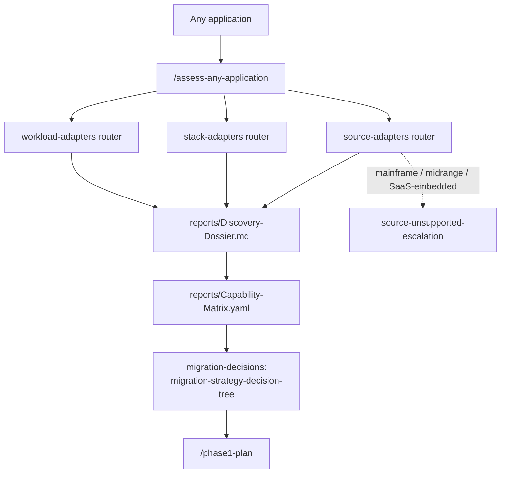
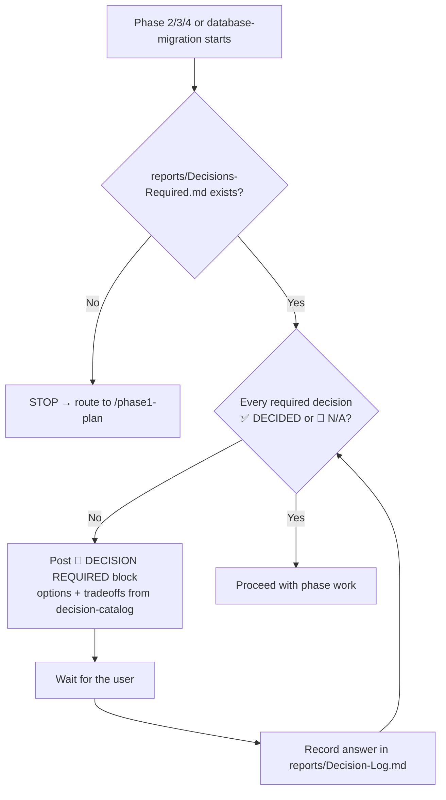
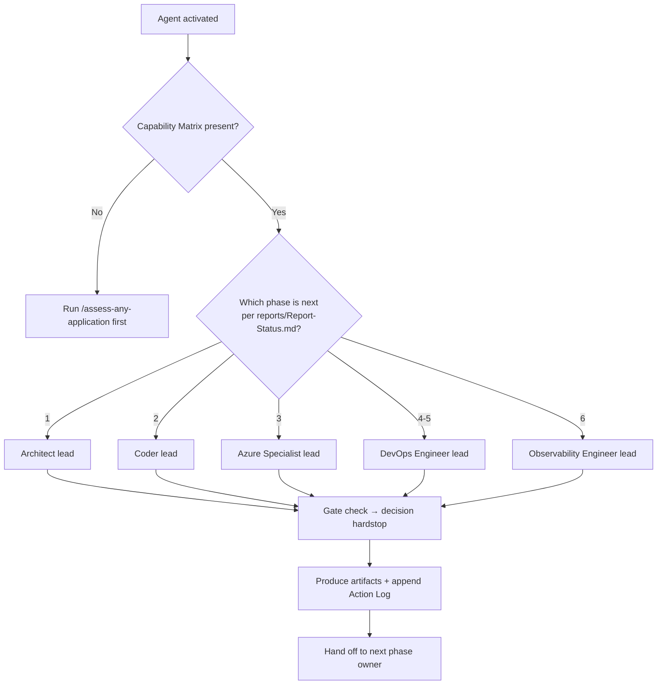
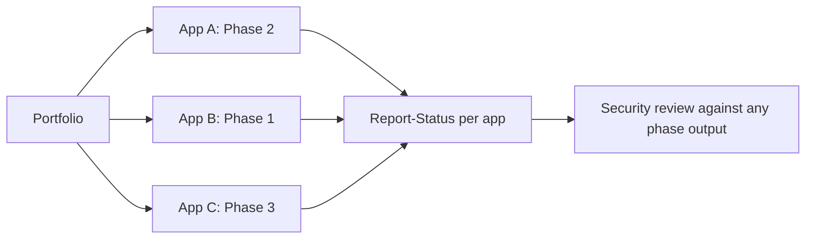
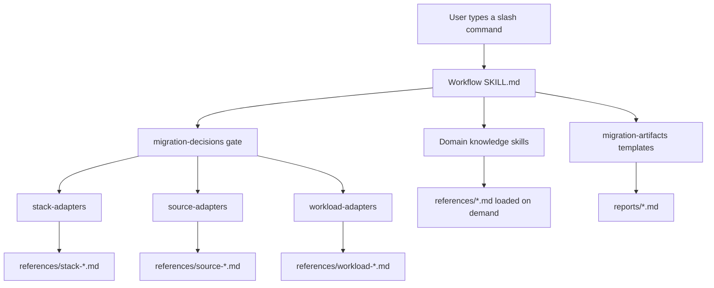
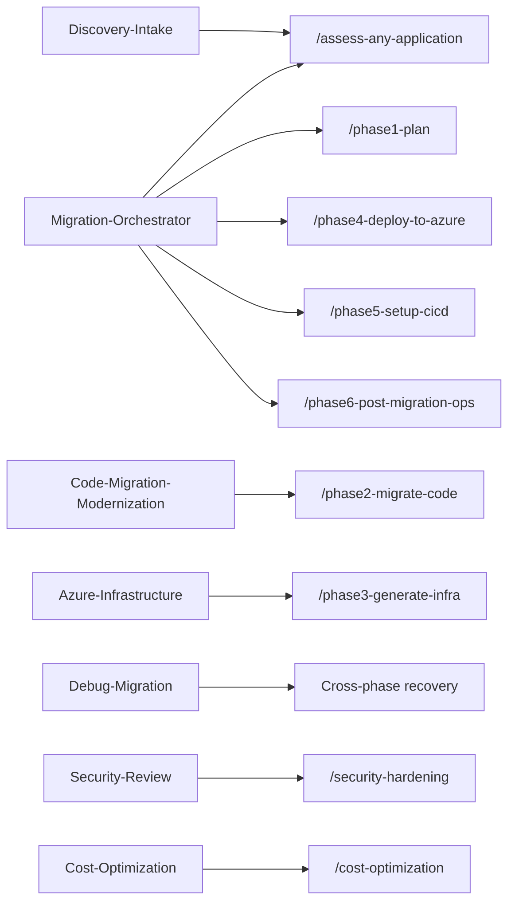
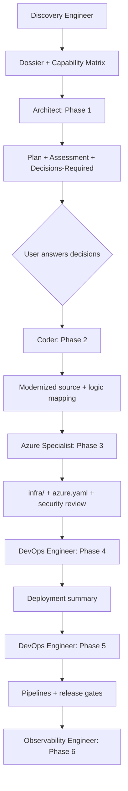

# Architecture

How the universal Azure migration tool is put together: skills, custom agents, hooks, and artifact contracts.

## Goal

Make a migration reproducible for **any application** — any source environment, any stack, any workload — without stuffing 40 KB of technology guidance into a single instruction file. The system does that by splitting knowledge into small, independently loadable **skills**, and by splitting behaviour into narrow **custom agents**.

## Design principles

1. **Thin entrypoints, rich references.** A `SKILL.md` is short and routes to `references/` files only when they are actually needed.
2. **Classify once, consume many times.** Discovery produces a Capability Matrix. Every later phase reads it instead of re-detecting the stack.
3. **Universal by default.** No step assumes .NET or Java. Stack, source, and workload are all resolved through routers.
4. **Architecture decisions belong to the user.** The agent lays out options with tradeoffs and blocks until the user chooses.
5. **Artifacts are the handoff.** A phase is done when its artifact exists and the status file says so — not when the chat says "looks good".
6. **Out-of-scope work gets escalated, not faked.** Mainframe, midrange, and SaaS-embedded code route to a specialist-partner playbook.

---

## 1. Repository layout

```text
.github/
├─ agents/                                  # 8 custom agents — persona, tools, routing posture
│  ├─ Migration-Orchestrator.agent.md
│  ├─ Code-Migration-Modernization.agent.md
│  ├─ Discovery-Intake.agent.md
│  ├─ Azure-Infrastructure.agent.md
│  ├─ Quick-Assessment.agent.md
│  ├─ Security-Review.agent.md
│  ├─ Cost-Optimization.agent.md
│  └─ Debug-Migration.agent.md
│
├─ skills/                                  # 36 skills, each a folder with a SKILL.md
│  │
│  │  ── 20 workflow skills (user-invocable: true) ──
│  ├─ assess-any-application/SKILL.md
│  ├─ phase1-plan/SKILL.md
│  ├─ phase2-migrate-code/SKILL.md
│  ├─ phase3-generate-infra/SKILL.md
│  ├─ phase4-deploy-to-azure/SKILL.md
│  ├─ phase5-setup-cicd/SKILL.md
│  ├─ phase6-post-migration-ops/SKILL.md
│  ├─ build-migration-plan/SKILL.md
│  ├─ quick-assessment/SKILL.md
│  ├─ quick-triage/SKILL.md
│  ├─ interactive-migration-interview/SKILL.md
│  ├─ team-skill-assessment/SKILL.md
│  ├─ portfolio-strategy/SKILL.md
│  ├─ phase0-multi-repo-assessment/SKILL.md
│  ├─ database-migration/SKILL.md
│  ├─ security-hardening/SKILL.md
│  ├─ cost-optimization/SKILL.md
│  ├─ phase-rollback/SKILL.md
│  ├─ get-status/SKILL.md
│  └─ skill-creator/
│     ├─ SKILL.md
│     └─ references/{skill-anatomy,skill-template}.md
│  │
│  │  ── 16 knowledge skills (user-invocable: false) ──
│  ├─ stack-adapters/
│  │  ├─ SKILL.md
│  │  └─ references/                        # 15: stack-detection + 14 stack adapters
│  ├─ source-adapters/
│  │  ├─ SKILL.md
│  │  └─ references/                        # 10: 9 source adapters + unsupported escalation
│  ├─ workload-adapters/
│  │  ├─ SKILL.md
│  │  └─ references/                        # 8 workload patterns
│  ├─ migration-decisions/
│  │  ├─ SKILL.md
│  │  └─ references/                        # decision-hardstop, decision-catalog,
│  │                                        # decisions-required-template,
│  │                                        # migration-strategy-decision-tree
│  ├─ migration-artifacts/
│  │  ├─ SKILL.md
│  │  └─ references/                        # dossier/matrix/plan/report templates,
│  │                                        # action-log-format, migration-handoff
│  ├─ azure-security-baseline/references/   # 8 security references
│  ├─ azure-infrastructure/references/      # bicep-modules, app-service, container-apps
│  ├─ azure-containerization/references/    # docker-containerize
│  ├─ dotnet-modernization/references/      # 4 .NET modernization references
│  ├─ java-modernization/references/        # java8-to-java21
│  ├─ wcf-to-rest-migration/
│  │  ├─ references/                        # wcf-to-rest-api
│  │  └─ templates/WcfMigrationGuide.md
│  ├─ config-transformation/references/     # config-transformation-patterns
│  ├─ migration-strategy-report/
│  │  ├─ README.md
│  │  └─ references/                        # 7 deck-rendering references
│  ├─ business-logic-mapping/
│  │  ├─ SKILL.md
│  │  └─ examples/Business-Logic-Mapping-Template.md
│  ├─ migration-unit-testing/SKILL.md
│  └─ rollback-strategy/SKILL.md
│
├─ hooks/                                   # orchestration rules read by the agents
│  ├─ decision-gates.md
│  ├─ phase-gates.md
│  ├─ quality-checklist.md
│  ├─ session-lifecycle.json
│  ├─ validation.json
│  └─ scripts/                              # auto-validate, load-migration-state,
│                                           # update-status-report (.ps1 + .sh)
│
├─ java-upgrade/                            # GitHub Copilot app-modernization tool scaffolding
├─ modernize/                               # (external tooling, not part of the skill system)
│
├─ workflows/                               # repo CI
├─ README.md                                # contributor notes for .github/
└─ copilot-instructions.md                  # top-level rules applied to every interaction
```

There is **no `.github/prompts/` folder and no `.github/chatmodes/` folder.** VS Code deprecated prompt files for Agent Host sessions, so every prompt became a workflow skill and every chat mode became a custom agent. See the [VS Code Agent Skills documentation](https://code.visualstudio.com/docs/agent-customization/agent-skills).

### Why this shape works

- One folder per skill means a skill can be added, versioned, or deleted without touching anything else.
- `SKILL.md` stays small; `references/` absorbs the depth. 36 skills and 71 reference files still fit a normal context window.
- New stacks, sources, and workloads are **additive** — drop a reference into the matching router and add one selection-table row.
- Custom agents stay thin because they delegate procedure to skills instead of embedding it.
- The VS Code extension bundles `.github/{agents,skills,hooks,copilot-instructions.md}` verbatim, so what you read here is what ships.

---

## 2. Skill anatomy

```text
.github/skills/<skill-name>/
├─ SKILL.md              # always loaded when the skill matches
└─ references/           # optional, loaded on demand
```

`SKILL.md` frontmatter:

| Field | Meaning |
|---|---|
| `name` | Skill identifier. For workflow skills this is also the slash command. |
| `description` | When the skill applies. The only text the model sees before deciding to load the skill — so it carries all the trigger evidence. |
| `user-invocable` | `true` → shows in the `/` menu. `false` → knowledge-only. |
| `disable-model-invocation` | `true` on 19 of the 20 workflow skills, so the model cannot silently start a phase the user did not ask for. `skill-creator` is the exception. |
| `argument-hint` | Optional placeholder shown next to the slash command. |

### Progressive disclosure

This is the core mechanic. A router `SKILL.md` contains a **selection table** mapping evidence to a reference file, and nothing more:

```md
| Detected signal or evidence | Read this reference |
|---|---|
| `*.sln`, `*.csproj`, `web.config`, `*.aspx`, `*.svc`, `System.Web` | `references/stack-dotnet.md` |
| `pom.xml`, `build.gradle`, `WEB-INF/`, `*.war`, Spring, Jakarta EE | `references/stack-java.md` |
| `package.json`, npm/yarn/pnpm lockfiles, Express, NestJS, Next.js | `references/stack-nodejs.md` |
```

The agent reads the table, opens **one** reference, and leaves the other 13 unread. Adding a 15th stack costs one file and one row — it does not make every other migration more expensive.

### Example composition — Phase 2 on a .NET WebForms app

```yaml
workflow skill:  phase2-migrate-code
auto-loaded:
  - migration-decisions           # gate: must be ✅ DECIDED before any edit
  - migration-artifacts           # action-log format, handoff contract
  - stack-adapters                # → references/stack-dotnet.md
  - workload-adapters             # → references/workload-webapp.md
  - dotnet-modernization          # → references/webforms-to-razor.md
                                  # → references/dotnet-framework-to-dotnet8.md
  - config-transformation         # → references/config-transformation-patterns.md
  - business-logic-mapping        # → reports/Business-Logic-Mapping.md
  - migration-unit-testing        # regression proof
```

### Example composition — Phase 3 for a Java service on Container Apps

```yaml
workflow skill:  phase3-generate-infra
auto-loaded:
  - migration-decisions           # gate: hosting + IaC tool must be decided
  - stack-adapters                # → references/stack-java.md
  - workload-adapters             # → references/workload-api-service.md
  - azure-containerization        # → references/docker-containerize.md
  - azure-infrastructure          # → references/azure-container-apps.md
                                  # → references/bicep-modules.md
  - azure-security-baseline       # → references/managed-identity.md
                                  # → references/secret-management.md
```

Neither example hardcodes a framework version. The version target comes from `reports/Decisions-Required.md`.

---

## 3. The universal discovery contract

Nothing downstream re-classifies the application. Discovery does it once, with evidence.


```mermaid
graph TD
    S[Any application] --> D["/assess-any-application"]
    D --> SR[source-adapters router]
    D --> KR[stack-adapters router]
    D --> WR[workload-adapters router]
    SR --> DD[reports/Discovery-Dossier.md]
    KR --> DD
    WR --> DD
    DD --> CM[reports/Capability-Matrix.yaml]
    CM --> T[migration-decisions:<br/>migration-strategy-decision-tree]
    T --> P["/phase1-plan"]
    SR -.mainframe / midrange / SaaS-embedded.-> E[source-unsupported-escalation]
```

| Router | Resolves | Reference count |
|---|---|---:|
| `source-adapters` | Where the app lives today: on-premise, AWS, GCP, Oracle, VMware/RVTools, Kubernetes cluster, container registry, GitHub repo, ZIP/filesystem | 10 |
| `stack-adapters` | Language and runtime: .NET, Java, Python, Node.js, PHP, Ruby, Go, Perl, Rust, Scala/Kotlin, C++ (Windows), Delphi/VB6, PowerBuilder, Oracle Forms — plus `stack-detection` for unknown/polyglot | 15 |
| `workload-adapters` | How it runs: web app, API service, batch job, data pipeline, event-driven, serverless, desktop client-server, packaged app | 8 |

Every classification carries `evidence_confidence: high | medium | low`. A `low` on a field that a later phase depends on is a planning risk, not a silent assumption.

### Out of scope — by design

`source-adapters/references/source-unsupported-escalation.md` is the terminal route for:

- **Mainframe and midrange:** z/OS, z/VSE, IBM i / AS-400, COBOL, RPG, Natural, PL/I, CICS, IMS, VSAM
- **SaaS-embedded code:** Salesforce Apex, ServiceNow, SharePoint, Power Platform, SAP extensions

The tool does not attempt code-level migration for these. The reference is a specialist-partner escalation playbook (Micro Focus, Astadia, Kyndryl, LzLabs, TCS, NTT DATA and similar).

### Capability gaps trigger skill creation

If the Capability Matrix contains a stack, source, workload, or integration value with no matching reference, `/assess-any-application` and `/phase1-plan` invoke `/skill-creator`, which researches the gap and drafts a new reference into the right router. The system grows with the portfolio instead of failing on it.

---

## 4. The decision hard-stop

This is the single most important behavioural rule in the system: **the agent does not choose architecture on the user's behalf.**


```mermaid
graph TD
    A[Phase 2/3/4 or database-migration starts] --> B{reports/Decisions-Required.md exists?}
    B -->|No| C[STOP → route to /phase1-plan]
    B -->|Yes| D{Every required decision<br/>✅ DECIDED or 🚫 N/A?}
    D -->|No| E["Post 🛑 DECISION REQUIRED block<br/>options + tradeoffs from decision-catalog"]
    E --> F[Wait for the user]
    F --> G[Record answer in reports/Decision-Log.md]
    G --> D
    D -->|Yes| H[Proceed with phase work]
```

| Rule | Meaning |
|---|---|
| No silent defaults | The agent never picks a runtime, database, host, or region to keep moving. |
| No "newer is better" | .NET 10 is not automatically right, and neither is Java 21. Both are decisions. |
| No expert-mode bypass | There is no flag that skips the gate. |
| Stay-as-is is always option 1 | Every option block forces an active choice, including the lowest-disruption path. |
| Recommendations are labelled | Any suggestion is marked `⚠ Default guess`, cites visible evidence, and states the user owns the choice. |

The closed list of 18 canonical decisions lives in `.github/skills/migration-decisions/references/decision-catalog.md`. The protocol lives in `decision-hardstop.md`. Orchestration lives in `.github/hooks/decision-gates.md`.

**Framework version targets are decisions, never defaults.** The framing applies uniformly: .NET Framework → .NET 10 LTS *or* .NET 8 LTS, Java 8/11 → Java 21 LTS *or* Java 17 LTS, Node.js ≤ 16 → Node 20 LTS *or* Node 22 LTS. The user picks.

---

## 5. Phase routing model

### Main path — 7 steps

| Step | Slash command | Lead role | Requires | Produces |
|---|---|---|---|---|
| 1 | `/assess-any-application` | Discovery Engineer | access to the app | `reports/Discovery-Dossier.md`, `reports/Capability-Matrix.yaml` |
| 2 | `/phase1-plan` | Architect | dossier + matrix | `reports/Migration-Plan.md`, `reports/Application-Assessment-Report.md`, `reports/Decisions-Required.md` |
| 3 | `/phase2-migrate-code` | Coder | plan + Phase 2 decisions decided | modernized source, `reports/Business-Logic-Mapping.md`, `reports/Media-Assets-Mapping.md` |
| 4 | `/phase3-generate-infra` | Azure Specialist | modernized app + hosting/IaC decisions | `infra/`, `azure.yaml` |
| 5 | `/phase4-deploy-to-azure` | DevOps Engineer | reviewed `infra/` | `reports/Deployment-Summary-Report.md` |
| 6 | `/phase5-setup-cicd` | DevOps Engineer | successful manual deploy | `.github/workflows/` or `azure-pipelines.yml`, `reports/cicd_setup_report.md` |
| 7 | `/phase6-post-migration-ops` | Observability Engineer | working pipeline | `reports/Post-Migration-Ops-Report.md`, `reports/Operational-Runbook.md` |

Every step appends to the Action Log in `reports/Report-Status.md`. The format is specified in `.github/skills/migration-artifacts/references/action-log-format.md`. That log is the migration's **trace memory** — it is what lets a fresh session recover when the previous one is gone.

### Optional add-ons

| Category | Slash commands |
|---|---|
| Alternative intakes | `/build-migration-plan`, `/quick-assessment`, `/quick-triage`, `/interactive-migration-interview`, `/team-skill-assessment` |
| Portfolio / multi-app | `/portfolio-strategy`, `/phase0-multi-repo-assessment` |
| Specialized deep-dives | `/database-migration`, `/security-hardening`, `/cost-optimization` |
| Utility / recovery | `/phase-rollback`, `/get-status` |
| Skill authoring | `/skill-creator` |

Add-ons are surfaced only when the user's question maps to one. The default recommendation is always the main path.

### Cross-cutting gates

`/security-hardening` and `/cost-optimization` can run between any two phases against whatever artifacts exist. `/get-status` is read-only and safe at any point. `/phase-rollback` is the recovery path when a cutover goes wrong.

---

## 6. Custom agents

`.github/agents/*.agent.md` files set persona, tool allow-list, and routing posture. They do **not** embed technology rules — that is what skills are for.

Agent frontmatter and role composition:

```yaml
---
name: Migration Orchestrator
description: Master agent-aware migration orchestrator for Azure modernization.
tools: [vscode, execute, read, agent, edit, search, web, azure-mcp/search, azure/search, browser, todo]
model: Claude Sonnet 5
---

## Role composition
- leadRole: Architect
- assistRoles: [Discovery Engineer, Coder, Tester, Azure Specialist, DevOps Engineer, ...]
- entryCommands: [/assess-any-application, /phase1-plan, /phase2-migrate-code, ...]
- requiredArtifacts: [reports/Discovery-Dossier.md, reports/Capability-Matrix.yaml, reports/Report-Status.md]
- producedArtifacts: [reports/Application-Assessment-Report.md, reports/Report-Status.md, ...]
```

| Agent | Scope | Entry skills |
|---|---|---|
| `Migration-Orchestrator` | End-to-end routing, gates, portfolio visibility | any workflow skill |
| `Discovery-Intake` | Universal intake and classification only | `/assess-any-application`, `/quick-triage` |
| `Code-Migration-Modernization` | General migration surface — the default agent; owns Phase 2 code work | any workflow skill |
| `Azure-Infrastructure` | Phase 3 hosting selection, IaC, identity, networking | `/phase3-generate-infra` |
| `Quick-Assessment` | Fast triage, effort sizing, go/no-go | `/quick-assessment` |
| `Security-Review` | Security posture as a phase gate | `/security-hardening`, `/phase-rollback` |
| `Cost-Optimization` | Spend, capacity, scaling | `/cost-optimization`, `/phase6-post-migration-ops` |
| `Debug-Migration` | Root cause across build, runtime, infra, deploy, config drift | `/get-status`, any failing phase |

### Dispatch behaviour

Agents dispatch by **phase** and **artifact readiness**, not by hardcoded instructions.


```mermaid
graph TD
    A[Agent activated] --> B{Capability Matrix present?}
    B -->|No| D["Run /assess-any-application first"]
    B -->|Yes| C{Which phase is next<br/>per reports/Report-Status.md?}
    C -->|1| E[Architect lead]
    C -->|2| F[Coder lead]
    C -->|3| G[Azure Specialist lead]
    C -->|4-5| H[DevOps Engineer lead]
    C -->|6| I[Observability Engineer lead]
    E --> J[Gate check → decision hardstop]
    F --> J
    G --> J
    H --> J
    I --> J
    J --> K[Produce artifacts + append Action Log]
    K --> L[Hand off to next phase owner]
```

---

## 7. Artifact contracts and handoffs

A phase is complete when its artifacts exist and `reports/Report-Status.md` says so.

| From | To | Required handoff artifacts |
|---|---|---|
| Discovery | Phase 1 | `Discovery-Dossier.md`, `Capability-Matrix.yaml` with confidence labels |
| Phase 1 | Phase 2 | `Migration-Plan.md`, `Application-Assessment-Report.md`, `Decisions-Required.md` with Phase 2 items decided |
| Phase 2 | Phase 3 | modernized source that builds, `Business-Logic-Mapping.md`, config/secret mapping |
| Phase 3 | Phase 4 | `infra/`, `azure.yaml`, parameter files, identity/secret approach |
| Phase 4 | Phase 5 | `Deployment-Summary-Report.md`, endpoint list, smoke-test evidence |
| Phase 5 | Phase 6 | pipeline files, `cicd_setup_report.md`, required secrets, approvals, rollback path |

### `reports/` structure

```text
reports/
├─ Discovery-Dossier.md              # narrative + evidence
├─ Capability-Matrix.yaml            # structured classification
├─ Migration-Plan.md
├─ Application-Assessment-Report.md
├─ Decisions-Required.md             # the hard-stop gate file
├─ Decision-Log.md                   # what the user chose and why
├─ Business-Logic-Mapping.md
├─ Media-Assets-Mapping.md
├─ Deployment-Summary-Report.md
├─ cicd_setup_report.md
├─ Post-Migration-Ops-Report.md
├─ Operational-Runbook.md
└─ Report-Status.md                  # current phase + 📜 Action Log (trace memory)
```

Templates for the first four live in `.github/skills/migration-artifacts/references/`.

### Parallel execution

Work parallelises across **applications**, not within a phase of a single application:


```mermaid
graph LR
    A[Portfolio] --> B[App A: Phase 2]
    A --> C[App B: Phase 1]
    A --> D[App C: Phase 3]
    B --> E[Report-Status per app]
    C --> E
    D --> E
    E --> F[Security review against any phase output]
```

`/portfolio-strategy` sits above all of this and produces the executive HTML deck that decides which application goes first.

---

## 8. Relationship diagrams

### Skill composition model


```mermaid
graph TD
    U[User types a slash command] --> W[Workflow SKILL.md]
    W --> G[migration-decisions gate]
    G --> R1[stack-adapters]
    G --> R2[source-adapters]
    G --> R3[workload-adapters]
    R1 --> X1[references/stack-*.md]
    R2 --> X2[references/source-*.md]
    R3 --> X3[references/workload-*.md]
    W --> K[Domain knowledge skills]
    K --> X4[references/*.md loaded on demand]
    W --> A[migration-artifacts templates]
    A --> O[reports/*.md]
```

### Agent to skill routing


```mermaid
graph LR
    CM0[Migration-Orchestrator] --> P0["/assess-any-application"]
    CM0 --> P1["/phase1-plan"]
    CMD[Discovery-Intake] --> P0
    CM1[Code-Migration-Modernization] --> P2["/phase2-migrate-code"]
    CM2[Azure-Infrastructure] --> P3["/phase3-generate-infra"]
    CM0 --> P4["/phase4-deploy-to-azure"]
    CM0 --> P5["/phase5-setup-cicd"]
    CM0 --> P6["/phase6-post-migration-ops"]
    CM3[Debug-Migration] --> PX[Cross-phase recovery]
    CM4[Security-Review] --> PS["/security-hardening"]
    CM5[Cost-Optimization] --> PC["/cost-optimization"]
```

### Role handoff model


```mermaid
graph TD
    D1[Discovery Engineer] --> H0[Dossier + Capability Matrix]
    H0 --> A1[Architect: Phase 1]
    A1 --> H1[Plan + Assessment + Decisions-Required]
    H1 --> U1{User answers decisions}
    U1 --> C1[Coder: Phase 2]
    C1 --> H2[Modernized source + logic mapping]
    H2 --> Z1[Azure Specialist: Phase 3]
    Z1 --> H3[infra/ + azure.yaml + security review]
    H3 --> D2[DevOps Engineer: Phase 4]
    D2 --> H4[Deployment summary]
    H4 --> V1[DevOps Engineer: Phase 5]
    V1 --> H5[Pipelines + release gates]
    H5 --> O1[Observability Engineer: Phase 6]
```

---

## 9. Distribution

The project ships as a **VS Code extension** at `packages/azure-migration-squad-vscode/`. There is no separate npm CLI.

The extension:

- Bundles `.github/{agents,skills,hooks,copilot-instructions.md}` and copies them into the user's workspace on **Initialize**
- Surfaces four sidebar tree views: **🛑 Decisions Required**, **Agent**, **🟢 Main path (Assess + Phase 1-6)**, and **🔵 Optional add-ons**
- Shows the current migration phase in the status bar
- Reads `reports/Decisions-Required.md` to badge pending architecture decisions
- Offers to install GitHub Copilot Chat, with user consent

`packages/azure-migration-squad-vscode/templates/` is **generated** from `.github/` by the repo's sync scripts. Never hand-edit it.

---

## 10. Reference use-cases

Seven legacy applications live under `Use-cases/` as **reference walkthroughs**, not as a fixed catalog of what the tool supports:

| # | Use-case | Demonstrates |
|---|---|---|
| 1 | `01-ASPClassicApp` | Full-platform rewrite, no in-place upgrade path |
| 2 | `02-NetFramework30-ASPNET-WEB` | WebForms + Windows Authentication modernization |
| 3 | `03-WCFNet35` | SOAP contract modernization to REST, config to code |
| 4 | `04-ContosoUniversityDiPS` | Multi-project solution, SPA + API boundaries |
| 5 | `05-BookShop` | Completed reference implementation and reporting standard |
| 6 | `06-Java-API-BusReservation` | Cross-stack: Java/Spring onto a container platform |
| 7 | `07-PartsUnlimited-aspnet45` | MVC + ORM + auth + deployment-script debt |

They exist so the reporting format, `infra/` shape, and handoff discipline have a worked example. They do **not** bound what the tool can take as input — discovery is universal.

## See also

- [Skill catalog](./SKILL-CATALOG.md) — all 36 skills with commands, inputs, and outputs
- [Skills map](../guides/skills-map.md) — which skills apply per phase and scenario
- [Handoff protocol](../guides/handoff-protocol.md) — artifact contracts and quality gates
- [VS Code quickstart](../vscode-quickstart.md) — install and run your first migration
