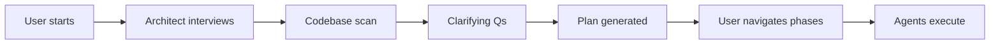

# Interactive Migration Interview

The interactive interview is the new generic front door for Ocean's Twelve.
Instead of starting from a BookShop-shaped prompt, the squad interviews you about your app, scans the codebase, and builds a migration plan that matches the repo in front of it.

## What It Is

- A conversational intake led by **Danny Ocean / Architect**
- A codebase-backed discovery flow, not a static questionnaire
- A phase-aware plan generator with status, drill-down, and execution hooks
- A CLI-first way to say **fan out** and let the squad split work safely

## How It Differs from the Old Hardcoded Approach

| Old BookShop-first flow | New interactive flow |
|---|---|
| Started from one sample app's assumptions | Starts from your repo and target outcome |
| Hardcoded prompts and paths | App-agnostic interview + scan |
| User had to map their app onto the sample | Squad infers stack, risks, and defaults |
| Linear prompt sequence | Interactive phases with `show`, `run`, `run all`, and `status` |
| Best for one reference migration | Best for any legacy app entering the squad |

## Interview Flow



## Typical CLI Shape

1. Start with a natural-language `@squad` request.
2. Point to the app folder or repo — relative to the current repo root or as an absolute path.
3. Confirm the target Azure service.
4. Let the Architect scan and summarize what was detected.
5. Answer only the missing questions.
6. Review the generated phase table.
7. Use `show phase N`, `run phase N`, `run all`, or `status`.
8. Add **fan out** when you want parallel-safe work to begin; it is the signal for coordinated parallel execution.
9. After the thread starts, short follow-ups like `show phase 2` or `status` can omit `@squad`.
10. If `reports\Migration-Plan.md` already exists, expect an overwrite-or-copy question before the plan is saved.

## Example CLI Session

```text
User: @squad I have a legacy app to migrate
Architect: What application do you want to migrate? Point me to the folder or repo.
User: Use-cases\02-NetFramework30-ASPNET-WEB
Architect: What's your target? (Azure App Service, Container Apps, AKS, etc.)
User: Azure App Service.
Architect: I scanned the repo. Here's what I found. Correct?
Architect: .NET Framework WebForms app, SQL Server access, web.config, IIS assumptions.
User: Yes. Use Bicep and GitHub Actions.
Architect: Great — I generated a 7-phase migration plan and saved reports\Migration-Plan.md.
Architect: Say `show phase 2`, `run phase 0 and 1, fan out`, `run all, fan out`, or `status`.
```

## Why This Matters

This flow makes the squad feel like an actual migration team.
It asks fewer generic questions, validates answers against the codebase, and turns discovery into a reusable execution plan instead of a one-off conversation.

## Prompt File

- Core prompt: [`/.github/prompts/InteractiveMigrationInterview.prompt.md`](../../.github/prompts/InteractiveMigrationInterview.prompt.md)
- Full sample conversation: [`example-session.md`](example-session.md)

## Good Follow-ups

- `@squad show phase 2`
- `@squad run phase 0 and 1, fan out`
- `@squad status`
- `@squad run phase 2`
