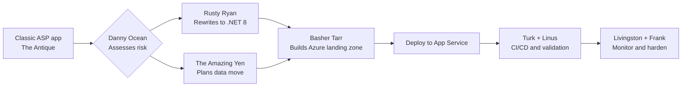

# 🎯 Classic ASP Migration — CLI Walkthrough

> **Codename:** The Antique | **Source:** Classic ASP (VBScript, ADODB, COM) | **Target:** .NET 8 + Azure App Service
> **Crew on point:** Danny Ocean, Rusty Ryan, The Amazing Yen, Basher Tarr, Frank Catton, Linus Caldwell

## How This Works



## Prerequisites

- [ ] Copilot CLI is available and signed in
- [ ] Azure CLI and AZD are installed and authenticated
- [ ] .NET 8 SDK is installed
- [ ] The legacy app exists at `Use-cases/01-ASPClassicApp`
- [ ] You have access to the database assets under `Use-cases/01-ASPClassicApp/db`
- [ ] You can identify any IIS, COM, and DSN dependencies from the current environment

## The Full Migration (One Shot)

> For teams that want to kick off everything at once:

```text
@agent Migrate Use-cases/01-ASPClassicApp to .NET 8 on Azure App Service. Assess the app, map COM and ADODB dependencies, plan the Azure SQL move, rewrite the VBScript app in C#, generate Azure infrastructure, deploy it, set up CI/CD, and operationalize it. Fan out all phases and keep me posted at each gate.
```

**What happens:** Danny Ocean routes the rewrite, Rusty Ryan drives the code move, The Amazing Yen handles data risk, and Basher Tarr lines up Azure.
**You'll get:** Assessment reports, migration plans, modernized app code, `infra/`, `azure.yaml`, deployment output, CI/CD guidance, and ops handoff notes.

## Phase by Phase

### Phase 0: Triage

```text
@agent Take point on Use-cases/01-ASPClassicApp and give me a fast triage for a move to .NET 8 on Azure App Service. Call out COM components, ADODB usage, include-file sprawl, Session/Application usage, and anything in global.asa that makes this a rewrite.
```

**What happens:** Danny Ocean sizes the heist and flags the rewrite-only traps early.
**You'll get:** A go/no-go summary, top blockers, and the safest next phase.
**Follow-up if needed:**

```text
@agent Explain why global.asa, Session state, and COM usage change the migration shape, and tell me which page group should move first.
```

### Phase 1: Assessment

```text
/run the full assessment for Use-cases/01-ASPClassicApp. Build a risk matrix for VBScript-to-C#, ADODB-to-EF Core, include files, Session state, global.asa startup logic, authentication, and Azure landing-zone fit. Fan out architecture, data, and security review.
```

**What happens:** Danny leads the assessment while Basher, Yen, and Frank pressure-test the risky edges.
**You'll get:** `reports/Quick-Assessment-Report.md`, `reports/ClassicASP-Migration-Report.md`, `reports/Application-Assessment-Report.md`, and `reports/Report-Status.md`.
**Follow-up if needed:**

```text
@agent Show me the top three rewrite risks in plain English and tell me what would delay the first production-ready cut.
```

### Phase 2: Database

```text
@agent Build the database migration plan for Use-cases/01-ASPClassicApp. Map ADODB access in database.asp to EF Core, define the Azure SQL target, identify schema or stored-procedure risks, and tell me how cart and session-backed data should persist after the rewrite.
```

**What happens:** The Amazing Yen maps the data path while Rusty keeps the application seams honest.
**You'll get:** `reports/Database-Migration-Plan.md` and `reports/Database-Validation-Report.md`.
**Follow-up if needed:**

```text
@agent Tell me what has to be rewritten first on the data side: connection handling, repositories, schema changes, or cart persistence.
```

### Phase 3: Code Migration

```text
@agent Start the code migration for Use-cases/01-ASPClassicApp. Rewrite the app to .NET 8 with C#, move global.asa behavior into modern startup patterns, replace includes with shared components, remove COM and ADODB dependencies, and prioritize catalog, product detail, cart, about, and contact flows. Fan out shared foundation work where it helps.
```

**What happens:** Rusty Ryan turns the storefront into a modern .NET 8 app while keeping the page flow recognizable.
**You'll get:** Modernized application code, updated configuration, dependency notes, and build-readiness feedback.
**Follow-up if needed:**

```text
@agent Walk me through how Session state, cart behavior, and shared includes were remapped in the .NET 8 version.
```

### Phase 4: Infrastructure

```text
@agent Generate the Azure platform for the migrated Classic ASP app. Use Azure App Service, Azure SQL, Key Vault, managed identity, and Application Insights. Keep the infrastructure ready for azd deployment and show me any production assumptions.
```

**What happens:** Basher Tarr sets the charges in the right places and gives the rewrite a clean Azure runway.
**You'll get:** `infra/`, `azure.yaml`, platform configuration, and updated status tracking.
**Follow-up if needed:**

```text
@agent Explain why App Service is the right landing zone here and show me how secrets, identity, and monitoring are wired.
```

### Phase 5: Deploy

```text
@agent Deploy the migrated Use-cases/01-ASPClassicApp solution to Azure when the infrastructure is ready. Use the generated deployment assets, summarize smoke-test results, and document rollback points before you call it good.
```

**What happens:** the agent takes the modernized storefront live with rollback discipline.
**You'll get:** Deployment output, endpoint summary, smoke-test notes, and rollback guidance.
**Follow-up if needed:**

```text
@agent If deployment fails, tell me whether the blocker is code, infrastructure, configuration, or data, and give me the next recovery move.
```

### Phase 6: CI/CD

```text
@agent Set up CI/CD for the migrated Classic ASP replacement. Include build, test, infrastructure validation, App Service deployment, security checks, and release gates that are safe for a rewrite cutover.
```

**What happens:** Turk Malloy lays out the getaway route and Linus checks that it is safe to drive.
**You'll get:** `reports/cicd_setup_report.md`, pipeline guidance, environment flow, and release controls.
**Follow-up if needed:**

```text
@agent Show me the release path from pull request to production and call out the manual approvals I should keep.
```

### Phase 7: Post-Migration Ops

```text
@agent Operationalize the migrated Classic ASP app. Set up monitoring, alerts, dashboards, runbooks, Azure SQL health checks, checkout diagnostics, and session or cart telemetry. Fan out observability, security hardening, and cost review.
```

**What happens:** Livingston Dell watches the floor, Frank Catton checks the locks, and the crew makes sure the new storefront is supportable.
**You'll get:** Ops guidance, alerting recommendations, runbook notes, cost considerations, and production-readiness feedback.
**Follow-up if needed:**

```text
@agent Tell me what to watch in the first 24 hours after cutover and which alert should wake up the team immediately.
```

## Final Validation

```text
/run final validation for Use-cases/01-ASPClassicApp. Confirm the build passes, the ADODB replacement is complete, the Azure SQL plan is sound, App Service deployment is healthy, CI/CD is wired, monitoring is live, rollback is documented, and the remaining risks are explicit.
```

**You'll get:** A ship/no-ship summary, open risks, and the exact next action.

## Expected Artifacts

- `reports/Quick-Assessment-Report.md`
- `reports/ClassicASP-Migration-Report.md`
- `reports/Application-Assessment-Report.md`
- `reports/Database-Migration-Plan.md`
- `reports/Database-Validation-Report.md`
- `reports/Report-Status.md`
- Modernized .NET 8 application code
- `infra/`
- `azure.yaml`
- `reports/cicd_setup_report.md`
- Deployment, monitoring, and rollback guidance

## 💡 Power-User Shortcut
> CLI-first follow-through commands:
> Assessment → `/run Phase 1 plan and assess` | Database → `/run database migration review` | Code → `/run Phase 2 code migration`
> Infra → `/run Phase 3 infrastructure generation` | Deploy → `/run Phase 4 deploy to Azure` | CI/CD → `/run Phase 5 CI/CD setup`
> Ops → `/run Phase 6 post-migration ops` | Security → `/run security hardening review` | Cost → `/run cost optimization review`
