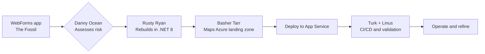

# 🎯 .NET 3.0 WebForms Migration — CLI Walkthrough

> **Codename:** The Fossil | **Source:** .NET 3.0 WebForms | **Target:** .NET 8 + Azure App Service
> **Crew on point:** Danny Ocean, Rusty Ryan, Basher Tarr, Frank Catton, Linus Caldwell

## How This Works



## Prerequisites

- [ ] Copilot CLI is available and signed in
- [ ] Azure CLI and AZD are installed and authenticated
- [ ] .NET 8 SDK is installed
- [ ] The app exists at `Use-cases/02-NetFramework30-ASPNET-WEB`
- [ ] You can inspect the WebForms pages, code-behind files, and `Web.config`
- [ ] You are ready to choose Razor Pages or MVC for the replacement UI

## The Full Migration (One Shot)

> For teams that want to launch the whole move at once:

```text
@agent Migrate Use-cases/02-NetFramework30-ASPNET-WEB to .NET 8 on Azure App Service. Assess the WebForms app, map ViewState and postback behavior, convert the code-behind model to a modern request-response app, generate Azure infrastructure, deploy it, and set up CI/CD. Fan out the work where architecture, code, and platform can move in parallel.
```

**What happens:** Danny defines the play, Rusty rebuilds the app model, and Basher makes sure Azure fits the target shape.
**You'll get:** Assessment output, modernized .NET 8 code, Azure infrastructure assets, deployment results, and release guidance.

## Phase by Phase

### Phase 0: Triage

```text
@agent Give me a fast triage for Use-cases/02-NetFramework30-ASPNET-WEB. Call out the hardest WebForms issues, especially ViewState, postback handlers, code-behind coupling, Secure.aspx behavior, and Web.config dependencies. Tell me if this should land as Razor Pages or MVC.
```

**What happens:** Danny Ocean identifies whether the crew is dealing with a straight modernization or a trickier behavioral rewrite.
**You'll get:** A quick risk readout, UI target recommendation, and the best next command.
**Follow-up if needed:**

```text
@agent Explain which page or feature will make the move hardest and why it matters before we touch the rest of the app.
```

### Phase 1: Assessment

```text
/run the full assessment for Use-cases/02-NetFramework30-ASPNET-WEB. Inventory Default.aspx, About.aspx, Secure.aspx, code-behind flows, ViewState usage, postback event patterns, auth rules, and Web.config dependencies. Fan out architecture, security, and hosting fit.
```

**What happens:** Danny leads the readout while Frank pressure-tests auth and Basher checks the Azure fit.
**You'll get:** `reports/Quick-Assessment-Report.md`, `reports/WebForms-Migration-Report.md`, `reports/DotNet-Upgrade-Report.md`, `reports/Application-Assessment-Report.md`, and `reports/Report-Status.md`.
**Follow-up if needed:**

```text
@agent Show me the three biggest WebForms blockers and tell me how each one changes the migration plan.
```

### Phase 2: Code Migration

```text
@agent Start the migration for Use-cases/02-NetFramework30-ASPNET-WEB. Convert the WebForms UI to .NET 8 using the recommended page model, remove ViewState, replace postback-driven handlers with request-response actions, move Web.config settings into modern configuration, and preserve Secure.aspx behavior.
```

**What happens:** Rusty Ryan turns the Fossil into a clean .NET 8 web app without carrying old page lifecycle baggage forward.
**You'll get:** Modernized application code, configuration mapping notes, and validation feedback on route and form parity.
**Follow-up if needed:**

```text
@agent Walk me through how ViewState, postback events, and Secure.aspx behavior were translated in the new app.
```

### Phase 3: Infrastructure

```text
@agent Generate the Azure platform for the migrated WebForms app. Use Azure App Service, Key Vault, managed identity, and Application Insights, keep the output ready for azd, and flag anything that depends on app configuration or protected routes.
```

**What happens:** Basher Tarr lays down the Azure structure so the new request-response app has a clean home.
**You'll get:** `infra/`, `azure.yaml`, hosting guidance, secret handling notes, and updated status output.
**Follow-up if needed:**

```text
@agent Show me how configuration, secrets, and auth-sensitive settings flow from the app into Azure safely.
```

### Phase 4: Deploy

```text
@agent Deploy the migrated Use-cases/02-NetFramework30-ASPNET-WEB solution to Azure when the platform is ready. Summarize smoke-test results, confirm protected routes behave correctly, and document rollback points.
```

**What happens:** The crew ships the rebuilt site and checks that the secure path behaves like the original, minus the legacy baggage.
**You'll get:** Deployment output, route and auth smoke-test notes, and rollback guidance.
**Follow-up if needed:**

```text
@agent If deployment or smoke tests fail, tell me whether the issue is routing, config, auth, or infrastructure and what to fix first.
```

### Phase 5: CI/CD

```text
@agent Set up CI/CD for the migrated WebForms replacement. Include build, test, configuration validation, security checks, App Service deployment, and release gates that are safe for the cutover.
```

**What happens:** Turk Malloy builds the release lane and Linus keeps the crew honest on validation.
**You'll get:** `reports/cicd_setup_report.md`, pipeline guidance, validation gates, and release sequencing notes.
**Follow-up if needed:**

```text
@agent Show me the release flow from commit to production and point out the checks that protect Secure.aspx and the main form flows.
```

## Final Validation and Ops Hand-Off

```text
/run final validation for Use-cases/02-NetFramework30-ASPNET-WEB. Confirm the build passes, ViewState is gone, postback flows are replaced, Secure.aspx parity is acceptable, App Service deployment is healthy, CI/CD is wired, and the first-day monitoring checklist is ready.
```

**What happens:** Linus gives the final once-over so the team knows what is done and what still needs eyes on it.
**You'll get:** A release-readiness summary, open risks, and the first operational watch list.
**Follow-up if needed:**

```text
@agent Tell me what I should verify in production during the first release window and which issues deserve a fast rollback.
```

## Expected Artifacts

- `reports/Quick-Assessment-Report.md`
- `reports/WebForms-Migration-Report.md`
- `reports/DotNet-Upgrade-Report.md`
- `reports/Application-Assessment-Report.md`
- `reports/Report-Status.md`
- Modernized .NET 8 application code
- `infra/`
- `azure.yaml`
- `reports/cicd_setup_report.md`
- Deployment, validation, and rollback guidance

## 💡 Power-User Shortcut

> CLI-first follow-through commands:
> Assessment → `/run Phase 1 plan and assess` | Code → `/run Phase 2 code migration` | Infra → `/run Phase 3 infrastructure generation`
> Deploy → `/run Phase 4 deploy to Azure` | CI/CD → `/run Phase 5 CI/CD setup`
> Optional hardening → `/run security hardening review` | Optional cost review → `/run cost optimization review`
