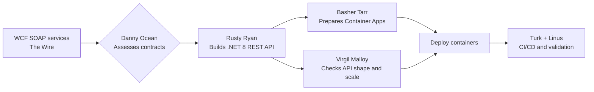

# 🎯 WCF Service Migration — CLI Walkthrough

> **Codename:** The Wire | **Source:** WCF .NET 3.5 (SOAP, ServiceContract) | **Target:** REST API + Azure Container Apps
> **Crew on point:** Danny Ocean, Rusty Ryan, Basher Tarr, Virgil Malloy, Frank Catton, Linus Caldwell

## How This Works



## Prerequisites

- [ ] Copilot CLI is available and signed in
- [ ] Azure CLI and AZD are installed and authenticated
- [ ] .NET 8 SDK is installed
- [ ] Docker Desktop is available for container validation
- [ ] The sample exists at `Use-cases/03-WCFNet35`
- [ ] You can inspect `WCFDemo.Service`, `WCFDemo.Host`, and `WCFDemo.Client`

## The Full Migration (One Shot)

> For teams that want one prompt to start the whole redesign:

```text
@agent Migrate Use-cases/03-WCFNet35 from WCF .NET 3.5 to a .NET 8 REST API on Azure Container Apps. Assess the SOAP contracts, redesign the service surface, modernize the host, define the client transition, generate container-ready Azure infrastructure, deploy it, and set up CI/CD. Fan out contract mapping, API conversion, platform design, and validation.
```

**What happens:** Danny scopes the redesign, Rusty rebuilds the API, Basher prepares Azure, and Virgil keeps an eye on scale and fit.
**You'll get:** Assessment reports, REST design guidance, modernized API code, container-ready infrastructure, deployment output, and release guidance.

## Phase by Phase

### Phase 0: Triage

```text
@agent Give me a fast triage for Use-cases/03-WCFNet35. Review WCFDemo.Service, WCFDemo.Host, and WCFDemo.Client separately, identify the hardest SOAP contracts, note binding or hosting blockers, and tell me what will break for clients when we move to REST.
```

**What happens:** Danny Ocean decides whether the job is a clean translation or a deeper service redesign.
**You'll get:** A feasibility summary, the hardest contract risks, and the best next move.
**Follow-up if needed:**

```text
@agent Explain which ServiceContract or client dependency creates the most migration risk and why it cannot stay exactly as-is.
```

### Phase 1: Assessment

```text
/run the full assessment for Use-cases/03-WCFNet35. Map ServiceContract and OperationContract usage, binding assumptions, config dependencies, host behavior, client proxy impact, auth expectations, and Azure Container Apps fit. Fan out architecture, security, and performance review.
```

**What happens:** Danny runs the table while Frank checks exposure and Virgil looks for API shape or scaling traps.
**You'll get:** `reports/Quick-Assessment-Report.md`, `reports/WCF-Migration-Report.md`, `reports/Application-Assessment-Report.md`, and `reports/Report-Status.md`.
**Follow-up if needed:**

```text
@agent Show me the top three service redesign risks and tell me which contract should become the first REST endpoint.
```

### Phase 2: Code Migration

```text
@agent Start the migration for Use-cases/03-WCFNet35. Convert the WCF service to a .NET 8 REST API, map contracts to endpoints and DTOs, replace SOAP-specific assumptions, modernize configuration, and define how WCFDemo.Client should transition to HttpClient or an OpenAPI-based client.
```

**What happens:** Rusty Ryan cuts the wire, turns service contracts into HTTP endpoints, and keeps the host and client transition explicit.
**You'll get:** Modernized API code, endpoint mapping notes, client transition guidance, and build-readiness feedback.
**Follow-up if needed:**

```text
@agent Walk me through how the SOAP operations were mapped to HTTP verbs, status codes, and DTOs, and tell me where parity is intentionally different.
```

### Phase 3: Infrastructure

```text
@agent Generate the Azure platform for the new REST API. Use Azure Container Apps, container registry, Key Vault, managed identity, and Application Insights. Keep the output ready for azd and show me any assumptions about ingress, secrets, and revisions.
```

**What happens:** Basher Tarr sets up the container escape route and makes the new API deployable without guesswork.
**You'll get:** `infra/`, `azure.yaml`, container platform guidance, secret handling notes, and updated status tracking.
**Follow-up if needed:**

```text
@agent Explain why Container Apps is the right landing zone and show me how ingress, identity, and telemetry are wired.
```

### Phase 4: Deploy

```text
@agent Deploy the migrated REST API for Use-cases/03-WCFNet35 to Azure Container Apps when the platform is ready. Confirm endpoint reachability, summarize smoke tests, and document rollback points before sign-off.
```

**What happens:** The crew ships the new API and makes sure the live surface is reachable and reversible.
**You'll get:** Deployment output, endpoint summary, smoke-test notes, and rollback guidance.
**Follow-up if needed:**

```text
@agent If deployment fails, tell me whether the problem is image build, container config, ingress, secrets, or code, and give me the fastest recovery path.
```

### Phase 5: CI/CD

```text
@agent Set up CI/CD for Use-cases/03-WCFNet35. Include build, container image creation, API tests, security checks, Azure deployment, and release gates that protect contract changes and endpoint health.
```

**What happens:** Turk Malloy automates the route to production and Linus verifies the health checks actually mean something.
**You'll get:** `reports/cicd_setup_report.md`, pipeline guidance, image and release flow, and validation gates.
**Follow-up if needed:**

```text
@agent Show me how the pipeline proves the REST API is healthy before production and where contract-breaking changes should be caught.
```

## Final Validation and Ops Hand-Off

```text
/run final validation for Use-cases/03-WCFNet35. Confirm the build passes, SOAP contracts are mapped, the REST API is deployable, Container Apps health is clean, CI/CD is wired, the client transition is documented, and the first-day monitoring and rollback checklist is ready.
```

**What happens:** Linus closes the loop while Virgil and Frank keep an eye on performance and exposure.
**You'll get:** A release-readiness summary, open risks, and the first operational watch list.
**Follow-up if needed:**

```text
@agent Tell me what to watch in the first release window for latency, error rates, ingress failures, and client breakage.
```

## Expected Artifacts

- `reports/Quick-Assessment-Report.md`
- `reports/WCF-Migration-Report.md`
- `reports/Application-Assessment-Report.md`
- `reports/Report-Status.md`
- Modernized .NET 8 REST API code
- Client transition guidance for `WCFDemo.Client`
- `infra/`
- `azure.yaml`
- `reports/cicd_setup_report.md`
- Deployment, validation, and rollback guidance

## 💡 Power-User Shortcut

> CLI-first follow-through commands:
> Assessment → `/run Phase 1 plan and assess` | Code → `/run Phase 2 code migration` | Infra → `/run Phase 3 infrastructure generation`
> Deploy → `/run Phase 4 deploy to Azure` | CI/CD → `/run Phase 5 CI/CD setup`
> Optional hardening → `/run security hardening review` | Optional cost review → `/run cost optimization review`
