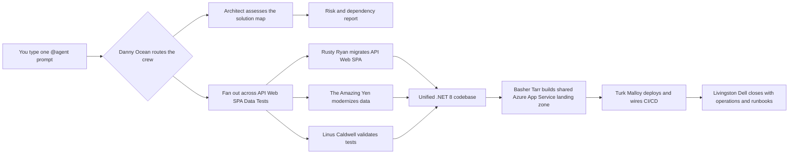

# 🎯 Contoso University Migration — CLI Walkthrough

> **Codename:** The Campus | **Source:** ASP.NET MVC multi-project solution (API + Web + React SPA + Data + Tests) | **Target:** .NET 8 + Azure App Service

## How This Works



## Prerequisites

- [ ] Copilot CLI is installed and authenticated
- [ ] Azure CLI, AZD, .NET 8 SDK, and Node.js are installed
- [ ] The full solution is available under `Use-cases/04-ContosoUniversityDiPS`
- [ ] You can build API, Web, SPA, data, and test projects locally
- [ ] You want every step driven from Copilot CLI with `@agent` prompts

## The Full Migration (One Shot)

```text
@agent migrate Use-cases/04-ContosoUniversityDiPS to .NET 8 on Azure App Service — full pipeline. Preserve API, Web, React SPA, Data, Common, and test boundaries. Build the migration plan, fan out by project, generate shared Azure infrastructure, deploy in a safe order, and leave me with CI/CD plus ops guidance. Fan out.
```

**What happens:** Danny Ocean treats this as the biggest heist in the repo, routes the sub-projects to specialists, and keeps one consolidated status line.
**You'll get:** A cross-project plan, risk matrix, modernization sequence, Azure target, and next-step recommendation.

## Phase by Phase

### Phase 0: Case the Campus

```text
/assess Use-cases/04-ContosoUniversityDiPS for migration to .NET 8 on Azure App Service. Tell me what this solution contains, what is risky, and what phase we should start with.
```

**What happens:** Danny Ocean and Rusty Ryan inventory the entire solution and call out the first blockers.
**You'll get:** A fast feasibility check, major dependencies, and the first recommended move.

**Follow-up prompt**
```text
@agent summarize the campus in one page: current projects, biggest blockers, and the next command you want from me.
```

### Phase 1: Fan Out the Assessment

```text
/assess each project in Use-cases/04-ContosoUniversityDiPS separately, then consolidate the findings. Review ContosoUniversity.Api, ContosoUniversity.Web, ContosoUniversity.Spa.React, ContosoUniversity.Data, ContosoUniversity.Common, and the test projects. Preserve boundaries and fan out.
```

**What happens:** the agent fans out across the multi-project solution instead of flattening everything into one app.
**You'll get:** A dependency map, per-project risk notes, and one cross-project migration order.

**Follow-up prompt**
```text
@agent show me the top 3 cross-project risks, the handoff points between projects, and which agent owns each risk.
```

### Phase 2: Lock the Blueprint

```text
@agent produce the migration blueprint for Use-cases/04-ContosoUniversityDiPS. Map authentication, configuration, SPA integration, EF Core upgrades, shared libraries, and test strategy. Tell me what can move in parallel and what must stay sequenced.
```

**What happens:** Danny Ocean sets the order of operations while The Amazing Yen and Linus Caldwell pressure-test data and test assumptions.
**You'll get:** A realistic phase plan, migration dependencies, and a clear parallel-vs-sequential split.

**Follow-up prompt**
```text
@agent turn that blueprint into a workboard: parallel tracks, critical path, blockers, and expected artifacts per track.
```

### Phase 3: Split the Crew and Migrate Code

```text
@agent migrate the code in Use-cases/04-ContosoUniversityDiPS to .NET 8. Keep API, MVC web app, React SPA integration, Data, Common, and tests as separate workstreams. Modernize dependencies, preserve auth flows, and fan out.
```

**What happens:** Rusty Ryan leads the code migration while the agent keeps API, Web, SPA, Data, and tests from stepping on each other.
**You'll get:** Modernized project files, upgraded dependencies, auth/config updates, and an updated status report.

**Follow-up prompt**
```text
@agent compare the migrated projects and tell me what is green, what is yellow, and what still blocks an end-to-end build.
```

### Phase 4: Unify the Azure Landing Zone

```text
@agent generate Azure infrastructure for Use-cases/04-ContosoUniversityDiPS. Use Azure App Service, Azure SQL, Key Vault, managed identity, Application Insights, deployment slots, and azd-friendly configuration. Unify the API, MVC web app, SPA assets, and data dependencies into one landing zone.
```

**What happens:** Basher Tarr turns the project-specific work into one deployable Azure plan without losing the solution boundaries.
**You'll get:** Infrastructure definitions, environment settings, secret handling, and a hosting topology that fits the whole solution.

**Follow-up prompt**
```text
@agent explain the Azure topology in plain English: what hosts what, where secrets live, how the SPA is served, and what deploys first.
```

### Phase 5: Deploy the Heist

```text
@agent deploy Use-cases/04-ContosoUniversityDiPS to Azure App Service. Roll out database changes, API, MVC web app, and SPA assets in a safe order. Validate the deployment, smoke-test the app, and call out rollback points.
```

**What happens:** Turk Malloy drives the release path while Linus Caldwell checks whether the app actually works end to end.
**You'll get:** Deployment status, smoke-test results, rollback notes, and a current readiness summary.

**Follow-up prompt**
```text
@agent give me the release report: what deployed, what passed validation, what did not, and whether you would ship this to production today.
```

### Phase 6: Wire CI/CD

```text
@agent create the CI/CD plan for Use-cases/04-ContosoUniversityDiPS. Cover .NET builds, SPA build steps, test execution, infrastructure validation, deployment slots, security checks, and staged promotion to Azure App Service.
```

**What happens:** Turk Malloy turns the manual run into a repeatable pipeline with guardrails.
**You'll get:** Pipeline steps, environment flow, release gates, and automation gaps to close.

### Phase 7: Operate, Secure, and Optimize

```text
@agent create the post-migration operations plan for Use-cases/04-ContosoUniversityDiPS. Cover health checks, dashboards, alerts, auth failures, database health, App Service telemetry, security hardening, and cost optimization. Fan out.
```

**What happens:** Livingston Dell, Frank Catton, and Basher Tarr close the loop on operations, security, and cost.
**You'll get:** Runbooks, monitoring requirements, security findings, optimization recommendations, and an operator-ready handoff.

**Follow-up prompt**
```text
@agent summarize operational readiness for the campus: dashboards, alerts, security gaps, cost risks, and the top 3 follow-up actions.
```

## Expected Artifacts

By the end of the flow, expect the agent to produce or update:

- `reports/Quick-Assessment-Report.md`
- `reports/Application-Assessment-Report.md`
- `reports/Report-Status.md`
- Modernized `.csproj` files and solution updates across API, Web, SPA integration, Data, Common, and tests
- Infrastructure artifacts such as `azure.yaml`, Bicep or Terraform files, and environment configuration
- Deployment notes covering rollout order, smoke tests, and rollback points
- CI/CD workflow definitions and release-gate guidance
- Monitoring, runbook, security, and cost-optimization outputs

## Natural Follow-Ups You Can Ask Anytime

```text
@agent what phase are we in, what is blocked, and what do you need from me next?
```

```text
@agent show me only the unresolved risks across API, Web, SPA, Data, and tests.
```

```text
@agent if we had to speed this up, where would you fan out more aggressively and where would you keep sequencing?
```

## 💡 Power-User Shortcut

> Optional prompt-name references only: assessment ≈ `Phase1-Plan`, code ≈ `Phase2-MigrateCode`, infra ≈ `Phase3-GenerateInfra`, deploy ≈ `Phase4-DeployToAzure`, ops ≈ `Phase6-PostMigrationOps`.
