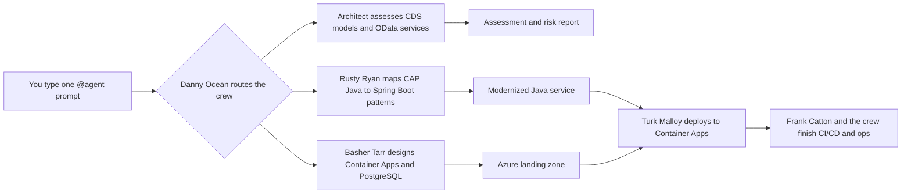

# 🎯 Bookshop Reference Migration — CLI Walkthrough

> **Codename:** The Bestseller | **Source:** SAP CAP Java bookshop (CDS + OData + SAP HANA) | **Target:** Azure Container Apps + Azure PostgreSQL

## How This Works



## Prerequisites

- [ ] Copilot CLI is installed and authenticated
- [ ] Azure CLI, AZD, Java, Maven, Docker, and PostgreSQL client tools are available
- [ ] The source app is available under `Use-cases/05-BookShop`
- [ ] You want the whole journey driven from Copilot CLI with `@agent` prompts
- [ ] You are ready to treat CDS models, OData contracts, and HANA dependencies as first-class migration concerns

## The Full Migration (One Shot)

```text
@agent migrate Use-cases/05-BookShop from SAP CAP Java to Azure Container Apps with Azure PostgreSQL — full pipeline. Assess CDS models, OData services, SAP HANA dependencies, Spring Boot migration patterns, containerization, Azure infrastructure, deployment, CI/CD, and operations. Fan out.
```

**What happens:** Danny Ocean frames the whole bookshop as one coordinated job, then fans the work out across architecture, code, data, platform, and release tracks.
**You'll get:** A migration plan, target architecture, cross-cutting risks, and the next command to run.

## Phase by Phase

### Phase 0: Case the Bookshop

```text
/assess Use-cases/05-BookShop as a SAP CAP Java migration. Tell me what CDS models, OData services, HANA assumptions, and deployment dependencies matter most before we touch code.
```

**What happens:** Danny Ocean and Rusty Ryan inventory the app and identify what makes this CAP workload different from a generic Java service.
**You'll get:** A fast feasibility view, first blockers, and a recommendation for the first deep dive.

**Follow-up prompt**
```text
@agent summarize the bookshop in plain English: business domains, exposed services, data risks, and the next move.
```

### Phase 1: Assess the Domain and Service Surface

```text
@agent map the CDS domain model and OData surface for Use-cases/05-BookShop. Tell me which entities, service contracts, auth assumptions, and extension points must survive the move to Azure. Fan out.
```

**What happens:** The Architect breaks down the CAP model while Frank Catton flags security and contract risks early.
**You'll get:** A dependency map, service inventory, auth notes, and a migration-risk matrix.

**Follow-up prompt**
```text
@agent show me the highest-risk CDS entities and OData endpoints, why they matter, and which agent should own each one.
```

### Phase 2: Plan the Data Move

```text
@agent create the data migration plan for Use-cases/05-BookShop. Map SAP HANA schemas, CDS persistence assumptions, data-access patterns, and the target PostgreSQL design. Call out what can be translated directly, what needs redesign, and fan out.
```

**What happens:** The Amazing Yen turns the data layer into a real migration plan instead of a hopeful ORM swap.
**You'll get:** Schema-mapping guidance, cutover concerns, validation checks, and a PostgreSQL readiness plan.

**Follow-up prompt**
```text
@agent explain the HANA-to-PostgreSQL translation: schema gaps, data movement risks, and the validation queries we should run first.
```

### Phase 3: Migrate the Application Code

```text
@agent migrate Use-cases/05-BookShop from SAP CAP Java patterns to a Spring Boot implementation that fits Azure. Preserve the business behavior, map OData responsibilities, modernize configuration, and keep the service boundaries clear. Fan out.
```

**What happens:** Rusty Ryan leads the code migration while the agent keeps contracts, config, and runtime behavior aligned to the new target.
**You'll get:** Modernized Java code, framework updates, service-boundary decisions, and a clear list of remaining blockers.

**Follow-up prompt**
```text
@agent compare the old CAP responsibilities to the new Spring Boot implementation and show me what is finished, what is partially mapped, and what still needs design work.
```

### Phase 4: Build the Azure Landing Zone

```text
@agent generate Azure infrastructure for Use-cases/05-BookShop. Use Azure Container Apps, Azure PostgreSQL, Key Vault, managed identity, Application Insights, and container-friendly configuration. Explain how the services, secrets, and data tier fit together.
```

**What happens:** Basher Tarr converts the app plan into an Azure platform design that matches the Java and PostgreSQL target.
**You'll get:** Infrastructure definitions, environment wiring, secret strategy, and a deployable hosting topology.

**Follow-up prompt**
```text
@agent describe the Azure topology in plain English: which services run in Container Apps, how PostgreSQL is secured, and what needs private or managed connectivity.
```

### Phase 5: Deploy, Validate, and Automate

```text
@agent deploy Use-cases/05-BookShop to Azure Container Apps, validate the PostgreSQL cutover path, smoke-test the migrated services, and create the CI/CD plan. Include rollback points, release gates, operations checks, and security hardening.
```

**What happens:** Turk Malloy drives the release, Frank Catton checks the exposed edges, and the crew turns the run into a repeatable pipeline.
**You'll get:** Deployment status, validation results, pipeline stages, rollback notes, and operator-ready next steps.

**Follow-up prompt**
```text
@agent give me the final release brief: what deployed, what passed, what is still risky, and what must happen before production traffic moves.
```

## Expected Artifacts

By the end of the flow, expect the agent to produce or update:

- `reports/Application-Assessment-Report.md`
- `reports/Report-Status.md`
- Service and contract inventory for CDS entities and OData endpoints
- HANA-to-PostgreSQL migration notes, validation queries, and cutover guidance
- Modernized Java or Spring Boot project changes plus container packaging updates
- Infrastructure artifacts such as `azure.yaml`, Bicep or Terraform files, and environment configuration
- Deployment, rollback, CI/CD, security, and operations guidance for Azure Container Apps

## Natural Follow-Ups You Can Ask Anytime

```text
@agent what phase are we in, what is blocked, and what should I ask you to do next?
```

```text
@agent show me only the unresolved risks across CDS, OData, HANA, Spring Boot migration, Container Apps, and PostgreSQL.
```

```text
@agent if we need to go faster, where should we fan out more aggressively and where should we stay sequential?
```

## Conversational Follow-Through

You do not need to restart the walkthrough to ask for clarification. Natural prompts like these still fit the same flow:

```text
@agent why did you choose PostgreSQL for this service instead of trying to preserve HANA-specific patterns?
```

```text
@agent which OData endpoints are most likely to break consumers after the migration, and how would you reduce that risk?
```

## 💡 Power-User Shortcut

> Optional prompt-name references only: assessment ≈ `Phase1-PlanAndAssess`, code ≈ `Phase2-MigrateCode`, infra ≈ `Phase3-GenerateInfra`, deploy ≈ `Phase4-DeployToAzure`, ops ≈ `Phase6-PostMigrationOps`.
