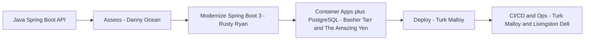

# 🎯 Java API Migration — CLI Walkthrough
> **Codename:** The Duke | **Source:** Java Spring Boot API (REST, JPA, Maven) | **Target:** Azure Container Apps + Azure PostgreSQL

## How This Works

This walkthrough stays on one surface: Copilot CLI.
Every step is a natural-language `@squad` prompt.
When parallel work helps, say **fan out**.

## Prerequisites
- [ ] GitHub Copilot CLI is installed and signed in
- [ ] Azure CLI, AZD, Docker, JDK 21, and Maven are available
- [ ] You can access the Java API source and its settings
- [ ] Examples use `Use-cases/06-JavaAPI`
- [ ] The target is Azure Container Apps plus Azure Database for PostgreSQL

## The Full Migration (One Shot)
```text
@squad migrate Use-cases/06-JavaAPI to Azure Container Apps plus Azure PostgreSQL — full pipeline. Assess the app, upgrade it to Spring Boot 3 on Java 21, plan the JPA and PostgreSQL move, generate the Azure deployment path, deploy it, wire CI/CD, and finish with monitoring guidance. Fan out.
```
**Expected artifacts**
- `reports/Quick-Assessment-Report.md`
- `reports/Java-Upgrade-Report.md`
- `reports/Application-Assessment-Report.md`
- `reports/Report-Status.md`
- Updated app code, container assets, Azure deployment assets, and release guidance

## Phase by Phase
### Phase 1 — Assess the Java API
```text
@squad assess Use-cases/06-JavaAPI for migration to Azure Container Apps plus Azure PostgreSQL. Map the REST endpoints, Spring Boot version, Maven dependencies, JPA usage, configuration files, database assumptions, and top blockers. Fan out across architecture, data, security, and hosting fit.
```
**What you should get**
- Feasibility for Java 21 and Spring Boot 3
- Top blockers for `javax` to `jakarta`, dependency age, and config drift
- A recommended Azure landing shape
**Follow-up prompts**
- `@squad show me the top 3 upgrade blockers in plain English and tell me which one should be fixed first.`
- `@squad compare the safest path versus the fastest path for this Java API modernization.`

### Phase 2 — Modernize to Spring Boot 3
```text
@squad modernize Use-cases/06-JavaAPI to Java 21 and Spring Boot 3. Upgrade dependencies, convert `javax` imports to `jakarta`, preserve the REST contract, review whether Maven should stay or whether Gradle is worth it, and flag breaking changes before code is rewritten. Fan out.
```
**What you should get**
- A Spring Boot 3 upgrade path
- A Maven-versus-Gradle recommendation
- Risks across controllers, config, and libraries
**Follow-up prompts**
- `@squad list every javax-to-jakarta hotspot I should expect before coding starts.`
- `@squad if we keep Maven, tell me exactly why. If we should move to Gradle, make the case clearly.`

### Phase 3 — Plan the PostgreSQL Move
```text
@squad plan the database move for Use-cases/06-JavaAPI to Azure Database for PostgreSQL. Review JPA and Hibernate mappings, schema assumptions, SQL dialect issues, transactions, seed data, and cutover risk. Tell me what must change before the app can run safely on PostgreSQL. Fan out.
```
**What you should get**
- A PostgreSQL compatibility review
- A schema and data migration sequence
- Validation checks and rollback points
**Follow-up prompts**
- `@squad show me the highest-risk JPA or Hibernate mappings for PostgreSQL and how to fix them.`
- `@squad what should we migrate first: schema, seed data, connection settings, or transaction behavior?`

### Phase 4 — Generate the Azure Target
```text
@squad generate the Azure target for Use-cases/06-JavaAPI on Azure Container Apps with Azure PostgreSQL. Include container build strategy, managed identity, Key Vault, secrets flow, ingress, environment variables, health probes, Application Insights, and deployment automation. Fan out.
```
**What you should get**
- Containerization guidance or Docker assets
- Azure infrastructure assets or a deployment plan
- Secrets, identity, and connectivity guidance
**Follow-up prompts**
- `@squad explain the container runtime plan like I am handing it to an Azure platform engineer tomorrow.`
- `@squad tell me which settings belong in code, which belong in environment variables, and which belong in Key Vault.`

### Phase 5 — Deploy and Prove It Works
```text
@squad deploy the migrated Java API from Use-cases/06-JavaAPI to Azure Container Apps. Validate startup, endpoint health, PostgreSQL connectivity, secrets resolution, and rollback readiness. Summarize what passed, what failed, and what should block production. Fan out.
```
**What you should get**
- A deployment summary
- Smoke-test results and rollback notes
- A go or no-go recommendation
**Follow-up prompts**
- `@squad summarize the deployment in operator language: what is healthy, what is risky, and what needs another pass?`
- `@squad if this deployment fails in production, what are the first three rollback moves?`

### Phase 6 — Wire CI/CD and Operations
```text
@squad set up the release and operations plan for Use-cases/06-JavaAPI. Cover build and test automation, container image publishing, infrastructure validation, deployment promotion, dashboards, alerts, API latency monitoring, JVM and container health, and PostgreSQL health checks. Fan out.
```
**What you should get**
- CI/CD steps or pipeline updates
- Monitoring guidance and release gates
- A short post-migration runbook
**Follow-up prompts**
- `@squad show me the minimum viable CI/CD flow first, then show me the hardened version.`
- `@squad what should the on-call team watch in the first 24 hours after cutover?`

## Useful Steering Prompts
- `@squad give me the current phase, the blocker, the owner, and the next best prompt.`
- `@squad we are stuck on PostgreSQL compatibility. Replan the next three moves and fan out only where it saves time.`
- `@squad keep the REST contract stable, minimize downtime, and call out any decision that changes cost or risk.`

## What Good Completion Sounds Like
By the end, the squad should be able to tell you:
- whether Spring Boot 3 on Java 21 is stable for this app
- whether JPA and Hibernate are safe on PostgreSQL
- how the containerized app lands on Azure Container Apps
- how deployment, rollback, CI/CD, and monitoring work end to end

## 💡 Power-User Shortcut
> Old advanced equivalents, if you already know them: QuickAssessment, Phase1-PlanAndAssess, DatabaseMigration, Phase2-MigrateCode, Phase3-GenerateInfra, Phase4-DeployToAzure, Phase5-SetupCICD, Phase6-PostMigrationOps.
> Canonical path for this walkthrough: stay in Copilot CLI and keep talking to `@squad`.