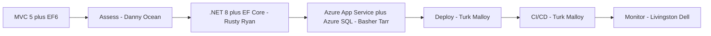

# 🎯 Parts Unlimited Migration — CLI Walkthrough
> **Codename:** The Factory | **Source:** ASP.NET MVC 5 + Entity Framework 6 (eCommerce) | **Target:** .NET 8 + Azure App Service + Azure SQL

## How This Works

This is a pure Copilot CLI flow.
You drive the migration by typing natural-language `@agent` prompts.
If you want parallel work, say **fan out** explicitly.

## Prerequisites
- [ ] GitHub Copilot CLI is installed and ready
- [ ] Azure CLI, AZD, and the .NET 8 SDK are available
- [ ] You can access the app, database project, and deployment scripts
- [ ] Examples use `Use-cases/07-PartsUnlimited`
- [ ] The target is Azure App Service plus Azure SQL

## The Full Migration (One Shot)
```text
@agent migrate Use-cases/07-PartsUnlimited to .NET 8 on Azure App Service with Azure SQL — full pipeline. Assess the app, modernize MVC 5 and EF6, redesign auth where needed, replace legacy deployment scripts, generate the Azure target, deploy it, wire CI/CD, and finish with monitoring guidance. Fan out.
```
**Expected artifacts**
- `reports/Quick-Assessment-Report.md`
- `reports/DotNet-Upgrade-Report.md`
- `reports/Application-Assessment-Report.md`
- `reports/Report-Status.md`
- Updated app code, Azure hosting assets, release guidance, and operational notes

## Phase by Phase
### Phase 1 — Assess the MVC 5 App
```text
/assess Use-cases/07-PartsUnlimited for migration to .NET 8 on Azure App Service with Azure SQL. Review MVC 5 patterns, EF6 usage, ASP.NET Identity and OWIN dependencies, shopping cart and order-processing flows, `deploy.cmd`, environment templates, and the biggest blockers. Fan out across architecture, app code, database, security, and deployment.
```
**What you should get**
- Feasibility for the .NET 8 move
- Top blockers across MVC 5, EF6, auth, and deployment
- A target App Service plus Azure SQL architecture
**Follow-up prompts**
- `@agent show me the top 3 modernization risks and tell me which one should be handled first.`
- `@agent explain where the shopping cart and order flow are most fragile during migration.`

### Phase 2 — Modernize to .NET 8 and EF Core
```text
@agent modernize Use-cases/07-PartsUnlimited to .NET 8. Convert MVC 5 patterns to ASP.NET Core MVC, map EF6 to EF Core, identify code that still depends on old hosting assumptions, and keep the shopping cart, checkout, and order-processing behavior stable. Fan out.
```
**What you should get**
- A .NET 8 migration plan
- An EF Core conversion plan
- A stability view for cart, checkout, and order processing
**Follow-up prompts**
- `@agent break the .NET 8 migration into the safest implementation order.`
- `@agent tell me which EF6 features will hurt the most when we move to EF Core.`

### Phase 3 — Modernize Auth and Data Safely
```text
@agent plan the auth and data modernization for Use-cases/07-PartsUnlimited. Review ASP.NET Identity, OWIN middleware, cookie flows, user and order data, EF Core migration sequencing, Azure SQL fit, and anything that could break sign-in, checkout, or order history. Fan out.
```
**What you should get**
- An auth modernization plan
- A database migration sequence for Azure SQL
- Validation and rollback notes for user, cart, and order data
**Follow-up prompts**
- `@agent what is the safest path from OWIN-era auth to modern ASP.NET Core auth for this app?`
- `@agent show me the validation checks I should run before trusting cart and order data after the move.`

### Phase 4 — Replace Script Deployment with Azure Hosting
```text
@agent generate the Azure target for Use-cases/07-PartsUnlimited on Azure App Service with Azure SQL. Replace `deploy.cmd` and template-driven assumptions with App Service-native deployment, managed identity, Key Vault, deployment slots, Application Insights, app settings, and repeatable environment setup. Fan out.
```
**What you should get**
- Azure hosting guidance or infrastructure assets
- A clean replacement for `deploy.cmd`
- Environment, secrets, and slot guidance
**Follow-up prompts**
- `@agent explain exactly how the new Azure deployment path replaces the old script path.`
- `@agent tell me which settings move to App Service configuration and which stay in code.`

### Phase 5 — Deploy and Validate the Commerce Flows
```text
@agent deploy the migrated Parts Unlimited app from Use-cases/07-PartsUnlimited to Azure App Service. Validate sign-in, catalog browsing, shopping cart, checkout, order processing, Azure SQL connectivity, slot safety, and rollback readiness. Summarize what passed, what failed, and what blocks production. Fan out.
```
**What you should get**
- A deployment summary
- Smoke-test results for critical user journeys
- Rollback notes and a go or no-go call
**Follow-up prompts**
- `@agent summarize the release like an operations lead: what is healthy, what is risky, and what needs another pass?`
- `@agent if checkout breaks after deployment, what are the first three recovery moves?`

### Phase 6 — Wire CI/CD for Repeatable Releases
```text
@agent set up CI/CD for Use-cases/07-PartsUnlimited. Cover build, test, EF Core migration validation, App Service deployment, slot-aware release flow, security checks, and repeatable promotion from lower environments to production. Fan out.
```
**What you should get**
- CI/CD guidance or pipeline updates
- Release gates for build, test, and deploy
- Failure-handling notes for the pipeline
**Follow-up prompts**
- `@agent show me the minimum viable pipeline first, then the hardened production version.`
- `@agent what should block promotion if the database migration looks risky?`

### Phase 7 — Monitor, Secure, and Tune the Live App
```text
@agent create the post-migration operations plan for Use-cases/07-PartsUnlimited. Cover dashboards, alerts, auth failures, Azure SQL health, checkout latency, order-processing failures, cost awareness, and the first-week runbook after cutover. Fan out.
```
**What you should get**
- Monitoring guidance for app and database health
- Alerting guidance for checkout and auth failures
- A first-week runbook and remaining risk list
**Follow-up prompts**
- `@agent what should the on-call team watch in the first 24 hours after cutover?`
- `@agent point out the remaining security and reliability risks in one short list.`

## Useful Steering Prompts
- `@agent give me the current phase, the blocker, the owner, and the next best prompt.`
- `@agent we are worried about auth and checkout stability. Replan the next three moves and fan out only where it saves time.`
- `@agent keep the customer journey stable, minimize migration risk, and call out any decision that changes deployment complexity or cost.`

## What Good Completion Sounds Like
By the end, the agent should be able to tell you:
- whether the app is ready for .NET 8 and EF Core
- whether auth, cart, checkout, and order processing survived the move
- how Azure App Service and Azure SQL replace the old deployment model
- how deployment, rollback, CI/CD, and monitoring work end to end

## 💡 Power-User Shortcut
> Old advanced equivalents, if you already know them: QuickAssessment, Phase1-PlanAndAssess, DatabaseMigration, Phase2-MigrateCode, Phase3-GenerateInfra, Phase4-DeployToAzure, Phase5-SetupCICD, Phase6-PostMigrationOps, SecurityHardening.
> Canonical path for this walkthrough: stay in Copilot CLI and keep talking to `@agent`.