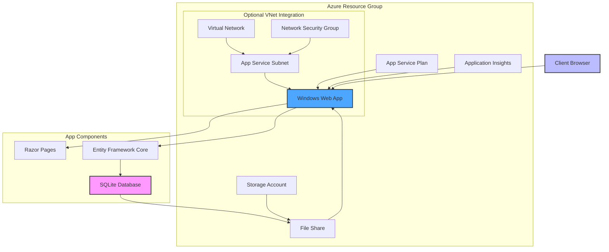

# Azure Infrastructure Diagram for Store App

## Architecture Overview

The diagram above illustrates the Azure infrastructure for hosting the Store App:

1. **Core Azure Resources**:
   - **Resource Group**: Contains all resources
   - **App Service Plan**: Provides the compute resources
   - **Windows Web App**: Hosts the ASP.NET Core application
   - **Storage Account**: Contains File Share for SQLite persistence
   - **Application Insights**: Provides monitoring and logging

2. **Optional VNet Integration**:
   - **Virtual Network**: Isolated network for the application
   - **App Service Subnet**: Dedicated subnet with delegation for App Service
   - **Network Security Group**: Controls traffic flow

3. **Application Components**:
   - **Razor Pages**: The web interface
   - **Entity Framework Core**: Data access layer
   - **SQLite Database**: Stored in Azure File Share for persistence

This architecture ensures:
- Reliable hosting on Azure App Service
- Data persistence through Azure Storage
- Application monitoring and diagnostics
- Optional network isolation for enhanced security
