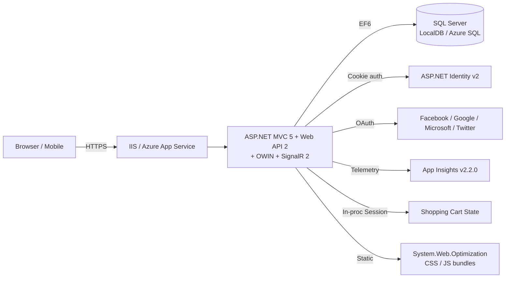
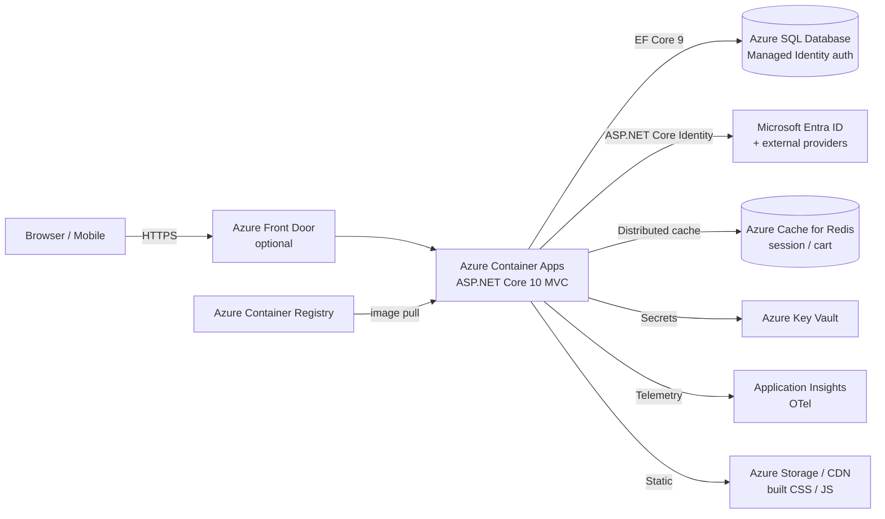

# Application Assessment Report — PartsUnlimited

**Source:** `Use-cases/07-PartsUnlimited-aspnet45`
**Target:** .NET 10 LTS on Azure Container Apps, Azure SQL Database, Bicep IaC
**Assessment date:** 2025
**Migration type:** 🔴 **REWRITE** (System.Web stack — not binary-compatible)

---

## 1. Executive Summary

PartsUnlimited is a reference ASP.NET 4.5.1 e-commerce application (MVC 5 + Web API 2) with EF6 Code First, OWIN-based ASP.NET Identity v2, SignalR 2.x, Unity DI, and legacy System.Web bundling. The application targets Windows / IIS and currently deploys to Azure App Service via Kudu (`deploy.cmd`).

Because the stack is built on `System.Web.*`, **a binary-compatible upgrade is not possible** — modernization to .NET 10 requires rewriting controllers, startup, identity, data access, and configuration into ASP.NET Core idioms. Business logic (cart, orders, catalog, recommendations) is well-isolated behind interfaces (`IPartsUnlimitedContext`, `IShoppingCart`, etc.) and **transfers cleanly**.

**T-shirt size:** **L** (large). Estimated 40–50% of code is new scaffolding (Program.cs, middleware, EF Core DbContext, Identity Core wiring, container/IaC), while ~50% of business logic ports with minimal change.

**Top 5 risks:**
1. EF6 → EF Core migration (DbContext + Identity tables) — schema & migration history rework
2. ASP.NET Identity v2 → ASP.NET Core Identity — user/role data migration path required
3. System.Web.Optimization (bundles) → modern asset pipeline (Vite/WebPack or built-in)
4. In-process session state (shopping cart) → distributed cache (Redis) for Container Apps
5. Hardcoded admin credentials & social-auth secrets in web.config → Azure Key Vault + Managed Identity

---

## 2. Application Inventory

### 2.1 Solution Structure

| Project | Type | Current TFV | Path |
|---|---|---|---|
| PartsUnlimitedWebsite | ASP.NET MVC 5 + Web API 2 | v4.5.1 | `src/PartsUnlimitedWebsite/` |
| PartsUnlimited.UnitTests | MSTest | v4.5.2 | `test/PartsUnlimited.UnitTests/` |
| FabrikamFiber.SeleniumTests | MSTest + Selenium 3.0.1 | v4.6.1 | `test/FabrikamFiber.SeleniumTests/` |
| PartsUnlimited.DepValidation | Dependency validation model | N/A | `PartsUnlimited.DepValidation/` |

### 2.2 Framework & Stack

- **Web framework:** ASP.NET MVC 5 (5.2.3) + ASP.NET Web API 2 (5.2.3) + Razor 3.2.3
- **Real-time:** Microsoft.AspNet.SignalR 2.2.1 (`Hubs/AnnouncementHub.cs`)
- **ORM:** Entity Framework 6.1.3 (Code First migrations in `Migrations/`)
- **Auth:** ASP.NET Identity 2.2.1 over OWIN (`App_Start/Startup.Auth.cs`) — cookie + Facebook / Google / Microsoft / Twitter
- **DI:** Unity 4.0.1 (`Unity.Mvc4`, `Unity.WebAPI`)
- **Bundling:** System.Web.Optimization 1.1.3
- **Telemetry:** Application Insights 2.2.0 (legacy SDK)
- **Package format:** `packages.config` (legacy NuGet)

### 2.3 Key Files

| File | Purpose |
|---|---|
| `src/PartsUnlimitedWebsite/Global.asax.cs` | HttpApplication lifecycle, seeds DB |
| `src/PartsUnlimitedWebsite/Startup.cs` | OWIN startup |
| `src/PartsUnlimitedWebsite/App_Start/Startup.Auth.cs` | Identity + external auth |
| `src/PartsUnlimitedWebsite/App_Start/UnityConfig.cs` | DI registrations |
| `src/PartsUnlimitedWebsite/Models/PartsUnlimitedContext.cs` | EF6 `IdentityDbContext<ApplicationUser>` |
| `src/PartsUnlimitedWebsite/Web.config` | Config + connection string + auth secrets |
| `src/PartsUnlimitedWebsite/Migrations/*.cs` | EF6 Code First migrations |
| `deploy.cmd` / `.deployment` | Kudu deployment script |

### 2.4 Database

- **Engine:** SQL Server (LocalDB in dev)
- **Schema:** EF6 Code First — Products, Orders, OrderDetails, Categories, CartItems, Rainchecks, Stores, Manufacturers, CommunityPosts + AspNet Identity tables (Users, Roles, Claims, Logins, UserRoles)
- **Connection:** `DefaultConnectionString` in `Web.config` (SQL auth, password in plain text)
- **Seeding:** `PartsUnlimitedDbInitializer` runs from Global.asax on startup

---

## 3. Current Architecture

## 4. Target Architecture

---

## 5. Risk Matrix

| # | Risk | Severity | Impact | Mitigation |
|---|---|---|---|---|
| R1 | System.Web.Mvc / Web.Http unavailable in .NET 10 | 🔴 Critical | All controllers must be rewritten as ASP.NET Core MVC | Port controllers 1:1; reuse view models; keep business logic |
| R2 | EF6 not supported on .NET 10 | 🔴 Critical | DbContext + migrations must be rebuilt | Move to EF Core 9 Code First; regenerate migrations against existing schema |
| R3 | OWIN startup not in ASP.NET Core | 🔴 Critical | Startup.cs / Startup.Auth.cs rewrite | Use ASP.NET Core minimal hosting (`Program.cs`) + middleware pipeline |
| R4 | ASP.NET Identity v2 → Core Identity | 🟠 High | User table schema diff + password hash compatibility | Use Core Identity with custom `PasswordHasher` compatibility shim; plan user data migration |
| R5 | System.Web.Optimization (bundles) | 🟠 High | All CSS / JS bundles break | Replace with Vite (recommended) or ASP.NET Core bundling |
| R6 | SignalR 2 → SignalR Core | 🟠 High | Hub & JS client API changes | Rewrite `AnnouncementHub`; update client to `@microsoft/signalr` package |
| R7 | In-process Session for shopping cart | 🟠 High | Container Apps scale-out breaks single-instance session | Move to Redis distributed cache (`IDistributedCache`) |
| R8 | Secrets in web.config (admin password, social auth keys) | 🟠 High | Credential leakage; not container-friendly | Move to Key Vault + Managed Identity; use environment variables in dev |
| R9 | Unity DI container | 🟡 Medium | DependencyResolver API gone | Replace with built-in `IServiceCollection` |
| R10 | Legacy test packages (MSTest 1.0-rc, Moq 4.5, Selenium 3) | 🟡 Medium | Tests won't run on .NET 10 | Upgrade to MSTest 3.x, Moq 4.20+, Selenium 4.x |
| R11 | Application Insights v2.2.0 SDK | 🟡 Medium | Telemetry pipeline outdated | Adopt Azure Monitor OpenTelemetry distro |
| R12 | `packages.config` legacy format | 🟡 Medium | Not supported by SDK-style projects | Migrate to `<PackageReference>` in new csproj |
| R13 | `Global.asax` + HttpApplication | 🟡 Medium | Lifecycle gone in Core | Move seeding to `IHostedService` |
| R14 | Kudu `deploy.cmd` | 🟢 Low | Not used for container deploys | Replace with Dockerfile + GitHub Actions in Phase 5 |
| R15 | Social auth provider config | 🟡 Medium | Package APIs differ | Use ASP.NET Core authentication providers (`AddFacebook`, `AddGoogle`, `AddMicrosoftAccount`, `AddTwitter`) |

---

## 6. Migration Plan

### Phase 2 — Code Migration (target: .NET 10 LTS)
1. Create new SDK-style `PartsUnlimited.Web` project targeting `net10.0`
2. Port `Program.cs` from `Startup.cs` + `Global.asax.cs` (minimal hosting model)
3. Replace Unity DI with built-in `IServiceCollection`
4. Convert `web.config` → `appsettings.json` + `appsettings.Development.json` + Key Vault references
5. Rebuild `PartsUnlimitedContext` on EF Core 9; generate initial migration matching existing schema
6. Port ASP.NET Identity v2 → ASP.NET Core Identity (preserve table names where possible)
7. Port MVC controllers (Home, Store, ShoppingCart, Checkout, Orders, Account, Manage, Recommendations, Search) 1:1
8. Port Web API controllers (`api/Products`, `api/Raincheck`) into MVC controllers (no separate Web API in Core)
9. Port `AnnouncementHub` to ASP.NET Core SignalR; update JS client
10. Move shopping-cart session state to `IDistributedCache` (Redis)
11. Replace `System.Web.Optimization` bundles with Vite-built static assets
12. Update Application Insights → Azure Monitor OpenTelemetry
13. Upgrade test projects to MSTest 3.x + Moq 4.20+; port mocks (`MockHttpContext` → `DefaultHttpContext`)
14. Externalize secrets to Key Vault; remove hardcoded admin password

### Phase 3 — Infrastructure (Bicep with AVM)
- Azure Container Registry
- Azure Container Apps environment + app
- Azure SQL Database (Managed Identity auth)
- Azure Cache for Redis
- Azure Key Vault (RBAC)
- Log Analytics workspace + Application Insights
- User-assigned managed identity with RBAC role assignments

### Phase 4 — Deployment
- Multi-stage Dockerfile (build → publish → runtime on `mcr.microsoft.com/dotnet/aspnet:10.0`)
- `azd up` deploy via `azd` + Bicep
- Smoke test catalog / cart / checkout flows

### Phase 5 — CI/CD
- GitHub Actions: build → test → docker push → `azd deploy`
- Secrets via GitHub OIDC federated identity to Azure

---

## 7. Effort & Cost Estimate

| Phase | T-shirt | Notes |
|---|---|---|
| Phase 2 — Code | L | 9 MVC controllers + 2 Web API + Identity + EF Core + SignalR + bundles |
| Phase 3 — Infra | M | Standard ACA + SQL + Redis + KV stack |
| Phase 4 — Deploy | S | Dockerfile + `azd up` |
| Phase 5 — CI/CD | S | Single GitHub Actions workflow |
| **Total** | **L** | Rewrite-class engagement |

---

## 8. Change Report (planned)

| Area | Before | After |
|---|---|---|
| TargetFramework | net451 | net10.0 |
| Project format | packages.config | SDK-style + PackageReference |
| Hosting | IIS / App Service (Windows) | Linux container on Azure Container Apps |
| Web framework | ASP.NET MVC 5 + Web API 2 | ASP.NET Core MVC 10 |
| DI | Unity 4 | Built-in `IServiceCollection` |
| ORM | EF 6.1.3 | EF Core 9 |
| Identity | ASP.NET Identity 2 + OWIN | ASP.NET Core Identity |
| Real-time | SignalR 2 | ASP.NET Core SignalR |
| Config | web.config | appsettings.json + Key Vault |
| Secrets | Plain text in web.config | Key Vault + Managed Identity |
| Session | In-proc | Redis (IDistributedCache) |
| Bundling | System.Web.Optimization | Vite |
| Telemetry | AI SDK v2.2.0 | Azure Monitor OpenTelemetry |
| DB auth | SQL user/password | Microsoft Entra Managed Identity |
| Deploy | Kudu deploy.cmd | Docker + azd + Bicep |
| CI/CD | None | GitHub Actions w/ OIDC |

---

## 9. Next Steps

▶ Run **`/Phase2-MigrateCode`** to start code modernization.
