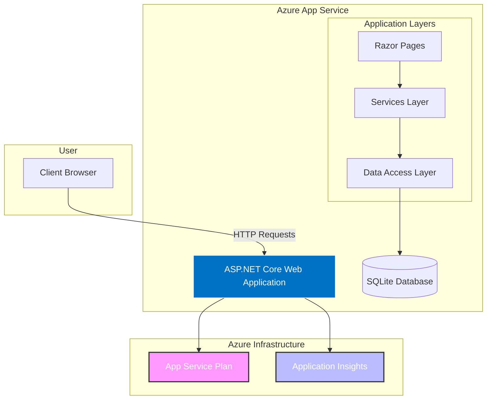

```mermaid
graph TD
    subgraph "User"
        Client[Client Browser]
    end

    subgraph "Azure App Service"
        WebApp[ASP.NET Core Web Application]
        
        subgraph "Application Layers"
            UI[Razor Pages]
            Logic[Services Layer]
            Data[Data Access Layer]
        end
        
        SQLite[(SQLite Database)]
    end

    subgraph "Azure Infrastructure"
        AppServicePlan[App Service Plan]
        AppInsights[Application Insights]
        style AppServicePlan fill:#f9f,stroke:#333,stroke-width:2px
        style AppInsights fill:#bbf,stroke:#333,stroke-width:2px
    end
    
    Client -->|HTTP Requests| WebApp
    UI --> Logic
    Logic --> Data
    Data --> SQLite
    WebApp --> AppInsights
    WebApp --> AppServicePlan

    %% Descriptions
    classDef azure fill:#0072C6,stroke:#fff,color:#fff,stroke-width:1px;
    class WebApp,AppServicePlan,AppInsights azure;
```
