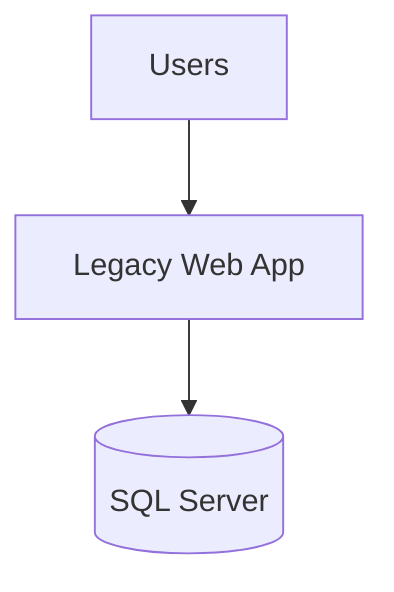
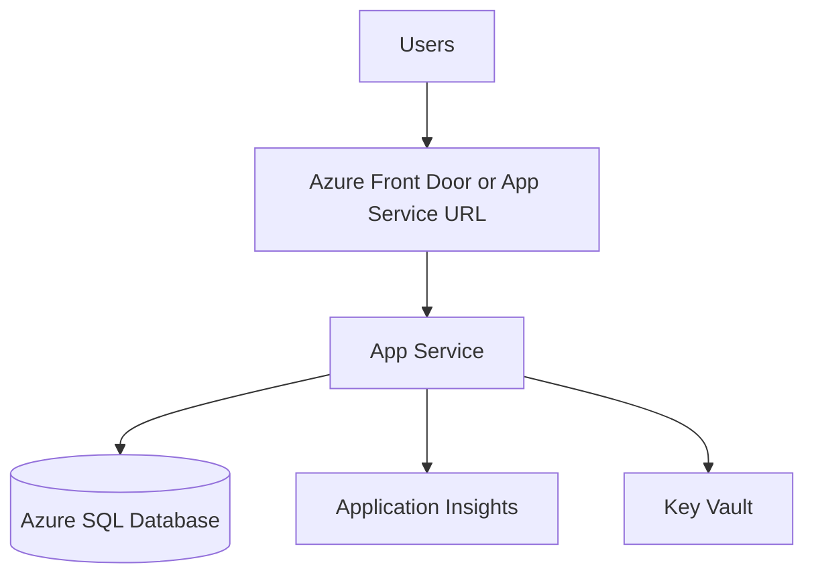

# Migration Report Template

> **REFERENCE ONLY** — This root `skills/` copy is for reference and onboarding. Prompts must reference the authoritative prompt-local copy at `#file:.github/skills/migration-report-template.md`.

Use this skill whenever a prompt must create or update migration reports in the `reports/` folder.

## Goals

- Keep every phase report consistent and comparable.
- Separate factual findings from recommendations.
- Make next steps explicit.
- Provide enough structure for humans and later prompts to reuse the report.

## Standard report set

The migration workflow should maintain these artifacts:

- `reports/Report-Status.md` - current phase status and next step dashboard
- `reports/Application-Assessment-Report.md` - baseline discovery, architecture, and risks
- phase-specific reports as needed, reusing the same section structure where practical

## Authoring rules

- Use clear Markdown headings.
- Put generated date/time near the top.
- Prefer tables for inventories, risks, and backlog items.
- Use Mermaid diagrams for current and target architecture when architecture is discussed.
- End every report with recommended next actions.

## Canonical assessment report template

````md
# Application Assessment Report
**Generated:** 2026-05-28 14:30 UTC
**Application:** Contoso University
**Source Path:** `Use-cases/04-ContosoUniversityDiPS`
**Assessment Type:** Planning & Assessment

## Executive Summary
- Current platform:
- Recommended target platform:
- Primary migration drivers:
- Top 3 risks:

## Migration Configuration
| Setting | Value |
|---|---|
| Modernization scope | |
| Target Azure hosting platform | |
| IaC tool | |
| Database strategy | |
| Authentication target | |

## Current Architecture


## Target Azure Architecture


## Application Inventory
### Projects and runtimes
### Dependencies
### Authentication and authorization
### Data access and integrations
### Configuration model

## Risk Assessment
| ID | Risk | Severity | Impact | Mitigation |
|---|---|---|---|---|
| R1 | | High | | |

## Recommended Migration Plan
### Phase 1 - Preparation
### Phase 2 - Code modernization
### Phase 3 - Infrastructure generation
### Phase 4 - Deployment and validation
### Phase 5 - CI/CD and cutover

## Change Backlog
| ID | Area | Change | Why | Verification |
|---|---|---|---|---|
| C1 | | | | |

## Effort Estimate
| Workstream | Complexity | Estimate | Notes |
|---|---|---|---|

## Open Questions
-

## Next Steps
1.
2.
````

## Canonical status report template

```md
# Migration Status
**Updated:** 2026-05-28 14:30 UTC

| Phase | Status | Notes |
|---|---|---|
| Phase 0 - Multi-repo assessment | Not started | |
| Phase 1 - Planning & assessment | In progress | |
| Phase 2 - Code migration | Not started | |
| Phase 3 - Infrastructure generation | Not started | |
| Phase 4 - Deployment | Not started | |
| Phase 5 - CI/CD | Not started | |
| Phase 6 - Post-migration ops | Not started | |

## Completed this phase
-

## Risks and blockers
-

## Files created or updated
-

## Recommended next command
- `/phase2-migratecode`
```

## Report writing checklist

Every generated report should answer these questions:

- What exists now?
- What is the proposed Azure target?
- What are the top blockers, risks, and assumptions?
- What concrete files, resources, or code changes must happen next?
- How will success be validated?

## Output expectations for prompts that use this skill

- Create missing report files when absent.
- Preserve prior useful sections when updating existing reports.
- Prefer additive updates over rewriting history unless the report is explicitly being regenerated.
- Reference the next phase command by name.
